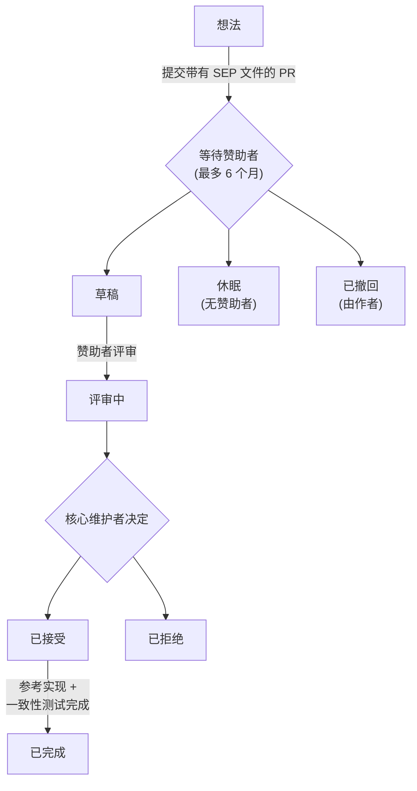

## 什么是 SEP？

SEP 代表规范增强提案（Specification Enhancement Proposal）。SEP 是一份设计文档，向 MCP 社区提供信息，或描述 Model Context Protocol 或其流程的新功能。SEP 应提供该功能的简洁技术规范和理由。

SEP 是提出主要新功能、收集社区对某个问题的意见以及记录 MCP 设计决策的主要机制。SEP 作者负责在社区中建立共识并记录不同意见。

在起草 SEP 时，作者应查阅 [MCP 设计原则](/community/design-principles)，其中概述了指导协议演进的核心价值观和权衡。

SEP 作为 markdown 文件维护在规范仓库的 [`seps/` 目录](https://github.com/modelcontextprotocol/modelcontextprotocol/tree/main/seps)中。其修订历史作为功能提案的历史记录。

## 何时编写 SEP

SEP 流程保留给足够重大、需要广泛社区讨论、正式设计文档和历史记录的更改。对于较小的更改，常规的 GitHub 拉取请求通常更为合适。

**如果你的更改涉及以下内容，请编写 SEP：**

- **新功能或协议更改** - 在协议中添加、修改或删除功能（新的 API 方法、消息格式更改、互操作性标准）
- **破坏性更改** - 任何不向后兼容的更改
- **治理或流程更改** - 改变决策或贡献指南
- **复杂或有争议的主题** - 可能具有多个有效解决方案或引起重大辩论的更改

**无需 SEP 流程的情况：**

- Bug 修复和拼写错误纠正
- 文档澄清
- 为现有功能添加示例
- 不改变行为的微小模式修复

不确定？在开始重要工作之前，请在 [Discord](/community/communication#discord) 中询问。

## SEP 类型

SEP 有四种类型：

1. **标准跟踪** - 描述 Model Context Protocol 的新功能或实现，或在核心规范之外支持的互操作性标准。
2. **信息性** - 描述设计问题或向社区提供指南/信息，而不提出新功能。
3. **流程** - 描述 MCP 相关的流程或提出对流程的更改（如本文档）。
4. **扩展跟踪** - 描述协议扩展。遵循与标准跟踪 SEP 相同的评审和接受流程，但表明该提案是针对扩展而非协议添加。有关扩展生命周期，请参阅[创建扩展](/extensions/overview#creating-extensions)。

## SEP 工作流程

### 分步流程

<Note>
  要提高 SEP 被接受的机会：

- **首先在 [Discord](/community/communication#discord) 上与相关的[工作组或兴趣小组](/community/working-interest-groups)讨论你的想法。** 这是完善提案和建立早期支持的最佳方式。
- **如果不存在相关小组，请在 [GitHub Discussions](https://github.com/modelcontextprotocol/modelcontextprotocol/discussions) 或 [Discord](/community/communication#discord) 的 `#general` 频道中开始对话。** 如果有足够的兴趣，可能值得[创建新的 IG 或 WG](/community/working-interest-groups#creating-an-interest-group) —— 寻找赞助者和协调人所付出的努力是判断想法是否具有足够牵引力的良好信号，仍然比直接提交更好。
- **检查是否与[核心维护者](/community/governance#roles)的优先事项和[设计原则](/community/design-principles)一致。** 优先事项通常反映在[项目路线图](/development/roadmap)中。当前优先事项之外或与设计原则冲突的提案更可能在评审过程中面临延迟或额外的摩擦。

</Note>

1. **起草你的 SEP**，以 `0000-your-feature-title.md` 命名的 markdown 文件，使用 `0000` 作为占位符。遵循下面的 [SEP 格式](#sep-格式)。

2. **创建一个拉取请求**，将你的 SEP 文件添加到[规范仓库](https://github.com/modelcontextprotocol/modelcontextprotocol)的 `seps/` 目录中。

3. **更新 SEP 编号**：创建 PR 后，使用 PR 编号重命名文件（例如，PR #1850 变为 `1850-your-feature-title.md`）并更新 SEP 头部。

4. **寻找赞助者**：从[维护者列表](https://github.com/modelcontextprotocol/modelcontextprotocol/blob/main/MAINTAINERS.md)中标记一位核心维护者或维护者。选择其领域与你的提案相关的人。提示：
   - 标记 1-2 位相关维护者，不要标记所有人
   - 在相关的 Discord 频道中分享你的 PR
   - 如果 2 周后没有回复，请在 `#general` 中询问

5. **赞助者自我分配**：当赞助者同意后，他们会将自己分配到 PR 并将 SEP 状态更新为 `draft`。

6. **非正式评审**：赞助者审查提案并可能要求修改。讨论在 PR 评论中进行。

7. **正式评审**：准备就绪后，赞助者将状态更新为 `in-review`。SEP 进入核心维护者的正式评审（每两周举行一次会议）。

8. **决议**：SEP 可以是 `accepted`、`rejected` 或返回修改。赞助者更新状态。

9. **定稿**：接受后，必须完成参考实现。对于具有可观察协议行为的标准跟踪 SEP，还必须合并[一致性测试](#一致性测试要求)。完成后并入规范，赞助者将状态更新为 `final`。

### SEP 状态

| 状态         | 含义                               |
| ------------ | ---------------------------------- |
| `draft`      | 有赞助者，正在进行非正式评审       |
| `in-review`  | 准备好进行核心维护者的正式评审     |
| `accepted`   | 已批准，等待实现 + 一致性测试      |
| `rejected`   | 被核心维护者拒绝                   |
| `withdrawn`  | 作者撤回提案                       |
| `final`      | 实现和一致性测试已完成             |
| `superseded` | 被更新的 SEP 取代                  |
| `dormant`    | 6 个月内未找到赞助者；可以重新激活 |

**重要区别**：`dormant` 不同于 `rejected`。休眠的 SEP 只是没有找到赞助者——想法可能仍然有效。如果情况发生变化（新的社区兴趣、新的用例），可以通过寻找赞助者并重新打开 PR 来重新激活休眠的 SEP。

## SEP 格式

每个 SEP 应包含以下部分：

### 1. 前言

简短描述性标题、作者姓名/联系信息、当前状态、SEP 类型和 PR 编号。

### 2. 摘要

对所解决技术问题的简短（约 200 字）描述。

### 3. 动机

为什么现有的协议规范不充分。这很关键——没有充分动机的 SEP 可能会被直接拒绝。

### 4. 规范

描述新功能的语法和语义的技术规范。必须足够详细，以便于竞争性、可互操作的实现。

### 5. 理由

为什么做出特定的设计决策、考虑的替代设计以及相关工作。应提供社区共识的证据并解决讨论中提出的异议。

### 6. 向后兼容性

所有引入向后不兼容性的 SEP 必须描述这些不兼容性、其严重程度以及如何处理它们。

### 7. 参考实现

必须在 SEP 达到"Final"状态之前完成，但在接受之前不需要完成。

### 8. 安全影响

与 SEP 相关的任何安全问题都应明确记录。

有关完整的文件结构，请参阅 [SEP 模板](https://github.com/modelcontextprotocol/modelcontextprotocol/blob/main/seps/README.md#sep-file-structure)。

## 原型要求

在 SEP 被接受之前，你需要"一个展示提案的原型实现"。以下是合格的条件：

**可接受的原型：**

- 在官方 SDK 之一中的工作实现（作为分支/复刻）
- 展示关键机制的独立概念验证
- 展示提议行为的集成测试
- 实现该功能的参考服务器或客户端

**原型应：**

- 展示核心功能按描述工作
- 展示 API 设计实用且符合人体工程学
- 揭示任何边缘情况或实现挑战
- 可由评审者运行（包括设置说明）

**不足够的：**

- 仅伪代码
- 没有代码的设计文档
- "相信我，它能工作"——评审者需要看到它

原型不需要达到生产就绪。它的存在是为了证明可行性并及早暴露问题。

## 赞助者角色

赞助者是核心维护者或维护者，负责在整个评审过程中支持 SEP。赞助者的职责包括：

- 审查提案并提供建设性反馈
- 根据社区意见要求修改
- 随着提案进展**更新 SEP 状态**
- 当 SEP 准备就绪时启动正式评审
- 在核心维护者会议上介绍和讨论提案
- 确保提案符合质量标准

作者应通过赞助者请求状态变更，而不是自己修改状态字段。

## 状态管理

**赞助者负责更新 SEP 状态。** 这确保状态转换由具有适当权限和上下文的人进行。

赞助者：

1. 直接在 SEP markdown 文件中更新 `Status` 字段（或者，如果他们无法访问源仓库，则与作者合作设置正确的状态）
2. 为拉取请求应用匹配的标签（例如 `draft`、`in-review`、`accepted`）

markdown 状态字段和 PR 标签应保持同步。markdown 文件是规范记录（随提案版本化），而 PR 标签使其易于过滤和搜索。

## SEP 评审与决议

SEP 由 MCP 核心维护者团队每两周评审一次。

SEP 要获得接受，必须满足以下标准：

- 展示提案的原型实现
- 对 MCP 生态系统的明确益处
- 社区支持和共识

SEP 被接受后，必须完成参考实现。完成后并入主仓库，状态更改为"Final"。

## 一致性测试要求

对于引入或修改可观察协议行为的**标准跟踪 SEP**，必须将一致性场景合并到[一致性仓库](https://github.com/modelcontextprotocol/conformance)中，然后 SEP 才能达到 `Final` 状态。

**需要的内容：**

- 带有 SEP 编号标记的一致性场景，针对一致性仓库的草稿规范版本标签
- 结构化的可追溯性文件（`sep-NNNN.yaml`），将 SEP 规范部分中的每个 MUST/MUST NOT 和 SHOULD/SHOULD NOT 映射到检查 ID 或记录的排除项（如果是框架差距，则附有跟踪问题）
- 该场景通过 SEP 参考实现的验证

**豁免内容：**

- 流程和信息性 SEP
- 没有可观察协议行为的标准跟踪 SEP（文档澄清、非验证模式注释、实现强化建议）

**各自职责：**

- **赞助者**确保编写一致性场景并验证可追溯性文件涵盖 SEP 中的每个 MUST/MUST NOT 和 SHOULD/SHOULD NOT
- **一致性仓库维护者**审查场景 PR 的技术正确性
- 测试**作者**可以是任何人：SEP 作者、SDK 维护者、社区贡献者

在 SEP 起草期间（核心维护者评审之前）编写一致性场景是鼓励的但非必需的，因为它通常能揭示规范语言中的歧义，早期修复成本更低。

有关完整的规范，包括可追溯性文件格式和争议处理流程，请参阅 [SEP-2484](/seps/2484-conformance-tests-required-for-final-seps)。

## 被拒绝后

被拒绝并非永久性的。你可以：

1. **处理反馈** - 如果提出了具体问题，解决它们并重新提交
2. **讨论拒绝理由** - 在 Discord 中询问以了解原因
3. **提交竞争性 SEP** - 有时不同的方法效果更好
4. **等待合适的时机** - 社区需求在不断演变；今天被拒绝的可能会在将来受到欢迎

## 报告 SEP 错误或更新

对于尚未达到 `final` 状态的 SEP，直接在 SEP 的拉取请求上评论。一旦 SEP 定稿并合并，通过创建一个修改 SEP 文件的新拉取请求来提交更新。

## 转让 SEP 所有权

有时需要将 SEP 的所有权转让给新作者。通常，我们希望保留原始作者作为共同作者，但这取决于原始作者。

转让所有权的正当理由：

- 原始作者不再有时间或兴趣
- 无法联系到原始作者

不正当的理由：

- 你不同意其方向（请提交竞争性 SEP）

## 版权

本文档置于公共领域或 CC0-1.0-Universal 许可下，以更宽松的为准。
