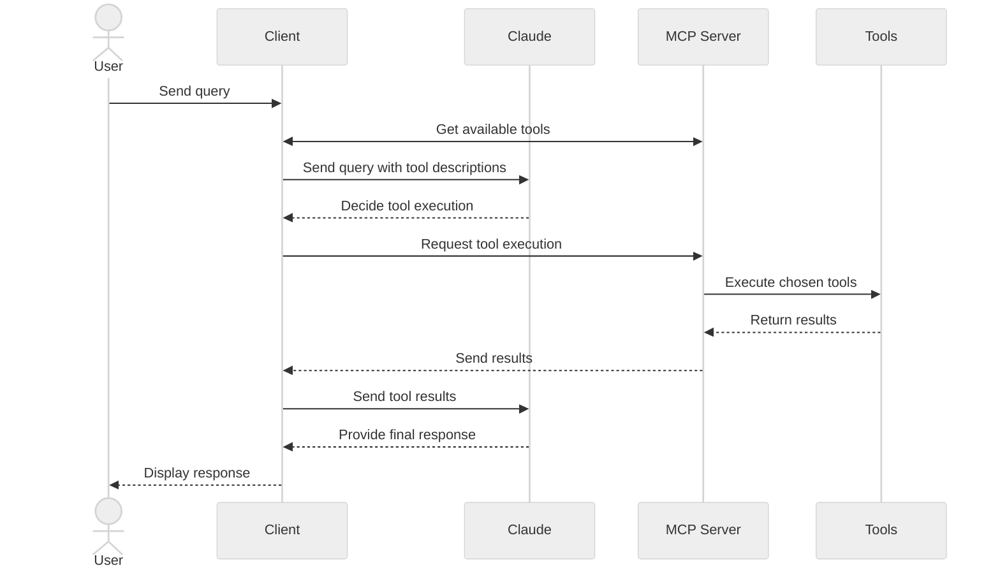

在本教程中，你将学习如何构建一个由 LLM 驱动的聊天机器人 client，它可以连接到 MCP server。

在开始之前，建议你先完成我们的[构建 MCP Server](/docs/develop/build-server) 教程，以了解 clients 和 servers 如何通信。

<Tabs>
<Tab title="Python">

[你可以在这里找到本教程的完整代码。](https://github.com/modelcontextprotocol/quickstart-resources/tree/main/mcp-client-python)

## 系统要求

开始之前，确保你的系统满足以下要求：

- Mac 或 Windows 计算机
- 已安装最新的 Python 版本
- 已安装最新版本的 `uv`

## 设置环境

首先，使用 `uv` 创建一个新的 Python 项目：

<CodeGroup>

```bash macOS/Linux
# 创建项目目录
uv init mcp-client
cd mcp-client

# 创建虚拟环境
uv venv

# 激活虚拟环境
source .venv/bin/activate

# 安装所需包
uv add mcp anthropic python-dotenv

# 删除样板文件
rm main.py

# 创建我们的主文件
touch client.py
```

```powershell Windows
# 创建项目目录
uv init mcp-client
cd mcp-client

# 创建虚拟环境
uv venv

# 激活虚拟环境
.venv\Scripts\activate

# 安装所需包
uv add mcp anthropic python-dotenv

# 删除样板文件
del main.py

# 创建我们的主文件
new-item client.py
```

</CodeGroup>

## 设置 API 密钥

你需要从 [Anthropic Console](https://console.anthropic.com/settings/keys) 获取一个 Anthropic API 密钥。

创建一个 `.env` 文件来存储它：

```bash
echo "ANTHROPIC_API_KEY=your-api-key-goes-here" > .env
```

将 `.env` 添加到你的 `.gitignore`：

```bash
echo ".env" >> .gitignore
```

<Warning>

确保你的 `ANTHROPIC_API_KEY` 安全！

</Warning>

## 创建 Client

### 基本 Client 结构

首先，让我们设置导入并创建基本的 client 类：

```python
import asyncio
from typing import Optional
from contextlib import AsyncExitStack

from mcp import ClientSession, StdioServerParameters
from mcp.client.stdio import stdio_client

from anthropic import Anthropic
from dotenv import load_dotenv

load_dotenv()  # 从 .env 加载环境变量

class MCPClient:
    def __init__(self):
        # 初始化 session 和 client 对象
        self.session: Optional[ClientSession] = None
        self.exit_stack = AsyncExitStack()
        self.anthropic = Anthropic()
    # 方法将写在这里
```

### Server 连接管理

接下来，我们将实现连接到 MCP server 的方法：

```python
async def connect_to_server(self, server_script_path: str):
    """连接到 MCP server

    Args:
        server_script_path: server 脚本的路径（.py 或 .js）
    """
    is_python = server_script_path.endswith('.py')
    is_js = server_script_path.endswith('.js')
    if not (is_python or is_js):
        raise ValueError("Server 脚本必须是 .py 或 .js 文件")

    command = "python" if is_python else "node"
    server_params = StdioServerParameters(
        command=command,
        args=[server_script_path],
        env=None
    )

    stdio_transport = await self.exit_stack.enter_async_context(stdio_client(server_params))
    self.stdio, self.write = stdio_transport
    self.session = await self.exit_stack.enter_async_context(ClientSession(self.stdio, self.write))

    await self.session.initialize()

    # 列出可用 tools
    response = await self.session.list_tools()
    tools = response.tools
    print("\n已连接到 server，可用 tools：", [tool.name for tool in tools])
```

### 查询处理逻辑

现在让我们添加处理查询和 tool 调用的核心功能：

```python
async def process_query(self, query: str) -> str:
    """使用 Claude 和可用 tools 处理查询"""
    messages = [
        {
            "role": "user",
            "content": query
        }
    ]

    response = await self.session.list_tools()
    available_tools = [{
        "name": tool.name,
        "description": tool.description,
        "input_schema": tool.inputSchema
    } for tool in response.tools]

    # 初始 Claude API 调用
    response = self.anthropic.messages.create(
        model="claude-sonnet-4-20250514",
        max_tokens=1000,
        messages=messages,
        tools=available_tools
    )

    # 处理响应并处理 tool 调用
    final_text = []

    assistant_message_content = []
    for content in response.content:
        if content.type == 'text':
            final_text.append(content.text)
            assistant_message_content.append(content)
        elif content.type == 'tool_use':
            tool_name = content.name
            tool_args = content.input

            # 执行 tool 调用
            result = await self.session.call_tool(tool_name, tool_args)
            final_text.append(f"[正在调用 tool {tool_name}，参数：{tool_args}]")

            assistant_message_content.append(content)
            messages.append({
                "role": "assistant",
                "content": assistant_message_content
            })
            messages.append({
                "role": "user",
                "content": [
                    {
                        "type": "tool_result",
                        "tool_use_id": content.id,
                        "content": result.content
                    }
                ]
            })

            # 从 Claude 获取下一个响应
            response = self.anthropic.messages.create(
                model="claude-sonnet-4-20250514",
                max_tokens=1000,
                messages=messages,
                tools=available_tools
            )

            final_text.append(response.content[0].text)

    return "\n".join(final_text)
```

### 交互式聊天界面

现在我们将添加聊天循环和清理功能：

```python
async def chat_loop(self):
    """运行交互式聊天循环"""
    print("\nMCP Client 已启动！")
    print("输入你的查询或 'quit' 退出。")

    while True:
        try:
            query = input("\n查询：").strip()

            if query.lower() == 'quit':
                break

            response = await self.process_query(query)
            print("\n" + response)

        except Exception as e:
            print(f"\n错误：{str(e)}")

async def cleanup(self):
    """清理资源"""
    await self.exit_stack.aclose()
```

### 主入口点

最后，我们将添加主要的执行逻辑：

```python
async def main():
    if len(sys.argv) < 2:
        print("用法：python client.py <path_to_server_script>")
        sys.exit(1)

    client = MCPClient()
    try:
        await client.connect_to_server(sys.argv[1])
        await client.chat_loop()
    finally:
        await client.cleanup()

if __name__ == "__main__":
    import sys
    asyncio.run(main())
```

你可以在[这里](https://github.com/modelcontextprotocol/quickstart-resources/blob/main/mcp-client-python/client.py)找到完整的 `client.py` 文件。

## 关键组件说明

### 1. Client 初始化

- `MCPClient` 类通过 session 管理和 API clients 进行初始化
- 使用 `AsyncExitStack` 进行适当的资源管理
- 配置 Anthropic client 用于 Claude 交互

### 2. Server 连接

- 支持 Python 和 Node.js servers
- 验证 server 脚本类型
- 设置适当的通信通道
- 初始化 session 并列出可用 tools

### 3. 查询处理

- 维护对话上下文
- 处理 Claude 的响应和 tool 调用
- 管理 Claude 和 tools 之间的消息流
- 将结果组合成连贯的响应

### 4. 交互式界面

- 提供简单的命令行界面
- 处理用户输入并显示响应
- 包含基本的错误处理
- 允许优雅退出

### 5. 资源管理

- 适当的资源清理
- 连接问题的错误处理
- 优雅关闭流程

## 常见的自定义点

1. **Tool 处理**
   - 修改 `process_query()` 以处理特定 tool 类型
   - 为 tool 调用添加自定义错误处理
   - 实现 tool 特定的响应格式化

2. **响应处理**
   - 自定义 tool 结果的格式化方式
   - 添加响应过滤或转换
   - 实现自定义日志记录

3. **用户界面**
   - 添加 GUI 或 Web 界面
   - 实现丰富的控制台输出
   - 添加命令历史或自动补全

## 运行 Client

使用任何 MCP server 运行你的 client：

```bash
uv run client.py path/to/server.py # python server
uv run client.py path/to/build/index.js # node server
```

<Note>

如果你正在继续[来自 server 快速入门的天气教程](https://github.com/modelcontextprotocol/quickstart-resources/tree/main/weather-server-python)，你的命令可能类似于：`python client.py .../quickstart-resources/weather-server-python/weather.py`

</Note>

Client 将：

1. 连接到指定的 server
2. 列出可用 tools
3. 启动交互式聊天会话，你可以：
   - 输入查询
   - 查看 tool 执行
   - 从 Claude 获取响应

如果连接到 server 快速入门中的天气 server，效果如下：

<Frame>
  
</Frame>

## 工作原理

当你提交查询时：

1. Client 从 server 获取可用 tools 列表
2. 你的查询连同 tool 描述一起发送给 Claude
3. Claude 决定使用哪些 tools（如果有）
4. Client 通过 server 执行任何请求的 tool 调用
5. 结果发送回 Claude
6. Claude 提供自然语言响应
7. 响应显示给你

## 最佳实践

1. **错误处理**
   - 始终将 tool 调用包装在 try-catch 块中
   - 提供有意义的错误消息
   - 优雅处理连接问题

2. **资源管理**
   - 使用 `AsyncExitStack` 进行适当的清理
   - 完成后关闭连接
   - 处理 server 断开连接

3. **安全**
   - 将 API 密钥安全地存储在 `.env` 中
   - 验证 server 响应
   - 谨慎处理 tool 权限

4. **Tool 名称**
   - Tool 名称可以按照[此处](/specification/draft/server/tools#tool-names)指定的格式进行验证
   - 如果 tool 名称符合指定格式，则不应被 MCP client 的验证拒绝

## 故障排除

### Server 路径问题

- 仔细检查 server 脚本的路径是否正确
- 如果相对路径不起作用，请使用绝对路径
- 对于 Windows 用户，确保在路径中使用正斜杠（/）或转义反斜杠（\\）
- 验证 server 文件具有正确的扩展名（Python 为 .py，Node.js 为 .js）

正确路径使用示例：

```bash
# 相对路径
uv run client.py ./server/weather.py

# 绝对路径
uv run client.py /Users/username/projects/mcp-server/weather.py

# Windows 路径（两种格式均可）
uv run client.py C:/projects/mcp-server/weather.py
uv run client.py C:\\projects\\mcp-server\\weather.py
```

### 响应时间

- 第一个响应可能需要最多 30 秒才能返回
- 这是正常的，发生在以下过程中：
  - Server 初始化
  - Claude 处理查询
  - Tools 被执行
- 后续响应通常更快
- 在此初始等待期间不要中断进程

### 常见错误消息

如果你看到：

- `FileNotFoundError`：检查你的 server 路径
- `Connection refused`：确保 server 正在运行且路径正确
- `Tool execution failed`：验证 tool 所需的环境变量是否已设置
- `Timeout error`：考虑增加 client 配置中的超时时间

</Tab>

<Tab title="TypeScript">

[你可以在这里找到本教程的完整代码。](https://github.com/modelcontextprotocol/quickstart-resources/tree/main/mcp-client-typescript)

## 系统要求

开始之前，确保你的系统满足以下要求：

- Mac 或 Windows 计算机
- 已安装 Node.js 17 或更高版本
- 已安装最新版本的 `npm`
- Anthropic API 密钥（Claude）

## 设置环境

首先，让我们创建并设置项目：

<CodeGroup>

```bash macOS/Linux
# 创建项目目录
mkdir mcp-client-typescript
cd mcp-client-typescript

# 初始化 npm 项目
npm init -y

# 安装依赖
npm install @anthropic-ai/sdk @modelcontextprotocol/sdk dotenv

# 安装开发依赖
npm install -D @types/node typescript

# 创建源文件
touch index.ts
```

```powershell Windows
# 创建项目目录
md mcp-client-typescript
cd mcp-client-typescript

# 初始化 npm 项目
npm init -y

# 安装依赖
npm install @anthropic-ai/sdk @modelcontextprotocol/sdk dotenv

# 安装开发依赖
npm install -D @types/node typescript

# 创建源文件
new-item index.ts
```

</CodeGroup>

更新你的 `package.json` 以设置 `type: "module"` 和构建脚本：

```json package.json
{
  "type": "module",
  "scripts": {
    "build": "tsc && chmod 755 build/index.js"
  }
}
```

Create a `tsconfig.json` in the root of your project:

```json tsconfig.json
{
  "compilerOptions": {
    "target": "ES2022",
    "module": "Node16",
    "moduleResolution": "Node16",
    "outDir": "./build",
    "rootDir": "./",
    "strict": true,
    "esModuleInterop": true,
    "skipLibCheck": true,
    "forceConsistentCasingInFileNames": true
  },
  "include": ["index.ts"],
  "exclude": ["node_modules"]
}
```

## 设置 API 密钥

你需要从 [Anthropic Console](https://console.anthropic.com/settings/keys) 获取一个 Anthropic API 密钥。

创建一个 `.env` 文件来存储它：

```bash
echo "ANTHROPIC_API_KEY=<your key here>" > .env
```

将 `.env` 添加到你的 `.gitignore`：

```bash
echo ".env" >> .gitignore
```

<Warning>

确保你的 `ANTHROPIC_API_KEY` 安全！

</Warning>

## 创建 Client

### 基本 Client 结构

首先，让我们在 `index.ts` 中设置导入并创建基本的 client 类：

```typescript
import { Anthropic } from "@anthropic-ai/sdk";
import {
  MessageParam,
  Tool,
} from "@anthropic-ai/sdk/resources/messages/messages.mjs";
import { Client } from "@modelcontextprotocol/sdk/client/index.js";
import { StdioClientTransport } from "@modelcontextprotocol/sdk/client/stdio.js";
import readline from "readline/promises";
import dotenv from "dotenv";

dotenv.config();

const ANTHROPIC_API_KEY = process.env.ANTHROPIC_API_KEY;
if (!ANTHROPIC_API_KEY) {
  throw new Error("ANTHROPIC_API_KEY is not set");
}

class MCPClient {
  private mcp: Client;
  private anthropic: Anthropic;
  private transport: StdioClientTransport | null = null;
  private tools: Tool[] = [];

  constructor() {
    this.anthropic = new Anthropic({
      apiKey: ANTHROPIC_API_KEY,
    });
    this.mcp = new Client({ name: "mcp-client-cli", version: "1.0.0" });
  }
  // 方法将写在这里
}
```

### Server 连接管理

接下来，我们将实现连接到 MCP server 的方法：

```typescript
async connectToServer(serverScriptPath: string) {
  try {
    const isJs = serverScriptPath.endsWith(".js");
    const isPy = serverScriptPath.endsWith(".py");
    if (!isJs && !isPy) {
      throw new Error("Server 脚本必须是 .js 或 .py 文件");
    }
    const command = isPy
      ? process.platform === "win32"
        ? "python"
        : "python3"
      : process.execPath;

    this.transport = new StdioClientTransport({
      command,
      args: [serverScriptPath],
    });
    await this.mcp.connect(this.transport);

    const toolsResult = await this.mcp.listTools();
    this.tools = toolsResult.tools.map((tool) => {
      return {
        name: tool.name,
        description: tool.description,
        input_schema: tool.inputSchema,
      };
    });
    console.log(
      "已连接到 server，可用 tools：",
      this.tools.map(({ name }) => name)
    );
  } catch (e) {
    console.log("连接到 MCP server 失败：", e);
    throw e;
  }
}
```

### 查询处理逻辑

现在让我们添加处理查询和 tool 调用的核心功能：

```typescript
async processQuery(query: string) {
  const messages: MessageParam[] = [
    {
      role: "user",
      content: query,
    },
  ];

  const response = await this.anthropic.messages.create({
    model: "claude-sonnet-4-20250514",
    max_tokens: 1000,
    messages,
    tools: this.tools,
  });

  const finalText = [];

  for (const content of response.content) {
    if (content.type === "text") {
      finalText.push(content.text);
    } else if (content.type === "tool_use") {
      const toolName = content.name;
      const toolArgs = content.input as { [x: string]: unknown } | undefined;

      const result = await this.mcp.callTool({
        name: toolName,
        arguments: toolArgs,
      });
      finalText.push(
        `[正在调用 tool ${toolName}，参数：${JSON.stringify(toolArgs)}]`
      );

      messages.push({
        role: "user",
        content: result.content as string,
      });

      const response = await this.anthropic.messages.create({
        model: "claude-sonnet-4-20250514",
        max_tokens: 1000,
        messages,
      });

      finalText.push(
        response.content[0].type === "text" ? response.content[0].text : ""
      );
    }
  }

  return finalText.join("\n");
}
```

### 交互式聊天界面

现在我们将添加聊天循环和清理功能：

```typescript
async chatLoop() {
  const rl = readline.createInterface({
    input: process.stdin,
    output: process.stdout,
  });

  try {
    console.log("\nMCP Client Started!");
    console.log("Type your queries or 'quit' to exit.");

    while (true) {
      const message = await rl.question("\nQuery: ");
      if (message.toLowerCase() === "quit") {
        break;
      }
      const response = await this.processQuery(message);
      console.log("\n" + response);
    }
  } finally {
    rl.close();
  }
}

async cleanup() {
  await this.mcp.close();
}
```

### Main Entry Point

Finally, we'll add the main execution logic:

```typescript
async function main() {
  if (process.argv.length < 3) {
    console.log("Usage: node index.ts <path_to_server_script>");
    return;
  }
  const mcpClient = new MCPClient();
  try {
    await mcpClient.connectToServer(process.argv[2]);
    await mcpClient.chatLoop();
  } catch (e) {
    console.error("Error:", e);
    await mcpClient.cleanup();
    process.exit(1);
  } finally {
    await mcpClient.cleanup();
    process.exit(0);
  }
}

main();
```

## 运行 Client

使用任何 MCP server 运行你的 client：

```bash
# 构建 TypeScript
npm run build

# 运行 client
node build/index.js path/to/server.py # python server
node build/index.js path/to/build/index.js # node server
```

<Note>

如果你正在继续[来自 server 快速入门的天气教程](https://github.com/modelcontextprotocol/quickstart-resources/tree/main/weather-server-typescript)，你的命令可能类似于：`node build/index.js .../quickstart-resources/weather-server-typescript/build/index.js`

</Note>

**Client 将：**

1. 连接到指定的 server
2. 列出可用 tools
3. 启动交互式聊天会话，你可以：
   - 输入查询
   - 查看 tool 执行
   - 从 Claude 获取响应

## 工作原理

当你提交查询时：

1. Client 从 server 获取可用 tools 列表
2. 你的查询连同 tool 描述一起发送给 Claude
3. Claude 决定使用哪些 tools（如果有）
4. Client 通过 server 执行任何请求的 tool 调用
5. 结果发送回 Claude
6. Claude 提供自然语言响应
7. 响应显示给你

## 最佳实践

1. **错误处理**
   - 使用 TypeScript 的类型系统进行更好的错误检测
   - 将 tool 调用包装在 try-catch 块中
   - 提供有意义的错误消息
   - 优雅处理连接问题

2. **安全**
   - 将 API 密钥安全地存储在 `.env` 中
   - 验证 server 响应
   - 谨慎处理 tool 权限

## 故障排除

### Server 路径问题

- 仔细检查 server 脚本的路径是否正确
- 如果相对路径不起作用，请使用绝对路径
- 对于 Windows 用户，确保在路径中使用正斜杠（/）或转义反斜杠（\\）
- 验证 server 文件具有正确的扩展名（Node.js 为 .js，Python 为 .py）

正确路径使用示例：

```bash
# 相对路径
node build/index.js ./server/build/index.js

# 绝对路径
node build/index.js /Users/username/projects/mcp-server/build/index.js

# Windows 路径（两种格式均可）
node build/index.js C:/projects/mcp-server/build/index.js
node build/index.js C:\\projects\\mcp-server\\build\\index.js
```

### 响应时间

- 第一个响应可能需要最多 30 秒才能返回
- 这是正常的，发生在以下过程中：
  - Server 初始化
  - Claude 处理查询
  - Tools 被执行
- 后续响应通常更快
- 在此初始等待期间不要中断进程

### 常见错误消息

如果你看到：

- `Error: Cannot find module`：检查你的构建文件夹并确保 TypeScript 编译成功
- `Connection refused`：确保 server 正在运行且路径正确
- `Tool execution failed`：验证 tool 所需的环境变量是否已设置
- `ANTHROPIC_API_KEY is not set`：检查你的 .env 文件和环境变量
- `TypeError`：确保你使用了正确的 tool 参数类型
- `BadRequestError`：确保你有足够的额度访问 Anthropic API

</Tab>

<Tab title="Java">

<Note>

这是一个基于 Spring AI MCP 自动配置和启动器的快速入门演示。
要了解如何手动创建同步和异步 MCP Client，请查阅 [Java SDK Client](https://java.sdk.modelcontextprotocol.io/) 文档。

</Note>

此示例演示如何构建一个交互式聊天机器人，它结合了 Spring AI 的 Model Context Protocol (MCP) 与 [Brave Search MCP Server](https://github.com/modelcontextprotocol/servers-archived/tree/main/src/brave-search)。该应用程序创建了一个由 Anthropic 的 Claude AI 模型驱动的对话界面，可以通过 Brave Search 执行互联网搜索，实现对实时 Web 数据的自然语言交互。
[你可以在这里找到本教程的完整代码。](https://github.com/spring-projects/spring-ai-examples/tree/main/model-context-protocol/web-search/brave-chatbot)

## 系统要求

开始之前，确保你的系统满足以下要求：

- Java 17 或更高版本
- Maven 3.6+
- npx 包管理器
- Anthropic API 密钥（Claude）
- Brave Search API 密钥

## 设置环境

1. 安装 npx（Node Package eXecute）：
   首先，确保安装 [npm](https://docs.npmjs.com/downloading-and-installing-node-js-and-npm)
   然后运行：

   ```bash
   npm install -g npx
   ```

2. 克隆仓库：

   ```bash
   git clone https://github.com/spring-projects/spring-ai-examples.git
   cd model-context-protocol/web-search/brave-chatbot
   ```

3. 设置你的 API 密钥：

   ```bash
   export ANTHROPIC_API_KEY='your-anthropic-api-key-here'
   export BRAVE_API_KEY='your-brave-api-key-here'
   ```

4. 构建应用程序：

   ```bash
   ./mvnw clean install
   ```

5. Run the application using Maven:
   ```bash
   ./mvnw spring-boot:run
   ```

<Warning>

Make sure you keep your `ANTHROPIC_API_KEY` and `BRAVE_API_KEY` keys secure!

</Warning>

## How it Works

The application integrates Spring AI with the Brave Search MCP server through several components:

### MCP Client Configuration

1. Required dependencies in pom.xml:

```xml
<dependency>
    <groupId>org.springframework.ai</groupId>
    <artifactId>spring-ai-starter-mcp-client</artifactId>
</dependency>
<dependency>
    <groupId>org.springframework.ai</groupId>
    <artifactId>spring-ai-starter-model-anthropic</artifactId>
</dependency>
```

2. Application properties (application.yml):

```yml
spring:
  ai:
    mcp:
      client:
        enabled: true
        name: brave-search-client
        version: 1.0.0
        type: SYNC
        request-timeout: 20s
        stdio:
          root-change-notification: true
          servers-configuration: classpath:/mcp-servers-config.json
        toolcallback:
          enabled: true
    anthropic:
      api-key: ${ANTHROPIC_API_KEY}
```

This activates the `spring-ai-starter-mcp-client` to create one or more `McpClient`s based on the provided server configuration.
The `spring.ai.mcp.client.toolcallback.enabled=true` property enables the tool callback mechanism, that automatically registers all MCP tool as spring ai tools.
It is disabled by default.

3. MCP Server Configuration (`mcp-servers-config.json`):

```json
{
  "mcpServers": {
    "brave-search": {
      "command": "npx",
      "args": ["-y", "@modelcontextprotocol/server-brave-search"],
      "env": {
        "BRAVE_API_KEY": "<PUT YOUR BRAVE API KEY>"
      }
    }
  }
}
```

### Chat Implementation

The chatbot is implemented using Spring AI's ChatClient with MCP tool integration:

```java
var chatClient = chatClientBuilder
    .defaultSystem("You are useful assistant, expert in AI and Java.")
    .defaultToolCallbacks((Object[]) mcpToolAdapter.toolCallbacks())
    .defaultAdvisors(new MessageChatMemoryAdvisor(new InMemoryChatMemory()))
    .build();
```

Key features:

- Uses Claude AI model for natural language understanding
- Integrates Brave Search through MCP for real-time web search capabilities
- Maintains conversation memory using InMemoryChatMemory
- Runs as an interactive command-line application

### Build and run

```bash
./mvnw clean install
java -jar ./target/ai-mcp-brave-chatbot-0.0.1-SNAPSHOT.jar
```

or

```bash
./mvnw spring-boot:run
```

The application will start an interactive chat session where you can ask questions. The chatbot will use Brave Search when it needs to find information from the internet to answer your queries.

The chatbot can:

- Answer questions using its built-in knowledge
- Perform web searches when needed using Brave Search
- Remember context from previous messages in the conversation
- Combine information from multiple sources to provide comprehensive answers

### Advanced Configuration

The MCP client supports additional configuration options:

- Client customization through `McpSyncClientCustomizer` or `McpAsyncClientCustomizer`
- Multiple clients with multiple transport types: `STDIO` and `SSE` (Server-Sent Events)
- Integration with Spring AI's tool execution framework
- Automatic client initialization and lifecycle management

For WebFlux-based applications, you can use the WebFlux starter instead:

```xml
<dependency>
    <groupId>org.springframework.ai</groupId>
    <artifactId>spring-ai-mcp-client-webflux-spring-boot-starter</artifactId>
</dependency>
```

This provides similar functionality but uses a WebFlux-based SSE transport implementation, recommended for production deployments.

</Tab>

<Tab title="Kotlin">

[You can find the complete code for this tutorial here.](https://github.com/modelcontextprotocol/kotlin-sdk/tree/main/samples/kotlin-mcp-client)

## System Requirements

Before starting, ensure your system meets these requirements:

- JDK 11 or higher
- Anthropic API key (Claude)

## Setting up your environment

First, let's install `java` and `gradle` if you haven't already.
You can download `java` from [official Oracle JDK website](https://www.oracle.com/java/technologies/downloads/).
Verify your `java` installation:

```bash
java --version
```

Now, let's create and set up your project:

<CodeGroup>

```bash macOS/Linux
# Create a new directory for our project
mkdir kotlin-mcp-client
cd kotlin-mcp-client

# Initialize a new kotlin project
gradle init
```

```powershell Windows
# Create a new directory for our project
md kotlin-mcp-client
cd kotlin-mcp-client
# Initialize a new kotlin project
gradle init
```

</CodeGroup>

After running `gradle init`, select **Application** as the project type, **Kotlin** as the programming language.

Alternatively, you can create a Kotlin application using the [IntelliJ IDEA project wizard](https://kotlinlang.org/docs/jvm-get-started.html).

After creating the project, replace the contents of your `build.gradle.kts` with:

```kotlin build.gradle.kts
// Check latest versions at https://github.com/modelcontextprotocol/kotlin-sdk/releases
val mcpVersion = "0.9.0"
val ktorVersion = "3.2.3"
val anthropicVersion = "2.15.0"
val slf4jVersion = "2.0.17"

plugins {
    kotlin("jvm") version "2.3.20"
    id("com.gradleup.shadow") version "8.3.9"
    application
}

application {
    mainClass.set("MainKt")
}

dependencies {
    implementation("io.modelcontextprotocol:kotlin-sdk:$mcpVersion")
    implementation("io.ktor:ktor-client-cio:$ktorVersion")
    implementation("com.anthropic:anthropic-java:$anthropicVersion")
    implementation("org.slf4j:slf4j-simple:$slf4jVersion")
}
```

Verify that everything is set up correctly:

```bash
./gradlew build
```

## Setting up your API key

You'll need an Anthropic API key from the [Anthropic Console](https://console.anthropic.com/settings/keys).

Set up your API key:

```bash
export ANTHROPIC_API_KEY='your-anthropic-api-key-here'
```

<Warning>

Make sure you keep your `ANTHROPIC_API_KEY` secure!

</Warning>

## Creating the Client

### Basic Client Structure

First, let's create the basic client class:

```kotlin
class MCPClient(apiKey: String) : AutoCloseable {
    private val anthropic = AnthropicOkHttpClient.builder()
        .apiKey(apiKey)
        .build()

  private val mcp: Client = Client(
        clientInfo = Implementation(name = "mcp-client-cli", version = "1.0.0")
  )
    private var serverProcess: Process? = null
    private lateinit var tools: List<ToolUnion>

    // methods will go here

    override fun close() {
        runBlocking {
            mcp.close()
        }
        serverProcess?.destroy()
        anthropic.close()
    }
}
```

### Server connection management

Next, we'll implement the method to connect to an MCP server:

```kotlin
suspend fun connectToServer(serverScriptPath: String) {
    val command = buildList {
        when (serverScriptPath.substringAfterLast(".")) {
            "js" -> add("node")
            "py" -> add(if (System.getProperty("os.name").lowercase().contains("win")) "python" else "python3")
            "jar" -> addAll(listOf("java", "-jar"))
            else -> throw IllegalArgumentException("Server script must be a .js, .py or .jar file")
        }
        add(serverScriptPath)
    }

    val process = ProcessBuilder(command).start()
    serverProcess = process

    val transport = StdioClientTransport(
        input = process.inputStream.asSource().buffered(),
        output = process.outputStream.asSink().buffered(),
    )

    mcp.connect(transport)

    val toolsResult = mcp.listTools()
    tools = toolsResult.tools.map { tool ->
        ToolUnion.ofTool(
            Tool.builder()
                .name(tool.name)
                .description(tool.description ?: "")
                .inputSchema(
                    Tool.InputSchema.builder()
                        .type(JsonValue.from(tool.inputSchema.type))
                        .properties(tool.inputSchema.properties?.toJsonValue() ?: EmptyJsonObject.toJsonValue())
                        .putAdditionalProperty("required", JsonValue.from(tool.inputSchema.required))
                        .build(),
                )
                .build(),
        )
    }
    println("Connected to server with tools: ${tools.joinToString(", ") { it.tool().get().name() }}")
}
```

<Accordion title="JsonObject.toJsonValue() helper">

This helper converts a kotlinx.serialization `JsonObject` to an Anthropic SDK `JsonValue` using Jackson:

```kotlin
private fun JsonObject.toJsonValue(): JsonValue {
    val mapper = ObjectMapper()
    val node = mapper.readTree(this.toString())
    return JsonValue.fromJsonNode(node)
}
```

</Accordion>

### Query processing logic

Now let's add the core functionality for processing queries and handling tool calls:

```kotlin
suspend fun processQuery(query: String): String {
    val messages = mutableListOf(
        MessageParam.builder()
            .role(MessageParam.Role.USER)
            .content(query)
            .build(),
    )

    val response = anthropic.messages().create(
        MessageCreateParams.builder()
            .model("claude-sonnet-4-20250514")
            .maxTokens(1024)
            .messages(messages)
            .tools(tools)
            .build(),
    )

    val finalText = mutableListOf<String>()
    response.content().forEach { content ->
        when {
            content.isText() -> finalText.add(content.text().get().text())

            content.isToolUse() -> {
                val toolName = content.toolUse().get().name()
                val toolArgs =
                    content.toolUse().get()._input().convert(object : TypeReference<Map<String, JsonValue>>() {})

                val result = mcp.callTool(
                    name = toolName,
                    arguments = toolArgs ?: emptyMap(),
                )
                finalText.add("[Calling tool $toolName with args $toolArgs]")

                messages.add(
                    MessageParam.builder()
                        .role(MessageParam.Role.USER)
                        .content(
                            result.content
                                .filterIsInstance<TextContent>()
                                .joinToString("\n") { it.text }
                        )
                        .build(),
                )

                val aiResponse = anthropic.messages().create(
                    MessageCreateParams.builder()
                        .model("claude-sonnet-4-20250514")
                        .maxTokens(1024)
                        .messages(messages)
                        .build(),
                )

                finalText.add(aiResponse.content().first().text().get().text())
            }
        }
    }

    return finalText.joinToString("\n")
}
```

### Interactive chat

We'll add the chat loop:

```kotlin
suspend fun chatLoop() {
    println("\nMCP Client Started!")
    println("Type your queries or 'quit' to exit.")

    while (true) {
        print("\nQuery: ")
        val message = readlnOrNull() ?: break
        if (message.trim().lowercase() == "quit") break

        try {
            val response = processQuery(message)
            println("\n$response")
        } catch (e: Exception) {
            println("\nError: ${e.message}")
        }
    }
}
```

### Main entry point

Finally, we'll add the main execution function:

```kotlin
fun main(args: Array<String>) = runBlocking {
    require(args.isNotEmpty()) { "Usage: java -jar <path> <path_to_server_script>" }

    val apiKey = System.getenv("ANTHROPIC_API_KEY")
    require(!apiKey.isNullOrBlank()) { "ANTHROPIC_API_KEY environment variable is not set" }

    val client = MCPClient(apiKey)
    client.use {
        client.connectToServer(args.first())
        client.chatLoop()
    }
}
```

## Running the client

To run your client with any MCP server:

```bash
./gradlew build

# Run the client
java -jar build/libs/kotlin-mcp-client-0.1.0-all.jar path/to/server.jar # JVM server
java -jar build/libs/kotlin-mcp-client-0.1.0-all.jar path/to/server.py  # Python server
java -jar build/libs/kotlin-mcp-client-0.1.0-all.jar path/to/build/index.js # Node server
```

Alternatively, you can run directly with Gradle:

```bash
./gradlew run --args="path/to/server.jar"
```

<Note>

If you're continuing the weather tutorial from the server quickstart, your command might look something like this: `java -jar build/libs/kotlin-mcp-client-0.1.0-all.jar .../samples/weather-stdio-server/build/libs/weather-stdio-server-0.1.0-all.jar`

</Note>

**The client will:**

1. Connect to the specified server
2. List available tools
3. Start an interactive chat session where you can:
   - Enter queries
   - See tool executions
   - Get responses from Claude

## How it works

Here's a high-level workflow schema:



When you submit a query:

1. The client gets the list of available tools from the server
2. Your query is sent to Claude along with tool descriptions
3. Claude decides which tools (if any) to use
4. The client executes any requested tool calls through the server
5. Results are sent back to Claude
6. Claude provides a natural language response
7. The response is displayed to you

## Best practices

1. **Error Handling**
   - Leverage Kotlin's type system to model errors explicitly
   - Wrap external tool and API calls in `try-catch` blocks when exceptions are possible
   - Provide clear and meaningful error messages
   - Handle network timeouts and connection issues gracefully

2. **Security**
   - Store API keys and secrets securely in `local.properties`, environment variables, or secret managers
   - Validate all external responses to avoid unexpected or unsafe data usage
   - Be cautious with permissions and trust boundaries when using tools

3. **Environment**
   - Set `ANTHROPIC_API_KEY` through environment variables rather than hardcoding
   - Use `.env` files with appropriate `.gitignore` rules for local development

## Troubleshooting

### Server Path Issues

- Double-check the path to your server script is correct
- Use the absolute path if the relative path isn't working
- For Windows users, make sure to use forward slashes (/) or escaped backslashes (\\) in the path
- Make sure that the required runtime is installed (java for Java, npm for Node.js, or uv for Python)
- Verify the server file has the correct extension (.jar for Java, .js for Node.js or .py for Python)

Example of correct path usage:

```bash
# Relative path
java -jar build/libs/client.jar ./server/build/libs/server.jar

# Absolute path
java -jar build/libs/client.jar /Users/username/projects/mcp-server/build/libs/server.jar

# Windows path (either format works)
java -jar build/libs/client.jar C:/projects/mcp-server/build/libs/server.jar
java -jar build/libs/client.jar C:\\projects\\mcp-server\\build\\libs\\server.jar
```

### Build Issues

- Use `./gradlew build` or `./gradlew shadowJar` (not `./gradlew jar`) to create the shadow JAR with all dependencies
- If you get JDK version errors, ensure your installed JDK version matches or exceeds the `jvmToolchain` setting in `build.gradle.kts`

### Response Timing

- The first response might take up to 30 seconds to return
- This is normal and happens while:
  - The server initializes
  - Claude processes the query
  - Tools are being executed
- Subsequent responses are typically faster
- Don't interrupt the process during this initial waiting period

### Common Error Messages

If you see:

- `Connection refused`: Ensure the server is running and the path is correct
- `Tool execution failed`: Verify the tool's required environment variables are set
- `ANTHROPIC_API_KEY is not set`: Check your environment variables

</Tab>

<Tab title="C#">

[You can find the complete code for this tutorial here.](https://github.com/modelcontextprotocol/csharp-sdk/tree/main/samples/QuickstartClient)

## System Requirements

Before starting, ensure your system meets these requirements:

- .NET 8.0 or higher
- Anthropic API key (Claude)
- Windows, Linux, or macOS

## Setting up your environment

First, create a new .NET project:

```bash
dotnet new console -n QuickstartClient
cd QuickstartClient
```

Then, add the required dependencies to your project:

```bash
dotnet add package ModelContextProtocol --prerelease
dotnet add package Anthropic.SDK
dotnet add package Microsoft.Extensions.Hosting
dotnet add package Microsoft.Extensions.AI
```

## Setting up your API key

You'll need an Anthropic API key from the [Anthropic Console](https://console.anthropic.com/settings/keys).

```bash
dotnet user-secrets init
dotnet user-secrets set "ANTHROPIC_API_KEY" "<your key here>"
```

## Creating the Client

### Basic Client Structure

First, let's setup the basic client class in the file `Program.cs`:

```csharp
using Anthropic.SDK;
using Microsoft.Extensions.AI;
using Microsoft.Extensions.Configuration;
using Microsoft.Extensions.Hosting;
using ModelContextProtocol.Client;
using ModelContextProtocol.Protocol.Transport;

var builder = Host.CreateApplicationBuilder(args);

builder.Configuration
    .AddEnvironmentVariables()
    .AddUserSecrets<Program>();
```

This creates the beginnings of a .NET console application that can read the API key from user secrets.

Next, we'll setup the MCP Client:

```csharp
var (command, arguments) = GetCommandAndArguments(args);

var clientTransport = new StdioClientTransport(new()
{
    Name = "Demo Server",
    Command = command,
    Arguments = arguments,
});

await using var mcpClient = await McpClient.CreateAsync(clientTransport);

var tools = await mcpClient.ListToolsAsync();
foreach (var tool in tools)
{
    Console.WriteLine($"Connected to server with tools: {tool.Name}");
}
```

Add this function at the end of the `Program.cs` file:

```csharp
static (string command, string[] arguments) GetCommandAndArguments(string[] args)
{
    return args switch
    {
        [var script] when script.EndsWith(".py") => ("python", args),
        [var script] when script.EndsWith(".js") => ("node", args),
        [var script] when Directory.Exists(script) || (File.Exists(script) && script.EndsWith(".csproj")) => ("dotnet", ["run", "--project", script, "--no-build"]),
        _ => throw new NotSupportedException("An unsupported server script was provided. Supported scripts are .py, .js, or .csproj")
    };
}
```

This creates an MCP client that will connect to a server that is provided as a command line argument. It then lists the available tools from the connected server.

### Query processing logic

Now let's add the core functionality for processing queries and handling tool calls:

```csharp
using var anthropicClient = new AnthropicClient(new APIAuthentication(builder.Configuration["ANTHROPIC_API_KEY"]))
    .Messages
    .AsBuilder()
    .UseFunctionInvocation()
    .Build();

var options = new ChatOptions
{
    MaxOutputTokens = 1000,
    ModelId = "claude-sonnet-4-20250514",
    Tools = [.. tools]
};

Console.ForegroundColor = ConsoleColor.Green;
Console.WriteLine("MCP Client Started!");
Console.ResetColor();

PromptForInput();
while(Console.ReadLine() is string query && !"exit".Equals(query, StringComparison.OrdinalIgnoreCase))
{
    if (string.IsNullOrWhiteSpace(query))
    {
        PromptForInput();
        continue;
    }

    await foreach (var message in anthropicClient.GetStreamingResponseAsync(query, options))
    {
        Console.Write(message);
    }
    Console.WriteLine();

    PromptForInput();
}

static void PromptForInput()
{
    Console.WriteLine("Enter a command (or 'exit' to quit):");
    Console.ForegroundColor = ConsoleColor.Cyan;
    Console.Write("> ");
    Console.ResetColor();
}
```

## Key Components Explained

### 1. Client Initialization

- The client is initialized using `McpClient.CreateAsync()`, which sets up the transport type and command to run the server.

### 2. Server Connection

- Supports Python, Node.js, and .NET servers.
- The server is started using the command specified in the arguments.
- Configures to use stdio for communication with the server.
- Initializes the session and available tools.

### 3. Query Processing

- Leverages [Microsoft.Extensions.AI](https://learn.microsoft.com/dotnet/ai/ai-extensions) for the chat client.
- Configures the `IChatClient` to use automatic tool (function) invocation.
- The client reads user input and sends it to the server.
- The server processes the query and returns a response.
- The response is displayed to the user.

## Running the Client

To run your client with any MCP server:

```bash
dotnet run -- path/to/server.csproj # dotnet server
dotnet run -- path/to/server.py # python server
dotnet run -- path/to/server.js # node server
```

<Note>

If you're continuing the weather tutorial from the server quickstart, your command might look something like this: `dotnet run -- path/to/QuickstartWeatherServer`.

</Note>

The client will:

1. Connect to the specified server
2. List available tools
3. Start an interactive chat session where you can:
   - Enter queries
   - See tool executions
   - Get responses from Claude
4. Exit the session when done

Here's an example of what it should look like if connected to the weather server quickstart:

<Frame>
  
</Frame>

</Tab>

<Tab title="Ruby">

[You can find the complete code for this tutorial here.](https://github.com/modelcontextprotocol/quickstart-resources/tree/main/mcp-client-ruby)

## System Requirements

Before starting, ensure your system meets these requirements:

- Mac or Windows computer
- Ruby 3.2.0 or higher installed (required by the [Anthropic SDK](https://github.com/anthropics/anthropic-sdk-ruby))
- Anthropic API key (Claude)

## Setting Up Your Environment

First, create a new Ruby project:

<CodeGroup>

```bash macOS/Linux
# Create project directory
mkdir mcp-client
cd mcp-client

# Create a Gemfile
bundle init

# Add required dependencies
bundle add anthropic base64 dotenv mcp

# Create our main file
touch client.rb
```

```powershell Windows
# Create project directory
mkdir mcp-client
cd mcp-client

# Create a Gemfile
bundle init

# Add required dependencies
bundle add anthropic base64 dotenv mcp

# Create our main file
new-item client.rb
```

</CodeGroup>

## Setting Up Your API Key

You'll need an Anthropic API key from the [Anthropic Console](https://console.anthropic.com/settings/keys).

Create a `.env` file to store it:

```bash
echo "ANTHROPIC_API_KEY=your-api-key-goes-here" > .env
```

Add `.env` to your `.gitignore`:

```bash
echo ".env" >> .gitignore
```

<Warning>

Make sure you keep your `ANTHROPIC_API_KEY` secure!

</Warning>

## Creating the Client

### Basic Client Structure

First, let's set up our requires and create the basic client class:

```ruby
require "anthropic"
require "dotenv/load"
require "json"
require "mcp"

class MCPClient
  ANTHROPIC_MODEL = "claude-sonnet-4-20250514"

  def initialize
    @mcp_client = nil
    @transport = nil
    @anthropic_client = nil
  end

  # methods will go here
end
```

### Server Connection Management

Next, we'll implement the method to connect to an MCP server:

```ruby
def connect_to_server(server_script_path)
  command = case File.extname(server_script_path)
  when ".rb"
    "ruby"
  when ".py"
    "python3"
  when ".js"
    "node"
  else
    raise ArgumentError, "Server script must be a .rb, .py, or .js file."
  end

  @transport = MCP::Client::Stdio.new(command: command, args: [server_script_path])
  @mcp_client = MCP::Client.new(transport: @transport)
  @mcp_client.connect

  tool_names = @mcp_client.tools.map(&:name)
  puts "\nConnected to server with tools: #{tool_names}"
end
```

### Query Processing Logic

Now let's add the core functionality for processing queries and handling tool calls:

```ruby
private

def process_query(query)
  messages = [{ role: "user", content: query }]

  available_tools = @mcp_client.tools.map do |tool|
    { name: tool.name, description: tool.description, input_schema: tool.input_schema }
  end

  # Initial Claude API call.
  response = chat(messages, tools: available_tools)

  # Process response and handle tool calls.
  if response.content.any?(Anthropic::Models::ToolUseBlock)
    assistant_content = response.content.filter_map do |content_block|
      case content_block
      when Anthropic::Models::TextBlock
        { type: "text", text: content_block.text }
      when Anthropic::Models::ToolUseBlock
        { type: "tool_use", id: content_block.id, name: content_block.name, input: content_block.input }
      end
    end
    messages << { role: "assistant", content: assistant_content }
  end

  response.content.each_with_object([]) do |content, response_parts|
    case content
    when Anthropic::Models::TextBlock
      response_parts << content.text
    when Anthropic::Models::ToolUseBlock
      # Execute tool call via MCP.
      result = @mcp_client.call_tool(name: content.name, arguments: content.input)
      response_parts << "[Calling tool #{content.name} with args #{content.input.to_json}]"

      tool_result_content = result.dig("result", "content")
      result_text = if tool_result_content.is_a?(Array)
        tool_result_content.filter_map { |content_item| content_item["text"] }.join("\n")
      else
        tool_result_content.to_s
      end

      messages << {
        role: "user",
        content: [{
          type: "tool_result",
          tool_use_id: content.id,
          content: result_text
        }]
      }

      # Get next response from Claude.
      response = chat(messages)

      response.content.each do |content_block|
        response_parts << content_block.text if content_block.is_a?(Anthropic::Models::TextBlock)
      end
    end
  end.join("\n")
end

def chat(messages, tools: nil)
  params = { model: ANTHROPIC_MODEL, max_tokens: 1000, messages: messages }
  params[:tools] = tools if tools

  anthropic_client.messages.create(**params)
end

def anthropic_client
  @anthropic_client ||= Anthropic::Client.new(api_key: ENV["ANTHROPIC_API_KEY"])
end
```

### Interactive Chat Interface

Now we'll add the chat loop and cleanup functionality:

```ruby
def chat_loop
  puts <<~MESSAGE
    MCP Client Started!
    Type your queries or 'quit' to exit.
  MESSAGE

  loop do
    print "\nQuery: "
    line = $stdin.gets
    break if line.nil?

    query = line.chomp.strip
    break if query.downcase == "quit"
    next if query.empty?

    begin
      response = process_query(query)
      puts "\n#{response}"
    rescue => e
      puts "\nError: #{e.message}"
    end
  end
end

def cleanup
  @transport&.close
end
```

### Main Entry Point

Finally, we'll add the main execution logic:

```ruby
if ARGV.empty?
  puts "Usage: ruby client.rb <path_to_server_script>"
  exit 1
end

client = MCPClient.new

begin
  client.connect_to_server(ARGV[0])

  api_key = ENV["ANTHROPIC_API_KEY"]
  if api_key.nil? || api_key.empty?
    puts <<~MESSAGE
      No ANTHROPIC_API_KEY found. To query these tools with Claude, set your API key:
        export ANTHROPIC_API_KEY=your-api-key-here
    MESSAGE
    exit
  end

  client.chat_loop
rescue => e
  puts "Error: #{e.message}"
  exit 1
ensure
  client.cleanup
end
```

You can find the complete `client.rb` file [here](https://github.com/modelcontextprotocol/quickstart-resources/blob/main/mcp-client-ruby/client.rb).

## Key Components Explained

### 1. Client Initialization

- The `MCPClient` class initializes with nil references for lazy setup
- The Anthropic client is lazily initialized via the `anthropic_client` method
- Uses `dotenv` to load environment variables from `.env`

### 2. Server Connection

- Supports Ruby, Python, and Node.js servers
- Uses `File.extname` to determine the server script type
- Uses `MCP::Client::Stdio` for stdio transport
- Initializes the MCP client and lists available tools

### 3. Query Processing

- Maps MCP tools to Anthropic tool format (`name`, `description`, `input_schema`)
- Uses `Anthropic::Models::TextBlock` and `Anthropic::Models::ToolUseBlock` for pattern matching
- Builds assistant content once before iterating tool calls
- Executes tool calls via `@mcp_client.call_tool`
- Uses `chat` helper method to wrap Anthropic API calls
- Extracts tool result content with `result.dig("result", "content")`
- Passes tool results back to Claude for a final response

### 4. Interactive Interface

- Provides a simple command-line interface
- Handles user input and displays responses
- Skips empty queries
- Includes basic error handling

### 5. Resource Management

- Proper cleanup of the transport via `begin`...`ensure`
- Top-level `rescue` for error handling
- API key validation after server connection

## Running the Client

To run your client with any MCP server:

```bash
bundle exec ruby client.rb path/to/server.rb # ruby server
bundle exec ruby client.rb path/to/server.py # python server
bundle exec ruby client.rb path/to/build/index.js # node server
```

<Note>

If you're continuing [the weather tutorial from the server quickstart](https://github.com/modelcontextprotocol/quickstart-resources/tree/main/weather-server-ruby), your command might look something like this: `bundle exec ruby client.rb /path/to/weather-server-ruby/weather.rb`

</Note>

The client will:

1. Connect to the specified server
2. List available tools
3. Start an interactive chat session where you can:
   - Enter queries
   - See tool executions
   - Get responses from Claude

## How It Works

When you submit a query:

1. The client gets the list of available tools from the server
2. Your query is sent to Claude along with tool descriptions
3. Claude decides which tools (if any) to use
4. The client executes any requested tool calls through the server
5. Results are sent back to Claude
6. Claude provides a natural language response
7. The response is displayed to you

## Best practices

1. **Error Handling**
   - Wrap tool calls in `begin`...`rescue` blocks
   - Provide meaningful error messages
   - Gracefully handle connection issues

2. **Resource Management**
   - Always close the transport when done
   - Use `begin`...`ensure` for proper cleanup
   - Handle server disconnections

3. **Security**
   - Store API keys securely in `.env`
   - Validate server responses
   - Be cautious with tool permissions

4. **Tool Names**
   - Tool names can be validated according to the format specified [here](/specification/draft/server/tools#tool-names)
   - If a tool name conforms to the specified format, it should not fail validation by an MCP client

## Troubleshooting

### Server Path Issues

- Double-check the path to your server script is correct
- Use the absolute path if the relative path isn't working
- For Windows users, make sure to use forward slashes (/) or escaped backslashes (\\) in the path
- Verify the server file has the correct extension (.py for Python, .js for Node.js, or .rb for Ruby)

Example of correct path usage:

```bash
# Relative path
bundle exec ruby client.rb ./server/weather.rb

# Absolute path
bundle exec ruby client.rb /Users/username/projects/mcp-server/weather.rb

# Windows path (either format works)
bundle exec ruby client.rb C:/projects/mcp-server/weather.rb
bundle exec ruby client.rb C:\\projects\\mcp-server\\weather.rb
```

### Response Timing

- The first response might take up to 30 seconds to return
- This is normal and happens while:
  - The server initializes
  - Claude processes the query
  - Tools are being executed
- Subsequent responses are typically faster
- Don't interrupt the process during this initial waiting period

### Common Error Messages

If you see:

- `Errno::ENOENT`: Check your server path and ensure the command (`ruby`, `python3`, `node`) is available
- `Connection refused`: Ensure the server is running and the path is correct
- `Tool execution failed`: Verify the tool's required environment variables are set
- `Anthropic::Errors::AuthenticationError`: Check your `.env` file has a valid `ANTHROPIC_API_KEY`

</Tab>

</Tabs>

## Next steps

<CardGroup cols={2}>
  <Card title="Example servers" icon="grid" href="/examples">
    Check out our gallery of official MCP servers and implementations
  </Card>
</CardGroup>
