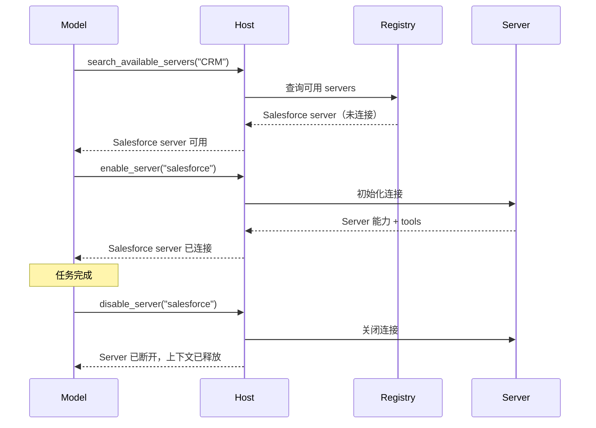
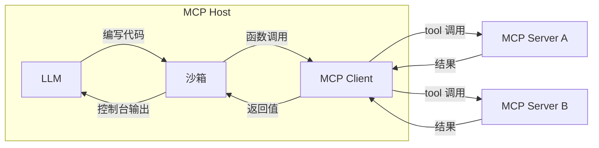

随着 MCP host 应用程序（如 agents）连接到更多 MCP server 并积累对成百上千个 tools 的访问权限，朴素的 tool 管理方法就会失效。预先将每个 tool 定义加载到模型的上下文窗口会浪费令牌、增加延迟并降低模型性能。在顺序 tool 调用之间通过模型传递大量中间结果会加剧这个问题。

两种模式可以应对这些挑战：**渐进式发现**，控制 tool 定义*何时*进入上下文；以及**编程式 tool 调用**，控制 tools *如何*被调用。

## 渐进式 Tool 发现

朴素的 MCP host 实现会在每次对话开始时将每个已连接 server 的 tool 定义直接传递给模型。对于少量 tools，这完全合理。但当 host 可以访问数十个暴露数百个 tools 的 servers 时，仅这些定义本身就可能消耗大部分上下文窗口，而模型甚至还没有读取用户的消息。


渐进式发现避免了这个问题：

- Host 像往常一样通过 `tools/list` 获取 tool 定义，但延迟将其注入模型的上下文。
- Host 向模型提供一个轻量级的 `search_tools` 元 tool。
- Host 仅在需要时将完整定义加载到上下文中。

### 何时使用渐进式发现

当 tool 定义占用上下文窗口的大部分时，渐进式发现最为适用。对于少量工具集，tool 定义只占上下文窗口的一小部分时，加载所有 tools 是可以的。一旦 tool 定义占用了可用上下文窗口的很大一部分，clients 应切换到渐进式发现。我们建议 clients 实现阈值来确定何时切换：

- 将阈值设置为上下文窗口的百分比。例如，1%-5%。
- 加载 tool 定义。一旦达到阈值，切换到渐进式发现。

### 选择发现策略

当模型调用 `search_tools` tool 后，我们需要选择一种搜索策略：

- **基于关键字**：关键字匹配（BM25、正则）。简单有效，特别适用于描述性的 tool 名称和描述。
- **基于 Embedding**：对 tool 描述进行向量相似性检索。能更好地处理同义词和语义匹配。
- **基于子 Agent**：使用辅助模型（通常是小型快速模型，如 Claude Haiku 或 Gemini Flash）为任务选择 tools。这通常效果非常好，但可能比基于 embedding 或关键字的解决方案成本更高。
- **混合**：结合多种方法。例如，通过关键字和 embedding 排名进行评分，或根据用例或查询选择不同的策略。

一些模型提供商已经提供了内置的 tool 搜索。例如，[OpenAI](https://developers.openai.com/api/docs/guides/tools-tool-search) 和 [Anthropic](https://platform.claude.com/docs/en/agents-and-tools/tool-use/tool-search-tool) 原生支持此功能；请查看你的提供商文档了解等效功能。如果可用，你可能更倾向于使用平台的 tool 搜索而不是自定义实现。当提供商不提供或你需要专门的检索逻辑（例如，特定领域的排名或访问控制过滤）时，再构建自己的实现。

下面的三层模式详细说明了基于自定义搜索的方法，但分层原则（目录、检查、执行）适用于任何检索机制。

### 使用渐进式发现

渐进式发现的一种常见实现使用基于搜索的三层方法：

**第 1 层：目录。** Host 暴露一小组用于搜索可用能力的元 tools。`search_tools` tool 接受自然语言查询，返回匹配的 tool 名称和简要描述。

```typescript
// 模型调用轻量级搜索 tool
search_tools({ query: "update salesforce record" })

// 返回简洁匹配：仅名称和一行描述
→ [
    { name: "salesforce_updateRecord", description: "Update fields on a Salesforce object" },
    { name: "salesforce_upsertRecord", description: "Insert or update based on external ID" }
  ]
```

**第 2 层：检查。** 一旦模型识别出候选 tool，它只获取该 tool 的完整定义（输入 schema、输出 schema、文档）。

```typescript
// 模型只检查它需要的 tool
get_tool_details({ name: "salesforce_updateRecord" });
```

This returns the complete schema for a single tool:

```json
{
  "name": "salesforce_updateRecord",
  "description": "Updates a record in Salesforce",
  "inputSchema": {
    "type": "object",
    "properties": {
      "objectType": {
        "type": "string",
        "description": "Salesforce object type"
      },
      "recordId": { "type": "string", "description": "Record ID to update" },
      "data": { "type": "object", "description": "Fields to update" }
    },
    "required": ["objectType", "recordId", "data"]
  }
}
```

**第 3 层：执行。** 模型在完全了解其接口的情况下调用 tool，仅加载了它需要的定义。

这种模式显著减少了令牌使用量，并可以提高 tool 选择准确性：模型专注于少量相关 tools，而不是扫描数百个不相关的 tools。其他发现策略（embeddings、子 agents 等）遵循相同的分层原则，但在目录层使用不同的检索机制。

### 动态 Server 管理

渐进式发现不仅限于单个 tools，还扩展到整个 servers。Host 不必在启动时连接到每个已配置的 server，而是可以：

1. 维护可用 servers 及其高级描述的注册表。
2. 仅在模型确定需要某个 server 的能力时才连接到该 server。
3. 断开与当前任务不再相关的 servers，释放上下文。



这对于通用 agents 特别有效，因为用户意图事先未知。Agent 从一组最小的常开 servers 开始，根据需要连接其他 servers。结合 [agent skills](/docs/develop/build-with-agent-skills)，skill 文件可以声明它需要哪些 MCP servers，host 仅在该 skill 被调用时才连接它们。

### 实现指南

实现渐进式发现时：

| 指南                         | 理由                                                                                                                       |
| ---------------------------- | -------------------------------------------------------------------------------------------------------------------------- |
| **提供多个详细级别**         | 让模型在仅名称、名称加描述或完整 schema 响应之间进行选择。                                                                 |
| **缓存 tool 定义**           | 从 server 获取后，在 host 端记忆定义，以便稍后重新注入时无需再次进行 `tools/list` 往返。这与当前在模型上下文中的内容分开。 |
| **在 `list_changed` 时刷新** | 当 server 发送 `notifications/tools/list_changed` 时，重新索引搜索目录。                                                   |
| **按 server 分组 tools**     | 按源 server 组织 tools，使模型能够推理相关能力。                                                                           |

### 与 Prompt 缓存的交互

大多数提供商缓存 prompt 前缀，包括 `tools` 数组。在对话中途添加或删除 tool 定义会使该缓存失效，由此导致的缓存未命中可能消耗比删除的定义更多的令牌。要保留缓存：

- 将新发现的定义追加到缓存断点之后，而不是重新排序 `tools` 数组，或通过一个稳定的 `call_tool({name, args})` 元 tool 路由所有调用，使数组永不改变。
- 将 server 断开连接视为对话边界操作，而不是每个回合的操作。
- 查阅你的提供商缓存文档以及上面的 tool 搜索链接。

## 编程式 Tool 调用 / 代码模式

使用直接 tool 调用时，每次 tool 调用都是一次往返：模型生成 tool 调用，client 执行它，完整结果流回模型上下文。当任务需要链接多个 tools（读取文档、转换它、写入其他地方）时，每个中间结果都通过模型传递，消耗令牌并增加延迟，即使模型与它们无关。

编程式 tool 调用（有时称为"代码模式"）为 clients 提供了一种有效**组合 tool 调用**的方式。模型不直接调用 tools，而是编写调用 tools 的代码。代码在沙箱环境中执行，只有最终结果返回给模型。

编程式 tool 调用非常强大，可以更有效地使用 MCP tools 和 resources，但要求 clients 实现沙箱环境。


### 工作原理

Host 将 MCP tool schema 转换为沙箱内可用的类型化 API。当模型需要 tools 时，它编写脚本并执行。

**步骤 1：从 MCP schema 生成编程式 API。** Host 读取每个 server 的 tool 定义，并根据每个 tool 的参数和 `outputSchema` 生成类型化函数：

```typescript
// 从 Logging MCP server 的 tool schema 自动生成
interface LogEntry {
  timestamp: string;
  message: string;
  level: string;
}

function logging_getLogs(input: {
  level: "error" | "warn" | "info";
  since: number;
}): Promise<{ entries: LogEntry[] }> {
  return mcp.callTool<{ entries: LogEntry[] }>("logging_getLogs", input);
}

// 从 Ticketing MCP server 的 tool schema 自动生成
function ticketing_createIssue(input: {
  title: string;
  body?: string;
  priority: "low" | "medium" | "high";
}): Promise<{ issueId: string }> {
  return mcp.callTool<{ issueId: string }>("ticketing_createIssue", input);
}
```

MCP Server 可以为每个 tool 提供可选的 [`outputSchema`](/specification/draft/server/tools#output-schema)。当存在输出 schema 时，host 可以生成精确的返回类型（如上面的 `LogEntry`）。

当没有输出 schema 时，优先选择简单路径：

- **使用通用类型并继续。** 接受 `any` 或 `string`，并在下游处理非结构化输出。真正的修复方法是让 server 作者提供 `outputSchema`。
- **使用快速模型提取类型化结果**，用于循环外的单次调用。通过与 MCP tool 调用相同的桩拦截路径暴露 host 代理的 `extract(value, ExpectedType)` 辅助函数，使沙箱本身永远不会打开网络连接。该辅助函数路由到小模型（例如 Claude Haiku 或 Gemini Flash）以将值强制转换为 `ExpectedType`。这会增加每次调用的延迟，并可能产生幻觉或遗漏字段，因此在使用前应针对 `ExpectedType` 验证结果。

**步骤 2：模型针对这些 API 编写代码。** 模型不单独进行 tool 调用（中间结果在它们之间流过上下文），而是编写单个脚本。考虑一个任务，如"查找过去一小时内所有错误日志，并为每个唯一错误提交一个工单。"使用直接 tool 调用，数千条日志条目会流过模型的上下文。使用代码，模型在沙箱中过滤：

```typescript
// 模型生成的代码，在沙箱中执行
const logs = await logging_getLogs({
  level: "error",
  since: Date.now() - 3600000,
});

// 在沙箱内过滤和去重，不在模型的上下文中
const uniqueErrors = new Map<string, LogEntry>();
for (const log of logs.entries) {
  if (!uniqueErrors.has(log.message)) {
    uniqueErrors.set(log.message, log);
  }
}

for (const [message, log] of uniqueErrors) {
  await ticketing_createIssue({
    title: `Error: ${message}`,
    body: `First seen: ${log.timestamp}\nOccurrences: ${
      logs.entries.filter((l) => l.message === message).length
    }`,
    priority: "high",
  });
}

console.log(
  `从 ${logs.entries.length} 条错误日志中提交了 ${uniqueErrors.size} 个工单`,
);
```

**步骤 3：沙箱执行代码。** 沙箱内的函数调用被拦截，并通过 host 代理路由回适当的 MCP server。日志数据和工单创建直接在 servers 之间流动，从不进入模型的上下文。只有 `console.log` 输出（一个摘要行）返回给模型。

### 选择沙箱

合适的沙箱取决于你希望模型编写的语言、你的 host 应用程序语言以及你需要多少隔离。下表列出了示例运行时而非推荐；请评估成熟度是否适合你的用例：

| 沙箱语言              | 运行时 / 库                                              | Host 语言         | 方法                                                               |
| --------------------- | -------------------------------------------------------- | ----------------- | ------------------------------------------------------------------ |
| **JavaScript**        | [Deno](https://github.com/denoland/deno), `isolated-vm`  | Rust / Node / CLI | 基于 V8 的运行时，具有细粒度权限。可以禁用所有权限以实现完全锁定。 |
| **Python**            | [Monty](https://github.com/pydantic/monty) _(实验性)_    | Rust              | 为 AI 用例构建的最小 Python 解释器。默认无 I/O。                   |
| **TypeScript**        | [pctx](https://github.com/portofcontext/pctx) _(早期)_   | Python / Rust     | 将代码模式概念作为库集成，具有底层 Rust 支持。                     |
| **任意（通过 Wasm）** | [Wasmtime](https://github.com/bytecodealliance/wasmtime) | Rust / C / Go     | 将任何语言编译为 Wasm 并使用基于能力的安全模型运行。               |

无论使用哪种沙箱，集成模式都是相同的：host 注入函数桩，通过进程内或 stdio 通道拦截调用（因此网络权限可以完全被拒绝），并将它们作为 `tools/call` 请求分发到 MCP servers。

### 执行架构

实现包含三个组件：



**沙箱** 在隔离环境中运行模型生成的代码，没有直接网络访问权限。它与外部世界的唯一接口是通过生成的函数桩，这些函数桩将调用路由回 host。

**Host** 充当代理。它接收来自沙箱的函数调用，将其映射到正确的 MCP server，执行 tool 调用，并将结果返回给沙箱。授权令牌和凭证由 host 持有，从不暴露给生成的代码。

**模型** 只看到沙箱返回的内容，通常是 `console.log` 语句的输出或最终返回值。这使模型（和 client 开发者）能够精确控制进入上下文窗口的内容。

### 安全考虑

编程式 tool 调用引入了一个需要仔细沙箱化的代码执行面：

- **每次调用授权**：代理仍然是规范意义上的 MCP host。对沙箱发起的调用应用与直接调用相同的人工确认策略（请参阅 [Tools：安全](/specification/draft/server/tools#security-considerations)）。批准脚本并不等于批准它在运行时发出的每个 tool 调用；host 可以授予分类批准（例如，"允许此脚本运行中的 `ticketing_createIssue`"），而不是每次迭代都提示，但代理仍必须根据该授权评估每个调用。
- **跨 server 数据流**：一个 server 的 tool 结果是另一个 server 的不可信输入。代理应对代理调用应用与直接调用相同的输入审查策略；仅靠输出截断不能防止数据泄露。
- **网络隔离**：沙箱不应有直接网络访问权限。所有外部通信都通过 host 代理进行，host 代理强制执行授权和访问控制。
- **不暴露凭证**：API 密钥和令牌由 host 持有。生成的代码调用类型化函数；host 在转发到 servers 时添加认证。
- **资源限制**：设置沙箱执行的超时时间和内存限制，以防止失控脚本。
- **输出过滤**：在将沙箱控制台输出反馈给模型之前进行验证和截断。

### 错误处理

MCP tool 错误以包含 [`isError: true`](/specification/draft/server/tools#error-handling) 的成功响应形式到达，而不是传输失败。生成的包装器应将其转换为抛出的异常，以便模型编写的代码可以使用 `try`/`catch`。如果未捕获的错误终止了脚本，则将其作为脚本的结果呈现，以便模型可以自我纠正；模型负责报告任何已提交的部分副作用。

## 结合两种模式

渐进式发现和编程式 tool 调用可以很好地协同工作。模型使用发现工具识别它需要哪些 tools，加载它们的 schema，然后编写一个在单次执行中调用多个 tools 的脚本。这种组合最小化了 tool 定义的令牌成本*和* tool 结果的令牌成本，使模型的上下文专注于推理而不是传递数据。
