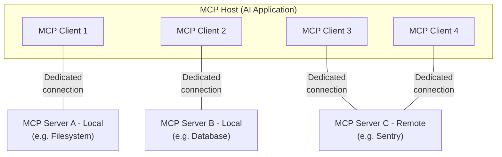

本文概述了 Model Context Protocol（MCP），讨论其[范围](#scope)和[核心概念](#concepts-of-mcp)，并提供一个[示例](#example)来演示每个核心概念。

由于 MCP SDK 抽象了许多关注点，大多数开发者可能会发现[数据层协议](#data-layer-protocol)部分最为有用。它讨论了 MCP server 如何向 AI 应用程序提供上下文。

有关具体的实现细节，请参考你所用[语言的 SDK](/docs/sdk) 的文档。

## 范围

Model Context Protocol 包含以下项目：

- [MCP 规范](https://modelcontextprotocol.io/specification/latest)：MCP 的规范，概述了 clients 和 servers 的实现要求。
- [MCP SDK](/docs/sdk)：实现 MCP 的不同编程语言的 SDK。
- **MCP 开发工具**：用于开发 MCP server 和 client 的工具，包括 [MCP Inspector](https://github.com/modelcontextprotocol/inspector)
- [MCP 参考 Server 实现](https://github.com/modelcontextprotocol/servers)：MCP server 的参考实现。

<Note>
  MCP 仅专注于上下文交换的协议——它不规定 AI 应用程序如何使用 LLM
  或管理所提供的上下文。
</Note>

## MCP 的概念

### 参与者

MCP 采用 client-server 架构，其中 MCP host——如 [Claude Code](https://www.anthropic.com/claude-code) 或 [Claude Desktop](https://www.claude.ai/download) 等 AI 应用程序——与一个或多个 MCP server 建立连接。MCP host 通过为每个 MCP server 创建一个 MCP client 来实现这一点。每个 MCP client 维护与其对应 MCP server 的专用连接。

使用 STDIO 传输的本地 MCP server 通常服务于单个 MCP client，而使用 Streamable HTTP 传输的远程 MCP server 通常服务于多个 MCP client。

MCP 架构中的关键参与者是：

- **MCP Host**：协调和管理一个或多个 MCP client 的 AI 应用程序
- **MCP Client**：维护与 MCP server 的连接并从 MCP server 获取上下文供 MCP host 使用的组件
- **MCP Server**：向 MCP client 提供上下文的程序

**例如**：Visual Studio Code 充当 MCP host。当 Visual Studio Code 与 MCP server（如 [Sentry MCP server](https://docs.sentry.io/product/sentry-mcp/)）建立连接时，Visual Studio Code 运行时实例化一个 MCP client 对象，该对象维护与 Sentry MCP server 的连接。
当 Visual Studio Code 随后连接到另一个 MCP server（如[本地文件系统 server](https://github.com/modelcontextprotocol/servers/tree/main/src/filesystem)）时，Visual Studio Code 运行时实例化另一个 MCP client 对象来维护此连接。



请注意，**MCP server** 指的是提供上下文数据的程序，无论它在何处运行。MCP server 可以在本地或远程执行。例如，当
Claude Desktop 启动[文件系统
server](https://github.com/modelcontextprotocol/servers/tree/main/src/filesystem)时，
该 server 因为使用 STDIO 传输而在同一台机器上本地运行。这通常被称为"本地"MCP server。官方
[Sentry MCP server](https://docs.sentry.io/product/sentry-mcp/) 运行在
Sentry 平台上，并使用 Streamable HTTP 传输。这通常被称为"远程"MCP server。

### 层次结构

MCP 包含两个层次：

- **数据层**：定义基于 JSON-RPC 的 client-server 通信协议，包括生命期管理以及核心原语，如 tools、resources、prompts 和通知。
- **传输层**：定义实现 clients 和 servers 之间数据交换的通信机制和通道，包括传输特定的连接建立、消息帧和授权。

从概念上讲，数据层是内层，而传输层是外层。

#### 数据层

数据层实现了基于 [JSON-RPC 2.0](https://www.jsonrpc.org/) 的交换协议，定义了消息结构和语义。
该层包括：

- **生命期管理**：处理 clients 和 servers 之间的连接初始化、能力协商和连接终止
- **Server 功能**：使 server 能够提供核心功能，包括用于 AI 动作的 tools、用于上下文数据的 resources 以及用于与 client 交互模板的 prompts
- **Client 功能**：使 server 能够请求 client 从 host LLM 采样、向用户征询输入以及向 client 记录消息
- **实用功能**：支持附加能力，如用于实时更新的通知和用于长时间运行操作的进度追踪

#### 传输层

传输层管理 clients 和 servers 之间的通信通道和认证。它处理连接建立、消息帧以及 MCP 参与者之间的安全通信。

MCP 支持两种传输机制：

- **Stdio 传输**：使用标准输入/输出流在同一台机器的本地进程之间进行直接进程通信，提供最佳性能且无网络开销。
- **Streamable HTTP 传输**：使用 HTTP POST 进行 client 到 server 的消息传递，并可选支持 Server-Sent Events 实现流式能力。此传输支持远程 server 通信，并支持标准 HTTP 认证方法，包括 bearer tokens、API keys 和自定义头部。MCP 建议使用 OAuth 获取认证令牌。

传输层将通信细节从协议层抽象出来，使得所有传输机制都能使用相同的 JSON-RPC 2.0 消息格式。

### 数据层协议

MCP 的核心部分是定义 MCP client 和 MCP server 之间的模式与语义。开发者可能会发现数据层——特别是[原语](#primitives)集合——是 MCP 中最有趣的部分。它是 MCP 中定义开发者如何从 MCP server 向 MCP client 共享上下文的部分。

MCP 使用 [JSON-RPC 2.0](https://www.jsonrpc.org/) 作为其底层 RPC 协议。Client 和 server 相互发送请求并相应地进行响应。当不需要响应时，可以使用通知。

#### 生命期管理

MCP 是一个 <Tooltip tip="MCP 的子集可以使用 Streamable HTTP 传输实现无状态">有状态协议</Tooltip>，需要生命期管理。生命期管理的目的是协商 client 和 server 都支持的<tooltip tip="client 或 server 支持的特性和操作，如 tools、resources 或 prompts">能力</tooltip>。详细信息可以在[规范](/specification/latest/basic/lifecycle)中找到，[示例](#example)展示了初始化序列。

#### 原语

MCP 原语是 MCP 中最重要的概念。它们定义了 clients 和 servers 可以相互提供什么。这些原语指定了可以与 AI 应用程序共享的上下文信息类型以及可以执行的操作范围。

MCP 定义了 server 可以暴露的三个核心原语：

- **Tools**：AI 应用程序可以调用的可执行函数，用于执行操作（如文件操作、API 调用、数据库查询）
- **Resources**：为 AI 应用程序提供上下文信息的数据源（如文件内容、数据库记录、API 响应）
- **Prompts**：可重复使用的模板，帮助结构化与语言模型的交互（如系统提示、few-shot 示例）

每个原语类型都有相关的发现（`*/list`）、检索（`*/get`），以及某些情况下的执行（`tools/call`）方法。
MCP client 将使用 `*/list` 方法来发现可用的原语。例如，client 可以先列出所有可用的 tools（`tools/list`），然后执行它们。这种设计允许列表是动态的。

作为一个具体示例，考虑一个提供数据库上下文的 MCP server。它可以暴露用于查询数据库的 tools、包含数据库 schema 的 resource，以及包含与 tools 交互的 few-shot 示例的 prompt。

有关 server 原语的更多详情，请参阅 [server concepts](./server-concepts)。

MCP 还定义了 _client_ 可以暴露的原语。这些原语允许 MCP server 作者构建更丰富的交互。

- **Sampling**：允许 server 从 client 的 AI 应用程序请求语言模型补全。当 server 作者希望访问语言模型，但希望保持模型无关性并且不在其 MCP server 中包含语言模型 SDK 时，这非常有用。他们可以使用 `sampling/createMessage` 方法从 client 的 AI 应用程序请求语言模型补全。
- **Elicitation**：允许 server 向用户请求额外信息。当 server 作者希望从用户获取更多信息，或请求确认某个操作时，这非常有用。他们可以使用 `elicitation/create` 方法向用户请求额外信息。
- **Logging**：使 server 能够向 client 发送日志消息，用于调试和监控目的。

有关 client 原语的更多详情，请参阅 [client concepts](./client-concepts)。

除了 server 和 client 原语之外，该协议还提供了横切实用原语，用于增强请求的执行方式：

- **Tasks（实验性）**：持久化执行包装器，支持对 MCP 请求进行延迟结果检索和状态跟踪（例如，昂贵的计算、工作流自动化、批处理、多步骤操作）

#### 通知

该协议支持实时通知，以实现 servers 和 clients 之间的动态更新。例如，当 server 的可用 tools 发生变化时——比如新功能可用或现有 tools 被修改——server 可以发送 tool 更新通知来通知已连接的 clients 这些变化。通知作为 JSON-RPC 2.0 通知消息发送（不期望响应），使 MCP server 能够向已连接的 clients 提供实时更新。

## 示例

### 数据层

本节逐步演示 MCP client-server 交互，重点关注数据层协议。我们将使用 JSON-RPC 2.0 消息展示生命期序列、tool 操作和通知。

<Steps>
<Step title="初始化（生命期管理）">

MCP 通过能力协商握手开始生命期管理。如[生命期管理](#lifecycle-management)部分所述，client 发送 `initialize` 请求来建立连接并协商支持的功能。

<CodeGroup>
  ```json Initialize Request
  {
    "jsonrpc": "2.0",
    "id": 1,
    "method": "initialize",
    "params": {
      "protocolVersion": "2025-06-18",
      "capabilities": {
        "elicitation": {}
      },
      "clientInfo": {
        "name": "example-client",
        "version": "1.0.0"
      }
    }
  }
  ```
  ```json Initialize Response
  {
    "jsonrpc": "2.0",
    "id": 1,
    "result": {
      "protocolVersion": "2025-06-18",
      "capabilities": {
        "tools": {
          "listChanged": true
        },
        "resources": {}
      },
      "serverInfo": {
        "name": "example-server",
        "version": "1.0.0"
      }
    }
  }
  ```
</CodeGroup>

#### 理解初始化交换

初始化过程是 MCP 生命期管理的关键部分，服务于几个关键目的：

1. **协议版本协商**：`protocolVersion` 字段（例如 "2025-06-18"）确保 client 和 server 使用兼容的协议版本。这可以防止不同版本交互时可能发生的通信错误。如果无法协商出相互兼容的版本，则应终止连接。

2. **能力发现**：`capabilities` 对象允许各方声明其支持的功能，包括它们可以处理哪些[原语](#primitives)（tools、resources、prompts）以及是否支持[通知](#notifications)等功能。这通过避免不支持的操作来实现高效通信。

3. **身份交换**：`clientInfo` 和 `serverInfo` 对象提供标识和版本信息，用于调试和兼容性目的。

在此示例中，能力协商展示了如何声明 MCP 原语：

**Client 能力**：

- `"elicitation": {}` - Client 声明它可以处理用户交互请求（可以接收 `elicitation/create` 方法调用）

**Server 能力**：

- `"tools": {"listChanged": true}` - Server 支持 tools 原语，并且可以在其 tool 列表更改时发送 `tools/list_changed` 通知
- `"resources": {}` - Server 还支持 resources 原语（可以处理 `resources/list` 和 `resources/read` 方法）

初始化成功后，client 发送一个通知表示已就绪：

```json Notification
{
  "jsonrpc": "2.0",
  "method": "notifications/initialized"
}
```

#### 在 AI 应用程序中的工作方式

初始化期间，AI 应用程序的 MCP client 管理器建立与已配置 server 的连接，并存储它们的能力以供以后使用。应用程序使用此信息来确定哪些 server 可以提供特定类型的功能（tools、resources、prompts）以及它们是否支持实时更新。

```python Pseudo-code for AI application initialization
# Pseudo Code
async with stdio_client(server_config) as (read, write):
    async with ClientSession(read, write) as session:
        init_response = await session.initialize()
        if init_response.capabilities.tools:
            app.register_mcp_server(session, supports_tools=True)
        app.set_server_ready(session)
```

</Step>

<Step title="Tool 发现（原语）">
现在连接已建立，client 可以通过发送 `tools/list` 请求来发现可用的 tools。这个请求是 MCP tool 发现机制的基础——它允许 clients 在尝试使用 tools 之前了解 server 上可用的 tools。

<CodeGroup>
  ```json Tools List Request
  {
    "jsonrpc": "2.0",
    "id": 2,
    "method": "tools/list"
  }
  ```
  ```json Tools List Response
  {
    "jsonrpc": "2.0",
    "id": 2,
    "result": {
      "tools": [
        {
          "name": "calculator_arithmetic",
          "title": "Calculator",
          "description": "Perform mathematical calculations including basic arithmetic, trigonometric functions, and algebraic operations",
          "inputSchema": {
            "type": "object",
            "properties": {
              "expression": {
                "type": "string",
                "description": "Mathematical expression to evaluate (e.g., '2 + 3 * 4', 'sin(30)', 'sqrt(16)')"
              }
            },
            "required": ["expression"]
          }
        },
        {
          "name": "weather_current",
          "title": "Weather Information",
          "description": "Get current weather information for any location worldwide",
          "inputSchema": {
            "type": "object",
            "properties": {
              "location": {
                "type": "string",
                "description": "City name, address, or coordinates (latitude,longitude)"
              },
              "units": {
                "type": "string",
                "enum": ["metric", "imperial", "kelvin"],
                "description": "Temperature units to use in response",
                "default": "metric"
              }
            },
            "required": ["location"]
          }
        }
      ]
    }
  }
  ```
</CodeGroup>

#### 理解 Tool 发现请求

`tools/list` 请求很简单，不包含参数。

#### 理解 Tool 发现响应

响应包含一个 `tools` 数组，提供每个可用 tool 的全面元数据。这种基于数组的结构允许 servers 同时暴露多个 tools，同时保持不同功能之间的清晰边界。

响应中的每个 tool 对象包含几个关键字段：

- **`name`**：tool 在 server 命名空间内的唯一标识符。这是 tool 执行的主键，应遵循清晰的命名模式（例如 `calculator_arithmetic` 而不是仅仅 `calculate`）
- **`title`**：tool 的人类可读显示名称，clients 可以显示给用户
- **`description`**：对 tool 功能和使用场景的详细说明
- **`inputSchema`**：定义预期输入参数的 JSON Schema，支持类型验证并提供关于必需和可选参数的清晰文档

#### 在 AI 应用程序中的工作方式

AI 应用程序从所有连接的 MCP server 获取可用 tools，并将它们合并为一个统一的 tool 注册表，供语言模型访问。这允许 LLM 了解它可以执行哪些操作，并在对话期间自动生成适当的 tool 调用。

```python Pseudo-code for AI application tool discovery
# Pseudo-code using MCP Python SDK patterns
available_tools = []
for session in app.mcp_server_sessions():
    tools_response = await session.list_tools()
    available_tools.extend(tools_response.tools)
conversation.register_available_tools(available_tools)
```

</Step>

<Step title="Tool 执行（原语）">
现在 client 可以使用 `tools/call` 方法执行 tool。这展示了 MCP 原语的实际使用方式：在发现可用 tools 后，client 可以使用适当的参数调用它们。

#### 理解 Tool 执行请求

`tools/call` 请求遵循结构化格式，确保类型安全以及 client 和 server 之间的清晰通信。请注意，我们使用了发现响应中的正确 tool 名称（`weather_current`）而不是简化名称：

<CodeGroup>
  ```json Tool Call Request
  {
    "jsonrpc": "2.0",
    "id": 3,
    "method": "tools/call",
    "params": {
      "name": "weather_current",
      "arguments": {
        "location": "San Francisco",
        "units": "imperial"
      }
    }
  }
  ```
  ```json Tool Call Response
  {
    "jsonrpc": "2.0",
    "id": 3,
    "result": {
      "content": [
        {
          "type": "text",
          "text": "Current weather in San Francisco: 68°F, partly cloudy with light winds from the west at 8 mph. Humidity: 65%"
        }
      ]
    }
  }
  ```
</CodeGroup>

#### Tool 执行的关键要素

请求结构包含几个重要组成部分：

1. **`name`**：必须与发现响应中的 tool 名称完全匹配（`weather_current`）。这确保 server 能正确识别要执行哪个 tool。

2. **`arguments`**：包含 tool 的 `inputSchema` 定义的输入参数。在此示例中：
   - `location`："San Francisco"（必需参数）
   - `units`："imperial"（可选参数，未指定时默认为 "metric"）

3. **JSON-RPC 结构**：使用标准 JSON-RPC 2.0 格式，具有唯一的 `id` 用于请求-响应关联。

#### 理解 Tool 执行响应

响应展示了 MCP 灵活的内容系统：

1. **`content` 数组**：Tool 响应返回一个内容对象数组，支持丰富、多格式的响应（文本、图片、resources 等）

2. **内容类型**：每个内容对象都有一个 `type` 字段。在此示例中，`"type": "text"` 表示纯文本内容，但 MCP 支持各种内容类型用于不同用例。

3. **结构化输出**：响应提供可操作的信息，AI 应用程序可以将其用作语言模型交互的上下文。

这种执行模式允许 AI 应用程序动态调用 server 功能，并接收结构化响应，这些响应可以集成到与语言模型的对话中。

#### 在 AI 应用程序中的工作方式

当语言模型决定在对话中使用 tool 时，AI 应用程序拦截该 tool 调用，将其路由到适当的 MCP server，执行它，并将结果返回给 LLM 作为对话流程的一部分。这使得 LLM 能够访问实时数据并在外部世界中执行操作。

```python
# AI 应用程序 tool 执行的伪代码
async def handle_tool_call(conversation, tool_name, arguments):
    session = app.find_mcp_session_for_tool(tool_name)
    result = await session.call_tool(tool_name, arguments)
    conversation.add_tool_result(result.content)
```

</Step>

<Step title="实时更新（通知）">
MCP 支持实时通知，使 servers 能够在不被明确请求的情况下通知 clients 有关变化。这展示了通知系统，这是保持 MCP 连接同步和响应的关键功能。

#### 理解 Tool 列表变更通知

当 server 的可用 tools 发生变化时——例如新功能可用、现有 tools 被修改或 tools 暂时不可用时——server 可以主动通知已连接的 clients：

```json Request
{
  "jsonrpc": "2.0",
  "method": "notifications/tools/list_changed"
}
```

#### MCP 通知的关键特性

1. **无需响应**：请注意通知中没有 `id` 字段。这遵循了 JSON-RPC 2.0 通知语义，即不期望也不发送响应。

2. **基于能力**：只有那些在初始化期间在其 tools 能力中声明了 `"listChanged": true` 的 server 才会发送此通知（如步骤 1 所示）。

3. **事件驱动**：Server 根据内部状态变化决定何时发送通知，使 MCP 连接动态且响应迅速。

#### Client 对通知的响应

收到此通知后，client 通常通过请求更新后的 tool 列表来做出反应。这创建了一个刷新循环，使 client 对可用 tools 的了解保持最新：

```json Request
{
  "jsonrpc": "2.0",
  "id": 4,
  "method": "tools/list"
}
```

#### 通知为何重要

此通知系统至关重要，原因如下：

1. **动态环境**：Tools 可能根据 server 状态、外部依赖或用户权限而变化
2. **效率**：Clients 无需轮询变化；它们在更新发生时被通知
3. **一致性**：确保 clients 始终拥有关于可用 server 能力的准确信息
4. **实时协作**：支持能够适应变化上下文的响应式 AI 应用程序

此通知模式超越了 tools，扩展到其他 MCP 原语，实现了 clients 和 servers 之间的全面实时同步。

#### 在 AI 应用程序中的工作方式

当 AI 应用程序收到关于 tools 变更的通知时，它会立即刷新其 tool 注册表并更新 LLM 的可用能力。这确保了正在进行的对话始终能够访问最新的 tools 集合，并且 LLM 可以动态适应新出现的功能。

```python
# AI 应用程序通知处理的伪代码
async def handle_tools_changed_notification(session):
    tools_response = await session.list_tools()
    app.update_available_tools(session, tools_response.tools)
    if app.conversation.is_active():
        app.conversation.notify_llm_of_new_capabilities()
```

</Step>
</Steps>
