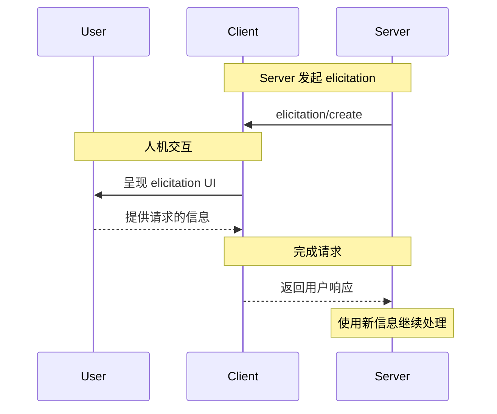
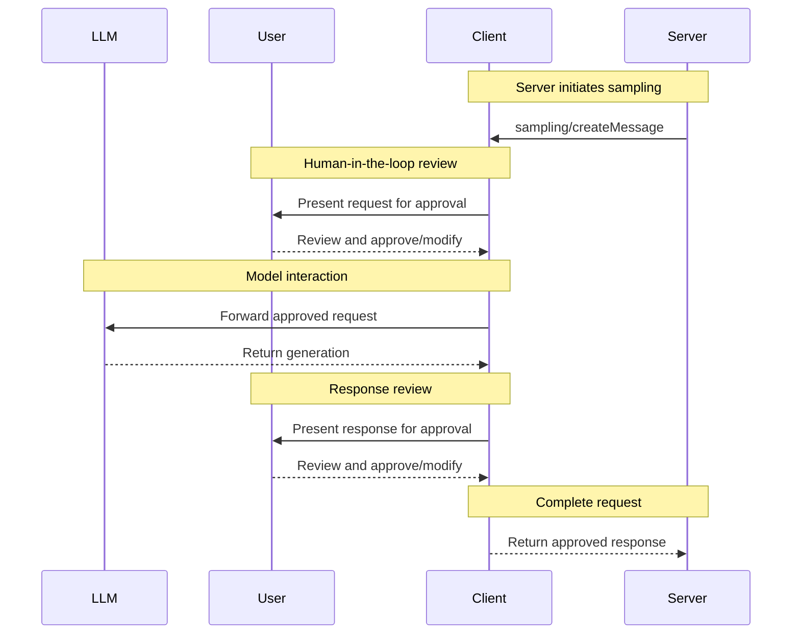

MCP client 由 host 应用程序实例化，用于与特定的 MCP server 通信。Host 应用程序（如 Claude.ai 或 IDE）管理整体用户体验并协调多个 clients。每个 client 处理与一个 server 的直接通信。

理解这种区别很重要：_host_ 是用户与之交互的应用程序，而 _clients_ 是启用 server 连接的协议级组件。

## 核心 Client 功能

除了使用 server 提供的上下文之外，clients 还可以向 servers 提供多个功能。这些 client 功能允许 server 作者构建更丰富的交互。

| 功能            | 说明                                                                                                                 | 示例                                                                               |
| --------------- | -------------------------------------------------------------------------------------------------------------------- | ---------------------------------------------------------------------------------- |
| **Elicitation** | Elicitation 使 server 能够在交互过程中向用户请求特定信息，为 servers 提供按需收集信息的结构化方式。                  | 预订旅行的 server 可能会询问用户对飞机座位、房间类型或联系方式的偏好，以完成预订。 |
| **Roots**       | Roots 允许 clients 指定 servers 应关注的目录，通过协调机制传达预期的范围。                                           | 预订旅行的 server 可能被授予对特定目录的访问权限，从中可以读取用户的日历。         |
| **Sampling**    | Sampling 允许 servers 通过 client 请求 LLM 补全，实现 agentic 工作流。这种方法使 client 完全控制用户权限和安全措施。 | 预订旅行的 server 可以向 LLM 发送航班列表，并请求 LLM 为用户选择最佳航班。         |

### Elicitation

Elicitation 使 server 能够在交互过程中向用户请求特定信息，创建更动态、更具响应性的工作流。

#### 概述

Elicitation 为 servers 提供了一种按需收集必要信息的结构化方式。与其要求所有信息一开始就提供，或在数据缺失时失败，servers 可以暂停其操作以向用户请求特定输入。这创建了更灵活的交互，其中 servers 适应用户需求，而不是遵循僵化的模式。

**Elicitation 流程：**



该流程支持动态信息收集。Servers 可以在需要时请求特定数据，用户通过适当的 UI 提供信息，servers 使用新获取的上下文继续处理。

**Elicitation 组件示例：**

```typescript
{
  method: "elicitation/create",
  params: {
    message: "Please confirm your Barcelona vacation booking details:",
    schema: {
      type: "object",
      properties: {
        confirmBooking: {
          type: "boolean",
          description: "Confirm the booking (Flights + Hotel = $3,000)"
        },
        seatPreference: {
          type: "string",
          enum: ["window", "aisle", "no preference"],
          description: "Preferred seat type for flights"
        },
        roomType: {
          type: "string",
          enum: ["sea view", "city view", "garden view"],
          description: "Preferred room type at hotel"
        },
        travelInsurance: {
          type: "boolean",
          default: false,
          description: "Add travel insurance ($150)"
        }
      },
      required: ["confirmBooking"]
    }
  }
}
```

#### 示例：假期预订批准

旅行预订 server 通过最终预订确认过程展示了 elicitation 的强大功能。当用户选择了理想的巴塞罗那度假套餐后，server 需要收集最终批准和任何缺失的详细信息才能继续。

Server 通过结构化请求征询预订确认，其中包括旅行摘要（巴塞罗那航班 6 月 15-22 日、海滨酒店、总计 3,000 美元）以及任何额外偏好的字段——如座位选择、房间类型或旅行保险选项。

随着预订的进行，server 会征询完成预订所需的联系信息。它可能会询问航班预订的旅客详细信息、酒店的特别要求或紧急联系信息。

#### 用户交互模型

Elicitation 交互设计为清晰、具有上下文感知性并尊重用户自主权：

**请求呈现**：Clients 显示 elicitation 请求，并附带清晰的上下文，说明是哪个 server 在请求、为什么需要这些信息以及将如何使用这些信息。请求消息解释目的，而 schema 提供结构和验证。

**响应选项**：用户可以通过适当的 UI 控件（文本字段、下拉菜单、复选框）提供所请求的信息，选择不提供信息（可附带可选说明），或取消整个操作。Clients 在将响应返回给 servers 之前，会根据提供的 schema 验证响应。

**隐私考虑**：Elicitation 从不请求密码或 API 密钥。Clients 会对可疑请求发出警告，并让用户在发送前审查数据。

### Roots

Roots 为 server 操作定义文件系统边界，允许 clients 指定 servers 应关注的目录。

#### 概述

Roots 是 clients 向 servers 传达文件系统访问边界的机制。它们由文件 URI 组成，指示 servers 可以操作的目录，帮助 servers 了解可用文件和文件夹的范围。虽然 roots 传达预期的边界，但它们不强制执行安全限制。实际安全必须在操作系统级别通过文件权限和/或沙箱来实施。

**Root 结构：**

```json
{
  "uri": "file:///Users/agent/travel-planning",
  "name": "Travel Planning Workspace"
}
```

Roots 专用于文件系统路径，始终使用 `file://` URI 方案。它们帮助 servers 了解项目边界、工作区组织和可访问的目录。随着用户处理不同的项目或文件夹，roots 列表可以动态更新，servers 通过 `roots/list_changed` 在边界变化时接收通知。

#### 示例：旅行规划工作区

处理多个客户行程的旅行代理受益于 roots 来组织文件系统访问。考虑一个工作区，其中包含旅行规划各个方面的不同目录。

Client 向旅行规划 server 提供文件系统 roots：

- `file:///Users/agent/travel-planning` - 包含所有旅行文件的主工作区
- `file:///Users/agent/travel-templates` - 可重用的行程模板和资源
- `file:///Users/agent/client-documents` - 客户护照和旅行文件

当代理创建巴塞罗那行程时，行为良好的 servers 会尊重这些边界——在指定的 roots 内访问模板、保存新行程和引用客户文件。Servers 通常通过使用根目录的相对路径或利用尊重根边界的文件搜索工具来访问 roots 内的文件。

如果代理打开一个归档文件夹，如 `file:///Users/agent/archive/2023-trips`，client 会通过 `roots/list_changed` 更新 roots 列表。

有关尊重 roots 的 server 的完整实现，请参阅官方 servers 仓库中的[文件系统 server](https://github.com/modelcontextprotocol/servers/tree/main/src/filesystem)。

#### 设计理念

Roots 作为 clients 和 servers 之间的协调机制，而不是安全边界。规范要求 servers "SHOULD respect root boundaries（应该尊重根边界）"，而不是 "MUST enforce（必须强制执行）"它们，因为 servers 运行 client 无法控制的代码。

Roots 在 servers 被信任或经过审查、用户理解其建议性质、目标是防止意外而不是阻止恶意行为时效果最佳。它们擅长上下文范围界定（告诉 servers 关注哪里）、意外预防（帮助行为良好的 servers 保持在边界内）和工作流组织（如自动管理项目边界）。

#### 用户交互模型

Roots 通常由 host 应用程序根据用户操作自动管理，尽管某些应用程序可能暴露手动 root 管理：

**自动 root 检测**：当用户打开文件夹时，clients 自动将它们作为 roots 暴露。打开旅行工作区允许 client 将该目录暴露为 root，帮助 servers 了解当前工作的哪些行程和文档在范围内。

**手动 root 配置**：高级用户可以通过配置指定 roots。例如，添加 `/travel-templates` 作为可重用资源，同时排除包含财务记录的目录。

### Sampling

Sampling allows servers to request language model completions through the client, enabling agentic behaviors while maintaining security and user control.

#### Overview

Sampling enables servers to perform AI-dependent tasks without directly integrating with or paying for AI models. Instead, servers can request that the client—which already has AI model access—handle these tasks on their behalf. This approach puts the client in complete control of user permissions and security measures. Because sampling requests occur within the context of other operations—like a tool analyzing data—and are processed as separate model calls, they maintain clear boundaries between different contexts, allowing for more efficient use of the context window.

**Sampling flow:**



该流程通过多个人工审核点确保安全。用户可以审查和修改初始请求以及生成后返回给 server 之前的响应。

**请求参数示例：**

```typescript
{
  messages: [
    {
      role: "user",
      content: "Analyze these flight options and recommend the best choice:\n" +
               "[47 flights with prices, times, airlines, and layovers]\n" +
               "User preferences: morning departure, max 1 layover"
    }
  ],
  modelPreferences: {
    hints: [{
      name: "claude-sonnet-4-20250514"  // Suggested model
    }],
    costPriority: 0.3,      // Less concerned about API cost
    speedPriority: 0.2,     // Can wait for thorough analysis
    intelligencePriority: 0.9  // Need complex trade-off evaluation
  },
  systemPrompt: "You are a travel expert helping users find the best flights based on their preferences",
  maxTokens: 1500
}
```

#### 示例：航班分析 Tool

考虑一个旅行预订 server，其中有一个名为 `findBestFlight` 的 tool，它使用 sampling 来分析可用航班并推荐最佳选择。当用户问"为我预订下个月去巴塞罗那的最佳航班"时，该 tool 需要 AI 协助来评估复杂的权衡。

该 tool 查询航空公司 API 并收集 47 个航班选项。然后它请求 AI 协助分析这些选项："分析这些航班选项并推荐最佳选择：[47 个航班的价格、时间、航空公司和中转信息] 用户偏好：早上出发，最多 1 次中转。"

Client 发起 sampling 请求，允许 AI 评估权衡——比如较便宜的红眼航班与方便的早上出发。该 tool 使用此分析来呈现前三名推荐。

#### 用户交互模型

虽然不是强制要求，但 sampling 设计为允许人工参与控制。用户可以通过几种机制保持监督：

**批准控制**：Sampling 请求可能需要明确的用户同意。Clients 可以显示 server 想要分析的内容以及原因。用户可以批准、拒绝或修改请求。

**透明度功能**：Clients 可以显示确切的 prompt、模型选择和令牌限制，允许用户在响应返回 server 之前审查 AI 响应。

**配置选项**：用户可以设置模型偏好、为受信任的操作配置自动批准，或要求对一切都进行批准。Clients 可能提供编辑敏感信息的选项。

**安全考虑**：Clients 和 servers 都必须在 sampling 期间适当处理敏感数据。Clients 应实施速率限制并验证所有消息内容。人工参与设计确保 server 发起的 AI 交互不会在未经用户明确同意的情况下危及安全或访问敏感数据。
