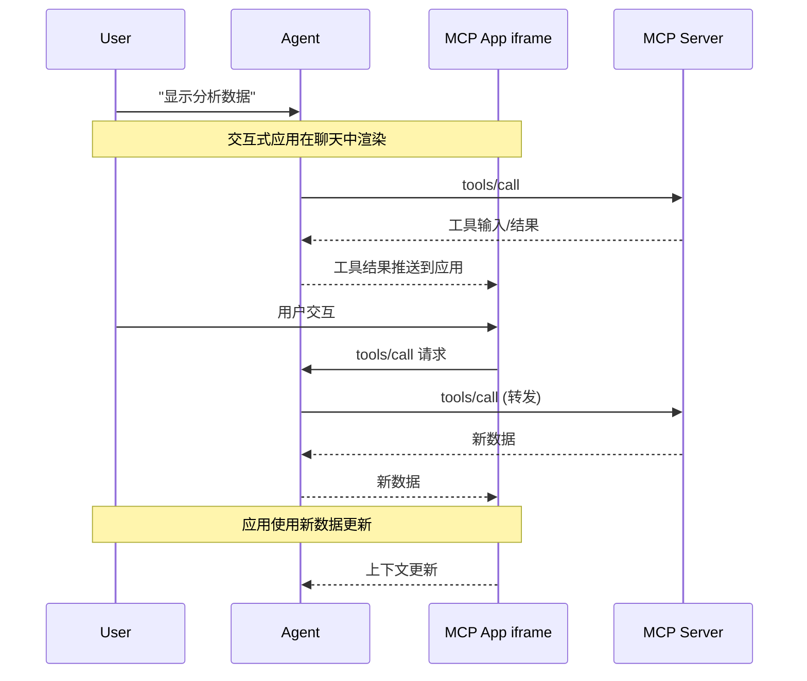

<Tip>

有关全面的 API 文档、高级模式和完整规范，请访问[官方 MCP 应用文档](https://apps.extensions.modelcontextprotocol.io)。

</Tip>

文本响应的能力是有限的。有时用户需要与数据交互，而不仅仅是阅读它。MCP 应用让服务器能够返回交互式 HTML 界面（数据可视化、表单、仪表板），直接在聊天中渲染。

## 为什么不直接构建一个 Web 应用？

您可以构建一个独立的 Web 应用并发送链接给用户。然而，MCP 应用提供了独立页面无法匹敌的关键优势：

- **保留上下文。** 应用存在于对话内部。用户无需切换标签页、迷失位置或担心哪个聊天线程有那个仪表板。UI 就在那里，与引发它的讨论并列显示。
- **双向数据流。** 您的应用可以调用 MCP 服务器上的任何工具，宿主也可以将最新结果推送到您的应用。独立的 Web 应用需要自己的 API、身份验证和状态管理。MCP 应用通过现有的 MCP 模式获得这些能力。
- **与宿主能力集成。** 应用可以将操作委托给宿主，宿主随后可以调用用户已连接的能力和工具（需经用户同意）。每个应用无需各自实现和维护直接集成（如电子邮件提供商），应用可以请求一个结果（如"安排此会议"），宿主通过用户现有的已连接能力来路由处理。
- **安全保障。** MCP 应用在宿主编制的沙箱化 iframe 中运行。它们无法访问父页面、窃取 cookie 或逃逸容器。这意味着宿主可以安全地渲染第三方应用，而无需完全信任服务器作者。

如果您的用例不受益于这些特性，那么常规的 Web 应用可能更简单。但如果您希望与基于 LLM 的对话紧密集成，MCP 应用是更好的工具。

## MCP 应用的工作原理

传统的 MCP 工具返回文本、图像、资源或结构化数据，由宿主作为对话的一部分显示。MCP 应用扩展了这种模式，允许工具在其工具描述中声明对交互式 UI 的引用，由宿主在原地渲染。

核心模式结合了两种 MCP 原语：一个在其描述中声明 UI 资源的工具，加上一个将数据渲染为交互式 HTML 界面的 UI 资源。

当大型语言模型（LLM）决定调用支持 MCP 应用的 tool 时，流程如下：

1. **UI 预加载**：工具描述包含一个指向 `ui://` 资源的 `_meta.ui.resourceUri` 字段。宿主可以在工具被调用之前预加载此资源，从而实现将工具输入流式传输到应用等功能。

2. **资源获取**：宿主从服务器获取 UI 资源。此资源包含一个 HTML 页面，通常为了简化而与其 JavaScript 和 CSS 打包在一起。应用还可以从 `_meta.ui.csp` 中指定的来源加载外部脚本和资源。

3. **沙箱化渲染**：Web 宿主通常在对话中的沙箱化 [iframe](https://developer.mozilla.org/en-US/docs/Web/HTML/Element/iframe) 内渲染 HTML。沙箱限制了应用对父页面的访问，确保了安全性。资源的 `_meta.ui` 对象可以包含 `permissions` 以请求额外能力（如麦克风、摄像头）和 `csp` 以控制应用可以从哪些外部来源加载资源。

4. **双向通信**：应用和宿主通过 JSON-RPC 协议进行通信，该协议形成了 MCP 自身的方言。某些请求和通知与核心 MCP 协议共享（例如 `tools/call`），有些类似（例如 `ui/initialize`），大多数是新的，带有 `ui/` 方法名前缀。应用可以请求工具调用、发送消息、更新模型的上下文以及从宿主接收数据。

应用与宿主保持隔离，但仍可通过安全的 postMessage 通道调用 MCP 工具。

## 何时使用 MCP 应用

MCP 应用适用于涉及以下场景的用例：

**探索复杂数据。** 用户问"按地区显示销售额"。文本响应可能列出数字，但 MCP 应用可以渲染交互式地图，用户可以点击区域深入查看、悬停获取详情、切换指标，所有这些都无需额外的提示。

**配置多项选项。** 设置部署涉及数十个相互依赖的选择。MCP 应用不是进行来回对话（"哪个区域？""什么实例大小？""启用自动扩展？"），而是呈现一个表单，让用户同时看到所有选项，并带有验证和默认值。

**查看富媒体。** 当用户要求审阅 PDF、查看 3D 模型或预览生成的图像时，文本描述不够用。MCP 应用将实际查看器（平移、缩放、旋转）直接嵌入到对话中。

**实时监控。** 显示实时指标、日志或系统状态的仪表板需要持续更新。MCP 应用保持持久连接，随着数据变化更新显示，无需用户问"现在状态如何？"

**多步骤工作流。** 审批费用报告、审查代码更改或分类问题需要逐项检查。MCP 应用提供导航控件、操作按钮和跨交互持久化的状态。

## 安全模型

MCP 应用在沙箱化的 [iframe](https://developer.mozilla.org/docs/Web/HTML/Element/iframe) 中运行，提供了与宿主应用的强隔离。沙箱阻止您的应用访问父窗口的 [DOM](https://developer.mozilla.org/docs/Web/API/Document_Object_Model)、读取宿主的 cookie 或本地存储、导航父页面或在父上下文中执行脚本。

您的应用与宿主之间的所有通信都通过 [postMessage API](https://developer.mozilla.org/docs/Web/API/Window/postMessage) 进行。宿主控制您的应用可以访问哪些能力。例如，宿主可能限制应用可以调用的工具或禁用 `sendOpenLink` 能力。

沙箱旨在防止应用逃逸以访问宿主或用户数据。

## 框架支持

MCP 应用使用自己的 MCP 方言，与核心协议一样基于 JSON-RPC 构建。一些消息与常规 MCP 共享（例如 `tools/call`），而其他消息则是应用特有的（例如 `ui/initialize`）。传输方式使用 [postMessage](https://developer.mozilla.org/docs/Web/API/Window/postMessage) 而非 stdio 或 HTTP。由于它全部是标准的 Web 原语，您可以使用任何框架或不使用框架。

`@modelcontextprotocol/ext-apps` 中的 `App` 类是一个便捷包装，但不是必需的。如果您想避免依赖或需要更精细的控制，可以直接实现 [postMessage 协议](https://github.com/modelcontextprotocol/ext-apps/blob/main/specification/2026-01-26/apps.mdx)。

[示例目录](https://github.com/modelcontextprotocol/ext-apps/tree/main/examples) 包含了 React、Vue、Svelte、Preact、Solid 和原生 JavaScript 的入门模板。这些展示了每个框架系统的推荐模式，但它们是示例而非要求。您可以选择最适合您用例的方式。

## 客户端支持

<Note>

MCP 应用是[核心 MCP 规范](/specification/latest)的扩展。宿主支持因客户端而异。

</Note>

MCP 应用目前受 [Claude](https://claude.ai)、[Claude Desktop](https://claude.ai/download)、[VS Code GitHub Copilot](https://code.visualstudio.com/)、[Goose](https://block.github.io/goose/)、[Postman](https://postman.com)、[MCPJam](https://www.mcpjam.com/) 和 [Archestra.AI](https://www.archestra.ai/) 支持。请参阅[客户端矩阵](/extensions/client-matrix)获取完整的客户端扩展支持列表。

如果您正在构建 MCP 客户端并希望支持 MCP 应用，有两种选择：

1. **使用框架**：[`@mcp-ui/client`](https://github.com/MCP-UI-Org/mcp-ui) 包提供了用于在宿主应用程序中渲染和交互 MCP 应用视图的 React 组件。详细信息请参阅 [MCP-UI 文档](https://mcpui.dev/)。

2. **基于 AppBridge 构建**：SDK 包含了一个 [**App Bridge**](https://apps.extensions.modelcontextprotocol.io/api/modules/app-bridge.html) 模块，负责在沙箱化 iframe 中渲染应用、消息传递、工具调用代理和安全策略执行。[basic-host 示例](https://github.com/modelcontextprotocol/ext-apps/tree/main/examples/basic-host) 展示了如何集成它。

实现细节请参阅 [API 文档](https://apps.extensions.modelcontextprotocol.io/api/)。

## 示例

[ext-apps 仓库](https://github.com/modelcontextprotocol/ext-apps/tree/main/examples) 包含了展示不同用例的可运行示例：

- **3D and visualization**:
  [map-server](https://github.com/modelcontextprotocol/ext-apps/tree/main/examples/map-server)
  (CesiumJS globe),
  [threejs-server](https://github.com/modelcontextprotocol/ext-apps/tree/main/examples/threejs-server)
  (Three.js scenes),
  [shadertoy-server](https://github.com/modelcontextprotocol/ext-apps/tree/main/examples/shadertoy-server)
  (shader effects)
- **Data exploration**:
  [cohort-heatmap-server](https://github.com/modelcontextprotocol/ext-apps/tree/main/examples/cohort-heatmap-server),
  [customer-segmentation-server](https://github.com/modelcontextprotocol/ext-apps/tree/main/examples/customer-segmentation-server),
  [wiki-explorer-server](https://github.com/modelcontextprotocol/ext-apps/tree/main/examples/wiki-explorer-server)
- **Business applications**:
  [scenario-modeler-server](https://github.com/modelcontextprotocol/ext-apps/tree/main/examples/scenario-modeler-server),
  [budget-allocator-server](https://github.com/modelcontextprotocol/ext-apps/tree/main/examples/budget-allocator-server)
- **Media**:
  [pdf-server](https://github.com/modelcontextprotocol/ext-apps/tree/main/examples/pdf-server),
  [video-resource-server](https://github.com/modelcontextprotocol/ext-apps/tree/main/examples/video-resource-server),
  [sheet-music-server](https://github.com/modelcontextprotocol/ext-apps/tree/main/examples/sheet-music-server),
  [say-server](https://github.com/modelcontextprotocol/ext-apps/tree/main/examples/say-server)
  (text-to-speech)
- **Utilities**:
  [qr-server](https://github.com/modelcontextprotocol/ext-apps/tree/main/examples/qr-server),
  [system-monitor-server](https://github.com/modelcontextprotocol/ext-apps/tree/main/examples/system-monitor-server),
  [transcript-server](https://github.com/modelcontextprotocol/ext-apps/tree/main/examples/transcript-server)
  (speech-to-text)
- **Starter templates**:
  [React](https://github.com/modelcontextprotocol/ext-apps/tree/main/examples/basic-server-react),
  [Vue](https://github.com/modelcontextprotocol/ext-apps/tree/main/examples/basic-server-vue),
  [Svelte](https://github.com/modelcontextprotocol/ext-apps/tree/main/examples/basic-server-svelte),
  [Preact](https://github.com/modelcontextprotocol/ext-apps/tree/main/examples/basic-server-preact),
  [Solid](https://github.com/modelcontextprotocol/ext-apps/tree/main/examples/basic-server-solid),
  [vanilla JavaScript](https://github.com/modelcontextprotocol/ext-apps/tree/main/examples/basic-server-vanillajs)

To start building your own MCP App, see the [build guide](/extensions/apps/build).
