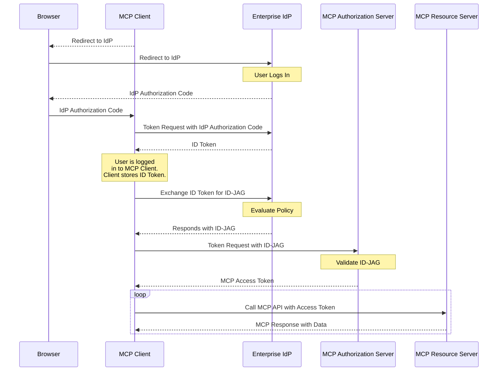

企业托管授权扩展（`io.modelcontextprotocol/enterprise-managed-authorization`）使组织能够通过其现有身份提供者（IdP）集中控制 MCP 服务器访问。无需每位员工单独授权每个 MCP 服务器，组织的 IT 或安全团队可以在一个地方管理访问策略。

<Card
  title="规范"
  icon="file-lines"
  href="https://github.com/modelcontextprotocol/ext-auth/blob/main/specification/draft/enterprise-managed-authorization.mdx"
>
  企业托管授权扩展的完整技术规范。
</Card>

## 这是什么

在标准的 MCP 部署中，每个用户独立地授权 MCP 客户端访问每个 MCP 服务器。对于消费类应用程序，这种用户驱动模型是理想的——它让个人控制对其数据的访问。

在企业环境中，此模型会产生摩擦和安全漏洞：

- 员工不需要了解其组织使用的每个 MCP 服务器的授权细节
- 如果每个用户独立授权，安全团队无法执行一致的访问策略
- 新员工入职需要他们手动授权数十个服务
- 离职需要在每个服务上单独撤销访问权限

企业托管授权通过引入组织的 IdP 作为权威决策者来解决此问题。IdP（如 Okta、Azure AD 或企业 SSO 系统）控制员工可以访问哪些 MCP 服务器以及在什么条件下访问。员工使用其企业身份进行身份验证——与用于电子邮件、Slack 和其他工作工具相同的凭据——IdP 根据组织策略授予或拒绝 MCP 服务器访问权限。

## 何时使用

在以下情况下使用企业托管授权：

- **在企业环境中部署 MCP**，IT 部门管理对所有业务应用程序的访问
- **执行组织访问策略**——您需要确保只有授权员工才能访问特定的 MCP 服务器
- **集中访问控制**——您希望从单个管理控制台添加或撤销对 MCP 服务器的访问权限
- **满足合规要求**——您的组织需要对所有 MCP 服务器访问具有可审计的授权追踪
- **简化员工体验**——员工应使用其现有的企业 SSO 凭据访问 MCP 工具，无需按服务进行授权流程

## 工作原理

该扩展建立了一个委托授权流程，企业 IdP 充当 MCP 客户端和 MCP 服务器之间的中介。MCP 客户端从企业 IdP 请求一种特殊类型的令牌，称为身份断言 JWT 授权（Identity Assertion JWT Authorization Grant，简称 ID-JAG）。然后 MCP 客户端将 ID-JAG 交换为来自 MCP 服务器授权服务器的访问令牌：



Key aspects of the flow:

1. **集中策略**：企业 IdP 维护已批准的 MCP 服务器注册表以及每个服务器的访问策略。管理员在其现有的身份管理工具中配置这些策略。

2. **单点登录**：员工使用其企业凭据进行一次身份验证。IdP 颁发令牌，授予对已批准的 MCP 服务器的访问权限，无需额外的逐个服务器授权提示。

3. **策略执行**：IdP 在颁发令牌之前评估访问策略（组成员身份、角色分配、条件访问规则）。未获得授权的员工会收到适当的错误——MCP 客户端永远不会收到未授权服务器的令牌。

4. **集中撤销**：撤销员工对 MCP 服务器的访问权限在 IdP 级别进行，立即在所有 MCP 客户端生效。无需按客户端、按服务器逐一撤销。

## 实现指南

### 针对 MCP 客户端

要支持企业托管授权，您的客户端必须：

1. **在 `initialize` 请求中声明支持**：

```json
{
  "capabilities": {
    "extensions": {
      "io.modelcontextprotocol/enterprise-managed-authorization": {}
    }
  }
}
```

2. **支持 SSO**——用户应使用企业 IdP 向 MCP 客户端进行身份验证。保存登录期间颁发的身份断言（OpenID ID Token 或 SAML 断言）以备后续使用。

3. **处理 ID-JAG**——当服务器指示需要企业托管授权时，使用先前获取的身份断言从企业 IdP 的授权端点请求 ID-JAG 令牌。将此 ID-JAG 交换为来自 MCP 授权服务器的访问令牌。不要将用户重定向到 MCP 授权服务器的授权端点。

4. **支持组织配置**——允许管理员配置企业 IdP 的端点，通常通过组织级设置而非按用户设置。

5. **尊重令牌作用域**——企业 IdP 颁发的令牌可能具有与标准 MCP 授权不同的作用域限制。优雅地处理作用域错误。

### 针对 MCP 服务器

要要求企业托管授权：

1. **在服务器的授权元数据中声明该扩展**，表明客户端必须使用企业托管流程。

2. **与 IdP 管理 API 集成**（可选）——发布服务器的资源描述符，以便企业管理员可以在其 IdP 管理控制台中配置访问策略。

### 针对 MCP 授权服务器

1. **验证企业 IdP 颁发的 ID-JAG**。这通常意味着根据 IdP 的 JWKS 端点验证 JWT 签名，并检查令牌的受众、签发者和过期时间。

2. **将 IdP 声明映射到权限**——ID-JAG 令牌携带声明（作用域和资源信息），您的服务器使用这些声明来确定员工身份及其可访问的内容。基于这些声明定义您的授权逻辑。

3. **处理账户链接**——ID-JAG 令牌将始终包含主体声明，并可能额外包含可用于账户链接的电子邮件声明。

## 客户端支持

<Note>

对此扩展的支持因客户端而异。扩展是选择加入的，默认从不激活。

</Note>

查看[客户端矩阵](/extensions/client-matrix)了解当前在 MCP 客户端中的实现状态。企业托管授权通常需要组织的 IT 团队在 MCP 客户端应用之外提供客户端级别的支持。

## 相关资源

<CardGroup cols={2}>
  <Card
    title="ext-auth 仓库"
    icon="github"
    href="https://github.com/modelcontextprotocol/ext-auth"
  >
    源代码和参考实现
  </Card>
  <Card
    title="完整规范"
    icon="file-lines"
    href="https://github.com/modelcontextprotocol/ext-auth/blob/main/specification/draft/enterprise-managed-authorization.mdx"
  >
    包含规范性要求的技术规范
  </Card>
  <Card
    title="SEP-990"
    icon="file-lines"
    href="/seps/990-enable-enterprise-idp-policy-controls-during-mcp-o"
  >
    原始提案：启用企业 IdP 策略控制
  </Card>
  <Card
    title="MCP 授权"
    icon="lock"
    href="/specification/latest/basic/authorization"
  >
    核心 MCP 授权规范
  </Card>
</CardGroup>
