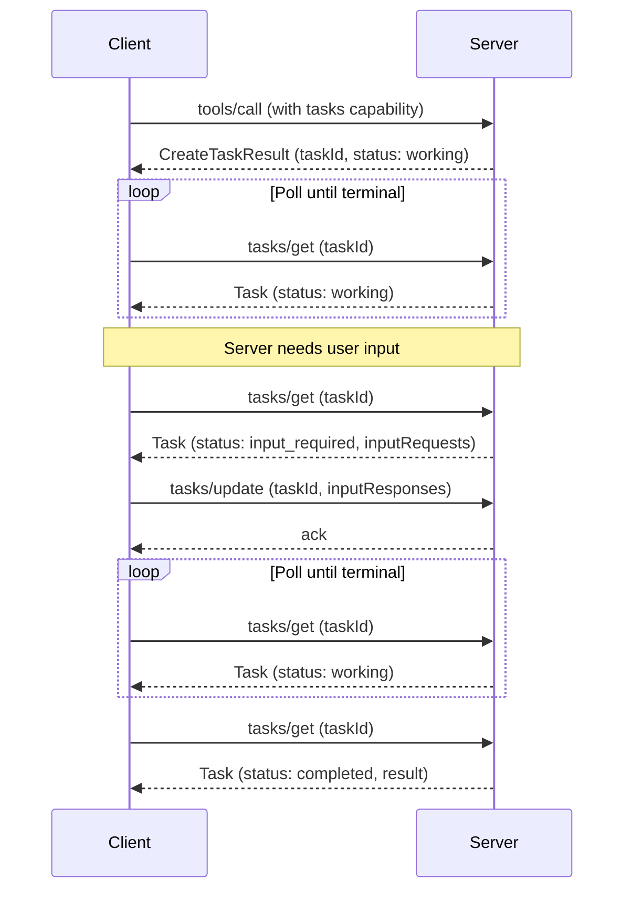

[experimental-ext-tasks 仓库](https://github.com/modelcontextprotocol/experimental-ext-tasks) 包含了 MCP 任务的完整规范和文档。

<Card
  title="modelcontextprotocol/ext-tasks"
  icon="github"
  href="https://github.com/modelcontextprotocol/ext-tasks"
>
  MCP 任务的完整规范和文档。
</Card>

并非每个工具调用都能立即返回。某些操作——CI 流水线、批处理、人工审批——需要数秒、数分钟甚至更长时间。MCP 任务让服务器返回一个持久化句柄而不是阻塞，这样客户端可以轮询进度、在需要时提供输入，并在重新连接后检索最终结果。

## 为什么不直接阻塞？

您可以保持连接打开直到工作完成。任务解决了阻塞无法解决的问题：

- **无需长连接。** 阻塞会在操作期间占用一个连接。许多客户端和传输中介会设置超时，使得超过几秒的操作变得不切实际。
- **崩溃恢复能力。** 任务 ID 是一个持久化句柄。如果客户端断开或重新启动，它可以使用相同的 ID 恢复轮询。
- **进度可见性。** 任务携带状态元数据（`working`、`input_required`、`completed`、`failed`、`cancelled`）和可选的状态消息，使客户端能够查看进度。
- **中途交互。** 当任务需要输入（例如用户确认的征询）时，它会切换到 `input_required` 状态并展示请求。客户端通过 `tasks/update` 响应——无需第二次连接或服务器主动发送消息。
- **服务器主导。** 服务器根据每个请求决定是否创建任务。客户端通过扩展能力一次性选择加入，并处理到达的任何结果形状。无需按工具预热或按请求设置标志。

## 任务的工作原理

任务扩展了标准请求流程。当服务器判定某个请求将长时间运行时，它会返回一个任务句柄而不是最终结果。客户端轮询直到完成。

1. **能力协商。** 客户端在其按请求的能力中包含 `io.modelcontextprotocol/tasks`。服务器在其自己的 `server/discover` 能力中宣传相同的扩展。

2. **任务创建。** 作为对受支持请求的响应，服务器返回一个 `CreateTaskResult`（由 `resultType: "task"` 标识），包含 `taskId`、初始状态、TTL 和建议的轮询间隔。任务在发送响应之前被持久化创建。

3. **轮询。** 客户端使用 `taskId` 调用 `tasks/get`。响应携带当前状态，对于终端状态，则携带最终结果或错误。

4. **中途输入。** 如果任务进入 `input_required` 状态，`tasks/get` 响应包含一个 `inputRequests` 映射，其中包含征询或其他服务器请求。客户端通过 `tasks/update` 来满足这些请求。

5. **完成。** 当状态达到 `completed` 时，`result` 字段包含原始请求本应同步返回的内容。如果状态是 `failed`，`error` 字段包含 JSON-RPC 错误。

6. **取消。** 客户端可以随时发送 `tasks/cancel`。取消是协作式的——服务器确认意图但没有义务停止工作。



## 何时使用任务

任务适用于涉及以下场景的用例：

**长时间运行的操作。** CI 流水线、批数据处理或需要数分钟或数小时的模型训练任务。

**人在回路中的工作流。** 审批关卡、审查步骤或任何需要用户确认而暂停的操作。任务切换到 `input_required` 状态，客户端展示请求。

**外部作业系统。** 如果您的服务器包装了一个已经使用作业 ID 的 API（云部署、异步 API、排队工作），在创建作业时返回一个任务，并在作业完成时解析它。

**不可靠的连接。** 移动客户端、间歇性网络或连接断开的環境。任务 ID 在断开连接后仍然存在。

**批处理。** 处理多个项目（批量导入、批量更新）的操作，部分进度是有意义的。状态消息报告进度。

## 任务生命周期

| 状态             | 含义                                                   |
| ---------------- | ------------------------------------------------------ |
| `working`        | 操作正在进行中。                                       |
| `input_required` | 服务器需要客户端输入才能继续。请参阅 `inputRequests`。 |
| `completed`      | 操作已完成。`result` 字段包含最终输出。                |
| `failed`         | 执行期间发生 JSON-RPC 错误。`error` 字段包含详细信息。 |
| `cancelled`      | 操作已取消（并非始终被遵守）。                         |

`completed`、`failed` 和 `cancelled` 是终端状态——一旦达到，任务的状态不再改变。

## 通知

服务器可以通过 `notifications/tasks` 推送状态更新。客户端通过 `subscriptions/listen` 机制选择加入这些通知。每条通知都携带完整的任务状态，无需额外的 `tasks/get` 往返。

轮询是默认方式。如果服务器支持通知，客户端可以依赖通知而不是轮询。

## 实现指南

### 针对 MCP 客户端

要使用任务增强的响应，您的客户端必须：

<Steps>
<Step title="声明支持">

在按请求的能力中包含该扩展：

```json
{
  "params": {
    "_meta": {
      "io.modelcontextprotocol/clientCapabilities": {
        "extensions": {
          "io.modelcontextprotocol/tasks": {}
        }
      }
    }
  }
}
```

</Step>
<Step title="处理多态结果">

当发出受支持的请求（例如 `tools/call`）时，准备好接收标准结果或带有 `resultType: "task"` 的 `CreateTaskResult`。

</Step>
<Step title="轮询完成">

使用返回的 `taskId` 调用 `tasks/get`，遵循 `pollIntervalMs` 值。继续轮询直到任务达到终端状态（`completed`、`failed` 或 `cancelled`）。

</Step>
<Step title="处理输入请求">

如果任务状态是 `input_required`，读取 `inputRequests` 映射，向用户或模型展示请求，并通过 `tasks/update` 提交响应。

</Step>
<Step title="持久化任务 ID">

持久化存储任务 ID，以便在客户端崩溃或重启后可以恢复轮询。

</Step>
</Steps>

### 针对 MCP 服务器

要从服务器返回任务：

<Steps>
<Step title="宣传支持">

在您的 `server/discover` 能力中包含该扩展：

```json
{
  "capabilities": {
    "extensions": {
      "io.modelcontextprotocol/tasks": {}
    }
  }
}
```

</Step>
<Step title="检查客户端能力">

在返回 `CreateTaskResult` 之前，验证客户端在其按请求的能力中是否包含该扩展。切勿向未声明支持的客户端返回任务。

</Step>
<Step title="返回 CreateTaskResult">

当请求将长时间运行时，使用 `resultType: "task"` 和一个包含唯一 `taskId`、初始状态、`ttlMs` 和 `pollIntervalMs` 的 `Task` 对象进行响应。任务必须在发送响应之前被持久化创建。

</Step>
<Step title="提供 tasks/get">

在每次轮询时返回当前任务状态。对于终端状态，包含 `result`（在 `completed` 时）或 `error`（在 `failed` 时）字段。

</Step>
<Step title="处理 tasks/update">

接受与未完成的 `inputRequests` 对应的 `inputResponses`。使用空结果进行确认。忽略未知或已满足的键的响应。

</Step>
<Step title="处理 tasks/cancel">

使用空结果确认取消请求。尽可能遵守取消请求，但取消是协作式的——任务仍可能达到非 `cancelled` 的终端状态。

</Step>
</Steps>

## 客户端支持

<Note>

MCP 任务是[核心 MCP 规范](/specification/latest)的扩展。宿主支持因客户端而异。

</Note>

请参阅[客户端矩阵](/extensions/client-matrix)了解各客户端的扩展支持情况。任务支持需要客户端和服务器都明确选择加入。

## 规范

任务扩展在 [experimental-ext-tasks 仓库](https://github.com/modelcontextprotocol/experimental-ext-tasks) 中定义。它使用标准的 MCP [扩展协商](/extensions/overview#negotiation)机制：客户端和服务器在初始化期间通过其能力中的 `extensions` 字段声明支持。
