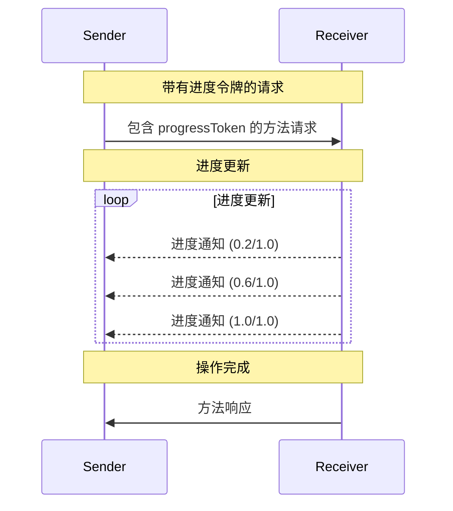

Model Context Protocol (MCP) 支持通过通知消息可选地跟踪长时间运行的操作的进度。任何一方都可以发送进度通知以提供操作状态的更新。

## 进度流程

当一方想要*接收*请求的进度更新时，它在请求元数据中包含一个 `progressToken`。

- 进度令牌 **MUST** 是字符串或整数值
- 发送方可以使用任何方式选择进度令牌，但 **MUST** 在所有活跃请求中保持唯一

```json
{
  "jsonrpc": "2.0",
  "id": 1,
  "method": "some_method",
  "params": {
    "_meta": {
      "progressToken": "abc123"
    }
  }
}
```

接收方 **MAY** 随后发送进度通知，包含：

- 原始进度令牌
- 当前的进度值
- 可选的"总计"值

```json
{
  "jsonrpc": "2.0",
  "method": "notifications/progress",
  "params": {
    "progressToken": "abc123",
    "progress": 50,
    "total": 100
  }
}
```

- `progress` 值 **MUST** 随每个通知递增，即使总计未知。
- `progress` 和 `total` 值 **MAY** 是浮点数。

## 行为要求

1. 进度通知 **MUST** 仅引用以下令牌：
   - 在活跃请求中提供的
   - 与正在进行的操作相关联的

2. 进度请求的接收方 **MAY**：
   - 选择不发送任何进度通知
   - 以他们认为适当的任何频率发送通知
   - 如果总计未知，则省略该值



## 实现说明

- 发送方和接收方 **SHOULD** 跟踪活跃的进度令牌
- 双方 **SHOULD** 实现速率限制以防止消息泛滥
- 进度通知 **MUST** 在完成后停止
