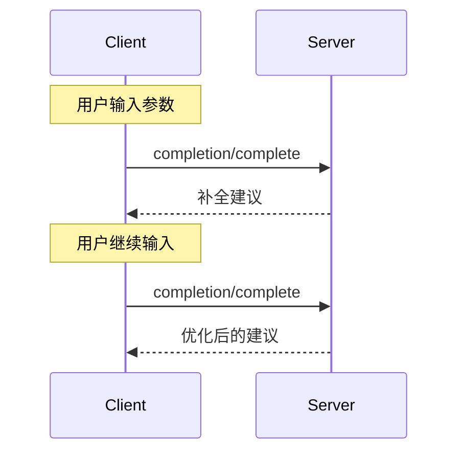

Model Context Protocol (MCP) 提供了一种标准化的方式，让服务器为提示和资源 URI 提供参数自动补全建议。这使得用户能够在输入参数值时获得上下文的建议，从而实现丰富的、类似 IDE 的体验。

## 用户交互模型

MCP 中的补全旨在支持类似于 IDE 代码补全的交互式用户体验。

例如，应用程序可以在用户键入时以下拉或弹出菜单的形式显示补全建议，并能够过滤和选择可用选项。

然而，实现可以自由地以适合其需求的任何界面模式暴露补全——协议本身并不强制要求任何特定的用户交互模型。

## 协议消息

### 请求补全

要获取补全建议，客户端发送 `completion/complete` 请求，通过引用类型指定要补全的内容：

**Request:**

```json
{
  "jsonrpc": "2.0",
  "id": 1,
  "method": "completion/complete",
  "params": {
    "ref": {
      "type": "ref/prompt",
      "name": "code_review"
    },
    "argument": {
      "name": "language",
      "value": "py"
    }
  }
}
```

**Response:**

```json
{
  "jsonrpc": "2.0",
  "id": 1,
  "result": {
    "completion": {
      "values": ["python", "pytorch", "pyside"],
      "total": 10,
      "hasMore": true
    }
  }
}
```

### 引用类型

该协议支持两种类型的补全引用：

| 类型           | 描述           | 示例                                                |
| -------------- | -------------- | --------------------------------------------------- |
| `ref/prompt`   | 按名称引用提示 | `{"type": "ref/prompt", "name": "code_review"}`     |
| `ref/resource` | 引用资源 URI   | `{"type": "ref/resource", "uri": "file:///{path}"}` |

### 补全结果

服务器返回按相关性排序的补全值数组，其中包含：

- 每个响应最多 100 个项目
- 可选的总匹配数
- 指示是否存在更多结果的布尔值

## 消息流程



## 数据类型

### CompleteRequest

- `ref`：`PromptReference` 或 `ResourceReference`
- `argument`：包含以下内容的对象：
  - `name`：参数名称
  - `value`：当前值

### CompleteResult

- `completion`：包含以下内容的对象：
  - `values`：建议数组（最多 100 个）
  - `total`：可选的总匹配数
  - `hasMore`：附加结果标志

## 实现考虑

1. 服务器 **SHOULD**：
   - 按相关性排序返回建议
   - 在适当情况下实现模糊匹配
   - 对补全请求进行速率限制
   - 验证所有输入

2. 客户端 **SHOULD**：
   - 对快速补全请求进行防抖处理
   - 在适当情况下缓存补全结果
   - 优雅地处理缺失或不完整的结果

## 安全

实现 **MUST**：

- 验证所有补全输入
- 实现适当的速率限制
- 控制对敏感建议的访问
- 防止基于补全的信息泄露
