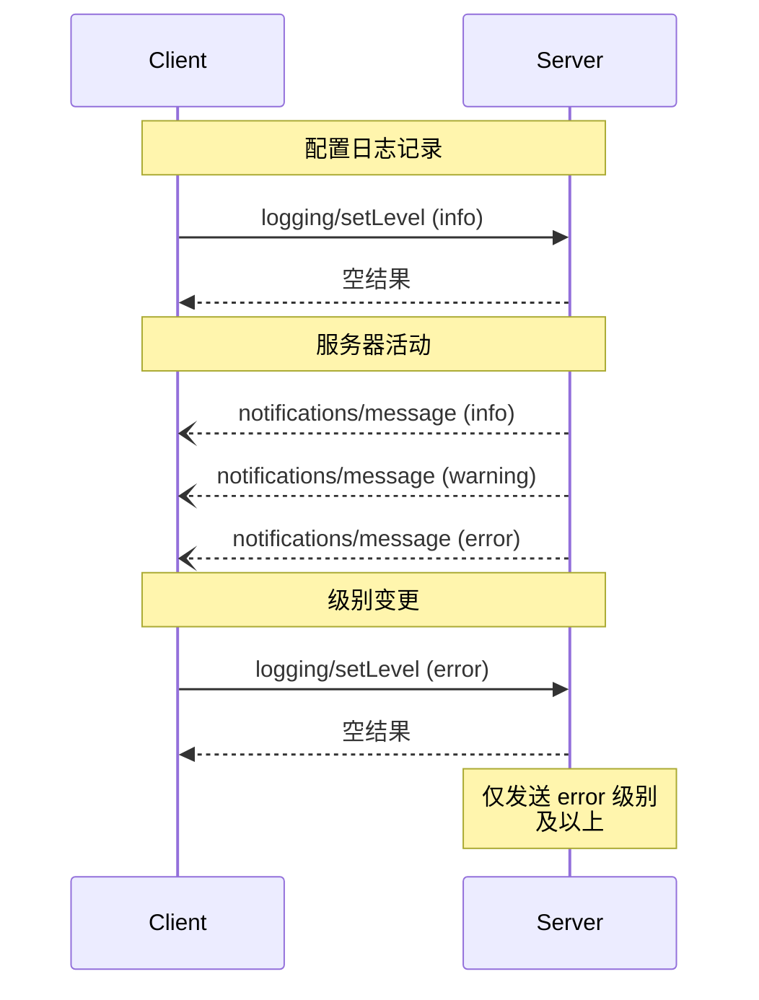

The Model Context Protocol (MCP) provides a standardized way for servers to send
structured log messages to clients. Clients can control logging verbosity by setting
minimum log levels, with servers sending notifications containing severity levels,
optional logger names, and arbitrary JSON-serializable data.

## 用户交互模型

实现可以自由地以适合其需求的任何界面模式暴露日志记录 their
needs&mdash;the protocol itself does not mandate any specific user interaction model.

## 能力

发出日志消息通知的服务器 **MUST** 声明 `logging` 能力：

```json
{
  "capabilities": {
    "logging": {}
  }
}
```

## 日志级别

该协议遵循 [RFC 5424](https://datatracker.ietf.org/doc/html/rfc5424#section-6.2.1) 中定义的标准 syslog 严重级别：

| 级别      | 描述             | 示例用例         |
| --------- | ---------------- | ---------------- |
| debug     | 详细的调试信息   | 函数入口/出口点  |
| info      | 常规信息消息     | 操作进度更新     |
| notice    | 正常但重要的事件 | 配置变更         |
| warning   | 警告条件         | 已弃用功能的使用 |
| error     | 错误条件         | 操作失败         |
| critical  | 严重条件         | 系统组件故障     |
| alert     | 必须立即采取行动 | 检测到数据损坏   |
| emergency | 系统不可用       | 完全系统故障     |

## 协议消息

### 设置日志级别

要配置最低日志级别，客户端 **MAY** 发送 `logging/setLevel` 请求：

**Request:**

```json
{
  "jsonrpc": "2.0",
  "id": 1,
  "method": "logging/setLevel",
  "params": {
    "level": "info"
  }
}
```

### 日志消息通知

服务器使用 `notifications/message` 通知发送日志消息：

```json
{
  "jsonrpc": "2.0",
  "method": "notifications/message",
  "params": {
    "level": "error",
    "logger": "database",
    "data": {
      "error": "Connection failed",
      "details": {
        "host": "localhost",
        "port": 5432
      }
    }
  }
}
```

## 消息流程



## 错误处理

服务器 **SHOULD** 对常见失败情况返回标准 JSON-RPC 错误：

- 无效的日志级别：`-32602`（无效参数）
- 配置错误：`-32603`（内部错误）

## 实现考虑

1. 服务器 **SHOULD**：
   - 对日志消息进行速率限制
   - 在 data 字段中包含相关上下文
   - 使用一致的日志记录器名称
   - 移除敏感信息

2. 客户端 **MAY**：
   - 在 UI 中展示日志消息
   - 实现日志过滤/搜索
   - 视觉化显示严重级别
   - 持久化日志消息

## 安全

1. 日志消息 **MUST NOT** 包含：
   - 凭据或密钥
   - 个人身份信息
   - 可能助长攻击的内部系统细节

2. 实现 **SHOULD**：
   - 对消息进行速率限制
   - 验证所有数据字段
   - 控制日志访问权限
   - 监控敏感内容
