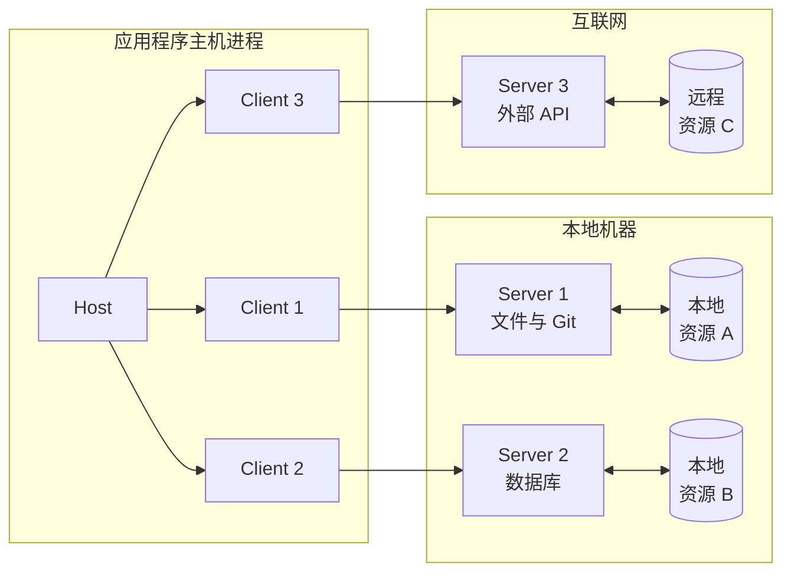
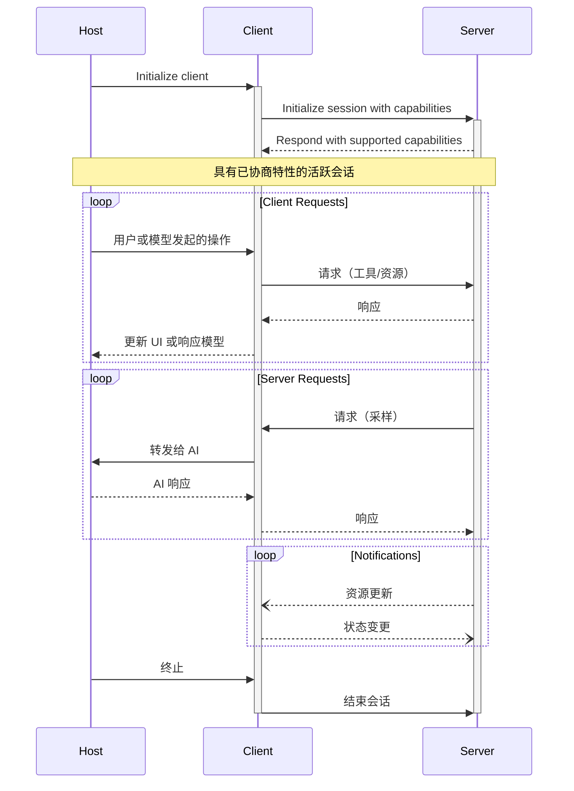

Model Context Protocol (MCP) 采用客户端-主机-服务器架构，每个
主机可以运行多个客户端实例。这种架构使用户能够在应用程序之间集成 AI
能力，同时保持清晰的安全边界和关注点隔离。MCP 基于 JSON-RPC 构建，提供了一种有状态的会话协议，专注于
客户端和服务器之间的上下文交换和采样协调。

## 核心组件

### 主机（Host）

主机进程充当容器和协调器：

- 创建和管理多个客户端实例
- 控制客户端连接权限和生命周期
- 执行安全策略和同意要求
- 处理用户授权决策
- 协调 AI/LLM 集成和采样
- 管理跨客户端的上下文聚合

### 客户端（Clients）

每个客户端由主机创建，并维护一个独立的服务器连接：

- 为每个服务器建立一个有状态会话
- 处理协议协商和能力交换
- 双向路由协议消息
- 管理订阅和通知
- 维护服务器之间的安全边界

主机应用程序创建和管理多个客户端，每个客户端与特定服务器保持 1:1
的关系。

### 服务器（Servers）

服务器提供专门的上下文和能力：

- 通过 MCP 原语暴露资源、工具和提示
- 独立运行，职责聚焦
- 通过客户端接口请求采样
- 必须遵守安全约束
- 可以是本地进程或远程服务

## 设计原则

MCP 建立在几个关键设计原则之上，这些原则指导其架构和
实现：

1. **服务器应该极其容易构建**
   - 主机应用程序处理复杂的编排职责
   - 服务器专注于特定的、明确定义的能力
   - 简单接口最小化实现开销
   - 清晰的分离实现可维护的代码

2. **服务器应该高度可组合**
   - 每个服务器独立提供聚焦的功能
   - 多个服务器可以无缝组合
   - 共享协议实现互操作性
   - 模块化设计支持可扩展性

3. **服务器不应能够读取整个对话，也不应能"窥视"其他服务器**
   - 服务器仅接收必要的上下文信息
   - 完整的对话历史保留在主机端
   - 每个服务器连接保持隔离
   - 跨服务器交互由主机控制
   - 主机进程强制执行安全边界

4. **特性可以逐步添加到服务器和客户端**
   - 核心协议提供最低限度的必需功能
   - 额外能力可以根据需要协商
   - 服务器和客户端独立演进
   - 协议设计支持未来的可扩展性
   - 保持向后兼容性

## 能力协商

Model Context Protocol 使用基于能力的协商系统，客户端和
服务器在初始化期间显式声明它们支持的特性。能力
决定了会话期间哪些协议特性和原语可用。

- 服务器声明资源订阅、工具支持和提示模板等能力
- 客户端声明采样支持和通知处理等能力
- 双方在会话期间必须尊重已声明的能力
- 额外能力可以通过协议扩展进行协商

每个能力解锁了会话期间可使用的特定协议特性。例如：

- 实现的[服务器特性](/specification/2025-03-26/server) 必须在服务器的能力中声明
- 发出资源订阅通知要求服务器声明订阅支持
- 工具调用要求服务器声明工具能力
- [采样](/specification/2025-03-26/client/sampling) 要求客户端在其能力中声明支持

这种能力协商确保客户端和服务器对支持的功能有清晰的理解，同时保持协议的可扩展性。
