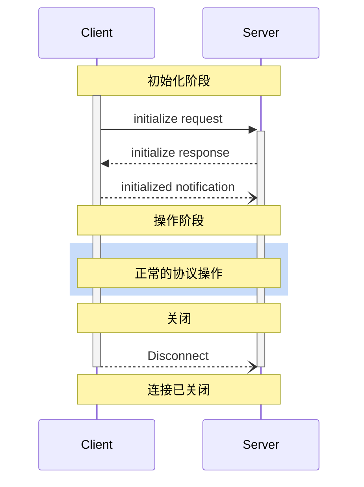

Model Context Protocol (MCP) 为客户端-服务器连接定义了一个严格的生命周期，确保适当的能力协商和状态管理。

1. **初始化**：能力协商和协议版本一致
2. **操作**：正常的协议通信
3. **关闭**：优雅地终止连接



## 生命周期阶段

### 初始化

初始化阶段 **MUST** 是客户端和服务器之间的首次交互。
在此阶段，客户端和服务器：

- 建立协议版本兼容性
- 交换和协商能力
- 共享实现细节

客户端 **MUST** 通过发送包含以下内容的 `initialize` 请求来发起此阶段：

- 支持的协议版本
- 客户端能力
- 客户端实现信息

```json
{
  "jsonrpc": "2.0",
  "id": 1,
  "method": "initialize",
  "params": {
    "protocolVersion": "2025-03-26",
    "capabilities": {
      "roots": {
        "listChanged": true
      },
      "sampling": {}
    },
    "clientInfo": {
      "name": "ExampleClient",
      "version": "1.0.0"
    }
  }
}
```

初始化请求 **MUST NOT** 是 JSON-RPC [批处理](https://www.jsonrpc.org/specification#batch) 的一部分，因为在初始化完成之前无法发送其他请求和通知。这也允许与不支持 JSON-RPC 批处理的先前协议版本保持向后兼容性。

服务器 **MUST** 使用其自身的能力和信息进行响应：

```json
{
  "jsonrpc": "2.0",
  "id": 1,
  "result": {
    "protocolVersion": "2025-03-26",
    "capabilities": {
      "logging": {},
      "prompts": {
        "listChanged": true
      },
      "resources": {
        "subscribe": true,
        "listChanged": true
      },
      "tools": {
        "listChanged": true
      }
    },
    "serverInfo": {
      "name": "ExampleServer",
      "version": "1.0.0"
    },
    "instructions": "Optional instructions for the client"
  }
}
```

初始化成功后，客户端 **MUST** 发送一个 `initialized` 通知，表示已准备好开始正常操作：

```json
{
  "jsonrpc": "2.0",
  "method": "notifications/initialized"
}
```

- 在服务器响应 `initialize` 请求之前，客户端 **SHOULD NOT** 发送除 [ping](/specification/2025-03-26/basic/utilities/ping) 以外的请求。
- 在收到 `initialized` 通知之前，服务器 **SHOULD NOT** 发送除 [ping](/specification/2025-03-26/basic/utilities/ping) 和 [日志](/specification/2025-03-26/server/utilities/logging) 以外的请求。

#### 版本协商

在 `initialize` 请求中，客户端 **MUST** 发送其支持的协议版本。
这 **SHOULD** 是客户端支持的*最新*版本。

如果服务器支持请求的协议版本，它 **MUST** 以相同版本响应。
否则，服务器 **MUST** 以它支持的另一个协议版本响应。
这 **SHOULD** 是服务器支持的*最新*版本。

如果客户端不支持服务器响应中的版本，它 **SHOULD** 断开连接。

#### 能力协商

客户端和服务器能力确定了会话期间哪些可选协议特性可用。

关键能力包括：

| 类别   | 能力           | 描述                                                                       |
| ------ | -------------- | -------------------------------------------------------------------------- |
| 客户端 | `roots`        | 提供文件系统[根目录](/specification/2025-03-26/client/roots)的能力         |
| 客户端 | `sampling`     | 支持 LLM [采样](/specification/2025-03-26/client/sampling) 请求            |
| 客户端 | `experimental` | 描述对非标准实验特性的支持                                                 |
| 服务器 | `prompts`      | 提供[提示模板](/specification/2025-03-26/server/prompts)                   |
| 服务器 | `resources`    | 提供可读的[资源](/specification/2025-03-26/server/resources)               |
| 服务器 | `tools`        | 暴露可调用的[工具](/specification/2025-03-26/server/tools)                 |
| 服务器 | `logging`      | 发出结构化的[日志消息](/specification/2025-03-26/server/utilities/logging) |
| 服务器 | `completions`  | 支持参数[自动补全](/specification/2025-03-26/server/utilities/completion)  |
| 服务器 | `experimental` | 描述对非标准实验特性的支持                                                 |

能力对象可以描述子能力，例如：

- `listChanged`：支持列表变更通知（用于提示、资源和工具）
- `subscribe`：支持订阅单个项目的变更（仅资源）

### 操作

在操作阶段，客户端和服务器根据协商好的能力交换消息。

双方 **SHOULD**:

- 尊重协商好的协议版本
- 仅使用成功协商的能力

### 关闭

在关闭阶段，一方（通常是客户端）干净地终止协议连接。没有定义特定的关闭消息——相反，应使用底层传输机制来发出连接终止信号：

#### stdio

对于 stdio [传输](/specification/2025-03-26/basic/transports)，客户端 **SHOULD** 按以下方式发起关闭：

1. 首先，关闭子进程（服务器）的输入流
2. 等待服务器退出，如果服务器在合理时间内未退出，则发送 `SIGTERM`
3. 如果在 `SIGTERM` 后的合理时间内服务器仍未退出，则发送 `SIGKILL`

服务器 **MAY** 通过关闭其输出流并退出来发起关闭。

#### HTTP

对于 HTTP [传输](/specification/2025-03-26/basic/transports)，关闭通过关闭相关的 HTTP 连接来表示。

## 超时

实现 **SHOULD** 为所有发送的请求建立超时机制，以防止连接挂起和资源耗尽。如果在超时期限内未收到成功或错误响应，发送方 **SHOULD** 为该请求发出[取消通知](/specification/2025-03-26/basic/utilities/cancellation)，并停止等待响应。

SDK 和其他中间件 **SHOULD** 允许在按请求基础上配置这些超时。

当收到与该请求对应的[进度通知](/specification/2025-03-26/basic/utilities/progress)时，实现 **MAY** 选择重置超时计时器，因为这表明工作正在实际进行中。然而，实现 **SHOULD** 始终强制执行最大超时，无论进度通知如何，以限制行为异常的客户端或服务器的影响。

## 错误处理

实现 **SHOULD** 准备好处理以下错误情况：

- 协议版本不匹配
- 未能协商所需能力
- 请求[超时](#timeouts)

Example initialization error:

```json
{
  "jsonrpc": "2.0",
  "id": 1,
  "error": {
    "code": -32602,
    "message": "Unsupported protocol version",
    "data": {
      "supported": ["2024-11-05"],
      "requested": "1.0.0"
    }
  }
}
```
