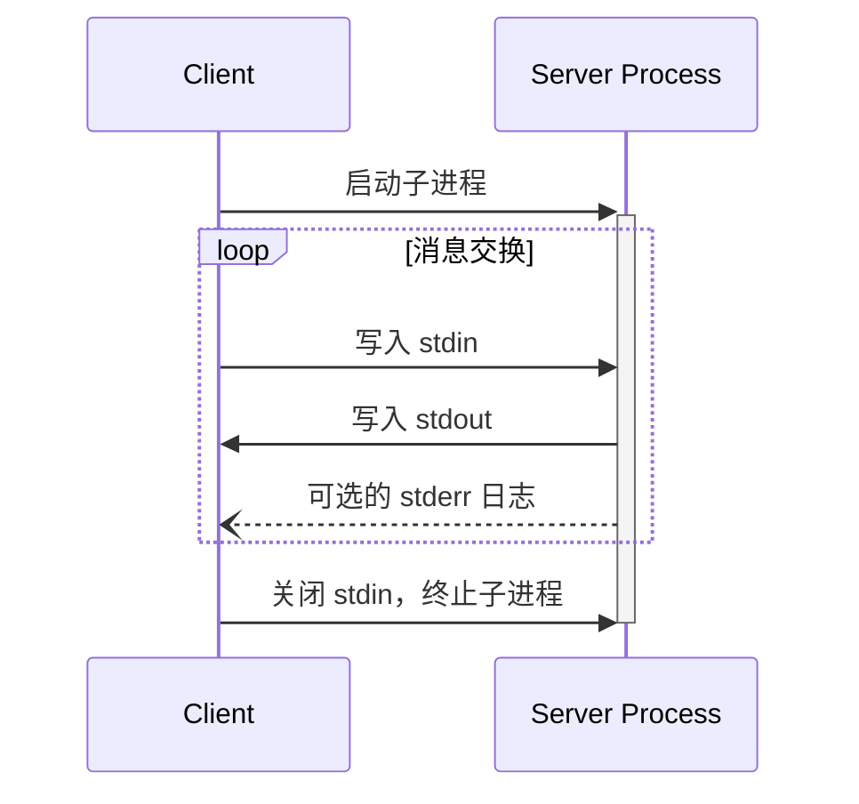
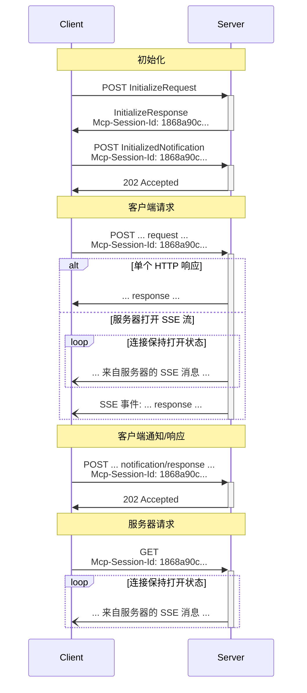

MCP 使用 JSON-RPC 编码消息。JSON-RPC 消息 **MUST** 使用 UTF-8 编码。

该协议目前定义了两种客户端-服务器通信的标准传输机制：

1. [stdio](#stdio)，通过标准输入和标准输出进行通信
2. [Streamable HTTP](#streamable-http)

客户端 **SHOULD** 尽可能支持 stdio。

客户端和服务器也可以以可插拔的方式实现[自定义传输](#custom-transports)。

## stdio

在 **stdio** 传输中：

- 客户端将 MCP 服务器作为子进程启动。
- 服务器从其标准输入（`stdin`）读取 JSON-RPC 消息，并将消息发送到其标准输出（`stdout`）。
- 消息可以是 JSON-RPC 请求、通知、响应 — 或包含一个或多个请求和/或通知的 JSON-RPC [批处理](https://www.jsonrpc.org/specification#batch)。
- 消息以换行符分隔，并且 **MUST NOT** 包含嵌入的换行符。
- 服务器 **MAY** 向其标准错误（`stderr`）写入 UTF-8 字符串用于日志记录。客户端 **MAY** 捕获、转发或忽略这些日志。
- 服务器 **MUST NOT** 向其 `stdout` 写入任何非有效 MCP 消息的内容。
- 客户端 **MUST NOT** 向服务器的 `stdin` 写入任何非有效 MCP 消息的内容。

## Streamable HTTP

<Info>

这取代了协议版本 2024-11-05 中的 [HTTP+SSE
传输](/specification/2024-11-05/basic/transports#http-with-sse)。请参阅下面的[向后兼容性](#backwards-compatibility)指南。

</Info>

在 **Streamable HTTP** 传输中，服务器作为一个独立的进程运行，可以处理多个客户端连接。此传输使用 HTTP POST 和 GET 请求。服务器可以选择使用 [Server-Sent Events](https://en.wikipedia.org/wiki/Server-sent_events) (SSE) 来流式传输多个服务器消息。这支持基础的 MCP 服务器，也支持更功能丰富的服务器，支持流式传输以及服务器到客户端的通知和请求。

服务器 **MUST** 提供一个同时支持 POST 和 GET 方法的单一 HTTP 端点路径（以下简称 **MCP 端点**）。例如，这可以是像 `https://example.com/mcp` 这样的 URL。

#### 安全警告

实现 Streamable HTTP 传输时：

1. 服务器 **MUST** 验证所有传入连接的 `Origin` 标头，以防止 DNS 重新绑定攻击
2. 在本地运行时，服务器 **SHOULD** 仅绑定到 localhost (127.0.0.1)，而不是所有网络接口 (0.0.0.0)
3. 服务器 **SHOULD** 为所有连接实现适当的身份验证

没有这些保护措施，攻击者可能使用 DNS 重新绑定从远程网站与本地 MCP 服务器进行交互。

### 向服务器发送消息

从客户端发送的每个 JSON-RPC 消息 **MUST** 是对 MCP 端点的新 HTTP POST 请求。

1. 客户端 **MUST** 使用 HTTP POST 向 MCP 端点发送 JSON-RPC 消息。
2. 客户端 **MUST** 包含一个 `Accept` 标头，列出 `application/json` 和 `text/event-stream` 作为支持的内容类型。
3. POST 请求的正文 **MUST** 是以下之一：
   - 单个 JSON-RPC _请求_、_通知_ 或 _响应_
   - 一个[批处理](https://www.jsonrpc.org/specification#batch)一个或多个 _请求和/或通知_ 的数组
   - 一个[批处理](https://www.jsonrpc.org/specification#batch)一个或多个 _响应_ 的数组
4. 如果输入仅包含（任意数量的）JSON-RPC _响应_ 或 _通知_：
   - 如果服务器接受输入，服务器 **MUST** 返回 HTTP 状态码 202 Accepted，无正文。
   - 如果服务器无法接受输入，它 **MUST** 返回 HTTP 错误状态码（例如，400 Bad Request）。HTTP 响应正文 **MAY** 包含一个没有 `id` 的 JSON-RPC _错误响应_。
5. 如果输入包含任意数量的 JSON-RPC _请求_，服务器 **MUST** 要么返回 `Content-Type: text/event-stream` 以发起 SSE 流，要么返回 `Content-Type: application/json` 以返回一个 JSON 对象。客户端 **MUST** 同时支持这两种情况。
6. 如果服务器发起 SSE 流：
   - SSE 流 **SHOULD** 最终为 POST 正文中发送的每个 JSON-RPC _请求_ 包含一个 JSON-RPC _响应_。这些 _响应_ **MAY** 是[批处理](https://www.jsonrpc.org/specification#batch)的。
   - 服务器 **MAY** 在发送 JSON-RPC _响应_ 之前发送 JSON-RPC _请求_ 和 _通知_。这些消息 **SHOULD** 与发起客户端 _请求_ 相关。这些 _请求_ 和 _通知_ **MAY** 是[批处理](https://www.jsonrpc.org/specification#batch)的。
   - 服务器 **SHOULD NOT** 在发送每个接收到的 JSON-RPC _请求_ 对应的 JSON-RPC _响应_ 之前关闭 SSE 流，除非[会话](#session-management)过期。
   - 在所有 JSON-RPC _响应_ 已发送后，服务器 **SHOULD** 关闭 SSE 流。
   - 断开连接 **MAY** 随时发生（例如，由于网络条件）。因此：
     - 断开连接 **SHOULD NOT** 被解释为客户端取消其请求。
     - 要取消，客户端 **SHOULD** 显式发送 MCP `CancelledNotification`。
     - 为避免因断开连接导致消息丢失，服务器 **MAY** 使流可[恢复](#resumability-and-redelivery)。

### 监听来自服务器的消息

1. 客户端 **MAY** 向 MCP 端点发出 HTTP GET 请求。这可用于打开 SSE 流，允许服务器与客户端通信，而无需客户端先通过 HTTP POST 发送数据。
2. 客户端 **MUST** 包含一个 `Accept` 标头，列出 `text/event-stream` 作为支持的内容类型。
3. 服务器 **MUST** 要么在响应此 HTTP GET 时返回 `Content-Type: text/event-stream`，要么返回 HTTP 405 Method Not Allowed，表示服务器在此端点不提供 SSE 流。
4. 如果服务器发起 SSE 流：
   - 服务器 **MAY** 在流上发送 JSON-RPC _请求_ 和 _通知_。这些 _请求_ 和 _通知_ **MAY** 是[批处理](https://www.jsonrpc.org/specification#batch)的。
   - 这些消息 **SHOULD** 与客户端任何同时运行的 JSON-RPC _请求_ 无关。
   - 服务器 **MUST NOT** 在流上发送 JSON-RPC _响应_，**除非**是[恢复](#resumability-and-redelivery)与先前客户端请求关联的流。
   - 服务器 **MAY** 随时关闭 SSE 流。
   - 客户端 **MAY** 随时关闭 SSE 流。

### 多连接

1. 客户端 **MAY** 同时保持连接到多个 SSE 流。
2. 服务器 **MUST** 仅在其中一个已连接的流上发送其每个 JSON-RPC 消息；也就是说，它 **MUST NOT** 跨多个流广播相同的消息。
   - 消息丢失的风险 **MAY** 通过使流可[恢复](#resumability-and-redelivery)来缓解。

### 可恢复性和重新投递

为了支持恢复断开的连接，并重新投递可能丢失的消息：

1. 服务器 **MAY** 为其 SSE 事件附加 `id` 字段，如 [SSE 标准](https://html.spec.whatwg.org/multipage/server-sent-events.html#event-stream-interpretation)中所述。
   - 如果存在，ID **MUST** 在该[会话](#session-management)内的所有流中全局唯一——如果未使用会话管理，则在与该特定客户端的所有流中全局唯一。
2. 如果客户端希望在连接断开后恢复，它 **SHOULD** 向 MCP 端点发出 HTTP GET 请求，并包含 [`Last-Event-ID`](https://html.spec.whatwg.org/multipage/server-sent-events.html#the-last-event-id-header) 标头以指示它接收到的最后一个事件 ID。
   - 服务器 **MAY** 使用此标头重放本应在最后一个事件 ID 之后发送的消息，_在被断开的流上_，并从该点恢复流。
   - 服务器 **MUST NOT** 重放本应在不同流上投递的消息。

换句话说，这些事件 ID 应由服务器在*逐流*基础上分配，作为该特定流中的游标。

### 会话管理

MCP "会话"由客户端和服务器之间逻辑相关的交互组成，从[初始化阶段](/specification/2025-03-26/basic/lifecycle)开始。为了支持想要建立有状态会话的服务器：

1. 使用 Streamable HTTP 传输的服务器 **MAY** 在初始化时分配一个会话 ID，方法是在包含 `InitializeResult` 的 HTTP 响应中包含 `Mcp-Session-Id` 标头。
   - 会话 ID **SHOULD** 是全局唯一且加密安全的（例如，安全生成的 UUID、JWT 或加密哈希）。
   - 会话 ID **MUST** 仅包含可见的 ASCII 字符（范围从 0x21 到 0x7E）。
2. 如果在初始化期间服务器返回了 `Mcp-Session-Id`，使用 Streamable HTTP 传输的客户端 **MUST** 在其所有后续 HTTP 请求的 `Mcp-Session-Id` 标头中包含它。
   - 需要会话 ID 的服务器 **SHOULD** 对没有 `Mcp-Session-Id` 标头的请求（初始化除外）响应 HTTP 400 Bad Request。
3. 服务器 **MAY** 随时终止会话，之后它 **MUST** 对包含该会话 ID 的请求响应 HTTP 404 Not Found。
4. 当客户端收到对其包含 `Mcp-Session-Id` 的请求的 HTTP 404 响应时，它 **MUST** 通过发送一个不带会话 ID 的新 `InitializeRequest` 来启动新会话。
5. 不再需要特定会话的客户端（例如，因为用户正在离开客户端应用程序）**SHOULD** 向 MCP 端点发送带有 `Mcp-Session-Id` 标头的 HTTP DELETE 请求，以显式终止会话。
   - 服务器 **MAY** 对此请求响应 HTTP 405 Method Not Allowed，表示服务器不允许客户端终止会话。

### 时序图

### 向后兼容性

客户端和服务器可以按以下方式与已弃用的 [HTTP+SSE 传输](/specification/2024-11-05/basic/transports#http-with-sse)（来自协议版本 2024-11-05）保持向后兼容性：

**希望支持旧版客户端** 的服务器应：

- 继续托管旧传输的 SSE 和 POST 端点，同时托管为 Streamable HTTP 传输定义的新 "MCP 端点"。
  - 也可以将旧 POST 端点与新 MCP 端点合并，但这可能会引入不必要的复杂性。

**希望支持旧版服务器** 的客户端应：

1. 接受来自用户的 MCP 服务器 URL，该 URL 可能指向使用旧传输或新传输的服务器。
2. 尝试向服务器 URL POST 一个 `InitializeRequest`，并带有如上定义的 `Accept` 标头：
   - 如果成功，客户端可以假设这是支持新 Streamable HTTP 传输的服务器。
   - 如果失败并返回 HTTP 4xx 状态码（例如，405 Method Not Allowed 或 404 Not Found）：
     - 向服务器 URL 发出 GET 请求，期望这将打开一个 SSE 流并返回一个 `endpoint` 事件作为第一个事件。
     - 当 `endpoint` 事件到达时，客户端可以假设这是运行旧 HTTP+SSE 传输的服务器，并应对所有后续通信使用该传输。

## 自定义传输

客户端和服务器 **MAY** 实现额外的自定义传输机制以满足其特定需求。该协议与传输无关，可以在任何支持双向消息交换的通信通道上实现。

选择支持自定义传输的实现者 **MUST** 确保他们保留 MCP 定义的 JSON-RPC 消息格式和生命周期要求。自定义传输 **SHOULD** 记录其特定的连接建立和消息交换模式，以帮助实现互操作性。
