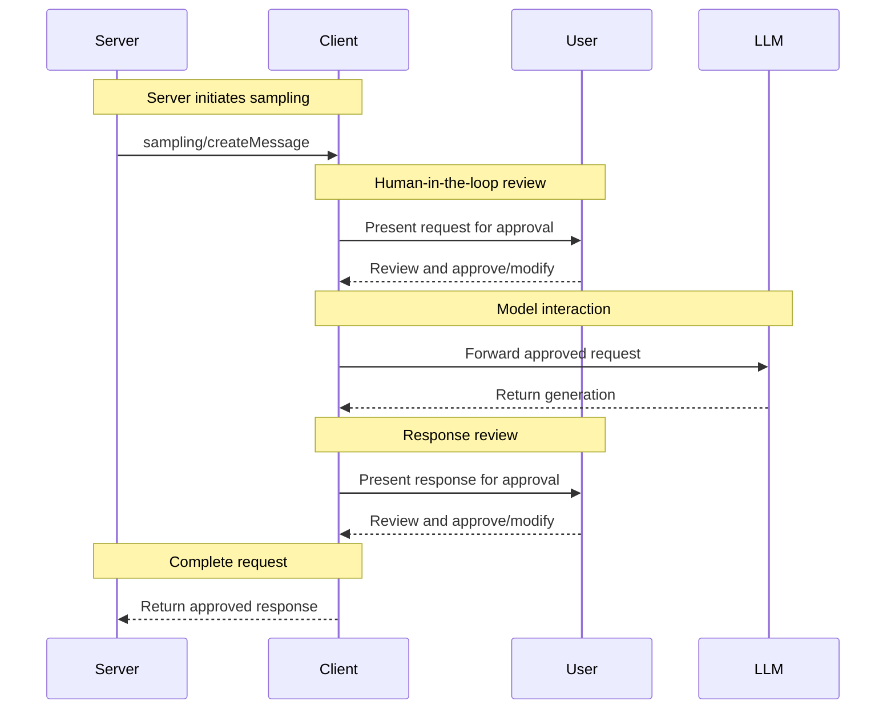

Model Context Protocol (MCP) 提供了一种标准化的方式，让服务器通过客户端请求 LLM 采样（"补全"或"生成"）。这一流程允许客户端保持对模型访问、选择和权限的控制，同时使服务器能够利用 AI 能力——无需服务器 API 密钥。服务器可以请求基于文本、音频或图像的交互，并可选择在其提示中包含来自 MCP 服务器的上下文。

## 用户交互模型

MCP 中的采样通过允许 LLM 调用*嵌套*在其他 MCP 服务器特性内部发生，使服务器能够实现代理行为。

实现可以自由地通过任何适合其需求的界面模式来暴露采样——协议本身并不强制任何特定的用户交互模型。

<Warning>

为了信任安全和安全性，**SHOULD** 始终有人参与循环，并能够拒绝采样请求。

应用程序 **SHOULD**：

- 提供使审查采样请求变得简单直观的 UI
- 允许用户在发送前查看和编辑提示
- 在交付前展示生成的响应以供审查

</Warning>

## 能力

支持采样的客户端 **MUST** 在[初始化](/specification/2025-03-26/basic/lifecycle#initialization)期间声明 `sampling` 能力：

```json
{
  "capabilities": {
    "sampling": {}
  }
}
```

## 协议消息

### 创建消息

要请求语言模型生成，服务器发送 `sampling/createMessage` 请求：

**请求：**

```json
{
  "jsonrpc": "2.0",
  "id": 1,
  "method": "sampling/createMessage",
  "params": {
    "messages": [
      {
        "role": "user",
        "content": {
          "type": "text",
          "text": "What is the capital of France?"
        }
      }
    ],
    "modelPreferences": {
      "hints": [
        {
          "name": "claude-3-sonnet"
        }
      ],
      "intelligencePriority": 0.8,
      "speedPriority": 0.5
    },
    "systemPrompt": "You are a helpful assistant.",
    "maxTokens": 100
  }
}
```

**响应：**

```json
{
  "jsonrpc": "2.0",
  "id": 1,
  "result": {
    "role": "assistant",
    "content": {
      "type": "text",
      "text": "The capital of France is Paris."
    },
    "model": "claude-3-sonnet-20240307",
    "stopReason": "endTurn"
  }
}
```

## 消息流



## 数据类型

### 消息

采样消息可以包含：

#### 文本内容

```json
{
  "type": "text",
  "text": "The message content"
}
```

#### 图像内容

```json
{
  "type": "image",
  "data": "base64-encoded-image-data",
  "mimeType": "image/jpeg"
}
```

#### 音频内容

```json
{
  "type": "audio",
  "data": "base64-encoded-audio-data",
  "mimeType": "audio/wav"
}
```

### 模型偏好

MCP 中的模型选择需要仔细抽象，因为服务器和客户端可能使用具有不同模型产品的 AI 提供商。服务器不能简单地按名称请求特定模型，因为客户端可能无法访问该确切模型，或者可能更愿意使用不同提供商的等效模型。

为了解决这个问题，MCP 实现了一个偏好系统，将抽象的能力优先级与可选的模型提示相结合：

#### 能力优先级

服务器通过三个标准化的优先级值（0-1）来表达其需求：

- `costPriority`：最小化成本有多重要？更高的值偏好更便宜的模型。
- `speedPriority`：低延迟有多重要？更高的值偏好更快的模型。
- `intelligencePriority`：高级能力有多重要？更高的值偏好能力更强的模型。

#### 模型提示

虽然优先级有助于根据特征选择模型，但 `hints` 允许服务器建议特定的模型或模型系列：

- 提示被视为可以灵活匹配模型名称的子字符串
- 多个提示按偏好顺序评估
- 客户端 **MAY** 将提示映射到不同提供商的等效模型
- 提示是建议性的——客户端做出最终模型选择

例如：

```json
{
  "hints": [
    { "name": "claude-3-sonnet" }, // Prefer Sonnet-class models
    { "name": "claude" } // Fall back to any Claude model
  ],
  "costPriority": 0.3, // Cost is less important
  "speedPriority": 0.8, // Speed is very important
  "intelligencePriority": 0.5 // Moderate capability needs
}
```

客户端处理这些偏好以从其可用选项中选择合适的模型。例如，如果客户端没有 Claude 模型但有 Gemini，它可能会根据相似能力将 sonnet 提示映射到 `gemini-1.5-pro`。

## 错误处理

客户端 **SHOULD** 为常见失败情况返回错误：

错误示例：

```json
{
  "jsonrpc": "2.0",
  "id": 1,
  "error": {
    "code": -1,
    "message": "User rejected sampling request"
  }
}
```

## 安全考虑

1. 客户端 **SHOULD** 实现用户批准控制
2. 双方 **SHOULD** 验证消息内容
3. 客户端 **SHOULD** 尊重模型偏好提示
4. 客户端 **SHOULD** 实现速率限制
5. 双方 **MUST** 适当地处理敏感数据
