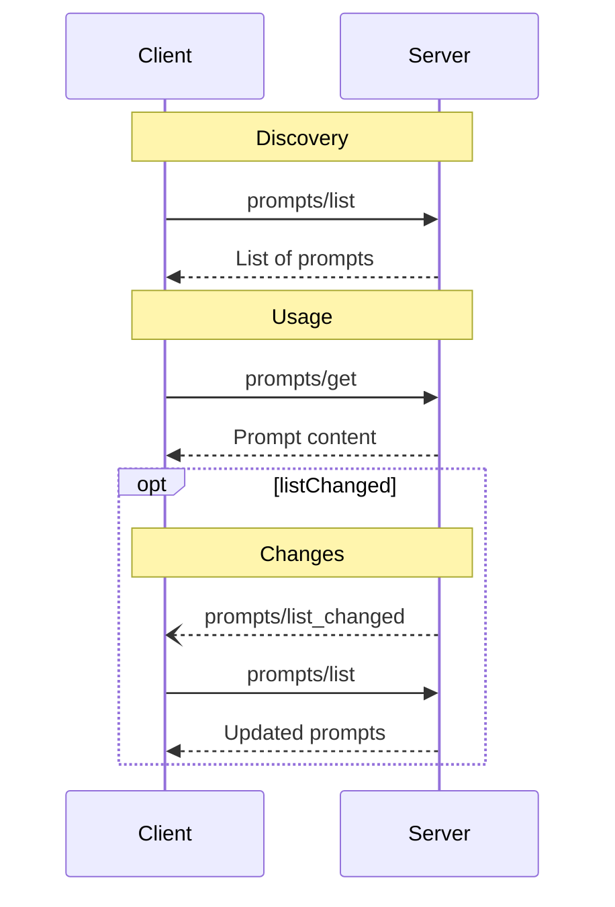

Model Context Protocol (MCP) 提供了一种标准化的方式，让服务器向客户端暴露提示模板。提示允许服务器提供与语言模型交互的结构化消息和指令。客户端可以发现可用的提示、获取其内容，并提供参数来自定义它们。

## 用户交互模型

提示设计为**用户控制**，意味着它们从服务器暴露给客户端，目的是让用户能够明确选择使用。

通常，提示会通过用户界面中由用户发起的命令触发，这使用户能够自然地发现和调用可用的提示。

例如，作为斜杠命令：


然而，实现者可以自由地通过任何适合其需求的界面模式来暴露提示——协议本身并不强制任何特定的用户交互模型。

## 能力

支持提示的服务器 **MUST** 在[初始化](/specification/2025-03-26/basic/lifecycle#initialization)期间声明 `prompts` 能力：

```json
{
  "capabilities": {
    "prompts": {
      "listChanged": true
    }
  }
}
```

`listChanged` 指示服务器是否会在可用提示列表发生变化时发出通知。

## 协议消息

### 列出提示

要获取可用的提示，客户端发送 `prompts/list` 请求。此操作支持[分页](/specification/2025-03-26/server/utilities/pagination)。

**请求：**

```json
{
  "jsonrpc": "2.0",
  "id": 1,
  "method": "prompts/list",
  "params": {
    "cursor": "optional-cursor-value"
  }
}
```

**响应：**

```json
{
  "jsonrpc": "2.0",
  "id": 1,
  "result": {
    "prompts": [
      {
        "name": "code_review",
        "description": "Asks the LLM to analyze code quality and suggest improvements",
        "arguments": [
          {
            "name": "code",
            "description": "The code to review",
            "required": true
          }
        ]
      }
    ],
    "nextCursor": "next-page-cursor"
  }
}
```

### 获取提示

要获取特定的提示，客户端发送 `prompts/get` 请求。参数可以通过[补全 API](/specification/2025-03-26/server/utilities/completion) 自动补全。

**请求：**

```json
{
  "jsonrpc": "2.0",
  "id": 2,
  "method": "prompts/get",
  "params": {
    "name": "code_review",
    "arguments": {
      "code": "def hello():\n    print('world')"
    }
  }
}
```

**响应：**

```json
{
  "jsonrpc": "2.0",
  "id": 2,
  "result": {
    "description": "Code review prompt",
    "messages": [
      {
        "role": "user",
        "content": {
          "type": "text",
          "text": "Please review this Python code:\ndef hello():\n    print('world')"
        }
      }
    ]
  }
}
```

### 列表变更通知

当可用提示列表发生变化时，声明了 `listChanged` 能力的服务器 **SHOULD** 发送一个通知：

```json
{
  "jsonrpc": "2.0",
  "method": "notifications/prompts/list_changed"
}
```

## 消息流



## 数据类型

### 提示

提示定义包括：

- `name`: 提示的唯一标识符
- `description`: 可选的人类可读描述
- `arguments`: 可选的自定义参数列表

### 提示消息

提示中的消息可以包含：

- `role`: "user" 或 "assistant"，指示发言者
- `content`: 以下内容类型之一：

#### 文本内容

文本内容表示纯文本消息：

```json
{
  "type": "text",
  "text": "The text content of the message"
}
```

这是用于自然语言交互的最常见内容类型。

#### 图像内容

图像内容允许在消息中包含视觉信息：

```json
{
  "type": "image",
  "data": "base64-encoded-image-data",
  "mimeType": "image/png"
}
```

图像数据 **MUST** 是 base64 编码的，并包含有效的 MIME 类型。这实现了视觉上下文很重要的多模态交互。

#### 音频内容

音频内容允许在消息中包含音频信息：

```json
{
  "type": "audio",
  "data": "base64-encoded-audio-data",
  "mimeType": "audio/wav"
}
```

音频数据 MUST 是 base64 编码的，并包含有效的 MIME 类型。这实现了音频上下文很重要的多模态交互。

#### 嵌入资源

嵌入资源允许直接在消息中引用服务器端资源：

```json
{
  "type": "resource",
  "resource": {
    "uri": "resource://example",
    "mimeType": "text/plain",
    "text": "Resource content"
  }
}
```

资源可以包含文本或二进制（blob）数据，并且 **MUST** 包括：

- 有效的资源 URI
- 适当的 MIME 类型
- 文本内容或 base64 编码的 blob 数据

嵌入资源使提示能够无缝地将服务器管理的内容（如文档、代码示例或其他参考资料）直接纳入对话流程。

## 错误处理

服务器 **SHOULD** 为常见失败情况返回标准 JSON-RPC 错误：

- 无效的提示名称：`-32602` (Invalid params)
- 缺少必需的参数：`-32602` (Invalid params)
- 内部错误：`-32603` (Internal error)

## 实现考虑

1. 服务器 **SHOULD** 在处理前验证提示参数
2. 客户端 **SHOULD** 处理大型提示列表的分页
3. 双方 **SHOULD** 尊重能力协商

## 安全

实现 **MUST** 仔细验证所有提示输入和输出，以防止注入攻击或未经授权访问资源。
