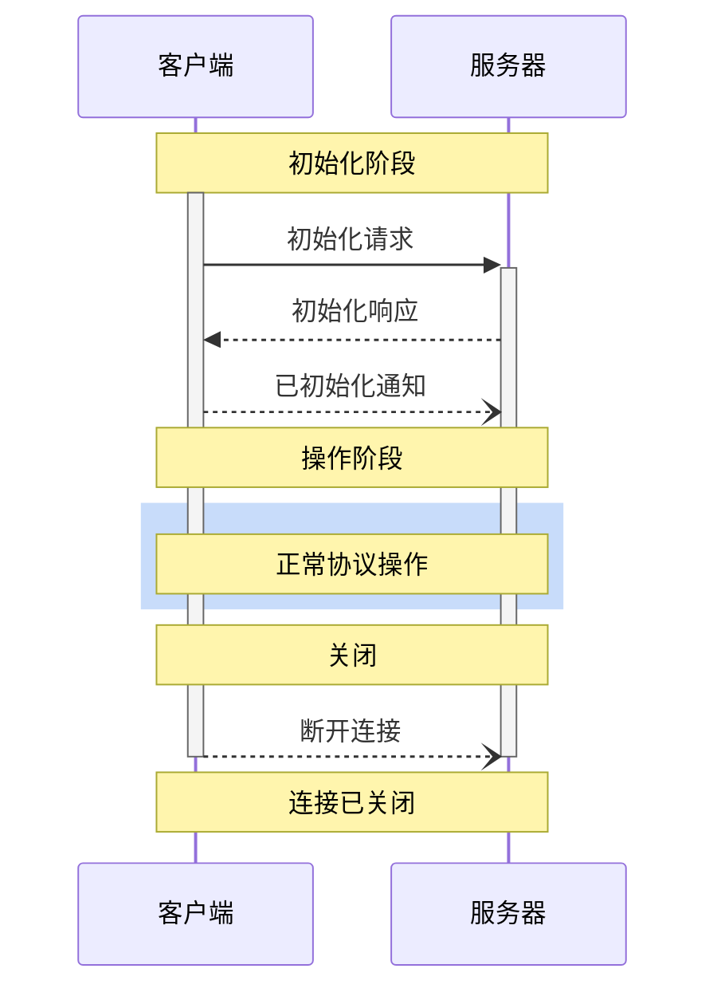

<div id="enable-section-numbers" />

Model Context Protocol (MCP) 为客户端-服务器连接定义了严格的生命周期，确保适当的能力协商和状态管理。

1. **初始化**：能力协商和协议版本协商
2. **操作**：正常的协议通信
3. **关闭**：优雅地终止连接



## 生命周期阶段

### 初始化

初始化阶段 **MUST** 是客户端和服务器之间的首次交互。在此阶段，客户端和服务器：

- 建立协议版本兼容性
- 交换和协商能力
- 共享实现详情

客户端 **MUST** 通过发送包含以下内容的 `initialize` 请求来发起此阶段：

- 支持的协议版本
- 客户端能力
- 客户端实现信息

```json
{
  "jsonrpc": "2.0",
  "id": 1,
  "method": "initialize",
  "params": {
    "protocolVersion": "2025-06-18",
    "capabilities": {
      "roots": {
        "listChanged": true
      },
      "sampling": {},
      "elicitation": {}
    },
    "clientInfo": {
      "name": "ExampleClient",
      "title": "示例客户端显示名称",
      "version": "1.0.0"
    }
  }
}
```

服务器 **MUST** 使用其自身的能力和信息进行响应：

```json
{
  "jsonrpc": "2.0",
  "id": 1,
  "result": {
    "protocolVersion": "2025-06-18",
    "capabilities": {
      "logging": {},
      "prompts": {
        "listChanged": true
      },
      "resources": {
        "subscribe": true,
        "listChanged": true
      },
      "tools": {
        "listChanged": true
      }
    },
    "serverInfo": {
      "name": "ExampleServer",
      "title": "示例服务器显示名称",
      "version": "1.0.0"
    },
    "instructions": "可选的客户端指令"
  }
}
```

初始化成功后，客户端 **MUST** 发送一个 `initialized` 通知以指示其已准备好开始正常操作：

```json
{
  "jsonrpc": "2.0",
  "method": "notifications/initialized"
}
```

- 在服务器响应 `initialize` 请求之前，客户端 **SHOULD NOT** 发送除 [ping](/specification/2025-06-18/basic/utilities/ping) 之外的请求。
- 在收到 `initialized` 通知之前，服务器 **SHOULD NOT** 发送除 [ping](/specification/2025-06-18/basic/utilities/ping) 和 [日志记录](/specification/2025-06-18/server/utilities/logging) 之外的请求。

#### 版本协商

在 `initialize` 请求中，客户端 **MUST** 发送其支持的协议版本。这 **SHOULD** 是客户端支持的 _最新_ 版本。

如果服务器支持所请求的协议版本，它 **MUST** 使用相同版本进行响应。否则，服务器 **MUST** 使用其支持的另一个协议版本进行响应。这 **SHOULD** 是服务器支持的 _最新_ 版本。

如果客户端不支持服务器响应中的版本，它 **SHOULD** 断开连接。

<Note>
如果使用 HTTP，客户端 **MUST** 在随后发送到 MCP 服务器的所有请求中
包含 `MCP-Protocol-Version: <protocol-version>` HTTP 头部。
有关详细信息，请参见[传输中的协议版本头部部分](/specification/2025-06-18/basic/transports#protocol-version-header)。
</Note>

#### 能力协商

客户端和服务器能力确定会话期间哪些可选的协议特性可用。

关键能力包括：

| 类别   | 能力           | 描述                                                                       |
| ------ | -------------- | -------------------------------------------------------------------------- |
| 客户端 | `roots`        | 提供文件系统[根目录](/specification/2025-06-18/client/roots)的能力         |
| 客户端 | `sampling`     | 支持 LLM [采样](/specification/2025-06-18/client/sampling)请求             |
| 客户端 | `elicitation`  | 支持服务器[征询](/specification/2025-06-18/client/elicitation)请求         |
| 客户端 | `experimental` | 描述对非标准实验性特性的支持                                               |
| 服务器 | `prompts`      | 提供[提示模板](/specification/2025-06-18/server/prompts)                   |
| 服务器 | `resources`    | 提供可读的[资源](/specification/2025-06-18/server/resources)               |
| 服务器 | `tools`        | 暴露可调用的[工具](/specification/2025-06-18/server/tools)                 |
| 服务器 | `logging`      | 发出结构化的[日志消息](/specification/2025-06-18/server/utilities/logging) |
| 服务器 | `completions`  | 支持参数[自动补全](/specification/2025-06-18/server/utilities/completion)  |
| 服务器 | `experimental` | 描述对非标准实验性特性的支持                                               |

能力对象可以描述子能力，例如：

- `listChanged`：支持列表变更通知（用于提示、资源和工具）
- `subscribe`：支持订阅单个项目的变更（仅限资源）

### 操作

在操作阶段，客户端和服务器根据协商的能力交换消息。

双方 **MUST**：

- 尊重协商的协议版本
- 仅使用成功协商的能力

### 关闭

在关闭阶段，一方（通常是客户端）干净地终止协议连接。没有定义特定的关闭消息——相反，应使用底层传输机制来发信号通知连接终止：

#### stdio

对于 stdio [传输](/specification/2025-06-18/basic/transports)，客户端 **SHOULD** 通过以下方式发起关闭：

1. 首先，关闭子进程（服务器）的输入流
2. 等待服务器退出，或者如果服务器在合理时间内未退出，则发送 `SIGTERM`
3. 如果在 `SIGTERM` 后合理时间内服务器仍未退出，则发送 `SIGKILL`

服务器 **MAY** 通过关闭其输出流并退出来发起关闭。

#### HTTP

For HTTP [transports](/specification/2025-06-18/basic/transports), shutdown is indicated by closing the
associated HTTP connection(s).

## Timeouts

Implementations **SHOULD** establish timeouts for all sent requests, to prevent hung
connections and resource exhaustion. When the request has not received a success or error
response within the timeout period, the sender **SHOULD** issue a [cancellation
notification](/specification/2025-06-18/basic/utilities/cancellation) for that request and stop waiting for
a response.

SDKs and other middleware **SHOULD** allow these timeouts to be configured on a
per-request basis.

Implementations **MAY** choose to reset the timeout clock when receiving a [progress
notification](/specification/2025-06-18/basic/utilities/progress) corresponding to the request, as this
implies that work is actually happening. However, implementations **SHOULD** always
enforce a maximum timeout, regardless of progress notifications, to limit the impact of a
misbehaving client or server.

## Error Handling

Implementations **SHOULD** be prepared to handle these error cases:

- Protocol version mismatch
- Failure to negotiate required capabilities
- Request [timeouts](#timeouts)

Example initialization error:

```json
{
  "jsonrpc": "2.0",
  "id": 1,
  "error": {
    "code": -32602,
    "message": "Unsupported protocol version",
    "data": {
      "supported": ["2024-11-05"],
      "requested": "1.0.0"
    }
  }
}
```
