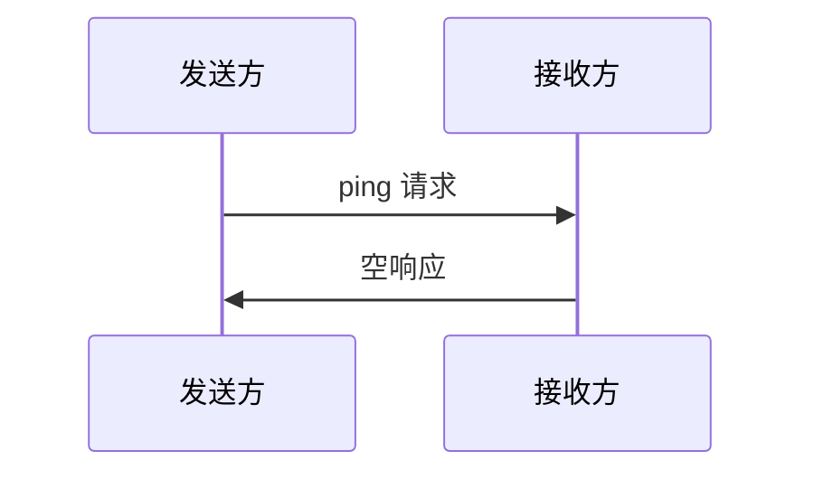

<div id="enable-section-numbers" />

Model Context Protocol 包含一个可选的 ping 机制，允许任何一方验证对方是否仍在响应且连接是否存活。

## 概述

Ping 功能通过简单的请求/响应模式实现。客户端或服务器都可以通过发送 `ping` 请求来发起 ping。

## 消息格式

Ping 请求是一个标准的 JSON-RPC 请求，没有参数：

```json
{
  "jsonrpc": "2.0",
  "id": "123",
  "method": "ping"
}
```

## 行为要求

1. 接收方 **MUST** 立即以空响应进行回应：

```json
{
  "jsonrpc": "2.0",
  "id": "123",
  "result": {}
}
```

2. 如果在合理的超时时间内未收到响应，发送方 **MAY**：
   - 认为连接已失效
   - 终止连接
   - 尝试重新连接流程

## 使用模式



## 实现考量

- 实现 **SHOULD** 定期发出 ping 以检测连接健康状态
- Ping 的频率 **SHOULD** 是可配置的
- 超时时间 **SHOULD** 适应网络环境
- **SHOULD** 避免过多的 ping 以减少网络开销

## 错误处理

- 超时 **SHOULD** 被视为连接故障
- 多次 ping 失败 **MAY** 触发连接重置
- 实现 **SHOULD** 记录 ping 失败信息用于诊断
