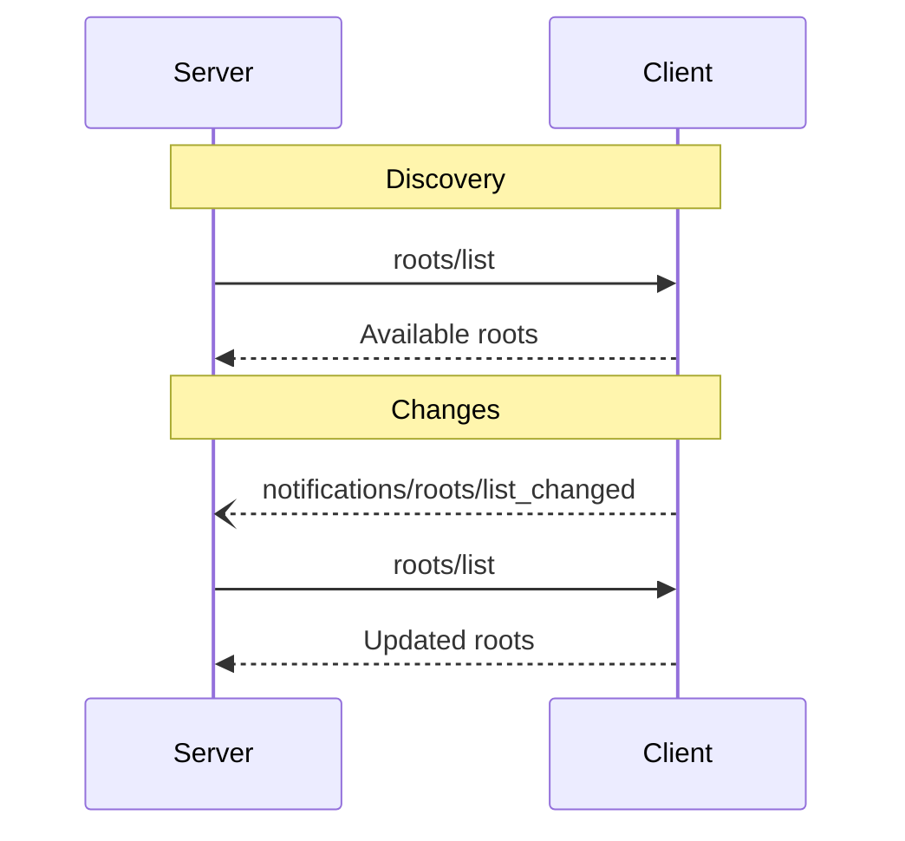

<div id="enable-section-numbers" />

Model Context Protocol (MCP) 提供了一种标准化的方式，让客户端向服务器暴露文件系统的"根目录"。根目录定义了服务器可以在文件系统中操作的边界，使它们能够了解有权访问哪些目录和文件。服务器可以向支持的客户端请求根目录列表，并在
notifications when that list changes.

## User Interaction Model

Roots in MCP are typically exposed through workspace or project configuration interfaces.

For example, implementations could offer a workspace/project picker that allows users to
select directories and files the server should have access to. This can be combined with
automatic workspace detection from version control systems or project files.

However, implementations are free to expose roots through any interface pattern that
suits their needs&mdash;the protocol itself does not mandate any specific user
interaction model.

## Capabilities

Clients that support roots **MUST** declare the `roots` capability during
[initialization](/specification/2025-06-18/basic/lifecycle#initialization):

```json
{
  "capabilities": {
    "roots": {
      "listChanged": true
    }
  }
}
```

`listChanged` indicates whether the client will emit notifications when the list of roots
changes.

## Protocol Messages

### Listing Roots

To retrieve roots, servers send a `roots/list` request:

**Request:**

```json
{
  "jsonrpc": "2.0",
  "id": 1,
  "method": "roots/list"
}
```

**Response:**

```json
{
  "jsonrpc": "2.0",
  "id": 1,
  "result": {
    "roots": [
      {
        "uri": "file:///home/user/projects/myproject",
        "name": "My Project"
      }
    ]
  }
}
```

### Root List Changes

When roots change, clients that support `listChanged` **MUST** send a notification:

```json
{
  "jsonrpc": "2.0",
  "method": "notifications/roots/list_changed"
}
```

## Message Flow



## Data Types

### Root

A root definition includes:

- `uri`: Unique identifier for the root. This **MUST** be a `file://` URI in the current
  specification.
- `name`: Optional human-readable name for display purposes.

Example roots for different use cases:

#### Project Directory

```json
{
  "uri": "file:///home/user/projects/myproject",
  "name": "My Project"
}
```

#### Multiple Repositories

```json
[
  {
    "uri": "file:///home/user/repos/frontend",
    "name": "Frontend Repository"
  },
  {
    "uri": "file:///home/user/repos/backend",
    "name": "Backend Repository"
  }
]
```

## Error Handling

Clients **SHOULD** return standard JSON-RPC errors for common failure cases:

- Client does not support roots: `-32601` (Method not found)
- Internal errors: `-32603`

Example error:

```json
{
  "jsonrpc": "2.0",
  "id": 1,
  "error": {
    "code": -32601,
    "message": "Roots not supported",
    "data": {
      "reason": "Client does not have roots capability"
    }
  }
}
```

## Security Considerations

1. Clients **MUST**:
   - Only expose roots with appropriate permissions
   - Validate all root URIs to prevent path traversal
   - Implement proper access controls
   - Monitor root accessibility

2. Servers **SHOULD**:
   - Handle cases where roots become unavailable
   - Respect root boundaries during operations
   - Validate all paths against provided roots

## Implementation Guidelines

1. Clients **SHOULD**:
   - Prompt users for consent before exposing roots to servers
   - Provide clear user interfaces for root management
   - Validate root accessibility before exposing
   - Monitor for root changes

2. Servers **SHOULD**:
   - Check for roots capability before usage
   - Handle root list changes gracefully
   - Respect root boundaries in operations
   - Cache root information appropriately
