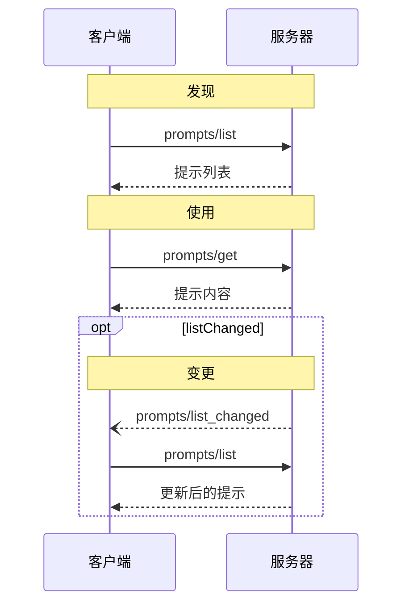

<div id="enable-section-numbers" />

Model Context Protocol (MCP) 提供了一种标准化的方式，让服务器向客户端暴露提示模板。提示允许服务器提供结构化的消息和指令，用于与语言模型交互。客户端可以发现可用的提示、检索其内容，并提供参数来自定义它们。

## 用户交互模型

提示被设计为**用户控制**的，这意味着它们从服务器暴露给客户端，目的是让用户能够明确选择使用它们。

通常，提示将通过用户界面中用户发起的命令触发，这允许用户自然地发现和调用可用的提示。

例如，作为斜杠命令：


然而，实现者可以自由地通过任何适合其需求的界面模式来暴露提示——协议本身并不强制规定任何特定的用户交互模型。

## 能力

支持提示的服务器 **MUST** 在[初始化](/specification/2025-06-18/basic/lifecycle#initialization)期间声明 `prompts` 能力：

```json
{
  "capabilities": {
    "prompts": {
      "listChanged": true
    }
  }
}
```

`listChanged` 指示服务器是否会在可用提示列表变化时发出通知。

## 协议消息

### 列出提示

要检索可用的提示，客户端发送 `prompts/list` 请求。此操作支持[分页](/specification/2025-06-18/server/utilities/pagination)。

**请求：**

```json
{
  "jsonrpc": "2.0",
  "id": 1,
  "method": "prompts/list",
  "params": {
    "cursor": "optional-cursor-value"
  }
}
```

**响应：**

```json
{
  "jsonrpc": "2.0",
  "id": 1,
  "result": {
    "prompts": [
      {
        "name": "code_review",
        "title": "请求代码审查",
        "description": "要求 LLM 分析代码质量并提出改进建议",
        "arguments": [
          {
            "name": "code",
            "description": "要审查的代码",
            "required": true
          }
        ]
      }
    ],
    "nextCursor": "next-page-cursor"
  }
}
```

### 获取提示

要检索特定提示，客户端发送 `prompts/get` 请求。参数可以通过[补全 API](/specification/2025-06-18/server/utilities/completion) 自动补全。

**请求：**

```json
{
  "jsonrpc": "2.0",
  "id": 2,
  "method": "prompts/get",
  "params": {
    "name": "code_review",
    "arguments": {
      "code": "def hello():\n    print('world')"
    }
  }
}
```

**响应：**

```json
{
  "jsonrpc": "2.0",
  "id": 2,
  "result": {
    "description": "代码审查提示",
    "messages": [
      {
        "role": "user",
        "content": {
          "type": "text",
          "text": "请审查这段 Python 代码：\ndef hello():\n    print('world')"
        }
      }
    ]
  }
}
```

### 列表变更通知

当可用提示列表发生变化时，声明了 `listChanged` 能力的服务器 **SHOULD** 发送通知：

```json
{
  "jsonrpc": "2.0",
  "method": "notifications/prompts/list_changed"
}
```

## 消息流



## 数据类型

### Prompt

一个提示定义包含：

- `name`：提示的唯一标识符
- `title`：可选的用于显示目的的人类可读提示名称
- `description`：可选的人类可读描述
- `arguments`：可选的用于自定义的参数列表

### PromptMessage

Messages in a prompt can contain:

- `role`: Either "user" or "assistant" to indicate the speaker
- `content`: One of the following content types:

<Note>
  All content types in prompt messages support optional
  [annotations](/specification/2025-06-18/server/resources#annotations) for
  metadata about audience, priority, and modification times.
</Note>

#### Text Content

Text content represents plain text messages:

```json
{
  "type": "text",
  "text": "The text content of the message"
}
```

This is the most common content type used for natural language interactions.

#### Image Content

Image content allows including visual information in messages:

```json
{
  "type": "image",
  "data": "base64-encoded-image-data",
  "mimeType": "image/png"
}
```

The image data **MUST** be base64-encoded and include a valid MIME type. This enables
multi-modal interactions where visual context is important.

#### Audio Content

Audio content allows including audio information in messages:

```json
{
  "type": "audio",
  "data": "base64-encoded-audio-data",
  "mimeType": "audio/wav"
}
```

The audio data MUST be base64-encoded and include a valid MIME type. This enables
multi-modal interactions where audio context is important.

#### Embedded Resources

Embedded resources allow referencing server-side resources directly in messages:

```json
{
  "type": "resource",
  "resource": {
    "uri": "resource://example",
    "mimeType": "text/plain",
    "text": "Resource content"
  }
}
```

Resources can contain either text or binary (blob) data and **MUST** include:

- A valid resource URI
- The appropriate MIME type
- Either text content or base64-encoded blob data

Embedded resources enable prompts to seamlessly incorporate server-managed content like
documentation, code samples, or other reference materials directly into the conversation
flow.

## Error Handling

Servers **SHOULD** return standard JSON-RPC errors for common failure cases:

- Invalid prompt name: `-32602` (Invalid params)
- Missing required arguments: `-32602` (Invalid params)
- Internal errors: `-32603` (Internal error)

## Implementation Considerations

1. Servers **SHOULD** validate prompt arguments before processing
2. Clients **SHOULD** handle pagination for large prompt lists
3. Both parties **SHOULD** respect capability negotiation

## Security

Implementations **MUST** carefully validate all prompt inputs and outputs to prevent
injection attacks or unauthorized access to resources.
