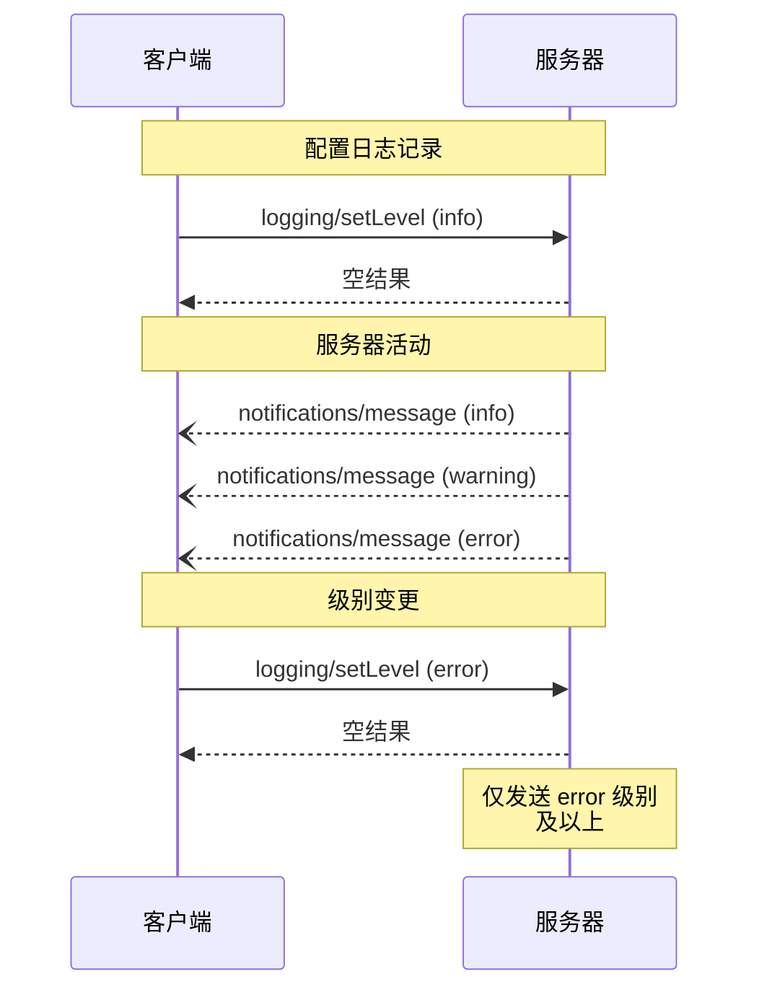

<div id="enable-section-numbers" />

Model Context Protocol (MCP) 提供了一种标准化的方式，让服务器向客户端发送结构化日志消息。客户端可以通过设置最低日志级别来控制日志详细程度，服务器发送包含严重级别、可选的记录器名称和任意 JSON 可序列化数据的通知。

## 用户交互模型

实现可以自由地通过任何适合其需求的界面模式来暴露日志记录——协议本身并不强制规定任何特定的用户交互模型。

## 能力

发送日志消息通知的服务器 **MUST** 声明 `logging` 能力：

```json
{
  "capabilities": {
    "logging": {}
  }
}
```

## 日志级别

该协议遵循 [RFC 5424](https://datatracker.ietf.org/doc/html/rfc5424#section-6.2.1) 中指定的标准 syslog 严重级别：

| 级别      | 描述             | 示例用例         |
| --------- | ---------------- | ---------------- |
| debug     | 详细的调试信息   | 函数入口/出口点  |
| info      | 一般信息性消息   | 操作进度更新     |
| notice    | 正常但重要的事件 | 配置变更         |
| warning   | 警告条件         | 已弃用功能的使用 |
| error     | 错误条件         | 操作失败         |
| critical  | 严重条件         | 系统组件故障     |
| alert     | 必须立即采取行动 | 检测到数据损坏   |
| emergency | 系统不可用       | 完全系统故障     |

## 协议消息

### 设置日志级别

要配置最低日志级别，客户端 **MAY** 发送 `logging/setLevel` 请求：

**请求：**

```json
{
  "jsonrpc": "2.0",
  "id": 1,
  "method": "logging/setLevel",
  "params": {
    "level": "info"
  }
}
```

### 日志消息通知

服务器使用 `notifications/message` 通知发送日志消息：

```json
{
  "jsonrpc": "2.0",
  "method": "notifications/message",
  "params": {
    "level": "error",
    "logger": "database",
    "data": {
      "error": "连接失败",
      "details": {
        "host": "localhost",
        "port": 5432
      }
    }
  }
}
```

## 消息流



## 错误处理

服务器 **SHOULD** 对常见失败情况返回标准的 JSON-RPC 错误：

- 无效的日志级别：`-32602`（Invalid params）
- 配置错误：`-32603`（Internal error）

## 实现考量

1. 服务器 **SHOULD**：
   - 对日志消息进行速率限制
   - 在 data 字段中包含相关上下文
   - 使用一致的记录器名称
   - 移除敏感信息

2. 客户端 **MAY**：
   - 在 UI 中展示日志消息
   - 实现日志过滤/搜索
   - 以视觉方式显示严重性
   - 持久化日志消息

## 安全

1. 日志消息 **MUST NOT** 包含：
   - 凭据或密钥
   - 个人身份信息
   - 可能有助于攻击的内部系统细节

2. 实现 **SHOULD**：
   - 对消息进行速率限制
   - 验证所有数据字段
   - 控制日志访问
   - 监控敏感内容
