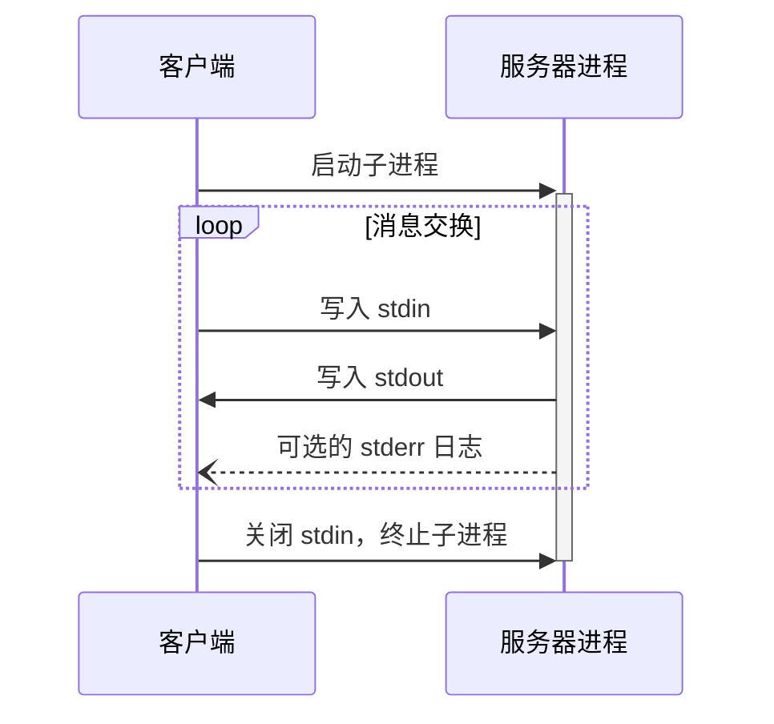
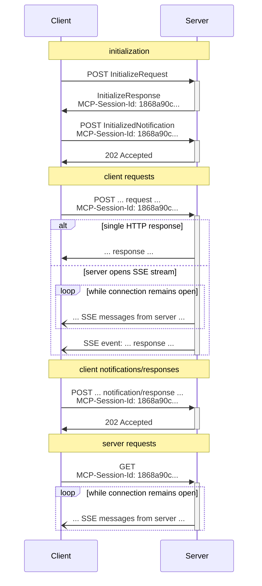

MCP 使用 JSON-RPC 对消息进行编码。JSON-RPC 消息 **MUST** 使用 UTF-8 编码。

该协议目前定义了两种用于客户端-服务器通信的标准传输机制：

1. [stdio](#stdio)，通过标准输入和标准输出进行通信
2. [Streamable HTTP](#streamable-http)

客户端 **SHOULD** 尽可能支持 stdio。

客户端和服务器也可以以可插拔的方式实现[自定义传输](#custom-transports)。

## stdio

在 **stdio** 传输中：

- 客户端将 MCP 服务器作为子进程启动。
- 服务器从其标准输入（`stdin`）读取 JSON-RPC 消息，并将其消息发送到标准输出（`stdout`）。
- 消息是单独的 JSON-RPC 请求、通知或响应。
- 消息由换行符分隔，并且 **MUST NOT** 包含嵌入式换行符。
- 服务器 **MAY** 将 UTF-8 字符串写入其标准错误（`stderr`）用于任何日志记录目的，包括信息、调试和错误消息。
- 客户端 **MAY** 捕获、转发或忽略服务器的 `stderr` 输出，并且 **SHOULD NOT** 假定 `stderr` 输出表示错误状况。
- 服务器 **MUST NOT** 向其 `stdout` 写入任何非有效 MCP 消息的内容。
- 客户端 **MUST NOT** 向服务器的 `stdin` 写入任何非有效 MCP 消息的内容。

## Streamable HTTP

<Info>

这取代了协议版本 2024-11-05 中的 [HTTP+SSE 传输](/specification/2024-11-05/basic/transports#http-with-sse)。请参见下面的[向后兼容性](#backwards-compatibility)指南。

</Info>

在 **Streamable HTTP** 传输中，服务器作为独立进程运行，可以处理多个客户端连接。此传输使用 HTTP POST 和 GET 请求。服务器可以选择使用[服务器发送事件（SSE）](https://en.wikipedia.org/wiki/Server-sent_events)来流式传输多个服务器消息。这既支持基本的 MCP 服务器，也支持支持流式传输和服务器到客户端通知及请求的功能更丰富的服务器。

服务器 **MUST** 提供一个支持 POST 和 GET 方法的单一 HTTP 端点路径（以下称为 **MCP 端点**）。例如，这可以是像 `https://example.com/mcp` 这样的 URL。

#### 安全警告

在实现 Streamable HTTP 传输时：

1. 服务器 **MUST** 验证所有传入连接的 `Origin` 头部以防止 DNS 重绑定攻击
   - 如果 `Origin` 头部存在且无效，服务器 **MUST** 响应 HTTP 403 Forbidden。HTTP 响应体 **MAY** 包含一个没有 `id` 的 JSON-RPC _错误响应_
2. 在本地运行时，服务器 **SHOULD** 仅绑定到 localhost（127.0.0.1），而不是所有网络接口（0.0.0.0）
3. 服务器 **SHOULD** 对所有连接实施适当的身份验证

没有这些保护措施，攻击者可能使用 DNS 重绑定从远程网站与本地 MCP 服务器交互。

### 向服务器发送消息

从客户端发送的每个 JSON-RPC 消息 **MUST** 是对 MCP 端点的新 HTTP POST 请求。

1. 客户端 **MUST** 使用 HTTP POST 向 MCP 端点发送 JSON-RPC 消息。
2. 客户端 **MUST** 包含一个 `Accept` 头部，列出 `application/json` 和 `text/event-stream` 作为支持的内容类型。
3. POST 请求的正文 **MUST** 是一个单独的 JSON-RPC _请求_、_通知_ 或 _响应_。
4. 如果输入是 JSON-RPC _响应_ 或 _通知_：
   - 如果服务器接受输入，服务器 **MUST** 返回 HTTP 状态码 202 Accepted，不包含正文。
   - 如果服务器无法接受输入，它 **MUST** 返回一个 HTTP 错误状态码（例如 400 Bad Request）。HTTP 响应体 **MAY** 包含一个没有 `id` 的 JSON-RPC _错误响应_。
5. 如果输入是 JSON-RPC _请求_，服务器 **MUST** 要么返回 `Content-Type: text/event-stream` 以启动 SSE 流，要么返回 `Content-Type: application/json` 以返回一个 JSON 对象。客户端 **MUST** 支持这两种情况。
6. 如果服务器启动 SSE 流：
   - 服务器 **SHOULD** 立即发送一个包含事件 ID 和空 `data` 字段的 SSE 事件，以便为客户端重新连接做好准备（使用该事件 ID 作为 `Last-Event-ID`）。
   - 在服务器向客户端发送了带有事件 ID 的 SSE 事件后，服务器 **MAY** 随时关闭*连接*（而不终止 _SSE 流_），以避免持有长期连接。客户端 **SHOULD** 然后通过尝试重新连接来"轮询"SSE 流。
   - 如果服务器在终止 _SSE 流_ 之前确实关闭了 _连接_，它 **SHOULD** 在关闭连接之前发送一个带有标准 [`retry`](https://html.spec.whatwg.org/multipage/server-sent-events.html#:~:text=field%20name%20is%20%22retry%22) 字段的 SSE 事件。客户端 **MUST** 遵守 `retry` 字段，在尝试重新连接之前等待指定的毫秒数。
   - SSE 流 **SHOULD** 最终包含在 POST 正文中发送的 JSON-RPC _请求_ 的 JSON-RPC _响应_。
   - 在发送 JSON-RPC _响应_ 之前，服务器 **MAY** 发送 JSON-RPC _请求_ 和 _通知_。这些消息 **SHOULD** 与原始客户端 _请求_ 相关。
   - 如果[会话](#session-management)过期，服务器 **MAY** 终止 SSE 流。
   - 在 JSON-RPC _响应_ 发送后，服务器 **SHOULD** 终止 SSE 流。
   - 断开连接 **MAY** 随时发生（例如由于网络状况）。因此：
     - 断开连接 **SHOULD NOT** 被解释为客户端取消其请求。
     - 要取消，客户端 **SHOULD** 显式发送 MCP `CancelledNotification`。
     - 为避免因断开连接导致消息丢失，服务器 **MAY** 使流[可恢复](#resumability-and-redelivery)。

### 监听来自服务器的消息

1. 客户端 **MAY** 向 MCP 端点发出 HTTP GET 请求。这可用于打开 SSE 流，允许服务器与客户端通信，而无需客户端先通过 HTTP POST 发送数据。
2. 客户端 **MUST** 包含一个 `Accept` 头部，列出 `text/event-stream` 作为支持的内容类型。
3. 服务器 **MUST** 要么在此 HTTP GET 响应中返回 `Content-Type: text/event-stream`，要么返回 HTTP 405 Method Not Allowed，指示服务器在此端点不提供 SSE 流。
4. 如果服务器启动 SSE 流：
   - 服务器 **MAY** 在流上发送 JSON-RPC _请求_ 和 _通知_。
   - 这些消息 **SHOULD** 与客户端任何同时运行的 JSON-RPC _请求_ 无关。
   - 服务器 **MUST NOT** 在流上发送 JSON-RPC _响应_，**除非**是[恢复](#resumability-and-redelivery)与先前客户端请求关联的流。
   - 服务器 **MAY** 随时关闭 SSE 流。
   - 如果服务器关闭 _连接_ 而不终止 _流_，它 **SHOULD** 遵循与 POST 请求相同的轮询行为：发送 `retry` 字段并允许客户端重新连接。
   - 客户端 **MAY** 随时关闭 SSE 流。

### 多个连接

1. 客户端 **MAY** 同时保持与多个 SSE 流的连接。
2. 服务器 **MUST** 仅在其中一个已连接的流上发送其每个 JSON-RPC 消息；也就是说，它 **MUST NOT** 跨多个流广播相同的消息。
   - 消息丢失的风险 **MAY** 通过使流[可恢复](#resumability-and-redelivery)来减轻。

### 可恢复性和重新投递

为了支持恢复断开的连接和重新投递可能丢失的消息：

1. 服务器 **MAY** 向其 SSE 事件附加一个 `id` 字段，如 [SSE 标准](https://html.spec.whatwg.org/multipage/server-sent-events.html#event-stream-interpretation) 中所述。
   - 如果存在，ID **MUST** 在该[会话](#session-management)内的所有流中全局唯一——或者如果未使用会话管理，则在与该特定客户端的所有流中唯一。
   - 事件 ID **SHOULD** 编码足够的信息来标识原始流，使服务器能够将 `Last-Event-ID` 关联到正确的流。
2. 如果客户端希望在断开连接后恢复（无论是由于网络故障还是服务器发起的关闭），它 **SHOULD** 向 MCP 端点发出 HTTP GET 请求，并包含 [`Last-Event-ID`](https://html.spec.whatwg.org/multipage/server-sent-events.html#the-last-event-id-header) 头部以指示它收到的最后一个事件 ID。
   - 服务器 **MAY** 使用此头部来重播在断开连接的流上本应在最后一个事件 ID 之后发送的消息，并从该点恢复流。
   - 服务器 **MUST NOT** 重播本应在不同流上投递的消息。
   - 此机制适用于原始流如何启动（通过 POST 或 GET）。恢复始终通过带有 `Last-Event-ID` 的 HTTP GET 进行。

换句话说，这些事件 ID 应由服务器在 _每流_ 基础上分配，作为该特定流中的游标。

### 会话管理

MCP "会话"由客户端和服务器之间逻辑相关的交互组成，从[初始化阶段](/specification/2025-11-25/basic/lifecycle)开始。为了支持想要建立有状态会话的服务器：

1. 使用 Streamable HTTP 传输的服务器 **MAY** 在初始化时分配一个会话 ID，将其包含在包含 `InitializeResult` 的 HTTP 响应的 `MCP-Session-Id` 头部中。
   - The session ID **SHOULD** be globally unique and cryptographically secure (e.g., a
     securely generated UUID, a JWT, or a cryptographic hash).
   - The session ID **MUST** only contain visible ASCII characters (ranging from 0x21 to
     0x7E).
   - The client **MUST** handle the session ID in a secure manner, see [Session Hijacking mitigations](/specification/2025-11-25/basic/security_best_practices#session-hijacking) for more details.
2. If an `MCP-Session-Id` is returned by the server during initialization, clients using
   the Streamable HTTP transport **MUST** include it in the `MCP-Session-Id` header on
   all of their subsequent HTTP requests.
   - Servers that require a session ID **SHOULD** respond to requests without an
     `MCP-Session-Id` header (other than initialization) with HTTP 400 Bad Request.
3. The server **MAY** terminate the session at any time, after which it **MUST** respond
   to requests containing that session ID with HTTP 404 Not Found.
4. When a client receives HTTP 404 in response to a request containing an
   `MCP-Session-Id`, it **MUST** start a new session by sending a new `InitializeRequest`
   without a session ID attached.
5. Clients that no longer need a particular session (e.g., because the user is leaving
   the client application) **SHOULD** send an HTTP DELETE to the MCP endpoint with the
   `MCP-Session-Id` header, to explicitly terminate the session.
   - The server **MAY** respond to this request with HTTP 405 Method Not Allowed,
     indicating that the server does not allow clients to terminate sessions.

### Sequence Diagram

### Protocol Version Header

If using HTTP, the client **MUST** include the `MCP-Protocol-Version:
<protocol-version>` HTTP header on all subsequent requests to the MCP
server, allowing the MCP server to respond based on the MCP protocol version.

For example: `MCP-Protocol-Version: 2025-11-25`

The protocol version sent by the client **SHOULD** be the one [negotiated during
initialization](/specification/2025-11-25/basic/lifecycle#version-negotiation).

For backwards compatibility, if the server does _not_ receive an `MCP-Protocol-Version`
header, and has no other way to identify the version - for example, by relying on the
protocol version negotiated during initialization - the server **SHOULD** assume protocol
version `2025-03-26`.

If the server receives a request with an invalid or unsupported
`MCP-Protocol-Version`, it **MUST** respond with `400 Bad Request`.

### Backwards Compatibility

Clients and servers can maintain backwards compatibility with the deprecated [HTTP+SSE
transport](/specification/2024-11-05/basic/transports#http-with-sse) (from
protocol version 2024-11-05) as follows:

**Servers** wanting to support older clients should:

- Continue to host both the SSE and POST endpoints of the old transport, alongside the
  new "MCP endpoint" defined for the Streamable HTTP transport.
  - It is also possible to combine the old POST endpoint and the new MCP endpoint, but
    this may introduce unneeded complexity.

**Clients** wanting to support older servers should:

1. Accept an MCP server URL from the user, which may point to either a server using the
   old transport or the new transport.
2. Attempt to POST an `InitializeRequest` to the server URL, with an `Accept` header as
   defined above:
   - If it succeeds, the client can assume this is a server supporting the new Streamable
     HTTP transport.
   - If it fails with the following HTTP status codes "400 Bad Request", "404 Not
     Found" or "405 Method Not Allowed":
     - Issue a GET request to the server URL, expecting that this will open an SSE stream
       and return an `endpoint` event as the first event.
     - When the `endpoint` event arrives, the client can assume this is a server running
       the old HTTP+SSE transport, and should use that transport for all subsequent
       communication.

## Custom Transports

Clients and servers **MAY** implement additional custom transport mechanisms to suit
their specific needs. The protocol is transport-agnostic and can be implemented over any
communication channel that supports bidirectional message exchange.

Implementers who choose to support custom transports **MUST** ensure they preserve the
JSON-RPC message format and lifecycle requirements defined by MCP. Custom transports
**SHOULD** document their specific connection establishment and message exchange patterns
to aid interoperability.
