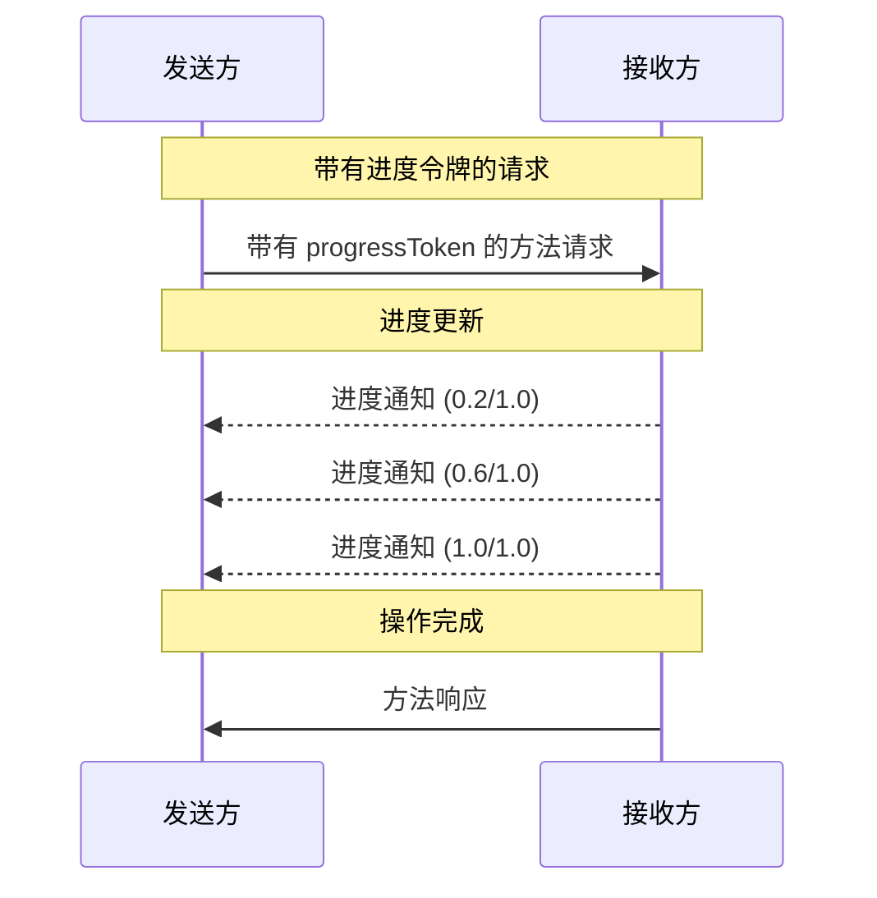

<div id="enable-section-numbers" />

Model Context Protocol (MCP) 支持通过通知消息可选地跟踪长时间运行的操作的进度。任何一方都可以发送进度通知来提供操作状态的更新。

## 进度流程

当一方希望 _接收_ 请求的进度更新时，它在请求元数据中包含一个 `progressToken`。

- 进度令牌 **MUST** 是字符串或整数值
- 进度令牌可以由发送方使用任何方式选择，但 **MUST** 在所有活动请求中唯一。

```json
{
  "jsonrpc": "2.0",
  "id": 1,
  "method": "some_method",
  "params": {
    "_meta": {
      "progressToken": "abc123"
    }
  }
}
```

然后，接收方 **MAY** 发送包含以下内容的进度通知：

- 原始进度令牌
- 当前的进度值
- 可选的"总计"值
- 可选的"消息"值

```json
{
  "jsonrpc": "2.0",
  "method": "notifications/progress",
  "params": {
    "progressToken": "abc123",
    "progress": 50,
    "total": 100,
    "message": "正在计算样条曲线..."
  }
}
```

- `progress` 值 **MUST** 随着每个通知递增，即使总计未知。
- `progress` 和 `total` 值 **MAY** 是浮点数。
- `message` 字段 **SHOULD** 提供相关的人类可读进度信息。

## 行为要求

1. 进度通知 **MUST** 仅引用以下令牌：
   - 在活动请求中提供的令牌
   - 与正在进行的操作相关联的令牌

2. 进度请求的接收方 **MAY**：
   - 选择不发送任何进度通知
   - 以他们认为合适的任何频率发送通知
   - 如果未知，则省略总计值

3. 对于[任务增强型请求](./tasks)，原始请求中提供的 `progressToken` **MUST** 在任务的整个生命周期中继续用于进度通知，即使在 `CreateTaskResult` 返回之后。进度令牌保持有效并与任务相关联，直到任务达到终端状态。
   - 任务的进度通知 **MUST** 使用初始任务增强型请求中提供的相同 `progressToken`
   - 任务的进度通知 **MUST** 在任务达到终端状态（`completed`、`failed` 或 `cancelled`）后停止



## 实现说明

- 发送方和接收方 **SHOULD** 跟踪活动的进度令牌
- 双方 **SHOULD** 实施速率限制以防止消息泛滥
- 进度通知 **MUST** 在完成后停止
