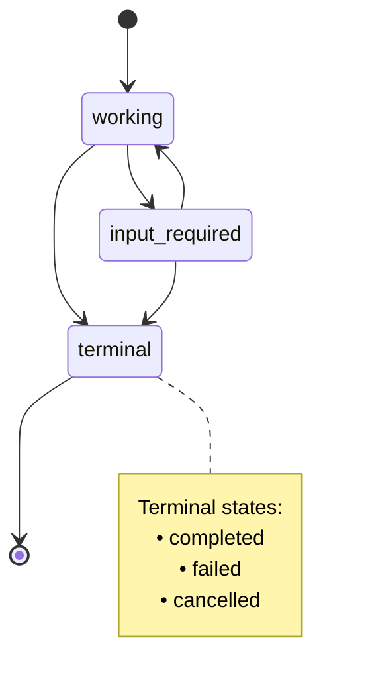
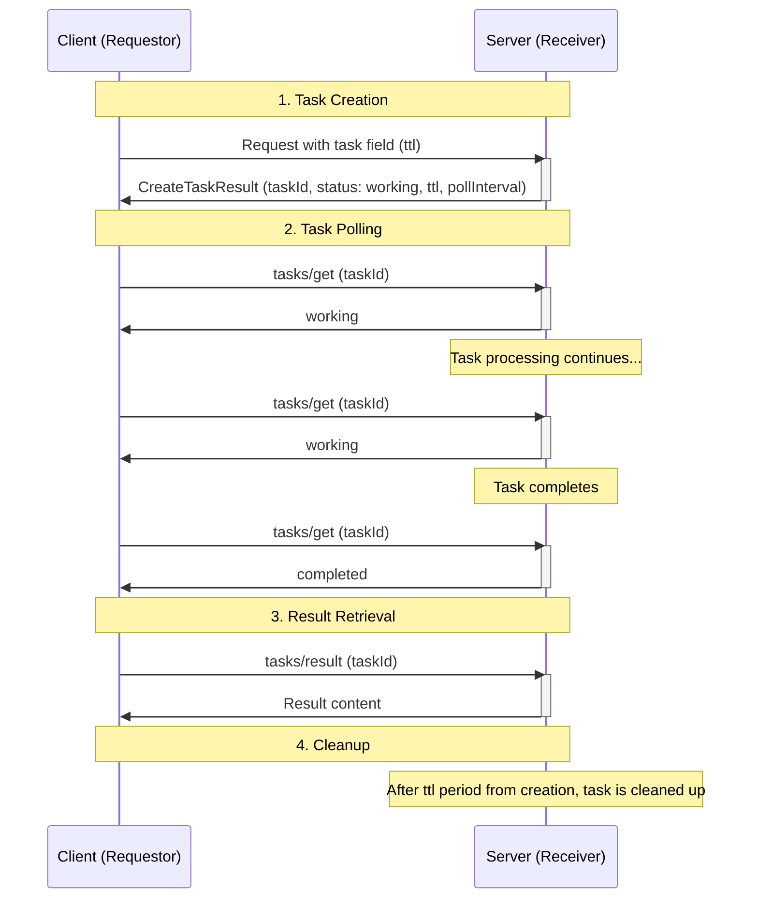
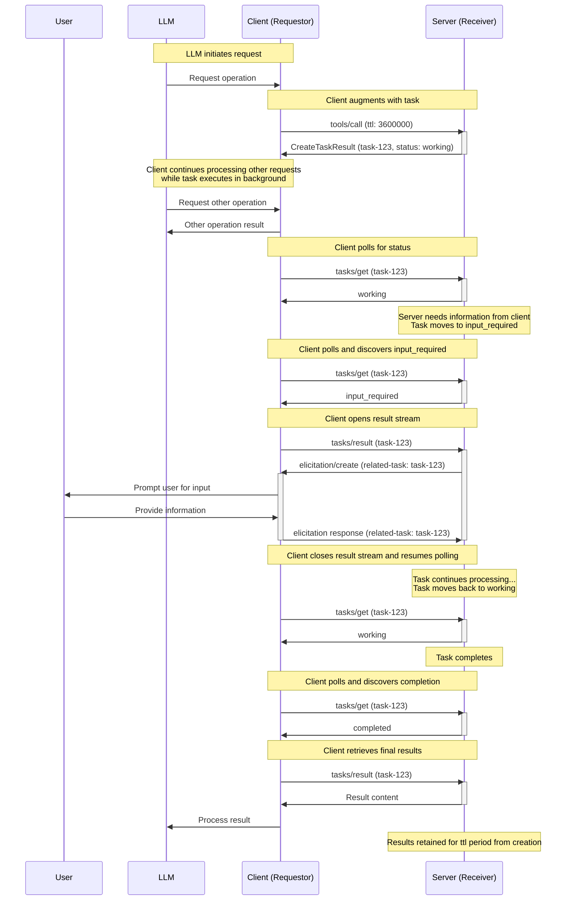
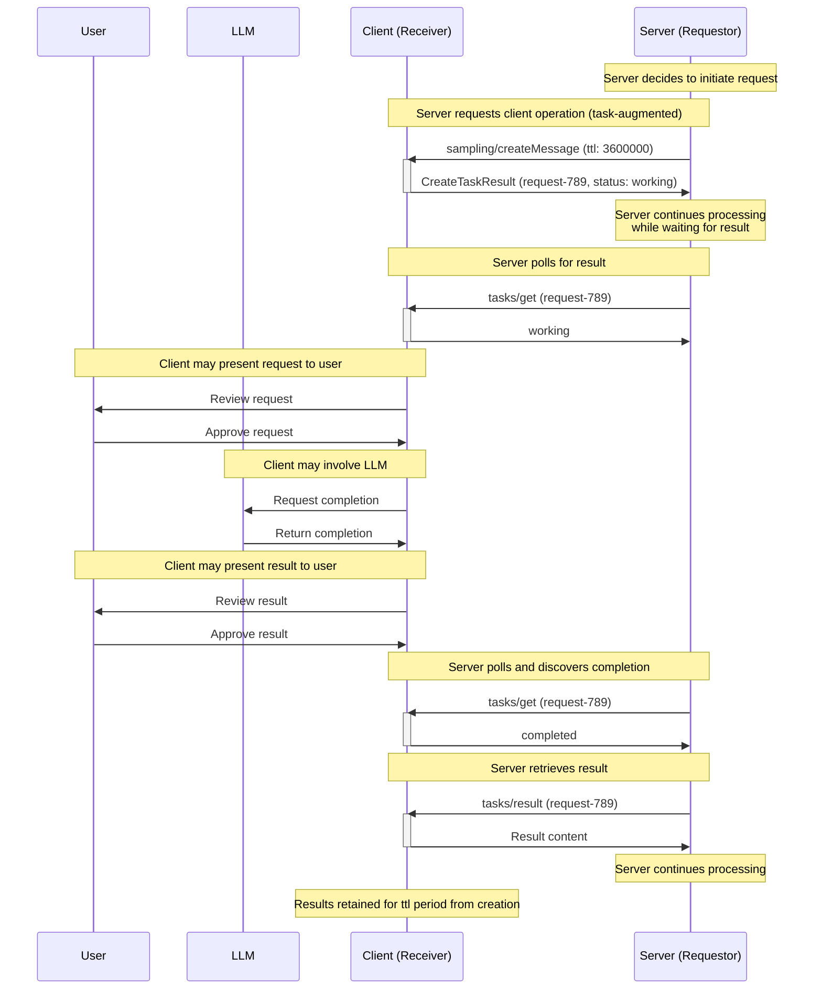
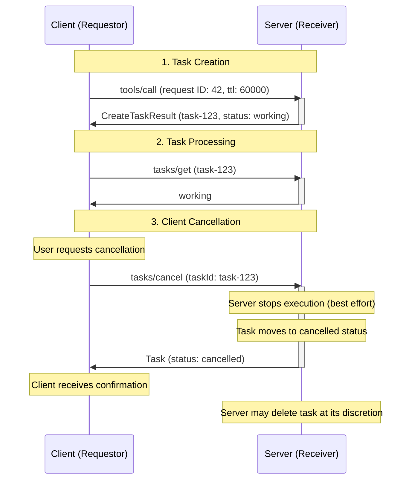

<div id="enable-section-numbers" />

<Note>

任务是在 MCP 规范 2025-11-25 版本中引入的，目前被视为**实验性**功能。
任务的设计和行为可能会在未来的协议版本中演变。

</Note>

Model Context Protocol (MCP) 允许请求方（可以是客户端或服务器，取决于通信方向）使用**任务（tasks）**来增强其请求。任务是持久的状态机，携带有关其所包装请求的底层执行状态的信息，旨在供请求方轮询和延迟结果检索。每个任务由接收方生成的**任务 ID** 唯一标识。

任务对于表示昂贵的计算和批处理请求非常有用，并且可以与外部作业 API 无缝集成。

## 定义

任务将各方表示为"请求方"或"接收方"，定义如下：

- **请求方（Requestor）**：任务增强型请求的发送者。可以是客户端或服务器——两者都可以创建任务。
- **接收方（Receiver）**：任务增强型请求的接收者，以及执行任务的实体。可以是客户端或服务器——两者都可以接收和执行任务。

## 用户交互模型

任务被设计为**请求方驱动**的——请求方负责使用任务增强请求并轮询这些任务的结果；同时，接收方严格控制哪些请求（如果有）支持基于任务的执行并管理这些任务的生命周期。

这种请求方驱动的方法确保了确定性的响应处理，并支持复杂的模式，如调度并发请求，只有请求方拥有足够的上下文来进行编排。

实现可以自由地通过任何适合其需求的界面模式来暴露任务——协议本身并不强制规定任何特定的用户交互模型。

## 能力

支持任务增强型请求的服务器和客户端 **MUST** 在初始化期间声明 `tasks` 能力。`tasks` 能力按请求类别结构化，使用布尔属性指示哪些特定请求类型支持任务增强。

### 服务器能力

服务器声明是否支持任务，如果支持，哪些服务器端请求可以增强为任务。

| 能力                        | 描述                                   |
| --------------------------- | -------------------------------------- |
| `tasks.list`                | 服务器支持 `tasks/list` 操作           |
| `tasks.cancel`              | 服务器支持 `tasks/cancel` 操作         |
| `tasks.requests.tools.call` | 服务器支持任务增强的 `tools/call` 请求 |

```json
{
  "capabilities": {
    "tasks": {
      "list": {},
      "cancel": {},
      "requests": {
        "tools": {
          "call": {}
        }
      }
    }
  }
}
```

### 客户端能力

客户端声明是否支持任务，如果支持，哪些客户端端请求可以增强为任务。

| 能力                                    | 描述                                               |
| --------------------------------------- | -------------------------------------------------- |
| `tasks.list`                            | 客户端支持 `tasks/list` 操作                       |
| `tasks.cancel`                          | 客户端支持 `tasks/cancel` 操作                     |
| `tasks.requests.sampling.createMessage` | 客户端支持任务增强的 `sampling/createMessage` 请求 |
| `tasks.requests.elicitation.create`     | 客户端支持任务增强的 `elicitation/create` 请求     |

```json
{
  "capabilities": {
    "tasks": {
      "list": {},
      "cancel": {},
      "requests": {
        "sampling": {
          "createMessage": {}
        },
        "elicitation": {
          "create": {}
        }
      }
    }
  }
}
```

### 能力协商

在初始化阶段，双方交换其 `tasks` 能力，以确定哪些操作支持基于任务的执行。请求方 **SHOULD** 仅当接收方声明了相应能力时才使用任务增强请求。

例如，如果服务器的能力包括 `tasks.requests.tools.call: {}`，则客户端可以使用任务增强 `tools/call` 请求。如果客户端的能力包括 `tasks.requests.sampling.createMessage: {}`，则服务器可以使用任务增强 `sampling/createMessage` 请求。

如果未定义 `capabilities.tasks`，对端 **SHOULD NOT** 尝试在请求期间创建任务。

`capabilities.tasks.requests` 中的能力集是穷举的。如果某个请求类型不存在，则它不支持任务增强。

`capabilities.tasks.list` 控制该方是否支持 `tasks/list` 操作。

`capabilities.tasks.cancel` 控制该方是否支持 `tasks/cancel` 操作。

### 工具级协商

工具调用在任务增强方面受到特殊考虑。在 `tools/list` 的结果中，工具通过 `execution.taskSupport` 声明对任务的支持，如果存在，其值可以是 `"required"`、`"optional"` 或 `"forbidden"`。

这被解释为除能力之外的细粒度层，遵循以下规则：

1. 如果服务器的能力不包括 `tasks.requests.tools.call`，则客户端 **MUST NOT** 尝试在该服务器的工具上使用任务增强，无论 `execution.taskSupport` 的值如何。
1. 如果服务器的能力包括 `tasks.requests.tools.call`，则客户端考虑 `execution.taskSupport` 的值，并相应处理：
   1. 如果 `execution.taskSupport` 不存在或为 `"forbidden"`，客户端 **MUST NOT** 尝试将工具作为任务调用。如果客户端尝试这样做，服务器 **SHOULD** 返回 `-32601`（Method not found）错误。这是默认行为。
   1. 如果 `execution.taskSupport` 是 `"optional"`，客户端 **MAY** 将工具作为任务或普通请求调用。
   1. 如果 `execution.taskSupport` 是 `"required"`，客户端 **MUST** 将工具作为任务调用。如果客户端不这样做，服务器 **MUST** 返回 `-32601`（Method not found）错误。

## 协议消息

### 创建任务

任务增强型请求遵循与普通请求不同的两阶段响应模式：

- **普通请求**：服务器处理请求并直接返回实际操作结果。
- **任务增强型请求**：服务器接受请求并立即返回包含任务数据的 `CreateTaskResult`。实际操作结果在任务完成后通过 `tasks/result` 可用。

要创建任务，请求方发送一个请求，在请求参数中包含 `task` 字段。请求方 **MAY** 包含一个 `ttl` 值，指示自创建以来所需的任务生命周期持续时间（以毫秒为单位）。

**请求：**

```json
{
  "jsonrpc": "2.0",
  "id": 1,
  "method": "tools/call",
  "params": {
    "name": "get_weather",
    "arguments": {
      "city": "New York"
    },
    "task": {
      "ttl": 60000
    }
  }
}
```

**响应：**

```json
{
  "jsonrpc": "2.0",
  "id": 1,
  "result": {
    "task": {
      "taskId": "786512e2-9e0d-44bd-8f29-789f320fe840",
      "status": "working",
      "statusMessage": "操作正在进行中。",
      "createdAt": "2025-11-25T10:30:00Z",
      "lastUpdatedAt": "2025-11-25T10:40:00Z",
      "ttl": 60000,
      "pollInterval": 5000
    }
  }
}
```

当接收方接受任务增强型请求时，它返回一个包含任务数据的 [`CreateTaskResult`](/specification/2025-11-25/schema#createtaskresult)。响应不包括实际操作结果。实际结果（例如 `tools/call` 的工具结果）仅在任务完成后通过 `tasks/result` 可用。

<Note>

当响应 `tools/call` 请求而创建任务时，主机应用程序可能希望在任务执行期间将控制权返回给模型。这允许模型在等待任务完成时继续处理其他请求或执行额外工作。

为了支持这种模式，服务器可以在 `CreateTaskResult` 的 `_meta` 字段中提供可选的 `io.modelcontextprotocol/model-immediate-response` 键。此键的值应是一个字符串，旨在作为即时工具结果传递给模型。
如果服务器不提供此字段，主机应用程序可以回退到其自己的预定义消息。

此指南不具有约束力，是旨在考虑特定用例的临时逻辑。此行为可能会在未来的协议版本中作为 `CreateTaskResult` 的一部分正式化或修改。

</Note>

### 获取任务

<Note>

在 Streamable HTTP (SSE) 传输中，客户端 **MAY** 随时断开由服务器响应 `tasks/get` 请求而打开的 SSE 流。

虽然此说明对 SSE 流的具体使用没有规定性，但所有实现 **MUST** 继续遵守现有的 [Streamable HTTP 传输规范](../transports#sending-messages-to-the-server)。

</Note>

请求方通过发送 [`tasks/get`](/specification/2025-11-25/schema#tasks%2Fget) 请求来轮询任务完成状态。请求方 **SHOULD** 在确定轮询频率时尊重响应中提供的 `pollInterval`。

请求方 **SHOULD** 继续轮询，直到任务达到终端状态（`completed`、`failed` 或 `cancelled`），或遇到 [`input_required`](#input-required-status) 状态。请注意，调用 `tasks/result` 并不意味着请求方需要停止轮询——如果请求方没有主动等待 `tasks/result` 完成，则 **SHOULD** 继续通过 `tasks/get` 轮询任务状态。

**请求：**

```json
{
  "jsonrpc": "2.0",
  "id": 3,
  "method": "tasks/get",
  "params": {
    "taskId": "786512e2-9e0d-44bd-8f29-789f320fe840"
  }
}
```

**Response:**

```json
{
  "jsonrpc": "2.0",
  "id": 3,
  "result": {
    "taskId": "786512e2-9e0d-44bd-8f29-789f320fe840",
    "status": "working",
    "statusMessage": "The operation is now in progress.",
    "createdAt": "2025-11-25T10:30:00Z",
    "lastUpdatedAt": "2025-11-25T10:40:00Z",
    "ttl": 30000,
    "pollInterval": 5000
  }
}
```

### Retrieving Task Results

<Note>

In the Streamable HTTP (SSE) transport, clients **MAY** disconnect from an SSE stream opened by the server in response to a `tasks/result` request at any time.

While this note is not prescriptive regarding the specific usage of SSE streams, all implementations **MUST** continue to comply with the existing [Streamable HTTP transport specification](../transports#sending-messages-to-the-server).

</Note>

After a task completes the operation result is retrieved via [`tasks/result`](/specification/2025-11-25/schema#tasks%2Fresult). This is distinct from the initial `CreateTaskResult` response, which contains only task data. The result structure matches the original request type (e.g., `CallToolResult` for `tools/call`).

To retrieve the result of a completed task, requestors can send a `tasks/result` request:

While `tasks/result` blocks until the task reaches a terminal status, requestors can continue polling via `tasks/get` in parallel if they are not actively blocked waiting for the result, such as if their previous `tasks/result` request failed or was cancelled. This allows requestors to monitor status changes or display progress updates while the task executes, even after invoking `tasks/result`.

**Request:**

```json
{
  "jsonrpc": "2.0",
  "id": 4,
  "method": "tasks/result",
  "params": {
    "taskId": "786512e2-9e0d-44bd-8f29-789f320fe840"
  }
}
```

**Response:**

```json
{
  "jsonrpc": "2.0",
  "id": 4,
  "result": {
    "content": [
      {
        "type": "text",
        "text": "Current weather in New York:\nTemperature: 72°F\nConditions: Partly cloudy"
      }
    ],
    "isError": false,
    "_meta": {
      "io.modelcontextprotocol/related-task": {
        "taskId": "786512e2-9e0d-44bd-8f29-789f320fe840"
      }
    }
  }
}
```

### Task Status Notification

When a task status changes, receivers **MAY** send a [`notifications/tasks/status`](/specification/2025-11-25/schema#notifications%2Ftasks%2Fstatus) notification to inform the requestor of the change. This notification includes the full task state.

**Notification:**

```json
{
  "jsonrpc": "2.0",
  "method": "notifications/tasks/status",
  "params": {
    "taskId": "786512e2-9e0d-44bd-8f29-789f320fe840",
    "status": "completed",
    "createdAt": "2025-11-25T10:30:00Z",
    "lastUpdatedAt": "2025-11-25T10:50:00Z",
    "ttl": 60000,
    "pollInterval": 5000
  }
}
```

The notification includes the full [`Task`](/specification/2025-11-25/schema#task) object, including the updated `status` and `statusMessage` (if present). This allows requestors to access the complete task state without making an additional `tasks/get` request.

Requestors **MUST NOT** rely on receiving this notifications, as it is optional. Receivers are not required to send status notifications and may choose to only send them for certain status transitions. Requestors **SHOULD** continue to poll via `tasks/get` to ensure they receive status updates.

### Listing Tasks

To retrieve a list of tasks, requestors can send a [`tasks/list`](/specification/2025-11-25/schema#tasks%2Flist) request. This operation supports pagination.

**Request:**

```json
{
  "jsonrpc": "2.0",
  "id": 5,
  "method": "tasks/list",
  "params": {
    "cursor": "optional-cursor-value"
  }
}
```

**Response:**

```json
{
  "jsonrpc": "2.0",
  "id": 5,
  "result": {
    "tasks": [
      {
        "taskId": "786512e2-9e0d-44bd-8f29-789f320fe840",
        "status": "working",
        "createdAt": "2025-11-25T10:30:00Z",
        "lastUpdatedAt": "2025-11-25T10:40:00Z",
        "ttl": 30000,
        "pollInterval": 5000
      },
      {
        "taskId": "abc123-def456-ghi789",
        "status": "completed",
        "createdAt": "2025-11-25T09:15:00Z",
        "lastUpdatedAt": "2025-11-25T10:40:00Z",
        "ttl": 60000
      }
    ],
    "nextCursor": "next-page-cursor"
  }
}
```

### Cancelling Tasks

To explicitly cancel a task, requestors can send a [`tasks/cancel`](/specification/2025-11-25/schema#tasks%2Fcancel) request.

**Request:**

```json
{
  "jsonrpc": "2.0",
  "id": 6,
  "method": "tasks/cancel",
  "params": {
    "taskId": "786512e2-9e0d-44bd-8f29-789f320fe840"
  }
}
```

**Response:**

```json
{
  "jsonrpc": "2.0",
  "id": 6,
  "result": {
    "taskId": "786512e2-9e0d-44bd-8f29-789f320fe840",
    "status": "cancelled",
    "statusMessage": "The task was cancelled by request.",
    "createdAt": "2025-11-25T10:30:00Z",
    "lastUpdatedAt": "2025-11-25T10:40:00Z",
    "ttl": 30000,
    "pollInterval": 5000
  }
}
```

## Behavior Requirements

These requirements apply to all parties that support receiving task-augmented requests.

### Task Support and Handling

1. Receivers that do not declare the task capability for a request type **MUST** process requests of that type normally, ignoring any task-augmentation metadata if present.
1. Receivers that declare the task capability for a request type **MAY** return an error for non-task-augmented requests, requiring requestors to use task augmentation.

### Task ID Requirements

1. Task IDs **MUST** be a string value.
1. Task IDs **MUST** be generated by the receiver when creating a task.
1. Task IDs **MUST** be unique among all tasks controlled by the receiver.

### Task Status Lifecycle

1. Tasks **MUST** begin in the `working` status when created.
1. Receivers **MUST** only transition tasks through the following valid paths:
   1. From `working`: may move to `input_required`, `completed`, `failed`, or `cancelled`
   1. From `input_required`: may move to `working`, `completed`, `failed`, or `cancelled`
   1. Tasks with a `completed`, `failed`, or `cancelled` status are in a terminal state and **MUST NOT** transition to any other status

**Task Status State Diagram:**



### Input Required Status

<Note>

With the Streamable HTTP (SSE) transport, servers often close SSE streams after delivering a response message, which can lead to ambiguity regarding the stream used for subsequent task messages.

Servers can handle this by enqueueing messages to the client to side-channel task-related messages alongside other responses.

Servers have flexibility in how they manage SSE streams during task polling and result retrieval, and clients **SHOULD** expect messages to be delivered on any SSE stream, including the HTTP GET stream.
One possible approach is maintaining an SSE stream on `tasks/result` (see notes on the `input_required` status).
Where possible, servers **SHOULD NOT** upgrade to an SSE stream in response to a `tasks/get` request, as the client has indicated it wishes to poll for a result.

While this note is not prescriptive regarding the specific usage of SSE streams, all implementations **MUST** continue to comply with the existing [Streamable HTTP transport specification](../transports#sending-messages-to-the-server).

</Note>

1. When the task receiver has messages for the requestor that are necessary to complete the task, the receiver **SHOULD** move the task to the `input_required` status.
1. The receiver **MUST** include the `io.modelcontextprotocol/related-task` metadata in the request to associate it with the task.
1. When the requestor encounters the `input_required` status, it **SHOULD** preemptively call `tasks/result`.
1. When the receiver receives all required input, the task **SHOULD** transition out of `input_required` status (typically back to `working`).

### TTL and Resource Management

1. Receivers **MUST** include a `createdAt` [ISO 8601](https://datatracker.ietf.org/doc/html/rfc3339#section-5)-formatted timestamp in all task responses to indicate when the task was created.
1. Receivers **MUST** include a `lastUpdatedAt` [ISO 8601](https://datatracker.ietf.org/doc/html/rfc3339#section-5)-formatted timestamp in all task responses to indicate when the task was last updated.
1. Receivers **MAY** override the requested `ttl` duration.
1. Receivers **MUST** include the actual `ttl` duration (or `null` for unlimited) in `tasks/get` responses.
1. After a task's `ttl` lifetime has elapsed, receivers **MAY** delete the task and its results, regardless of the task status.
1. Receivers **MAY** include a `pollInterval` value (in milliseconds) in `tasks/get` responses to suggest polling intervals. Requestors **SHOULD** respect this value when provided.

### Result Retrieval

1. Receivers that accept a task-augmented request **MUST** return a `CreateTaskResult` as the response. This result **SHOULD** be returned as soon as possible after accepting the task.
1. When a receiver receives a `tasks/result` request for a task in a terminal status (`completed`, `failed`, or `cancelled`), it **MUST** return the final result of the underlying request, whether that is a successful result or a JSON-RPC error.
1. When a receiver receives a `tasks/result` request for a task in any other non-terminal status (`working` or `input_required`), it **MUST** block the response until the task reaches a terminal status.
1. For tasks in a terminal status, receivers **MUST** return from `tasks/result` exactly what the underlying request would have returned, whether that is a successful result or a JSON-RPC error.

### Associating Task-Related Messages

1. All requests, notifications, and responses related to a task **MUST** include the `io.modelcontextprotocol/related-task` key in their `_meta` field, with the value set to an object with a `taskId` matching the associated task ID.
   1. For example, an elicitation that a task-augmented tool call depends on **MUST** share the same related task ID with that tool call's task.
1. For the `tasks/get`, `tasks/result`, and `tasks/cancel` operations, the `taskId` parameter in the request **MUST** be used as the source of truth for identifying the target task. Requestors **SHOULD NOT** include `io.modelcontextprotocol/related-task` metadata in these requests, and receivers **MUST** ignore such metadata if present in favor of the RPC method parameter.
   Similarly, for the `tasks/get`, `tasks/list`, and `tasks/cancel` operations, receivers **SHOULD NOT** include `io.modelcontextprotocol/related-task` metadata in the result messages, as the `taskId` is already present in the response structure.

### Task Notifications

1. Receivers **MAY** send `notifications/tasks/status` notifications when a task's status changes.
1. Requestors **MUST NOT** rely on receiving the `notifications/tasks/status` notification, as it is optional.
1. When sent, the `notifications/tasks/status` notification **SHOULD NOT** include the `io.modelcontextprotocol/related-task` metadata, as the task ID is already present in the notification parameters.

### Task Progress Notifications

Task-augmented requests support progress notifications as defined in the [progress](./progress) specification. The `progressToken` provided in the initial request remains valid throughout the task lifetime.

### Task Listing

1. Receivers **SHOULD** use cursor-based pagination to limit the number of tasks returned in a single response.
1. Receivers **MUST** include a `nextCursor` in the response if more tasks are available.
1. Requestors **MUST** treat cursors as opaque tokens and not attempt to parse or modify them.
1. If a task is retrievable via `tasks/get` for a requestor, it **MUST** be retrievable via `tasks/list` for that requestor.

### Task Cancellation

1. Receivers **MUST** reject cancellation requests for tasks already in a terminal status (`completed`, `failed`, or `cancelled`) with error code `-32602` (Invalid params).
1. Upon receiving a valid cancellation request, receivers **SHOULD** attempt to stop the task execution and **MUST** transition the task to `cancelled` status before sending the response.
1. Once a task is cancelled, it **MUST** remain in `cancelled` status even if execution continues to completion or fails.
1. The `tasks/cancel` operation does not define deletion behavior. However, receivers **MAY** delete cancelled tasks at their discretion at any time, including immediately after cancellation or after the task `ttl` expires.
1. Requestors **SHOULD NOT** rely on cancelled tasks being retained for any specific duration and should retrieve any needed information before cancelling.

## Message Flow

### Basic Task Lifecycle



### Task-Augmented Tool Call With Elicitation



### Task-Augmented Sampling Request



### Task Cancellation Flow



## Data Types

### Task

A task represents the execution state of a request. The task state includes:

- `taskId`: Unique identifier for the task
- `status`: Current state of the task execution
- `statusMessage`: Optional human-readable message describing the current state (can be present for any status, including error details for failed tasks)
- `createdAt`: ISO 8601 timestamp when the task was created
- `ttl`: Time in milliseconds from creation before task may be deleted
- `pollInterval`: Suggested time in milliseconds between status checks
- `lastUpdatedAt`: ISO 8601 timestamp when the task status was last updated

### Task Status

Tasks can be in one of the following states:

- `working`: The request is currently being processed.
- `input_required`: The receiver needs input from the requestor. The requestor should call `tasks/result` to receive input requests, even though the task has not reached a terminal state.
- `completed`: The request completed successfully and results are available.
- `failed`: The associated request did not complete successfully. For tool calls specifically, this includes cases where the tool call result has `isError` set to true.
- `cancelled`: The request was cancelled before completion.

### Task Parameters

When augmenting a request with task execution, the `task` field is included in the request parameters:

```json
{
  "task": {
    "ttl": 60000
  }
}
```

Fields:

- `ttl` (number, optional): Requested duration in milliseconds to retain task from creation

### Related Task Metadata

All requests, responses, and notifications associated with a task **MUST** include the `io.modelcontextprotocol/related-task` key in `_meta`:

```json
{
  "io.modelcontextprotocol/related-task": {
    "taskId": "786512e2-9e0d-44bd-8f29-789f320fe840"
  }
}
```

This associates messages with their originating task across the entire request lifecycle.

For the `tasks/get`, `tasks/list`, and `tasks/cancel` operations, requestors and receivers **SHOULD NOT** include this metadata in their messages, as the `taskId` is already present in the message structure.
The `tasks/result` operation **MUST** include this metadata in its response, as the result structure itself does not contain the task ID.

## Error Handling

Tasks use two error reporting mechanisms:

1. **Protocol Errors**: Standard JSON-RPC errors for protocol-level issues
1. **Task Execution Errors**: Errors in the underlying request execution, reported through task status

### Protocol Errors

Receivers **MUST** return standard JSON-RPC errors for the following protocol error cases:

- Invalid or nonexistent `taskId` in `tasks/get`, `tasks/result`, or `tasks/cancel`: `-32602` (Invalid params)
- Invalid or nonexistent cursor in `tasks/list`: `-32602` (Invalid params)
- Attempt to cancel a task already in a terminal status: `-32602` (Invalid params)
- Internal errors: `-32603` (Internal error)

Additionally, receivers **MAY** return the following errors:

- Non-task-augmented request when receiver requires task augmentation for that request type: `-32600` (Invalid request)

Receivers **SHOULD** provide informative error messages to describe the cause of errors.

**Example: Task augmentation required**

```json
{
  "jsonrpc": "2.0",
  "id": 1,
  "error": {
    "code": -32600,
    "message": "Task augmentation required for tools/call requests"
  }
}
```

**Example: Task not found**

```json
{
  "jsonrpc": "2.0",
  "id": 70,
  "error": {
    "code": -32602,
    "message": "Failed to retrieve task: Task not found"
  }
}
```

**Example: Task expired**

```json
{
  "jsonrpc": "2.0",
  "id": 71,
  "error": {
    "code": -32602,
    "message": "Failed to retrieve task: Task has expired"
  }
}
```

<Note>

Receivers are not required to retain tasks indefinitely. It is compliant behavior for a receiver to return an error stating the task cannot be found if it has purged an expired task.

</Note>

**Example: Task cancellation rejected (already terminal)**

```json
{
  "jsonrpc": "2.0",
  "id": 74,
  "error": {
    "code": -32602,
    "message": "Cannot cancel task: already in terminal status 'completed'"
  }
}
```

### Task Execution Errors

When the underlying request does not complete successfully, the task moves to the `failed` status. This includes JSON-RPC protocol errors during request execution, or for tool calls specifically, when the tool result has `isError` set to true. The `tasks/get` response **SHOULD** include a `statusMessage` field with diagnostic information about the failure.

**Example: Task with execution error**

```json
{
  "jsonrpc": "2.0",
  "id": 4,
  "result": {
    "taskId": "786512e2-9e0d-44bd-8f29-789f820fe840",
    "status": "failed",
    "createdAt": "2025-11-25T10:30:00Z",
    "lastUpdatedAt": "2025-11-25T10:40:00Z",
    "ttl": 30000,
    "statusMessage": "Tool execution failed: API rate limit exceeded"
  }
}
```

For tasks that wrap tool call requests, when the tool result has `isError` set to `true`, the task should reach `failed` status.

The `tasks/result` endpoint returns exactly what the underlying request would have returned:

- If the underlying request resulted in a JSON-RPC error, `tasks/result` **MUST** return that same JSON-RPC error.
- If the request completed with a JSON-RPC response, `tasks/result` **MUST** return a successful JSON-RPC response containing that result.

## Security Considerations

### Task Isolation and Access Control

Task IDs are the primary mechanism for accessing task state and results. Without proper access controls, any party that can guess or obtain a task ID could potentially access sensitive information or manipulate tasks they did not create.

When an authorization context is provided, receivers **MUST** bind tasks to said context.

Context-binding is not practical for all applications. Some MCP servers operate in environments without authorization, such as single-user tools, or use transports that don't support authorization.
In these scenarios, receivers **SHOULD** document this limitation clearly, as task results may be accessible to any requestor that can guess the task ID.
If context-binding is unavailable, receivers **MUST** generate cryptographically secure task IDs with enough entropy to prevent guessing and should consider using shorter TTL durations to reduce the exposure window.
Furthermore, receivers that cannot identify requestors **SHOULD NOT** declare the `tasks.list` capability, as listing tasks would expose task metadata to any requestor regardless of task ID entropy.

If context-binding is available, receivers **MUST** reject `tasks/get`, `tasks/result`, and `tasks/cancel` requests for tasks that do not belong to the same authorization context as the requestor. For `tasks/list` requests, receivers **MUST** ensure the returned task list includes only tasks associated with the requestor's authorization context.

Additionally, receivers **SHOULD** implement rate limiting on task operations to prevent denial-of-service and enumeration attacks.

### Resource Management

1. Receivers **SHOULD**:
   1. Enforce limits on concurrent tasks per requestor
   1. Enforce maximum `ttl` durations to prevent indefinite resource retention
   1. Clean up expired tasks promptly to free resources
   1. Document maximum supported `ttl` duration
   1. Document maximum concurrent tasks per requestor
   1. Implement monitoring and alerting for resource usage

### Audit and Logging

1. Receivers **SHOULD**:
   1. Log task creation, completion, and retrieval events for audit purposes
   1. Include auth context in logs when available
   1. Monitor for suspicious patterns (e.g., many failed task lookups, excessive polling)
1. Requestors **SHOULD**:
   1. Log task lifecycle events for debugging and audit purposes
   1. Track task IDs and their associated operations
