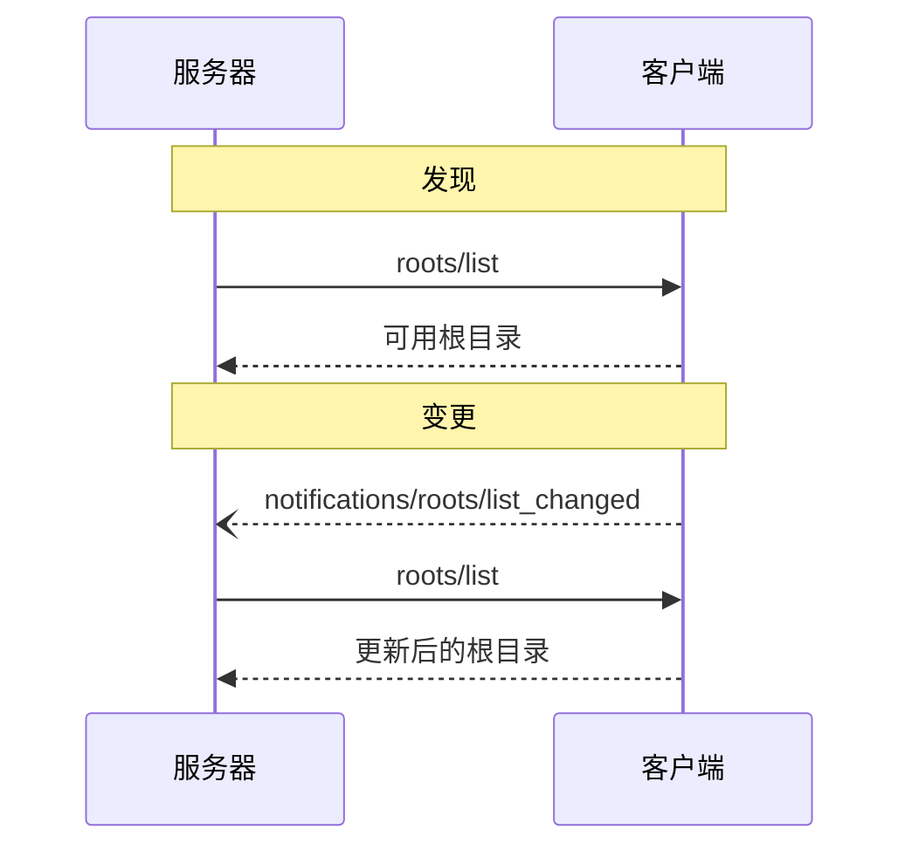

<div id="enable-section-numbers" />

Model Context Protocol (MCP) 提供了一种标准化的方式，让客户端向服务器暴露文件系统的"根目录"。根目录定义了服务器可以在文件系统中操作的边界，使它们能够了解有权访问哪些目录和文件。服务器可以向支持的客户端请求根目录列表，并在该列表发生变化时接收通知。

## 用户交互模型

MCP 中的根目录通常通过工作区或项目配置界面暴露。

例如，实现可以提供工作区/项目选择器，允许用户选择服务器应有权访问的目录和文件。这可以与来自版本控制系统或项目文件的自动工作区检测相结合。

然而，实现可以自由地通过任何适合其需求的界面模式来暴露根目录——协议本身并不强制规定任何特定的用户交互模型。

## 能力

支持根目录的客户端 **MUST** 在[初始化](/specification/2025-11-25/basic/lifecycle#initialization)期间声明 `roots` 能力：

```json
{
  "capabilities": {
    "roots": {
      "listChanged": true
    }
  }
}
```

`listChanged` 指示客户端是否会在根目录列表变化时发出通知。

## 协议消息

### 列出根目录

要检索根目录，服务器发送 `roots/list` 请求：

**请求：**

```json
{
  "jsonrpc": "2.0",
  "id": 1,
  "method": "roots/list"
}
```

**响应：**

```json
{
  "jsonrpc": "2.0",
  "id": 1,
  "result": {
    "roots": [
      {
        "uri": "file:///home/user/projects/myproject",
        "name": "我的项目"
      }
    ]
  }
}
```

### 根目录列表变更

当根目录发生变化时，支持 `listChanged` 的客户端 **MUST** 发送通知：

```json
{
  "jsonrpc": "2.0",
  "method": "notifications/roots/list_changed"
}
```

## 消息流



## 数据类型

### 根目录

根目录定义包含：

- `uri`：根目录的唯一标识符。在当前规范中，这 **MUST** 是 `file://` URI。
- `name`：可选的用于显示的人类可读名称。

不同用例的根目录示例：

#### 项目目录

```json
{
  "uri": "file:///home/user/projects/myproject",
  "name": "我的项目"
}
```

#### 多个仓库

```json
[
  {
    "uri": "file:///home/user/repos/frontend",
    "name": "前端仓库"
  },
  {
    "uri": "file:///home/user/repos/backend",
    "name": "后端仓库"
  }
]
```

## 错误处理

客户端 **SHOULD** 对常见失败情况返回标准的 JSON-RPC 错误：

- 客户端不支持根目录：`-32601`（Method not found）
- 内部错误：`-32603`

错误示例：

```json
{
  "jsonrpc": "2.0",
  "id": 1,
  "error": {
    "code": -32601,
    "message": "不支持根目录",
    "data": {
      "reason": "客户端没有根目录能力"
    }
  }
}
```

## 安全考量

1. 客户端 **MUST**：
   - 仅以适当的权限暴露根目录
   - 验证所有根目录 URI 以防止路径遍历
   - 实施适当的访问控制
   - 监控根目录的可访问性

2. 服务器 **SHOULD**：
   - 处理根目录不可用的情况
   - 在操作期间尊重根目录边界
   - 根据提供的根目录验证所有路径

## 实现指南

1. 客户端 **SHOULD**：
   - 在向服务器暴露根目录之前提示用户同意
   - 为根目录管理提供清晰的用户界面
   - 在暴露之前验证根目录的可访问性
   - 监控根目录的变化

2. 服务器 **SHOULD**：
   - 在使用前检查根目录能力
   - 优雅地处理根目录列表变化
   - 在操作中尊重根目录边界
   - 适当地缓存根目录信息
