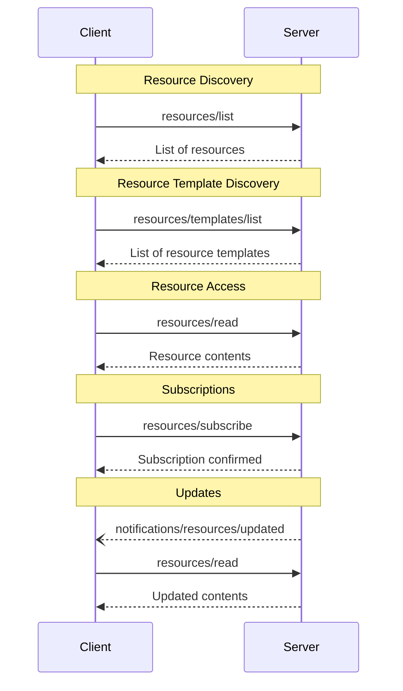

<div id="enable-section-numbers" />

Model Context Protocol (MCP) 提供了一种标准化的方式，让服务器向客户端暴露资源。资源允许服务器共享为语言模型提供上下文的数据，例如文件、数据库模式或应用程序特定信息。每个资源通过 [URI](https://datatracker.ietf.org/doc/html/rfc3986) 唯一标识。

## 用户交互模型

MCP 中的资源被设计为**应用程序驱动**的，由主机应用程序决定如何根据其需求合并上下文。

例如，应用程序可以：

- 通过 UI 元素以树形或列表视图暴露资源以供明确选择
- 允许用户搜索和过滤可用资源
- 基于启发式规则或 AI 模型的选择实现自动上下文包含


然而，实现可以自由地通过任何适合其需求的界面模式来暴露资源——协议本身并不强制规定任何特定的用户交互模型。

## 能力

支持资源的服务器 **MUST** 声明 `resources` 能力：

```json
{
  "capabilities": {
    "resources": {
      "subscribe": true,
      "listChanged": true
    }
  }
}
```

该能力支持两个可选特性：

- `subscribe`：客户端是否可以订阅以接收单个资源变更的通知。
- `listChanged`：服务器是否会在可用资源列表变化时发出通知。

`subscribe` 和 `listChanged` 都是可选的——服务器可以不支持、支持其中之一或两者都支持：

```json
{
  "capabilities": {
    "resources": {} // 两个特性都不支持
  }
}
```

```json
{
  "capabilities": {
    "resources": {
      "subscribe": true // 仅支持订阅
    }
  }
}
```

```json
{
  "capabilities": {
    "resources": {
      "listChanged": true // 仅支持列表变更通知
    }
  }
}
```

## 协议消息

### 列出资源

要发现可用资源，客户端发送 `resources/list` 请求。此操作支持[分页](/specification/2025-11-25/server/utilities/pagination)。

**请求：**

```json
{
  "jsonrpc": "2.0",
  "id": 1,
  "method": "resources/list",
  "params": {
    "cursor": "optional-cursor-value"
  }
}
```

**响应：**

```json
{
  "jsonrpc": "2.0",
  "id": 1,
  "result": {
    "resources": [
      {
        "uri": "file:///project/src/main.rs",
        "name": "main.rs",
        "title": "Rust 软件应用程序主文件",
        "description": "主要应用程序入口点",
        "mimeType": "text/x-rust",
        "icons": [
          {
            "src": "https://example.com/rust-file-icon.png",
            "mimeType": "image/png",
            "sizes": ["48x48"]
          }
        ]
      }
    ],
    "nextCursor": "next-page-cursor"
  }
}
```

### 读取资源

要检索资源内容，客户端发送 `resources/read` 请求：

**请求：**

```json
{
  "jsonrpc": "2.0",
  "id": 2,
  "method": "resources/read",
  "params": {
    "uri": "file:///project/src/main.rs"
  }
}
```

**响应：**

```json
{
  "jsonrpc": "2.0",
  "id": 2,
  "result": {
    "contents": [
      {
        "uri": "file:///project/src/main.rs",
        "mimeType": "text/x-rust",
        "text": "fn main() {\n    println!(\"Hello world!\");\n}"
      }
    ]
  }
}
```

### 资源模板

资源模板允许服务器使用 [URI 模板](https://datatracker.ietf.org/doc/html/rfc6570) 暴露参数化的资源。参数可以通过[补全 API](/specification/2025-11-25/server/utilities/completion) 自动补全。

**请求：**

```json
{
  "jsonrpc": "2.0",
  "id": 3,
  "method": "resources/templates/list"
}
```

**响应：**

```json
{
  "jsonrpc": "2.0",
  "id": 3,
  "result": {
    "resourceTemplates": [
      {
        "uriTemplate": "file:///{path}",
        "name": "项目文件",
        "title": "📁 项目文件",
        "description": "访问项目目录中的文件",
        "mimeType": "application/octet-stream",
        "icons": [
          {
            "src": "https://example.com/folder-icon.png",
            "mimeType": "image/png",
            "sizes": ["48x48"]
          }
        ]
      }
    ]
  }
}
```

### List Changed Notification

When the list of available resources changes, servers that declared the `listChanged`
capability **SHOULD** send a notification:

```json
{
  "jsonrpc": "2.0",
  "method": "notifications/resources/list_changed"
}
```

### Subscriptions

The protocol supports optional subscriptions to resource changes. Clients can subscribe
to specific resources and receive notifications when they change:

**Subscribe Request:**

```json
{
  "jsonrpc": "2.0",
  "id": 4,
  "method": "resources/subscribe",
  "params": {
    "uri": "file:///project/src/main.rs"
  }
}
```

**Update Notification:**

```json
{
  "jsonrpc": "2.0",
  "method": "notifications/resources/updated",
  "params": {
    "uri": "file:///project/src/main.rs"
  }
}
```

## Message Flow



## Data Types

### Resource

A resource definition includes:

- `uri`: Unique identifier for the resource
- `name`: The name of the resource.
- `title`: Optional human-readable name of the resource for display purposes.
- `description`: Optional description
- `icons`: Optional array of icons for display in user interfaces
- `mimeType`: Optional MIME type
- `size`: Optional size in bytes

### Resource Contents

Resources can contain either text or binary data:

#### Text Content

```json
{
  "uri": "file:///example.txt",
  "mimeType": "text/plain",
  "text": "Resource content"
}
```

#### Binary Content

```json
{
  "uri": "file:///example.png",
  "mimeType": "image/png",
  "blob": "base64-encoded-data"
}
```

### Annotations

Resources, resource templates and content blocks support optional annotations that provide hints to clients about how to use or display the resource:

- **`audience`**: An array indicating the intended audience(s) for this resource. Valid values are `"user"` and `"assistant"`. For example, `["user", "assistant"]` indicates content useful for both.
- **`priority`**: A number from 0.0 to 1.0 indicating the importance of this resource. A value of 1 means "most important" (effectively required), while 0 means "least important" (entirely optional).
- **`lastModified`**: An ISO 8601 formatted timestamp indicating when the resource was last modified (e.g., `"2025-01-12T15:00:58Z"`).

Example resource with annotations:

```json
{
  "uri": "file:///project/README.md",
  "name": "README.md",
  "title": "Project Documentation",
  "mimeType": "text/markdown",
  "annotations": {
    "audience": ["user"],
    "priority": 0.8,
    "lastModified": "2025-01-12T15:00:58Z"
  }
}
```

Clients can use these annotations to:

- Filter resources based on their intended audience
- Prioritize which resources to include in context
- Display modification times or sort by recency

## Common URI Schemes

The protocol defines several standard URI schemes. This list not
exhaustive&mdash;implementations are always free to use additional, custom URI schemes.

### https://

Used to represent a resource available on the web.

Servers **SHOULD** use this scheme only when the client is able to fetch and load the
resource directly from the web on its own—that is, it doesn’t need to read the resource
via the MCP server.

For other use cases, servers **SHOULD** prefer to use another URI scheme, or define a
custom one, even if the server will itself be downloading resource contents over the
internet.

### file://

Used to identify resources that behave like a filesystem. However, the resources do not
need to map to an actual physical filesystem.

MCP servers **MAY** identify file:// resources with an
[XDG MIME type](https://specifications.freedesktop.org/shared-mime-info-spec/0.14/ar01s02.html#id-1.3.14),
like `inode/directory`, to represent non-regular files (such as directories) that don’t
otherwise have a standard MIME type.

### git://

Git version control integration.

### Custom URI Schemes

Custom URI schemes **MUST** be in accordance with [RFC3986](https://datatracker.ietf.org/doc/html/rfc3986),
taking the above guidance in to account.

## Error Handling

Servers **SHOULD** return standard JSON-RPC errors for common failure cases:

- Resource not found: `-32002`
- Internal errors: `-32603`

Example error:

```json
{
  "jsonrpc": "2.0",
  "id": 5,
  "error": {
    "code": -32002,
    "message": "Resource not found",
    "data": {
      "uri": "file:///nonexistent.txt"
    }
  }
}
```

## Security Considerations

1. Servers **MUST** validate all resource URIs
2. Access controls **SHOULD** be implemented for sensitive resources
3. Binary data **MUST** be properly encoded
4. Resource permissions **SHOULD** be checked before operations
