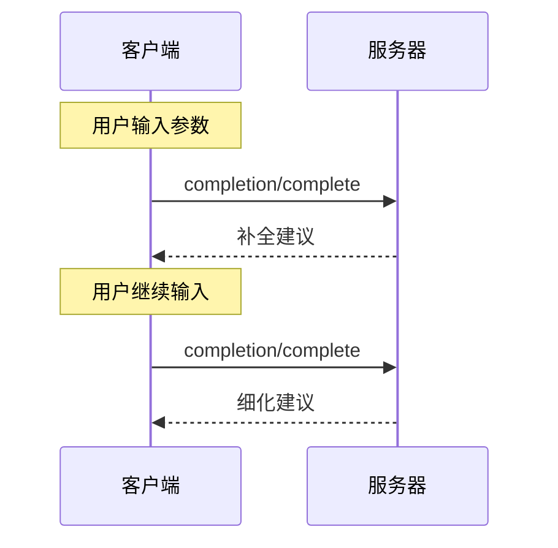

<div id="enable-section-numbers" />

Model Context Protocol (MCP) 提供了一种标准化的方式，让服务器为提示和资源模板的参数提供自动补全建议。当用户为特定提示（通过名称标识）或资源模板（通过 URI 标识）填写参数值时，服务器可以提供上下文相关的建议。

## 用户交互模型

MCP 中的补全功能旨在支持类似于 IDE 代码补全的交互式用户体验。

例如，应用程序可以在用户输入时在下拉或弹出菜单中显示补全建议，并提供过滤和从可用选项中选择的功能。

然而，实现可以自由地通过任何适合其需求的界面模式来暴露补全功能——协议本身并不强制规定任何特定的用户交互模型。

## 能力

支持补全的服务器 **MUST** 声明 `completions` 能力：

```json
{
  "capabilities": {
    "completions": {}
  }
}
```

## 协议消息

### 请求补全

要获取补全建议，客户端发送 `completion/complete` 请求，通过引用类型指定要补全的内容：

**请求：**

```json
{
  "jsonrpc": "2.0",
  "id": 1,
  "method": "completion/complete",
  "params": {
    "ref": {
      "type": "ref/prompt",
      "name": "code_review"
    },
    "argument": {
      "name": "language",
      "value": "py"
    }
  }
}
```

**响应：**

```json
{
  "jsonrpc": "2.0",
  "id": 1,
  "result": {
    "completion": {
      "values": ["python", "pytorch", "pyside"],
      "total": 10,
      "hasMore": true
    }
  }
}
```

对于具有多个参数的提示或 URI 模板，客户端应在 `context.arguments` 对象中包含先前的补全结果，以便为后续请求提供上下文。

**请求：**

```json
{
  "jsonrpc": "2.0",
  "id": 1,
  "method": "completion/complete",
  "params": {
    "ref": {
      "type": "ref/prompt",
      "name": "code_review"
    },
    "argument": {
      "name": "framework",
      "value": "fla"
    },
    "context": {
      "arguments": {
        "language": "python"
      }
    }
  }
}
```

**响应：**

```json
{
  "jsonrpc": "2.0",
  "id": 1,
  "result": {
    "completion": {
      "values": ["flask"],
      "total": 1,
      "hasMore": false
    }
  }
}
```

### 引用类型

该协议支持两种补全引用类型：

| 类型           | 描述             | 示例                                                |
| -------------- | ---------------- | --------------------------------------------------- |
| `ref/prompt`   | 通过名称引用提示 | `{"type": "ref/prompt", "name": "code_review"}`     |
| `ref/resource` | 引用资源 URI     | `{"type": "ref/resource", "uri": "file:///{path}"}` |

### 补全结果

服务器返回按相关性排序的补全值数组，包含：

- 每个响应最多 100 项
- 可选的可用匹配总数
- 指示是否存在额外结果的布尔值

## 消息流



## 数据类型

### CompleteRequest

- `ref`：`PromptReference` 或 `ResourceReference`
- `argument`：包含以下内容的对象：
  - `name`：参数名称
  - `value`：当前值
- `context`：包含以下内容的对象：
  - `arguments`：已解析的参数名称到其值的映射。

### CompleteResult

- `completion`：包含以下内容的对象：
  - `values`：建议数组（最多 100 个）
  - `total`：可选的匹配总数
  - `hasMore`：额外结果标志

## 错误处理

服务器 **SHOULD** 对常见失败情况返回标准的 JSON-RPC 错误：

- Method not found：`-32601`（能力不受支持）
- 无效的提示名称：`-32602`（Invalid params）
- 缺少必需参数：`-32602`（Invalid params）
- 内部错误：`-32603`（Internal error）

## 实现考量

1. 服务器 **SHOULD**：
   - 按相关性排序返回建议
   - 在适当的情况下实现模糊匹配
   - 对补全请求进行速率限制
   - 验证所有输入

2. 客户端 **SHOULD**：
   - 对快速的补全请求进行防抖处理
   - 在适当的情况下缓存补全结果
   - 优雅地处理缺失或部分结果

## 安全

实现 **MUST**：

- 验证所有补全输入
- 实施适当的速率限制
- Control access to sensitive suggestions
- Prevent completion-based information disclosure
