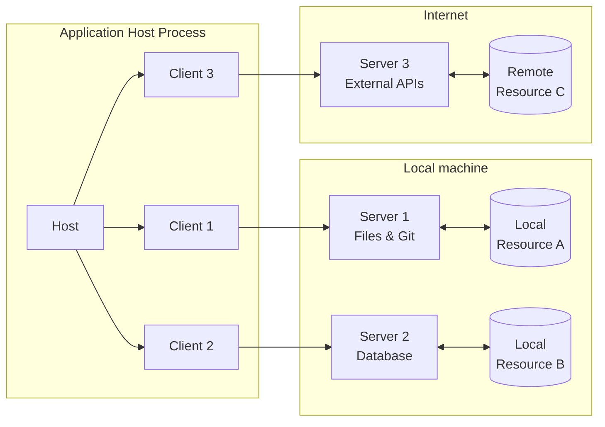
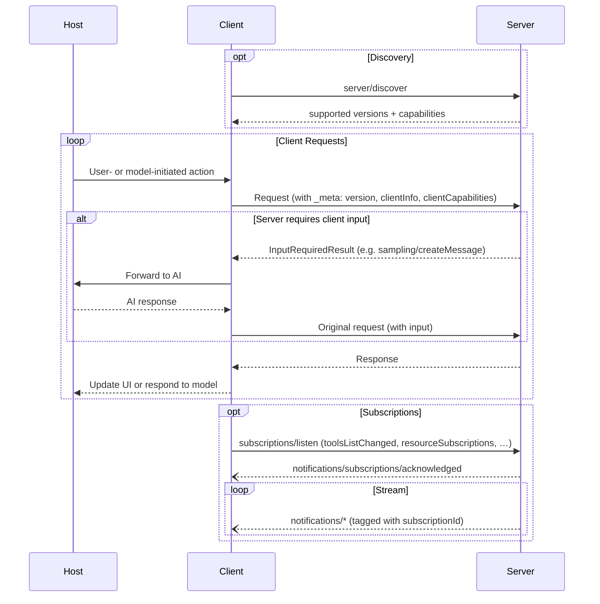

Model Context Protocol (MCP) 采用客户端-主机-服务器架构，其中每个
主机可以运行多个客户端实例。MCP 是一个无状态协议：每个请求都是
自包含的，并携带自己的协议版本、客户端标识和能力。
这种架构使用户能够在跨应用程序集成 AI 能力的同时，
保持清晰的安全边界和关注点隔离。MCP 构建在 JSON-RPC 之上，
提供了一个专注于客户端和服务器之间上下文交换和采样协调的协议。

## 核心组件

### 主机

主机进程充当容器和协调器：

- 创建和管理多个客户端实例
- 控制客户端连接权限和生命周期
- 强制执行安全策略和同意要求
- 处理用户授权决策
- 协调 AI/LLM 集成和采样
- 管理跨客户端的上下文聚合

### 客户端

每个客户端由主机创建，并与恰好一个服务器通信：

- 与恰好一个服务器通信
- 为每个请求附加协议版本和能力
- 双向路由协议消息
- 管理订阅和通知
- 维护服务器之间的安全边界

主机应用程序创建和管理多个客户端，每个客户端与特定服务器
具有 1:1 的关系。

### 服务器

服务器提供专门的上下文和能力：

- 通过 MCP 原语暴露资源、工具和提示
- 独立运行，职责聚焦
- 通过响应中的 `InputRequiredResult` 请求客户端输入（采样、引导、roots）
- 必须遵守安全约束
- 可以是本地进程或远程服务

## 设计原则

MCP 建立在几个关键设计原则之上，这些原则指导其架构和
实现：

1. **服务器应该极易构建**
   - 主机应用程序处理复杂的编排职责
   - 服务器专注于特定、定义明确的能力
   - 简单接口最小化实现开销
   - 清晰分离实现可维护的代码

2. **服务器应该高度可组合**
   - 每个服务器独立提供聚焦的功能
   - 多个服务器可以无缝组合
   - 共享协议实现互操作性
   - 模块化设计支持可扩展性

3. **服务器不应能读取整个对话，也不应能"窥视"其他
   服务器**
   - 服务器只接收必要的上下文信息
   - 完整的对话历史保存在主机中
   - 每个服务器保持隔离
   - 跨服务器交互由主机控制
   - 主机进程强制执行安全边界

4. **可以逐步向服务器和客户端添加特性**
   - 核心协议提供最小必要功能
   - 可以根据需要协商额外能力
   - 服务器和客户端独立演进
   - 协议设计为未来可扩展
   - 保持向后兼容性

## 能力协商

Model Context Protocol 使用基于能力的协商系统，客户端和
服务器在每个请求上声明其支持的特性。客户端在每个请求的
`_meta.io.modelcontextprotocol/clientCapabilities` 中包含其能力。
服务器通过响应
[`server/discover`](/specification/draft/server/discover) 来通告其能力，客户端可以在
任何其他请求之前调用它以进行预先能力发现。

- 服务器声明工具支持、资源订阅和提示模板等能力
- 客户端声明采样支持和引导处理等能力
- 双方必须在整个交互过程中尊重已声明的能力
- 可以通过协议的扩展协商额外能力

每个能力在按请求的基础上解锁特定的协议特性。例如：

- 已实现的[服务器特性](/specification/draft/server)必须在服务器的能力中通告
- 接收资源更新通知需要打开一个
  [`subscriptions/listen`](/specification/draft/basic/patterns/subscriptions) 流
  并包含所需的资源 URI
- [工具](/specification/draft/server/tools)调用要求服务器声明工具能力

这种能力协商确保客户端和服务器对支持的功能有清晰的理解，
同时保持协议的可扩展性。
