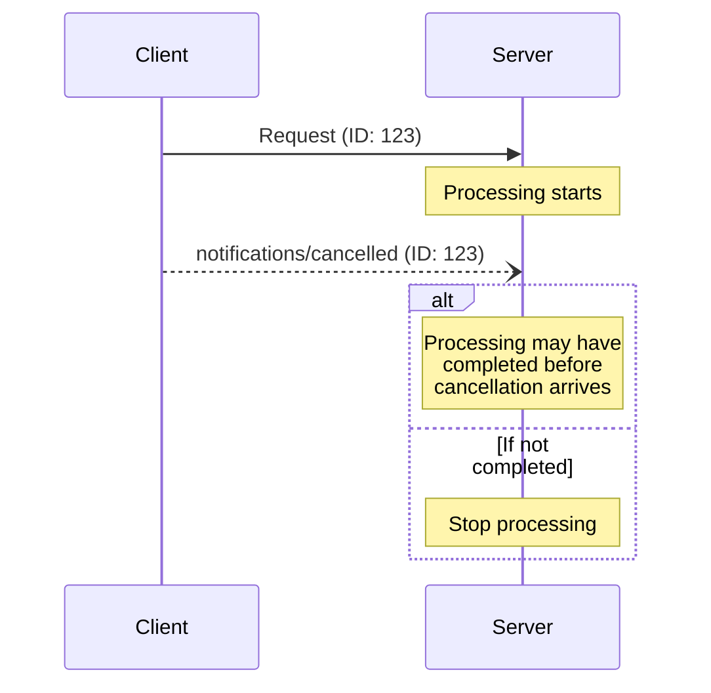

<div id="enable-section-numbers" />

Model Context Protocol (MCP) 支持通过通知消息可选地取消正在进行的请求。
任何一方都可以发送取消通知，以指示先前发出的请求应被终止。

## 取消流程

当一方想要取消正在进行的请求时，它发送 `notifications/cancelled`
通知，包含：

- 要取消的请求的 ID
- 可选的原因字符串，可以记录或显示

```json
{
  "jsonrpc": "2.0",
  "method": "notifications/cancelled",
  "params": {
    "requestId": "123",
    "reason": "User requested cancellation"
  }
}
```

## 传输特定的取消

客户端如何发出取消信号取决于传输方式：

- **Streamable HTTP**：关闭 SSE 响应流就是取消信号。
  服务器 **MUST** 将客户端断开视为对该请求的取消。不
  需要或期望 `notifications/cancelled` 消息。
- **stdio**：没有按请求的流可以关闭。客户端 **MUST** 发送一个引用请求 ID 的 `notifications/cancelled` 通知。

## 行为要求

1. 取消通知 **MUST** 仅引用满足以下条件的请求：
   - 先前已按同一方向发出
   - 被认为仍在进行中
2. 取消通知的接收者 **SHOULD**：
   - 停止处理已取消的请求
   - 释放相关资源
   - 不为已取消的请求发送响应
3. 接收者 **MAY** 忽略取消通知，如果：
   - 引用的请求是未知的
   - 处理已经完成
   - 请求无法被取消
4. 取消通知的发送者 **SHOULD** 忽略之后到达的任何对该请求的响应

## 时序考虑

由于网络延迟，取消通知可能在请求处理完成后到达，
甚至可能在响应已经发送之后到达。

双方 **MUST** 优雅地处理这些竞态条件：



## 实现说明

- 双方 **SHOULD** 记录取消原因以便调试
- 应用程序 UI **SHOULD** 指示何时请求取消

## 错误处理

无效的取消通知 **SHOULD** 被忽略：

- 未知的请求 ID
- 已经完成的请求
- 格式错误的通知

这保持了通知的"即发即弃"特性，同时允许异步通信中的竞态条件。
