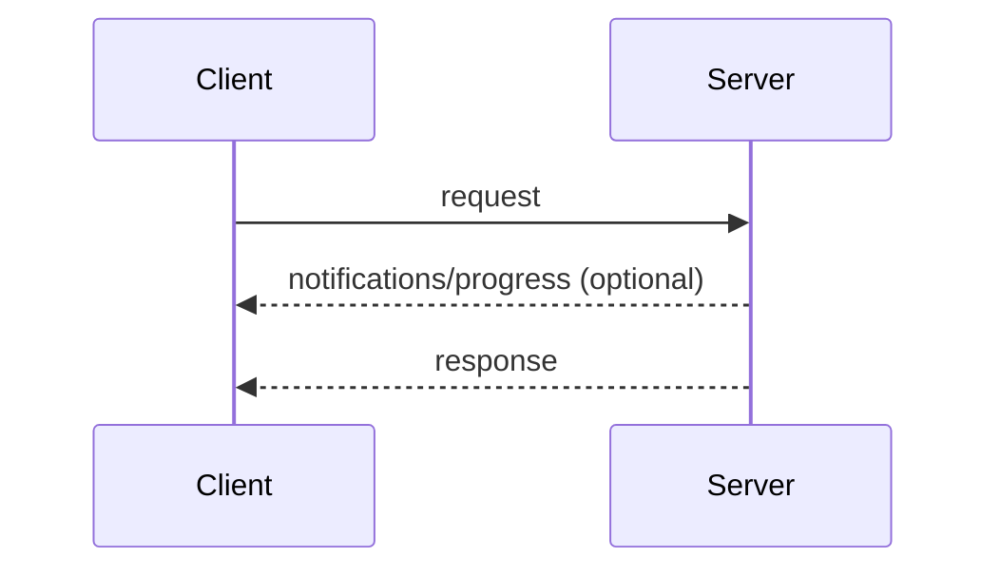
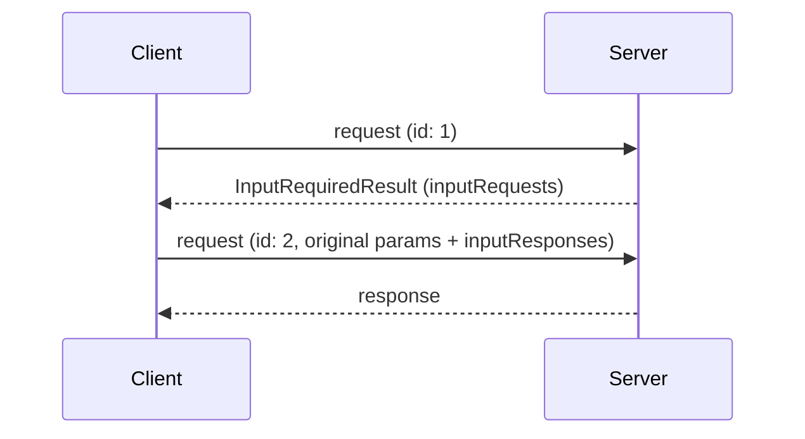
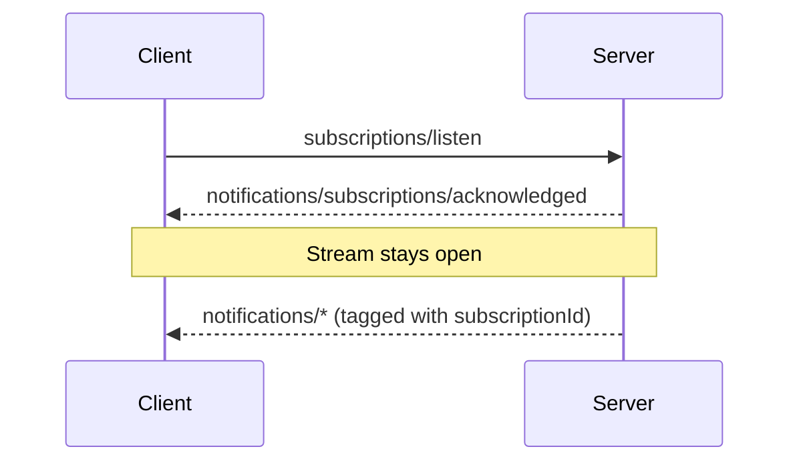

本页定义了核心协议的消息模式：客户端和服务器将 JSON-RPC
[请求、响应和通知](/specification/draft/basic/index#messages)
组合成交互的方式。每个
[传输](/specification/draft/basic/transports)都支持所有这些模式；
传输仅在消息的帧封装和传递方式上有所不同。

每次交互都从客户端开始：

- **客户端**发送 JSON-RPC _请求_ 和 _通知_。
- **服务器**以 JSON-RPC _响应_（结果或错误）回应每个请求，
  可选地在其前面加上限定于该请求的 _通知_。

服务器 **MUST NOT** 发起 JSON-RPC 请求，客户端也不发送
JSON-RPC 响应。

## 请求和响应

客户端发送请求；服务器用结果或错误进行回应。
当请求正在进行时，服务器 **MAY** 发送限定于该请求的通知，
如
[`notifications/progress`](/specification/draft/basic/patterns/progress)
和 [`notifications/message`](/specification/draft/server/utilities/logging)。

## 多轮请求

当服务器需要客户端输入（采样、引导或 roots）来完成请求时，
它以 [`InputRequiredResult`](/specification/draft/basic/patterns/mrtr#inputrequiredresult)
回应，客户端使用匹配的 `inputResponses` 重试请求。
请参见[多轮请求](/specification/draft/basic/patterns/mrtr)。

## 订阅和通知

为接收变更通知（列表变更、资源更新），客户端发送
[`subscriptions/listen`](/specification/draft/basic/patterns/subscriptions)
请求；回复是一个长期存在的请求通知类型流。
流状态限定在请求内：如果底层通道丢失，客户端重新发出请求。

## 添加模式

所有核心协议特性都构建在这些模式之上。添加模式的协议修订版在本页上定义它。传输无需更改即可承载新模式，因为模式完全以请求、响应和通知来表达。
