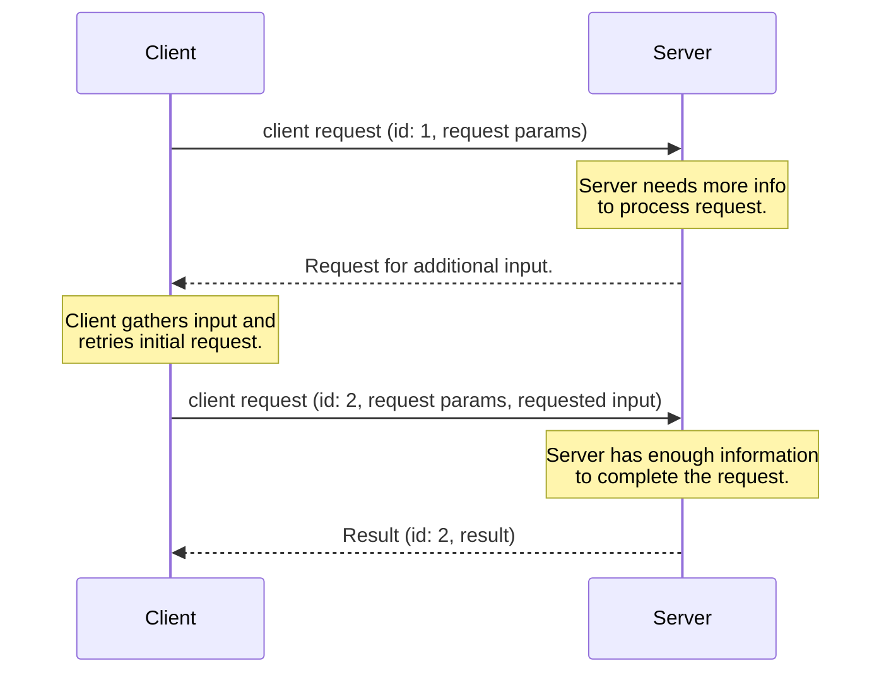
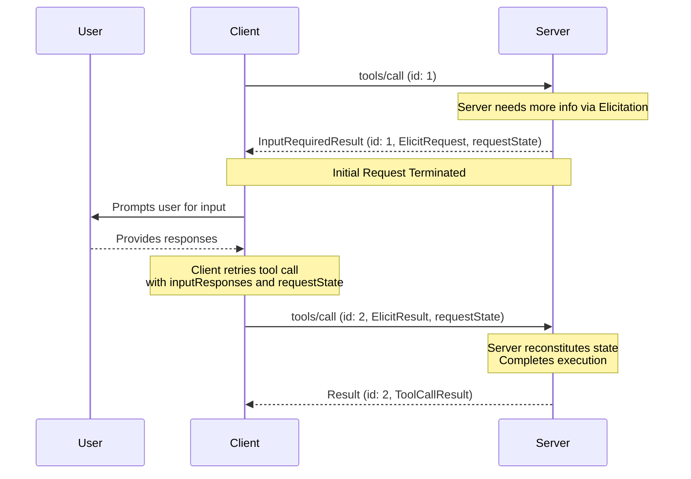

<div id="enable-section-numbers" />

<Note>
  多轮请求（MRTR）是在此版本的 MCP 规范中引入的。
  这取代了之前发送服务器发起请求的方式。 服务器 **MUST** 使用 MRTR
  模式发送服务器到客户端的请求 （如 `roots/list`、`sampling/createMessage` 或
  `elicitation/create`）。
  之前的服务器发起请求模式不再受支持。这是一项破坏性变更。
</Note>

## 多轮请求

Model Context Protocol (MCP) 定义了多种方式，让服务器在处理客户端请求期间
向用户请求额外信息（如 `roots/list`、`sampling/createMessage` 或 `elicitation/create`）。
**多轮请求**模式提供了一种标准化的方式来处理这些服务器请求，
无需跨服务器实例的共享存储层或状态ful 负载均衡。

高层流程如下：

1. 客户端向服务器发送初始请求，包含执行操作所需的参数。
2. 服务器确定需要额外信息才能完成请求，并响应请求更多信息。
3. 客户端从用户或其他来源收集请求的信息，然后重试原始请求，包含所请求的额外信息。
4. 服务器确定有足够信息完成操作，并以最终结果响应。



### 核心类型

MCP 使用以下类型实现此流程。

#### InputRequests

[`InputRequests`](/specification/draft/schema#inputrequests) 对象是服务器-客户端请求的映射。
键是服务器分配的字符串标识符；
值是请求对象（例如 [`ElicitRequest`](/specification/draft/schema#elicitrequest)、[`CreateMessageRequest`](/specification/draft/schema#createmessagerequest) 或 [`ListRootsRequest`](/specification/draft/schema#listrootsrequest)）。

```json
{
  "github_login": {
    "method": "elicitation/create",
    "params": {
      "mode": "form",
      "message": "Please provide your GitHub username",
      "requestedSchema": {
        "type": "object",
        "properties": {
          "name": { "type": "string" }
        },
        "required": ["name"]
      }
    }
  },
  "capital_of_france": {
    "method": "sampling/createMessage",
    "params": {
      "messages": [
        {
          "role": "user",
          "content": {
            "type": "text",
            "text": "What is the capital of France?"
          }
        }
      ],
      "systemPrompt": "You are a helpful assistant.",
      "maxTokens": 100
    }
  }
}
```

#### InputResponses

[`InputResponses`](/specification/draft/schema#inputresponses) 对象是客户端对服务器请求的响应的映射。
键对应于 `InputRequests` 映射中的键；值是每个请求的客户端结果（例如 [`ElicitResult`](/specification/draft/schema#elicitresult)、[`CreateMessageResult`](/specification/draft/schema#createmessageresult) 或 [`ListRootsResult`](/specification/draft/schema#listrootsresult)）。

```json
{
  "github_login": {
    "action": "accept",
    "content": {
      "name": "octocat"
    }
  },
  "capital_of_france": {
    "role": "assistant",
    "content": {
      "type": "text",
      "text": "The capital of France is Paris."
    },
    "model": "claude-3-sonnet-20240307",
    "stopReason": "endTurn"
  }
}
```

#### InputRequiredResult

[`InputRequiredResult`](/specification/draft/schema#inputrequiredresult) 是一种 [`Result`](/specification/draft/basic#responses) 类型，
表示在请求完成前需要额外的输入。

- `inputRequests` _(可选)_：客户端必须满足的服务器发起请求的 [`InputRequests`](/specification/draft/schema#inputrequests) 映射。
- `requestState` _(可选)_：仅对服务器有意义的不透明字符串。客户端 **MUST NOT** 检查、解析、修改或对其内容做任何假设。

```json
{
  "jsonrpc": "2.0",
  "id": 1,
  "result": {
    "resultType": "input_required",
    "inputRequests": {
      // Elicitation request.
      "github_login": {
        "method": "elicitation/create",
        "params": {
          "mode": "form",
          "message": "Please provide your GitHub username",
          "requestedSchema": {
            "type": "object",
            "properties": {
              "name": { "type": "string" }
            },
            "required": ["name"]
          }
        }
      },
      // Sampling request.
      "capital_of_france": {
        "method": "sampling/createMessage",
        "params": {
          "messages": [
            {
              "role": "user",
              "content": {
                "type": "text",
                "text": "What is the capital of France?"
              }
            }
          ],
          "modelPreferences": {
            "hints": [{ "name": "claude-3-sonnet" }],
            "intelligencePriority": 0.8,
            "speedPriority": 0.5
          },
          "systemPrompt": "You are a helpful assistant.",
          "maxTokens": 100
        }
      }
    },
    "requestState": "AEAD-protected blob"
  }
}
```

### 支持的请求

服务器 **MAY** 在以下客户端请求上发送 `InputRequiredResult` 响应：

| 客户端请求                                                                  | 支持 InputRequiredResult |
| --------------------------------------------------------------------------- | ------------------------ |
| [`prompts/get`](/specification/draft/server/prompts#getting-a-prompt)       | 是                       |
| [`resources/read`](/specification/draft/server/resources#reading-resources) | 是                       |
| [`tools/call`](/specification/draft/server/tools#calling-tools)             | 是                       |

服务器 **MUST NOT** 在任何其他客户端请求上发送 `InputRequiredResult` 响应。

### 基本工作流

基本工作流描述了服务器如何在客户端-服务器请求中向客户端请求额外输入。
在此示例中，我们使用 `tools/call` 作为客户端请求，但相同的模式适用于上述任何支持的请求。

值得注意的是，它允许服务器在不维护任何服务器端状态的情况下请求额外信息。
服务器将任何需要的上下文编码到 `requestState` 字段中，客户端在重试时将其原样返回。



Note that the requests in each step are completely independent: the server processing the retry does not need any information beyond
what is directly present in the retry request.

#### Server Requirements (Basic Workflow)

1. Servers **MAY** respond to any [supported client request](#supported-requests) with an `InputRequiredResult`.
1. The `InputRequiredResult` **MAY** include an `inputRequests` field.
   - `inputRequests` keys are server assigned identifiers and **MUST** be unique within the scope of the request.
   - `inputRequests` values are request objects that **MUST** be one of [`ElicitRequest`](/specification/draft/schema#elicitrequest), [`CreateMessageRequest`](/specification/draft/schema#createmessagerequest), or [`ListRootsRequest`](/specification/draft/schema#listrootsrequest)

1. The `InputRequiredResult` **MAY** include a `requestState` field. If specified, this field is an opaque string meaningful only to the server. Servers are free to encode the state in any format (e.g. base64-encoded JSON, encrypted JWT, serialized binary).
1. If a client request contains a `requestState` field, servers **MUST** treat `requestState` as an attacker-controlled input. If `requestState` influences authorization, resource access, or business logic, servers **MUST** protect its integrity (e.g. HMAC or AEAD)
   and **MUST** reject state that fails verification. Integrity protection **MAY** be omitted only when tampering can cause nothing worse than request failure.
1. To prevent replay, servers **SHOULD** include the following inside the integrity-protected `requestState` payload and verify each on receipt:
   - the authenticated principal, rejecting state presented by a different principal.
   - a short expiry (TTL), rejecting state presented after it lapses;
   - an identifier for the originating request, e.g. the method name and a digest of its salient parameters, rejecting state presented on a request that does not match.
     <Warning>
       Note that these measures bound the replay window and prevent cross-user
       and cross-request reuse, but do not by themselves guarantee single-use.
       Servers for which a given `requestState` must be consumed at most once
       (e.g., one-time redemptions) **MUST** enforce that invariant server-side.
     </Warning>

1. Servers **MUST** include at least one of `inputRequests` or `requestState` in every `InputRequiredResult` response.
1. Servers **MUST NOT** send an `inputRequests` that the client has not declared support for in its capabilities. For example, if a client does not declare support for `elicitation`, the server **MUST NOT** include any `elicitation/create` requests in the `inputRequests` field.
1. Servers **MUST NOT** assume that clients will fulfill the `inputRequests` or retry the original request. Servers **MAY** choose to return an `InputRequiredResult` on multiple attempts at the same request if they want to repeatedly prompt the user for information until they have what they need to complete the request.

#### Client Requirements (Basic Workflow)

1. If a client receives an `InputRequiredResult` that contains the `inputRequests` field, the client **MUST** construct the requested
   inputs before retrying the original request. If the `InputRequiredResult` does _not_ contain the `inputRequests` field,
   the client **MAY** retry the original request immediately.
1. If an `InputRequiredResult` contains the `requestState` field, the client **MUST** echo back the exact value of that field when retrying the original request.
   Clients **MUST NOT** inspect, parse, modify, or make any assumptions about the `requestState` contents. If the `InputRequiredResult` does not contain a `requestState` field, the client **MUST NOT** include one in the retry.
1. The JSON-RPC `id` **MUST** be different between the initial request and the retry, as they are independent requests.
1. Both the `inputRequests` and `requestState` fields affect only the client's retry of the original request. They **MUST NOT** be used for any other request that the client may be sending in parallel.

### Error Handling

Servers **SHOULD** validate that the data provided by the client is a valid `InputResponses` object and that the information inside can be correctly parsed.
Protocol errors (malformed JSON, invalid schema, internal server errors) **SHOULD** return a JSON-RPC error response with an appropriate error code and message.

If additional, unexpected parameters are provided in the `InputResponses` object, the server **SHOULD** ignore any information it does not recognize or need.

If the client fails to send all the information requested in a previous `InputRequests`, and the missing information is necessary for the server to process the request,
the server **SHOULD** respond with a new `InputRequiredResult` requesting the missing information again, rather than returning an error.

### Security Considerations

Because `requestState` passes through the client, malicious or compromised clients could attempt to modify it to alter server behavior,
bypass authorization checks, or corrupt server logic. Servers **MUST** validate request state as described in the [server requirements](#server-requirements-basic-workflow) above.
