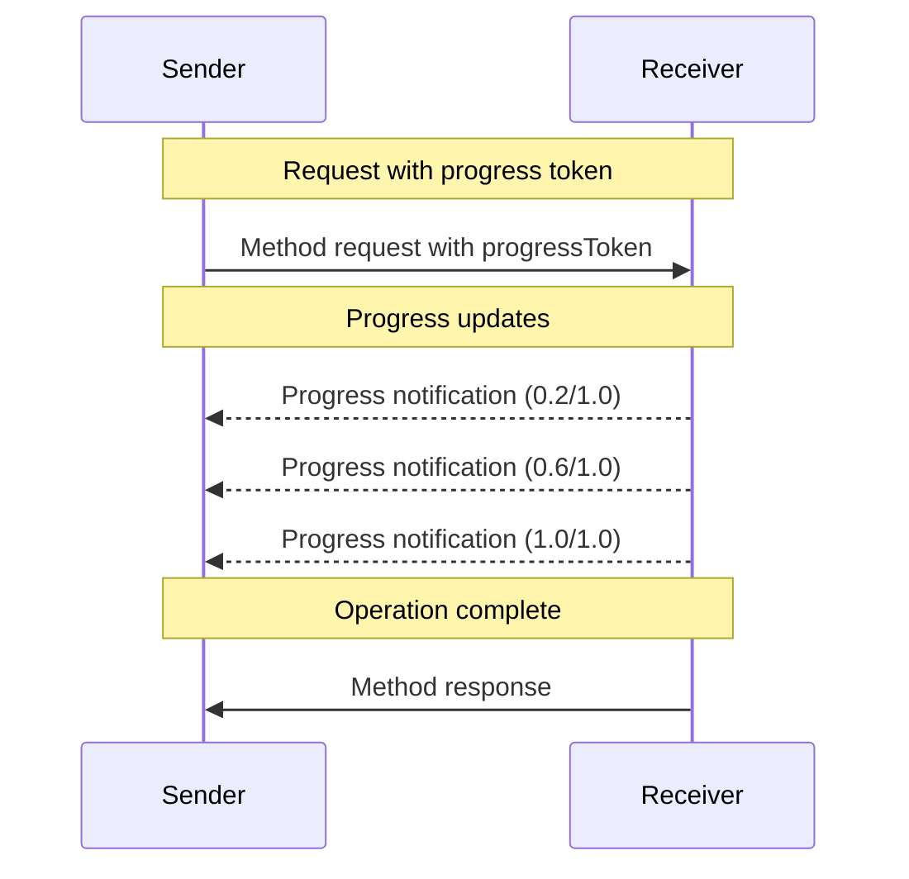

<div id="enable-section-numbers" />

Model Context Protocol (MCP) 支持通过通知消息对长时间运行的操作进行可选的进度跟踪。
任何一方都可以发送进度通知以提供操作状态的更新。

## 进度流程

当一方希望*接收*请求的进度更新时，它在请求元数据中包含一个
`progressToken`。

- 进度令牌 **MUST** 是字符串或整数值
- 进度令牌可以由发送者使用任何方式选择，但 **MUST** 在所有活跃请求中保持唯一。

```json
{
  "jsonrpc": "2.0",
  "id": 1,
  "method": "some_method",
  "params": {
    "_meta": {
      "progressToken": "abc123"
    }
  }
}
```

The receiver **MAY** then send progress notifications containing:

- The original progress token
- The current progress value so far
- An optional "total" value
- An optional "message" value

```json
{
  "jsonrpc": "2.0",
  "method": "notifications/progress",
  "params": {
    "progressToken": "abc123",
    "progress": 50,
    "total": 100,
    "message": "Reticulating splines..."
  }
}
```

- The `progress` value **MUST** increase with each notification, even if the total is
  unknown.
- The `progress` and the `total` values **MAY** be floating point.
- The `message` field **SHOULD** provide relevant human readable progress information.

## 行为要求

1. 进度通知 **MUST** 仅引用满足以下条件的令牌：
   - 在活跃请求中提供
   - 与正在进行的操作关联

2. 进度请求的接收者 **MAY**：
   - 选择不发送任何进度通知
   - 以他们认为适当的任何频率发送通知
   - 如果总量未知则省略 total 值



## 实现说明

- 发送者和接收者 **SHOULD** 跟踪活跃的进度令牌
- 双方 **SHOULD** 实现速率限制以防止洪泛
- 进度通知在完成后 **MUST** 停止
