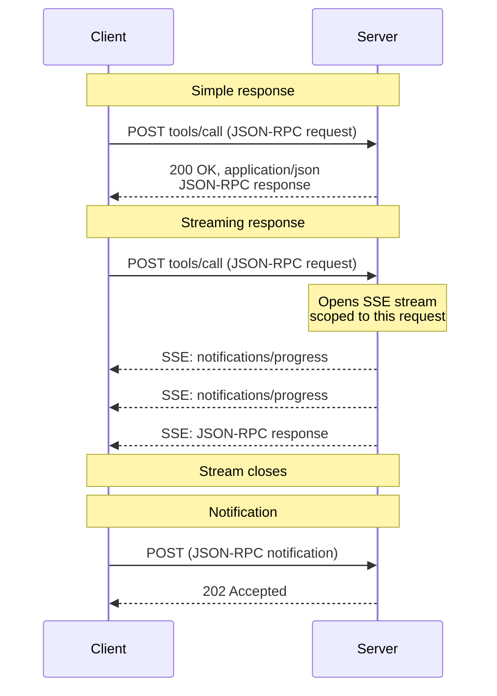
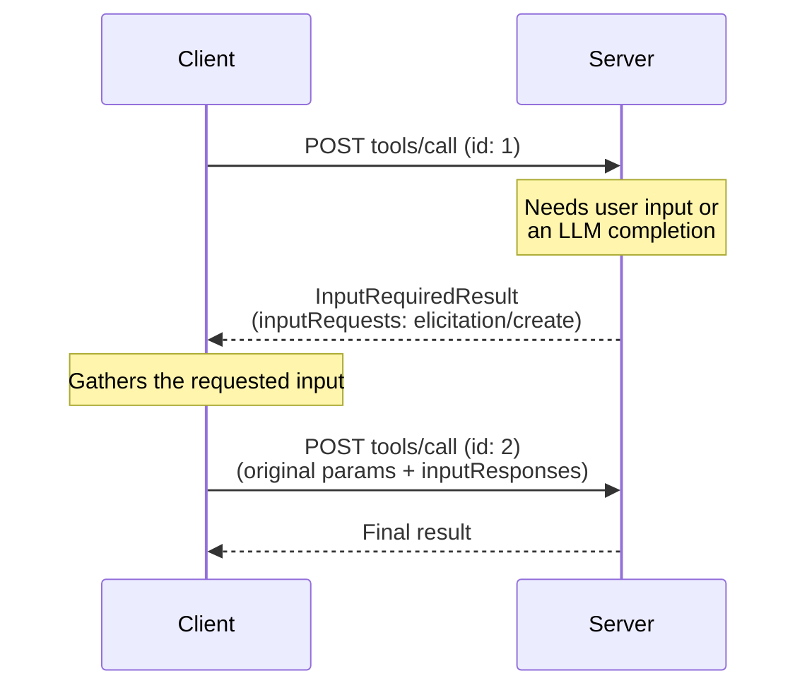
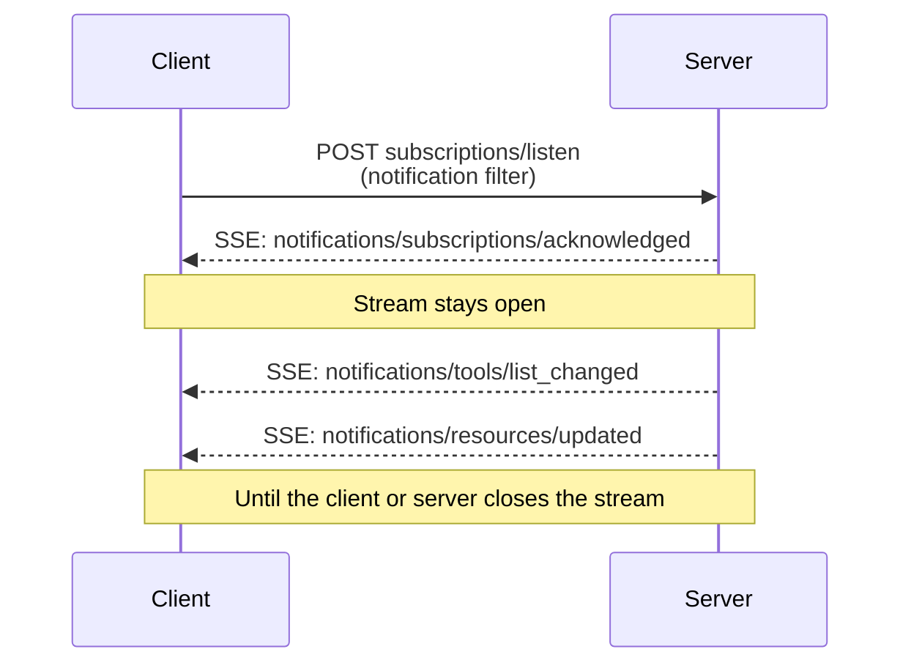

<div id="enable-section-numbers" />

<Info>

Streamable HTTP 是在协议版本 2025-03-26 中引入的，用于替代
协议版本 2024-11-05 中的 [HTTP+SSE 传输][http-sse]。

</Info>

<Info>

修订版 2026-07-28 更改了 Streamable HTTP 的行为。客户端必须确保正确处理向后兼容性。更改包括：

- 移除了 GET 流端点。
- 移除了协议级会话。

请参见下面的[更改日志](/specification/draft/changelog)和[向后兼容性](#backward-compatibility)。

</Info>

在 **Streamable HTTP** 传输中，服务器作为一个独立进程运行，可以处理多个客户端连接。概览：

- 服务器暴露一个接受 POST 的单个 HTTP 端点（**MCP 端点**）。
- 客户端将每个 JSON-RPC 请求或通知作为自己的 HTTP POST 发送。
- 服务器用单个 JSON 对象或限定于该请求的 [Server-Sent Events][sse] (SSE) 流响应每个请求，携带请求相关的通知，然后是最终响应。
- 服务器到客户端的交互（采样、引导、roots）根据[多轮请求 (MRTR)][mrtr] ([SEP-2322][sep-2322]) 作为输入请求嵌入在结果中。
- 长期存在的变更通知（如列表变更和资源更新）在 [`subscriptions/listen`][subscriptions-listen] 请求的响应流上传递。

有关这些交互的序列图，请参见[消息流](#message-flow)。

服务器 **MUST** 提供一个支持 POST 的单个 HTTP 端点路径（以下简称 **MCP 端点**）。例如，这可以是像 `https://example.com/mcp` 这样的 URL。

[http-sse]: /specification/2024-11-05/basic/transports#http-with-sse
[sse]: https://en.wikipedia.org/wiki/Server-sent_events

## 安全与端点

实现 Streamable HTTP 传输时：

1. 服务器 **MUST** 验证所有传入连接的 `Origin` 头部，以防止 DNS 重绑定攻击。
   - 如果 `Origin` 头部存在且无效，服务器 **MUST** 以 HTTP 403 Forbidden 响应。HTTP 响应体 **MAY** 包含一个没有 `id` 的 JSON-RPC _错误响应_。
2. 在本地运行时，服务器 **SHOULD** 仅绑定到 localhost (127.0.0.1)，而不是所有网络接口 (0.0.0.0)。
3. 服务器 **SHOULD** 为所有连接实现适当的身份验证。

没有这些保护措施，攻击者可能使用 DNS 重绑定从远程网站与本地 MCP 服务器交互。

## 发送消息

从客户端发送的每个 JSON-RPC 消息 **MUST** 是对 MCP 端点的新 HTTP POST 请求。

1. 客户端 **MUST** 使用 HTTP POST 发送 JSON-RPC 消息。
2. 客户端 **MUST** 包含一个 `Accept` 头部，列出 `application/json` 和 `text/event-stream` 作为支持的内容类型。
3. 客户端 **MUST** 在每个 POST 请求上包含[请求元数据头部](#request-metadata)。
4. HTTP POST 的消息体 **MUST** 是单个 JSON-RPC _请求_ 或 _通知_。客户端 **MUST NOT** 发送 JSON-RPC _响应_。
5. 如果消息体是 JSON-RPC _通知_：
   - 如果服务器接受它，服务器 **MUST** 返回 HTTP 状态码 `202 Accepted`，无消息体。
   - 如果服务器无法接受它，它 **MUST** 返回 HTTP 错误状态码（例如 `400 Bad Request`）。HTTP 响应体 **MAY** 包含一个没有 `id` 的 JSON-RPC _错误响应_。
6. 如果消息体是 JSON-RPC _请求_，服务器 **MUST** 返回 `Content-Type: application/json`（单个 JSON 对象）或 `Content-Type: text/event-stream`（SSE 响应流）。客户端 **MUST** 同时支持两者。

## 接收消息

当服务器返回 SSE 响应流（`Content-Type: text/event-stream`）时：

- 服务器 **MAY** 在最终响应之前发送 JSON-RPC _通知_ — 例如，[`notifications/progress`][notifications-progress] 或 [`notifications/message`][notifications-message]。这些通知 **MUST** 与原始客户端请求相关。
- 服务器 **MUST NOT** 在此流上发送独立的 JSON-RPC _请求_。服务器到客户端的交互（采样、引导、list-roots）根据 [MRTR][mrtr] ([SEP-2322][sep-2322]) 作为输入请求嵌入在 [`InputRequiredResult`][input-required-result] 内部，不作为单独的请求在此流或任何其他流上传递。这与协议版本 `2025-03-26` 到 `2025-11-25` 中的 Streamable HTTP 有所不同，在这些版本中服务器可以在 SSE 流上发送此类请求。
- 最终的 JSON-RPC _响应_ **SHOULD** 终止流。

长期存在的通知流通过发送 [`subscriptions/listen`][subscriptions-listen] 请求获得。服务器的响应本身是一个保持开放的 SSE 流，传递客户端选择加入的变更通知（如 `notifications/tools/list_changed` 或 `notifications/resources/updated`）。请求作用域的通知如 `notifications/progress` 和 `notifications/message` **不会** 在 listen 流上传递 — 它们仅在与它们相关的请求的响应流上流动。

When initiating an SSE stream, servers **SHOULD** include the
`X-Accel-Buffering: no` header in the HTTP response. This instructs reverse
proxies (such as nginx) to disable response buffering, ensuring that SSE
events are delivered to clients immediately rather than being held in a
buffer. Without this header, proxies may accumulate messages before sending
them to the client, introducing unwanted latency and potentially breaking the
real-time nature of SSE communication.

Resumable SSE streams via `Last-Event-ID` are not supported.

[notifications-progress]: /specification/draft/basic/patterns/progress
[notifications-message]: /specification/draft/server/utilities/logging
[input-required-result]: /specification/draft/schema#inputrequiredresult
[mrtr]: /specification/draft/basic/patterns/mrtr
[sep-2322]: /seps/2322-MRTR
[subscriptions-listen]: /specification/draft/basic/patterns/subscriptions

## Message Flow

The following diagrams illustrate the message flows on a single MCP endpoint.

**Requests and responses.** Each request is its own POST; the server chooses
per request whether to respond with a single JSON object or an SSE stream:



**Server-to-client interactions (MRTR).** When the server needs input from
the client — sampling, elicitation, or roots — it does not send its own
JSON-RPC request. It returns an
[`InputRequiredResult`][input-required-result] containing `inputRequests`,
and the client retries the original request with the matching
`inputResponses` (see [Multi Round-Trip Requests][mrtr]):



**Change notifications.** Clients that want server-initiated change
notifications open a long-lived stream with
[`subscriptions/listen`][subscriptions-listen]; the response stream stays
open and carries only the notification types the client opted in to:



## 取消

关闭 SSE 响应流 **MUST** 被服务器视为取消该请求。由于每个请求都有自己的响应流，传输级别的断开连接是明确的。服务器 **SHOULD** 尽快停止处理已取消的请求，并且 **MUST NOT** 再为其发送任何消息。请参见[取消][cancellation]了解完整规则。

[cancellation]: /specification/draft/basic/patterns/cancellation

## 请求元数据

Streamable HTTP 传输将选定的 JSON-RPC 消息体字段镜像到 HTTP 头部中，以便中间件（负载均衡器、网关、可观测性工具）可以在不解析消息体的情况下路由和检查请求。

### 协议版本头部

对 MCP 端点的每个 POST 请求 **MUST** 包含 `MCP-Protocol-Version` 头部。

例如：`MCP-Protocol-Version: 2026-07-28`

The header value **MUST** match the
`io.modelcontextprotocol/protocolVersion` field carried in the request body's
`_meta`. If the values do not match, the server **MUST** reject the request
with `400 Bad Request` and a `HeaderMismatch` JSON-RPC error
(see [Server Validation](#server-validation)).

If the server does not implement the requested protocol version (whether the
version is unknown to the server, or is a known version the server has chosen
not to support), it **MUST** respond with `400 Bad Request` and an
[`UnsupportedProtocolVersionError`][unsupported-version]
listing its supported versions. See
[Versioning: Protocol Version Negotiation][lifecycle-version]
for the negotiation flow.

If the server does not implement the requested RPC method, it **MUST** respond
with `404 Not Found` and a JSON-RPC error with code `-32601`
(`Method not found`). The JSON-RPC error body distinguishes this case from a
`404` returned by a legacy [HTTP+SSE][http-sse] server that does not host the
modern MCP endpoint (see [Backward Compatibility](#backward-compatibility)).

A server that supports clients implementing protocol versions earlier than
`2025-06-18` (which did not define the `MCP-Protocol-Version` header) **MAY**
treat a request that omits the header as protocol version `2025-03-26`. A
server that does not support such clients **MUST** reject a request without
the header per [Server Validation](#server-validation).

[unsupported-version]: /specification/draft/schema#unsupportedprotocolversionerror
[lifecycle-version]: /specification/draft/basic/versioning#protocol-version-negotiation

### 标准请求头部

| 头部名称     | 源字段                        | 适用范围                                           |
| ------------ | ----------------------------- | -------------------------------------------------- |
| `Mcp-Method` | `method`                      | 所有请求和通知                                     |
| `Mcp-Name`   | `params.name` 或 `params.uri` | `tools/call`、`resources/read`、`prompts/get` 请求 |

这些头部是合规性 **REQUIRED** 的。

**`tools/call` request:**

```http
POST /mcp HTTP/1.1
Content-Type: application/json
MCP-Protocol-Version: 2026-07-28
Mcp-Method: tools/call
Mcp-Name: get_weather

{
  "jsonrpc": "2.0",
  "id": 1,
  "method": "tools/call",
  "params": {
    "name": "get_weather",
    "arguments": {
      "location": "Seattle, WA"
    },
    "_meta": {
      "io.modelcontextprotocol/protocolVersion": "2026-07-28",
      "io.modelcontextprotocol/clientInfo": {
        "name": "ExampleClient",
        "version": "1.0.0"
      },
      "io.modelcontextprotocol/clientCapabilities": {}
    }
  }
}
```

**`resources/read` request:**

```http
POST /mcp HTTP/1.1
Content-Type: application/json
MCP-Protocol-Version: 2026-07-28
Mcp-Method: resources/read
Mcp-Name: file:///projects/myapp/config.json

{
  "jsonrpc": "2.0",
  "id": 2,
  "method": "resources/read",
  "params": {
    "uri": "file:///projects/myapp/config.json",
    "_meta": {
      "io.modelcontextprotocol/protocolVersion": "2026-07-28",
      "io.modelcontextprotocol/clientInfo": {
        "name": "ExampleClient",
        "version": "1.0.0"
      },
      "io.modelcontextprotocol/clientCapabilities": {}
    }
  }
}
```

### 来自工具参数的自定义头部

MCP 服务器 **MAY** 通过在工具 `inputSchema` 内参数的 schema 中使用 `x-mcp-header` 扩展属性，指定要将特定工具参数镜像到 HTTP 头部。有关如何注释工具参数的详细信息，请参见[工具定义][tool-definitions]。

虽然 `x-mcp-header` 的使用对于服务器是可选的，但客户端 **MUST** 支持此功能。当服务器的工具定义包含 `x-mcp-header` 注释时，符合规范的客户端 **MUST** 将指定的参数值镜像到 HTTP 头部中。

[tool-definitions]: /specification/draft/server/tools#x-mcp-header

#### Schema 扩展

`x-mcp-header` 属性指定用于构造头部名称 `Mcp-Param-{name}` 的名称部分。

**`x-mcp-header` 值的约束**：

- **MUST NOT** 为空
- **MUST** 匹配 HTTP 字段名令牌语法（`1*tchar`，[RFC 9110 第 5.1 节](https://datatracker.ietf.org/doc/html/rfc9110#section-5.1)）
- **MUST NOT** 包含控制字符，包括回车符（CR，`\r`）或换行符（LF，`\n`）
- **MUST** 在 `inputSchema` 中所有 `x-mcp-header` 值中不区分大小写地唯一
- **MUST** 仅应用于原始类型（整数、字符串、布尔值）的参数。不允许使用 `number` 类型的参数。整数值 **MUST** 在 JavaScript 的安全范围内（−2<sup>53</sup>+1 到 2<sup>53</sup>−1）
- **MAY** 应用于 `inputSchema` 内任何嵌套深度的属性，不仅限于顶层属性

使用 Streamable HTTP 传输的客户端 **MUST** 拒绝任何 `x-mcp-header` 值违反这些约束的工具定义。拒绝意味着客户端 **MUST** 从 `tools/list` 的结果中排除无效的工具。客户端 **SHOULD** 在拒绝工具定义时记录警告，包括工具名称和拒绝原因。这确保了单个格式错误的工具定义不会阻止其他有效工具被使用。使用其他传输（例如，stdio）的客户端 **MAY** 完全忽略 `x-mcp-header` 注释。

**Example tool definition:**

```json
{
  "name": "execute_sql",
  "description": "Execute SQL on Google Cloud Spanner",
  "inputSchema": {
    "type": "object",
    "properties": {
      "region": {
        "type": "string",
        "description": "The region to execute the query in",
        "x-mcp-header": "Region"
      },
      "query": {
        "type": "string",
        "description": "The SQL query to execute"
      }
    },
    "required": ["region", "query"]
  }
}
```

**Resulting HTTP request:**

```http
POST /mcp HTTP/1.1
Content-Type: application/json
MCP-Protocol-Version: 2026-07-28
Mcp-Method: tools/call
Mcp-Name: execute_sql
Mcp-Param-Region: us-west1

{
  "jsonrpc": "2.0",
  "id": 1,
  "method": "tools/call",
  "params": {
    "_meta": {
      "io.modelcontextprotocol/protocolVersion": "2026-07-28",
      "io.modelcontextprotocol/clientInfo": {
        "name": "ExampleClient",
        "version": "1.0.0"
      },
      "io.modelcontextprotocol/clientCapabilities": {}
    },
    "name": "execute_sql",
    "arguments": {
      "region": "us-west1",
      "query": "SELECT * FROM users"
    }
  }
}
```

#### Value Encoding

Clients **MUST** encode parameter values before including them in HTTP
headers to ensure safe transmission and prevent injection attacks.

**Type conversion**: Convert the parameter value to its string representation:

- `string`: Use the value as-is
- `integer`: Convert to decimal string representation (e.g., `42`, `-7`)
- `boolean`: Convert to lowercase `"true"` or `"false"`

Per [RFC 9110][rfc9110-values],
HTTP header field values must consist of visible ASCII characters
(0x21-0x7E), space (0x20), and horizontal tab (0x09). When a value cannot
be safely represented as a plain ASCII header value (e.g., it contains
non-ASCII characters, control characters, or has leading/trailing
whitespace), clients **MUST** use Base64 encoding of the UTF-8
representation with the following format:

```text
Mcp-Param-{Name}: =?base64?{Base64EncodedValue}?=
```

The prefix `=?base64?` and suffix `?=` indicate that the value is
Base64-encoded. These markers are case-sensitive and **MUST** appear exactly
as shown (lowercase). Servers and intermediaries that need to inspect these
values **MUST** decode them accordingly.

To avoid ambiguity, clients **MUST** also Base64-encode any plain-ASCII
value that matches the sentinel pattern (i.e., starts with `=?base64?`
and ends with `?=`).

**Encoding examples:**

| Original Value         | Reason                   | Encoded Header Value                                  |
| ---------------------- | ------------------------ | ----------------------------------------------------- |
| `"us-west1"`           | Plain ASCII              | `Mcp-Param-Region: us-west1`                          |
| `"Hello, 世界"`        | Contains non-ASCII       | `Mcp-Param-Greeting: =?base64?SGVsbG8sIOS4lueVjA==?=` |
| `" padded "`           | Leading/trailing spaces  | `Mcp-Param-Text: =?base64?IHBhZGRlZCA=?=`             |
| `"line1\nline2"`       | Contains newline         | `Mcp-Param-Text: =?base64?bGluZTEKbGluZTI=?=`         |
| `"=?base64?literal?="` | Matches sentinel pattern | `Mcp-Param-Val: =?base64?PT9iYXNlNjQ/bGl0ZXJhbD89?=`  |

[rfc9110-values]: https://datatracker.ietf.org/doc/html/rfc9110#name-field-values

#### Client Behavior

When constructing a `tools/call` request via HTTP transport, the client
**MUST**:

1. Extract the values for any standard headers from the request body (e.g.,
   `method`, `params.name`, `params.uri`).
2. Append the `Mcp-Method` header and, if applicable, `Mcp-Name` header to
   the request.
3. Inspect the tool's `inputSchema` for properties marked with
   `x-mcp-header` and extract the value for each parameter.
4. Encode the values according to the [Value Encoding](#value-encoding)
   rules.
5. Append a `Mcp-Param-{Name}: {Value}` header to the request.

<Note>

If the client does not have the tool's `inputSchema` (e.g., `tools/list`
has not yet been called) or the cached schema is stale (e.g., its TTL has
expired), the client **SHOULD** send the request without custom
`Mcp-Param-*` headers. If the server rejects the request because required
custom headers are missing, the client **SHOULD** call `tools/list` to
obtain the current `inputSchema`, then retry the original request with the
appropriate headers. Clients **MAY** pre-load tool definitions via other
means (e.g., from a previous session or configuration) to enable header
emission without a prior `tools/list` call.

</Note>

#### Server Behavior for Custom Headers

Intermediate servers that do not recognize an `Mcp-Param-{Name}` header
**MUST** forward it and otherwise ignore it, as required by the
[HTTP Semantics RFC][http-semantics].

Servers **MUST** reject requests with a recognized `Mcp-Param-{Name}` header
that contains invalid characters (see [Value Encoding](#value-encoding)).

Any server that processes the message body **MUST** validate that encoded
header values, after decoding if Base64-encoded, match the corresponding
values in the request body. Servers **MUST** reject requests with a
`400 Bad Request` HTTP status and JSON-RPC error code `-32001`
(`HeaderMismatch`) if any validation fails.

| Scenario                                 | Client Behavior                | Server Behavior                          |
| ---------------------------------------- | ------------------------------ | ---------------------------------------- |
| Parameter value provided                 | Client MUST include the header | Server MUST validate header matches body |
| Parameter value is `null`                | Client MUST omit the header    | Server MUST NOT expect the header        |
| Parameter not in arguments               | Client MUST omit the header    | Server MUST NOT expect the header        |
| Client omits header but value is in body | Non-conforming client          | Server MUST reject the request           |

[http-semantics]: https://www.rfc-editor.org/rfc/rfc9110.html#name-field-names

### Case Sensitivity

Header names (called "field names" in
[RFC 9110][rfc9110-names])
are case-insensitive. Clients and servers **MUST** use case-insensitive
comparisons for header names. Header _values_ (such as method names) are
case-sensitive.

[rfc9110-names]: https://datatracker.ietf.org/doc/html/rfc9110#name-field-names

### Server Validation

Servers that process the request body **MUST** reject requests where the
values specified in the headers do not match the corresponding values in the
request body. This prevents potential security vulnerabilities when
different components in the network rely on different sources of truth
(e.g., a load balancer routing on the header value while the MCP server
executes based on the body value).

<Note>

When validating integer parameter values, servers **SHOULD** compare the
header value and the body value numerically rather than as strings (e.g.,
`42.0` and `42` are considered equal).

</Note>

When rejecting a request due to header validation failure, servers **MUST**
return HTTP status `400 Bad Request` and **MUST** include a JSON-RPC error
response using the following error code:

| Code     | Name             | Description                                                                                                            |
| -------- | ---------------- | ---------------------------------------------------------------------------------------------------------------------- |
| `-32001` | `HeaderMismatch` | The HTTP headers do not match the corresponding values in the request body, or required headers are missing/malformed. |

This error code is in the JSON-RPC implementation-defined server error range
(`-32000` to `-32099`).

**Example error response:**

```json
{
  "jsonrpc": "2.0",
  "id": 1,
  "error": {
    "code": -32001,
    "message": "Header mismatch: Mcp-Name header value 'foo' does not match body value 'bar'"
  }
}
```

Validation failure conditions include:

- A required standard header (`MCP-Protocol-Version`, `Mcp-Method`,
  `Mcp-Name`) is missing.
- A header value does not match the corresponding request body value.
- A header value contains invalid characters.

<Note>

Intermediaries **MUST** return an appropriate HTTP error status (e.g.,
`400 Bad Request`) for validation failures but are not required to return
a JSON-RPC error response.

</Note>

<Note>

Intermediaries that enforce policy based on mirrored headers (e.g., routing
or rate-limiting by tenant) **SHOULD** verify that the `MCP-Protocol-Version`
header indicates a version that requires header–body validation. If the
version is older or the header is absent, the intermediary **SHOULD** reject
the request rather than trusting unvalidated header values.

</Note>

## Backward Compatibility

A client that supports both modern (per-request-metadata) MCP versions and a
legacy version that requires an `initialize` handshake **MAY** detect which
era the server implements by attempting a modern request first. On
`400 Bad Request`, the client **SHOULD** inspect the response body before
falling back: modern servers also use `400` for
[`UnsupportedProtocolVersionError`][unsupported-version],
`MissingRequiredClientCapabilityError`, and header-validation failures.

- If the body contains a recognized modern JSON-RPC error, the server speaks
  a modern version of MCP — retry using the advertised `supported` versions
  or correct the request, rather than falling back.
- If the body is empty or is not a recognized modern JSON-RPC error, fall
  back to `initialize` and continue with the legacy version for subsequent
  requests.

See [Versioning: Backward Compatibility][lifecycle-compat] for the era model
and a compatibility matrix for implementors.

### Earlier Streamable HTTP Revisions

Protocol versions `2025-03-26` through [`2025-11-25`](/specification/2025-11-25/basic/transports)
also used the Streamable HTTP transport, but in a different shape: servers could assign a session via
the `Mcp-Session-Id` header (terminated with HTTP DELETE), clients could open
a standalone SSE stream with HTTP GET to receive server-initiated messages,
servers could send JSON-RPC _requests_ on SSE streams, and streams were
resumable via `Last-Event-ID`. None of these mechanisms are part of this
revision.

A server that supports only this revision and receives such traffic from an
older client **SHOULD** respond as follows:

- HTTP GET or DELETE to the MCP endpoint: respond with
  `405 Method Not Allowed`.
- An `Mcp-Session-Id` header on a request: ignore it, and do not mint or echo
  session IDs.
- A `Last-Event-ID` header: ignore it; streams are not resumable.

Servers and clients that need to interoperate with counterparts speaking
those protocol versions implement the behavior described in the corresponding
revision (for example,
[2025-11-25: Streamable HTTP](/specification/2025-11-25/basic/transports#streamable-http)),
in addition to the version-negotiation fallback described above.

### HTTP+SSE Transport (2024-11-05)

<Warning>
  **Deprecated**: The [HTTP+SSE transport][http-sse] from protocol version
  2024-11-05 has been deprecated since protocol version `2025-03-26` and is
  classified as Deprecated under the [feature lifecycle
  policy](/community/feature-lifecycle#deprecating-a-feature)
  ([SEP-2596](https://github.com/modelcontextprotocol/modelcontextprotocol/pull/2596)).
  New implementations **SHOULD NOT** adopt it; existing implementations
  **SHOULD** migrate to [Streamable
  HTTP](/specification/draft/basic/transports/streamable-http). It is eligible
  for removal in a future revision; see the [deprecated features
  registry](/specification/draft/deprecated).
</Warning>

Clients and servers can maintain backward compatibility with the
deprecated [HTTP+SSE transport][http-sse] (from
protocol version 2024-11-05) as follows:

**Servers** wanting to support older clients should:

- Continue to host both the SSE and POST endpoints of the old transport,
  alongside the new "MCP endpoint" defined for the Streamable HTTP transport.
  - It is also possible to combine the old POST endpoint and the new MCP
    endpoint, but this may introduce unneeded complexity.

**Clients** wanting to support older servers should:

1. Accept an MCP server URL from the user, which may point to either a server
   using the old transport or the new transport.
2. Attempt to POST a request to the server URL, with an `Accept` header as
   defined above:
   - If it succeeds, the client can assume this is a server supporting the
     new Streamable HTTP transport.
   - If it fails with HTTP status code `400 Bad Request`, `404 Not Found`,
     or `405 Method Not Allowed` **and** the response body is not a
     recognized modern JSON-RPC error (a modern server returns one for
     unsupported version, unknown method, or header-validation failure):
     - Issue a GET request to the server URL, expecting that this will open
       an SSE stream and return an `endpoint` event as the first event.
     - When the `endpoint` event arrives, the client can assume this is a
       server running the old HTTP+SSE transport, and should use that
       transport for all subsequent communication.

[lifecycle-compat]: /specification/draft/basic/versioning#backward-compatibility-with-initialization-based-versions
