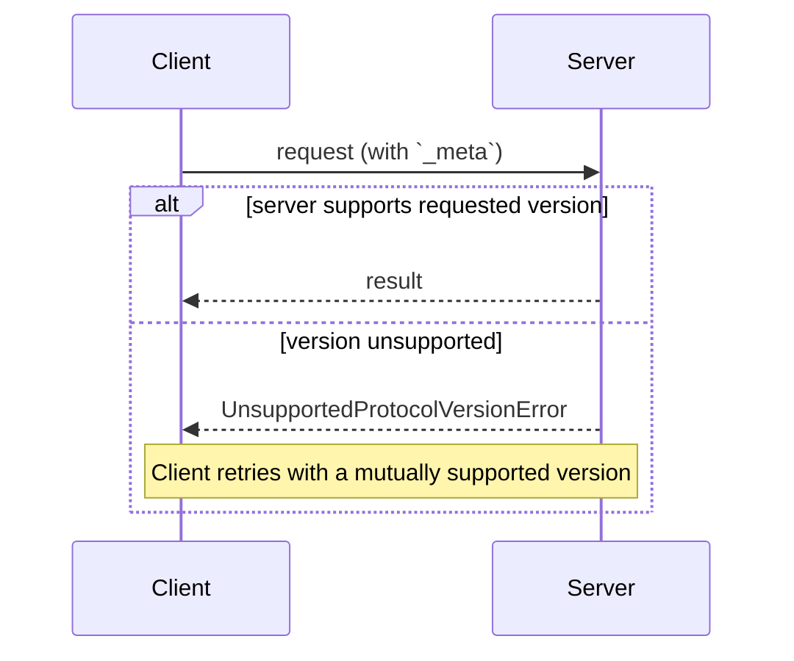

<div id="enable-section-numbers" />

本页定义了客户端和服务器如何就它们所使用的协议达成一致：
在每个请求上声明的协议版本；通过能力协商的可选扩展；
以及与早期的、基于握手的协议修订版的互操作性。

没有协商握手。每个请求携带其协议版本，
服务器独立地接受或拒绝每个请求：



## 术语

本页使用以下术语来说明跨协议修订版的互操作性：

- **现代（Modern）**：将版本、标识和能力作为按请求元数据传递的协议版本（`2026-07-28` 及之后的修订版）。
- **遗留（Legacy）**：通过 `initialize` 握手建立会话的协议版本（`2025-11-25` 及更早的修订版）。
- **双时代（Dual-era）**：同时支持现代和遗留版本的实现。

## 协议版本协商

每个请求在其 [`_meta`](/specification/draft/basic/index#meta) 字段中声明所使用的协议版本。在 HTTP 上，这也通过
[`MCP-Protocol-Version` 头部](/specification/draft/basic/transports/streamable-http#protocol-version-header)携带。

如果服务器未实现所请求的版本（无论是服务器未知的版本，
还是服务器选择不支持的已知版本），它 **MUST** 以
[`UnsupportedProtocolVersionError`](/specification/draft/schema#unsupportedprotocolversionerror)
响应，列出它支持的版本：

```json
{
  "jsonrpc": "2.0",
  "id": 1,
  "error": {
    "code": -32004,
    "message": "Unsupported protocol version",
    "data": {
      "supported": ["2026-07-28", "2025-11-25"],
      "requested": "1900-01-01"
    }
  }
}
```

The client **SHOULD** select a mutually supported version from the `supported`
list and retry the request, or surface an error to the user if no compatible
version exists.

Servers **MUST** implement
[`server/discover`](/specification/draft/server/discover). Clients
**MAY** call it before sending any other requests to learn the server's
supported versions up front, but are not required to: a client is free to
invoke any RPC inline and handle `UnsupportedProtocolVersionError` if its
preferred version is not supported.

## 扩展协商

客户端和服务器可以协商对核心协议之外的可选[扩展](/docs/extensions/overview)的支持。扩展
在能力的 `extensions` 字段中通告，这是一个从扩展标识符到每个扩展设置对象的映射。扩展标识符
**MUST** 遵循 [`_meta` 键命名规则](/specification/draft/basic/index#meta)，
带有必需的前缀。

The following is an example of a client that advertises the
[MCP Apps extension](/extensions/apps/overview) identified as `io.modelcontextprotocol/ui`:

```json
{
  "capabilities": {
    "roots": {},
    "extensions": {
      "io.modelcontextprotocol/ui": {
        "mimeTypes": ["text/html;profile=mcp-app"]
      }
    }
  }
}
```

An example of [Tasks extension](/extensions/tasks/overview) identified as `io.modelcontextprotocol/tasks`:

```json
{
  "capabilities": {
    "tools": {},
    "extensions": {
      "io.modelcontextprotocol/tasks": {}
    }
  }
}
```

Each extension specifies the schema of its settings object; an empty object
indicates support with no additional settings.

If one party supports an extension but the other does not, the supporting
party **MUST** either revert to core protocol behavior or reject the request
with an appropriate error. Extensions **SHOULD** document their expected
fallback behavior.

## 与基于初始化的版本的向后兼容性

希望同时支持[遗留](#terminology)客户端（期望 `initialize` 握手）和[现代](#terminology)客户端（使用按请求元数据）的服务器 **MAY** 实现这两种行为。

需要与两种服务器互操作的客户端通过传输特定的机制检测服务器的
时代，具体在绑定页面中说明：

- [stdio](/specification/draft/basic/transports/stdio#backward-compatibility)：
  使用 `server/discover` 探测，并在任何不是可识别的现代错误时回退。
- [Streamable HTTP](/specification/draft/basic/transports/streamable-http#backward-compatibility)：
  尝试一个现代请求，在回退之前检查 `400 Bad Request` 的响应体。

在这两种情况下，可识别的现代 JSON-RPC 错误（如
[`UnsupportedProtocolVersionError`](/specification/draft/schema#unsupportedprotocolversionerror)）
识别出现代服务器：客户端使用支持的版本重试，而不是回退。
其他任何情况都标识遗留服务器。

时代的确定是服务器的属性，而不是单个请求的属性。
客户端 **SHOULD** 在服务器进程（stdio）或源（HTTP）的整个生命周期内缓存结果，
并且 **MAY** 在相同服务器配置的重启之间持久化它，
如果缓存的假设后来失败，则重新探测。

只支持[现代](#terminology)版本的服务器 **SHOULD** 在它返回给 `initialize`
请求的任何错误中命名它支持的协议版本，在任何传输上：
遗留客户端没有前向回退机制，这条消息可能是它们能向用户显示的唯一的诊断信息。

### 兼容性矩阵

以下矩阵总结了客户端和服务器时代每种组合的预期结果：

| 客户端 | 服务器 | 结果                                                                                                                                                                                                                                                                                                                                                                              |
| ------ | ------ | --------------------------------------------------------------------------------------------------------------------------------------------------------------------------------------------------------------------------------------------------------------------------------------------------------------------------------------------------------------------------------- |
| 现代   | 现代   | 正常工作。`server/discover` 是可选的；版本不匹配会显示为 `UnsupportedProtocolVersionError`，客户端使用互支持的版本重试。                                                                                                                                                                                                                                                          |
| 现代   | 遗留   | 失败。服务器可能以实现定义的错误拒绝请求、保持沉默，甚至在遗留语义下处理时代模糊的方法。在 stdio 上，客户端 **SHOULD** 首先发送 `server/discover` 以确定性方式失败；然后客户端向用户显示可操作的错误。                                                                                                                                                                            |
| 双时代 | 现代   | 正常工作。stdio 探测返回 `DiscoverResult`（或 `UnsupportedProtocolVersionError`）；在 HTTP 上，第一个现代请求成功或返回现代错误。客户端保持现代。                                                                                                                                                                                                                                 |
| 双时代 | 遗留   | 正常工作。stdio：探测返回非现代错误或超时，客户端回退到 `initialize`。HTTP：现代请求返回 `4xx` 但没有可识别的现代错误体，客户端回退到 `initialize`（并且可能进一步回退到已弃用的 HTTP+SSE 传输）。                                                                                                                                                                                |
| 遗留   | 现代   | 失败。stdio：服务器以 JSON-RPC 错误拒绝 `initialize`；确切的代码是实现定义的（`initialize` 是未知方法，且请求也缺少所需的 `_meta` 字段）。HTTP：请求缺少所需的头，根据[服务器验证](/specification/draft/basic/transports/streamable-http#server-validation)以 `400 Bad Request` 拒绝（使用已弃用的 HTTP+SSE 传输的客户端在其初始 `GET` 时就失败了）。遗留客户端没有前向回退机制。 |
| 遗留   | 双时代 | 正常工作。服务器响应 `initialize` 并根据协商的遗留修订版为客户端服务。                                                                                                                                                                                                                                                                                                            |
| 遗留   | 遗留   | 根据遗留修订版工作；本文档不涉及。                                                                                                                                                                                                                                                                                                                                                |

一个双时代**服务器**根据客户端打开连接的方式选择其行为：

- 携带现代按请求 `_meta` 的请求根据此修订版以无状态方式服务。
- 一个 `initialize` 请求选择遗留语义，限定在 stdio 进程（stdio）或会话（HTTP），按协商的遗留协议版本指定。

双时代服务器 **MAY** 在同一端点或进程上同时服务两个时代。
