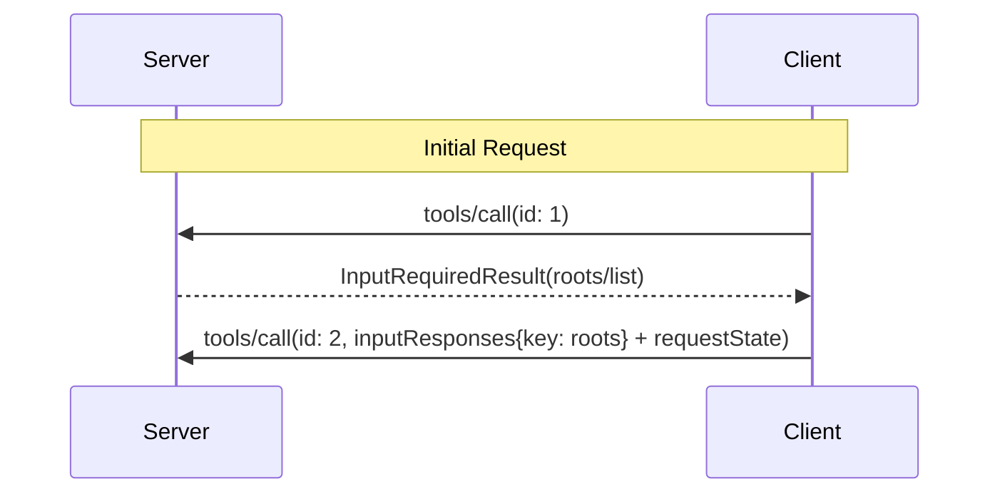

<div id="enable-section-numbers" />

<Warning>
  **已弃用**：Roots 特性自协议版本 `2026-07-28` 起已弃用
  （[SEP-2577](https://github.com/modelcontextprotocol/modelcontextprotocol/pull/2577)）。
  根据[特性生命周期策略](/community/feature-lifecycle)，它在此修订版发布后至少十二个月内
  仍保留在规范中，之后才有资格被移除。新实现 **SHOULD NOT** 采用它；现有实现
  **SHOULD** 迁移到通过工具参数、资源 URI 或服务器配置传递目录
  或文件。请参见[已弃用特性注册表](/specification/draft/deprecated)。
</Warning>

Model Context Protocol (MCP) 提供了标准化的方式让客户端向服务器暴露文件系统"根"。Roots 告知服务器客户端认为相关的目录和文件，以便服务器相应地聚焦其操作。它们是指南性信息，而非访问控制机制。协议不强制服务器保持在 roots 范围内。服务器可以从支持的客户端请求 roots 列表。

## 用户交互模型

MCP 中的 Roots 通常通过工作区或项目配置界面暴露。

例如，实现可以提供工作区/项目选择器，允许用户选择服务器应该有权访问的目录和文件。这可以与版本控制系统或项目文件的自动工作区检测相结合。

然而，实现可以自由地通过适合其需求的任何界面模式来暴露 roots — 协议本身不强制任何特定的用户交互模型。

## 能力

支持 roots 的客户端 **MUST** 在每个请求的 `_meta.io.modelcontextprotocol/clientCapabilities` 中声明 `roots` 能力：

```json
{
  "capabilities": {
    "roots": {}
  }
}
```

## 协议消息

### 列出 Roots

为了在处理客户端请求期间检索 roots，服务器发送包含 `roots/list` 请求的 `InputRequiredResult`：

**Request:**

```json
{
  "method": "roots/list"
}
```

**Response:**

```json
{
  "result": {
    "roots": [
      {
        "uri": "file:///home/user/projects/myproject",
        "name": "My Project"
      }
    ]
  }
}
```

## Message Flow



## 数据类型

### Root

根定义包括：

- `uri`：根的唯标识符。在当前规范中，这 **MUST** 是 `file://` URI。
- `name`：用于显示目的的可选人类可读名称。

Example roots for different use cases:

#### Project Directory

```json
{
  "uri": "file:///home/user/projects/myproject",
  "name": "My Project"
}
```

#### Multiple Repositories

```json
[
  {
    "uri": "file:///home/user/repos/frontend",
    "name": "Frontend Repository"
  },
  {
    "uri": "file:///home/user/repos/backend",
    "name": "Backend Repository"
  }
]
```

## 错误处理

如果发生错误，客户端不需要用错误消息重放初始调用，因为服务器没有等待使用 `InputRequiredResult` 模式的响应。

## 安全考虑

1. 客户端 **MUST**：
   - 仅暴露具有适当权限的 roots
   - 验证所有根 URI 以防止路径遍历
   - 实施适当的访问控制
   - 监控根的可访问性

2. 服务器 **SHOULD**：
   - 处理 roots 不可用的情况
   - 在操作期间尊重根边界
   - 根据提供的 roots 验证所有路径

## 实现指南

1. 客户端 **SHOULD**：
   - 在向服务器暴露 roots 之前提示用户同意
   - 提供清晰的用户界面进行根管理
   - 在暴露之前验证根的可访问性
   - 监控根变更

2. 服务器 **SHOULD**：
   - 在使用前检查 roots 能力
   - 在操作中尊重根边界
   - 适当地缓存根信息
