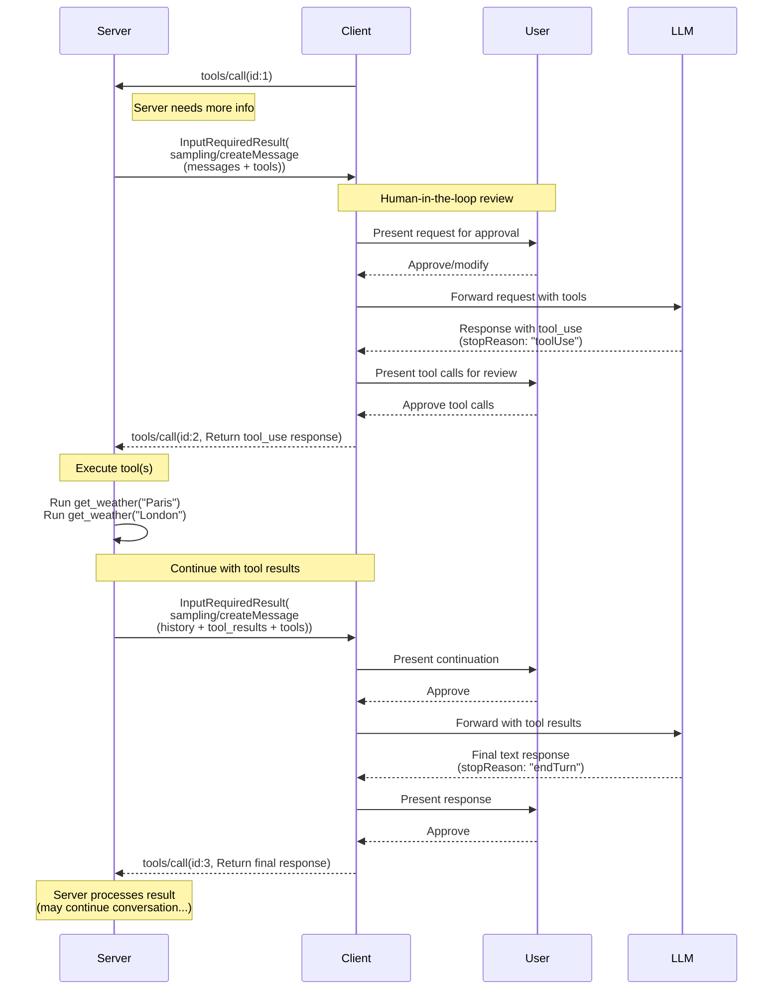
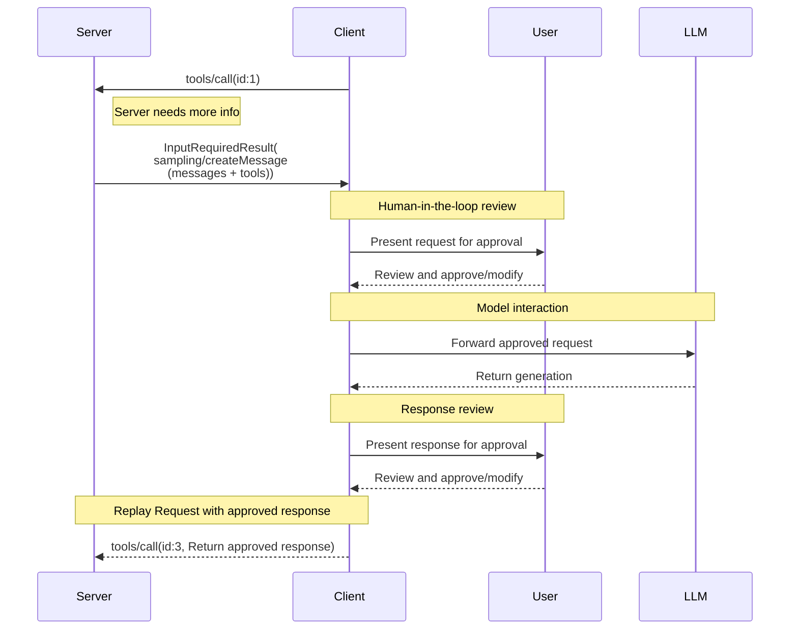

<div id="enable-section-numbers" />

<Warning>
  **已弃用**：Sampling 特性自协议版本 `2026-07-28` 起已弃用
  （[SEP-2577](https://github.com/modelcontextprotocol/modelcontextprotocol/pull/2577)）。
  根据[特性生命周期策略](/community/feature-lifecycle)，它在此修订版发布后至少十二个月内
  仍保留在规范中，之后才有资格被移除。新实现 **SHOULD NOT** 采用它；现有实现
  **SHOULD** 迁移到直接与 LLM 提供商 API 集成。
  请参见[已弃用特性注册表](/specification/draft/deprecated)。
</Warning>

Model Context Protocol (MCP) 提供了标准化的方式让服务器通过客户端从语言模型请求 LLM 采样（"补全"或"生成"）。此流程允许客户端保持对模型访问、选择和权限的控制，同时使服务器能够利用 AI 能力，且无需服务器 API 密钥。服务器可以请求文本、音频或基于图像的交互，并可选地在提示中包含来自 MCP 服务器的上下文。

## 用户交互模型

MCP 中的 Sampling 允许服务器实现 agentic 行为，通过使 LLM 调用*嵌套*在其他 MCP 服务器特性内部发生。

实现可以自由地通过适合其需求的任何界面模式来暴露采样 — 协议本身不强制任何特定的用户交互模型。

<Warning>

为了信任、安全和保护，**SHOULD** 始终在循环中有人类参与，具有拒绝采样请求的能力。

应用程序 **SHOULD**：

- 提供 UI 使审查采样请求变得简单直观
- 允许用户在发送前查看和编辑提示
- 在交付之前呈现生成响应供审查

</Warning>

## Sampling 中的工具

服务器可以通过在其采样请求中提供 `tools` 数组和可选的 `toolChoice` 配置，请求客户端的 LLM 在采样期间使用工具。`tools` 数组中的工具定义限定于该采样请求 — 它们不需要对应于已注册的工具。这使得服务器能够实现 agentic 行为，其中 LLM 可以调用专门指定的工具、接收结果并继续对话 — 所有这些都在单个采样请求流程中完成。

客户端 **MUST** 通过 `sampling.tools` 能力声明对工具使用的支持，才能接收启用工具的采样请求。服务器 **MUST NOT** 向未通过 `sampling.tools` 能力声明支持工具使用的客户端发送启用工具的采样请求。

## 能力

支持采样的客户端 **MUST** 在每个请求的 `_meta.io.modelcontextprotocol/clientCapabilities` 中声明 `sampling` 能力：

**Basic sampling:**

```json
{
  "capabilities": {
    "sampling": {}
  }
}
```

**With tool use support:**

```json
{
  "capabilities": {
    "sampling": {
      "tools": {}
    }
  }
}
```

**With context inclusion support (deprecated):**

```json
{
  "capabilities": {
    "sampling": {
      "context": {}
    }
  }
}
```

<Note>
  The `includeContext` parameter values `"thisServer"` and `"allServers"` are
  deprecated under the [feature lifecycle
  policy](/community/feature-lifecycle#deprecating-a-feature)
  ([SEP-2596](https://github.com/modelcontextprotocol/modelcontextprotocol/pull/2596));
  they will be removed no later than the Sampling feature itself. Servers
  **SHOULD** avoid using these values (e.g. can just omit `includeContext` since
  it defaults to `"none"`), and **SHOULD NOT** use them unless the client
  declares `sampling.context` capability. See the [deprecated features
  registry](/specification/draft/deprecated).
</Note>

## 协议消息

### 创建消息

为了在处理客户端请求期间请求语言模型生成，服务器发送包含 `sampling/createMessage` 请求的 `InputRequiredResult`：

**Request:**

```json
{
  "method": "sampling/createMessage",
  "params": {
    "messages": [
      {
        "role": "user",
        "content": {
          "type": "text",
          "text": "What is the capital of France?"
        }
      }
    ],
    "modelPreferences": {
      "hints": [
        {
          "name": "claude-3-sonnet"
        }
      ],
      "costPriority": 0.3,
      "intelligencePriority": 0.8,
      "speedPriority": 0.5
    },
    "temperature": 0.1,
    "systemPrompt": "You are a helpful assistant.",
    "includeContext": "thisServer",
    "maxTokens": 100
  }
}
```

**Response:**

```json
{
  "result": {
    "role": "assistant",
    "content": {
      "type": "text",
      "text": "The capital of France is Paris."
    },
    "model": "claude-3-sonnet-20240307",
    "stopReason": "endTurn"
  }
}
```

### Sampling with Tools

The following diagram illustrates the complete flow of sampling with tools, including the multi-turn tool loop:



To request LLM generation with tool use capabilities, servers include `tools` and optionally `toolChoice` in the request:

**Request (Server -> Client):**

```json
{
  "method": "sampling/createMessage",
  "params": {
    "messages": [
      {
        "role": "user",
        "content": {
          "type": "text",
          "text": "What's the weather like in Paris and London?"
        }
      }
    ],
    "tools": [
      {
        "name": "get_weather",
        "description": "Get current weather for a city",
        "inputSchema": {
          "type": "object",
          "properties": {
            "city": {
              "type": "string",
              "description": "City name"
            }
          },
          "required": ["city"]
        }
      }
    ],
    "toolChoice": {
      "mode": "auto"
    },
    "maxTokens": 1000
  }
}
```

**Response (Client -> Server):**

```json
{
  "result": {
    "role": "assistant",
    "content": [
      {
        "type": "tool_use",
        "id": "call_abc123",
        "name": "get_weather",
        "input": {
          "city": "Paris"
        }
      },
      {
        "type": "tool_use",
        "id": "call_def456",
        "name": "get_weather",
        "input": {
          "city": "London"
        }
      }
    ],
    "model": "claude-3-sonnet-20240307",
    "stopReason": "toolUse"
  }
}
```

### Multi-turn Tool Loop

After receiving tool use requests from the LLM, the server typically:

1. Executes the requested tool uses.
2. Sends a new sampling request with the tool results appended
3. Receives the LLM's response (which might contain new tool uses)
4. Repeats as many times as needed (server might cap the maximum number of iterations, and e.g. pass `toolChoice: {mode: "none"}` on the last iteration to force a final result)

**Follow-up request (Server -> Client) with tool results:**

```json
{
  "method": "sampling/createMessage",
  "params": {
    "messages": [
      {
        "role": "user",
        "content": {
          "type": "text",
          "text": "What's the weather like in Paris and London?"
        }
      },
      {
        "role": "assistant",
        "content": [
          {
            "type": "tool_use",
            "id": "call_abc123",
            "name": "get_weather",
            "input": { "city": "Paris" }
          },
          {
            "type": "tool_use",
            "id": "call_def456",
            "name": "get_weather",
            "input": { "city": "London" }
          }
        ]
      },
      {
        "role": "user",
        "content": [
          {
            "type": "tool_result",
            "toolUseId": "call_abc123",
            "content": [
              {
                "type": "text",
                "text": "Weather in Paris: 18°C, partly cloudy"
              }
            ]
          },
          {
            "type": "tool_result",
            "toolUseId": "call_def456",
            "content": [
              {
                "type": "text",
                "text": "Weather in London: 15°C, rainy"
              }
            ]
          }
        ]
      }
    ],
    "tools": [
      {
        "name": "get_weather",
        "description": "Get current weather for a city",
        "inputSchema": {
          "type": "object",
          "properties": {
            "city": { "type": "string" }
          },
          "required": ["city"]
        }
      }
    ],
    "maxTokens": 1000
  }
}
```

**Final response (Client -> Server):**

```json
{
  "result": {
    "role": "assistant",
    "content": {
      "type": "text",
      "text": "Based on the current weather data:\n\n- **Paris**: 18°C and partly cloudy - quite pleasant!\n- **London**: 15°C and rainy - you'll want an umbrella.\n\nParis has slightly warmer and drier conditions today."
    },
    "model": "claude-3-sonnet-20240307",
    "stopReason": "endTurn"
  }
}
```

## Message Content Constraints

### Tool Result Messages

When a user message contains tool results (type: "tool_result"), it **MUST** contain ONLY tool results. Mixing tool results with other content types (text, image, audio) in the same message is not allowed.

This constraint ensures compatibility with provider APIs that use dedicated roles for tool results (e.g., OpenAI's "tool" role, Gemini's "function" role).

**Valid - single tool result:**

```json
{
  "role": "user",
  "content": {
    "type": "tool_result",
    "toolUseId": "call_123",
    "content": [{ "type": "text", "text": "Result data" }]
  }
}
```

**Valid - multiple tool results:**

```json
{
  "role": "user",
  "content": [
    {
      "type": "tool_result",
      "toolUseId": "call_123",
      "content": [{ "type": "text", "text": "Result 1" }]
    },
    {
      "type": "tool_result",
      "toolUseId": "call_456",
      "content": [{ "type": "text", "text": "Result 2" }]
    }
  ]
}
```

**Invalid - mixed content:**

```json
{
  "role": "user",
  "content": [
    {
      "type": "text",
      "text": "Here are the results:"
    },
    {
      "type": "tool_result",
      "toolUseId": "call_123",
      "content": [{ "type": "text", "text": "Result data" }]
    }
  ]
}
```

### Tool Use and Result Balance

When using tool use in sampling, every assistant message containing `ToolUseContent` blocks **MUST** be followed by a user message that consists entirely of `ToolResultContent` blocks, with each tool use (e.g. with `id: $id`) matched by a corresponding tool result (with `toolUseId: $id`), before any other message.

This requirement ensures:

- Tool uses are always resolved before the conversation continues
- Provider APIs can concurrently process multiple tool uses and fetch their results in parallel
- The conversation maintains a consistent request-response pattern

**Example valid sequence:**

1. User message: "What's the weather like in Paris and London?"
2. Assistant message: `ToolUseContent` (`id: "call_abc123", name: "get_weather", input: {city: "Paris"}`) + `ToolUseContent` (`id: "call_def456", name: "get_weather", input: {city: "London"}`)
3. User message: `ToolResultContent` (`toolUseId: "call_abc123", content: "18°C, partly cloudy"`) + `ToolResultContent` (`toolUseId: "call_def456", content: "15°C, rainy"`)
4. Assistant message: Text response comparing the weather in both cities

**Invalid sequence - missing tool result:**

1. User message: "What's the weather like in Paris and London?"
2. Assistant message: `ToolUseContent` (`id: "call_abc123", name: "get_weather", input: {city: "Paris"}`) + `ToolUseContent` (`id: "call_def456", name: "get_weather", input: {city: "London"}`)
3. User message: `ToolResultContent` (`toolUseId: "call_abc123", content: "18°C, partly cloudy"`) ← Missing result for call_def456
4. Assistant message: Text response (invalid - not all tool uses were resolved)

## Cross-API Compatibility

The sampling specification is designed to work across multiple LLM provider APIs (Claude, OpenAI, Gemini, etc.). Key design decisions for compatibility:

### Message Roles

MCP uses two roles: "user" and "assistant".

Tool use requests are sent in CreateMessageResult with the "assistant" role.
Tool results are sent back in messages with the "user" role.
Messages with tool results cannot contain other kinds of content.

### Tool Choice Modes

`CreateMessageRequest.params.toolChoice` controls the tool use ability of the model:

- `{mode: "auto"}`: Model decides whether to use tools (default)
- `{mode: "required"}`: Model MUST use at least one tool before completing
- `{mode: "none"}`: Model MUST NOT use any tools

### Parallel Tool Use

MCP allows models to make multiple tool use requests in parallel (returning an array of `ToolUseContent`). All major provider APIs support this:

- **Claude**: Supports parallel tool use natively
- **OpenAI**: Supports parallel tool calls (can be disabled with `parallel_tool_calls: false`)
- **Gemini**: Supports parallel function calls natively

Implementations wrapping providers that support disabling parallel tool use MAY expose this as an extension, but it is not part of the core MCP specification.

## Message Flow



## Data Types

### Messages

Sampling messages **MUST** contain a `role` field of `"user"` or `"assistant"`; and
a `content` field representing the message data.

The list of messages in a sampling request **SHOULD NOT** be retained between
separate requests.

The `content` field can contain:

#### Text Content

```json
{
  "type": "text",
  "text": "The message content"
}
```

#### Image Content

```json
{
  "type": "image",
  "data": "base64-encoded-image-data",
  "mimeType": "image/jpeg"
}
```

#### Audio Content

```json
{
  "type": "audio",
  "data": "base64-encoded-audio-data",
  "mimeType": "audio/wav"
}
```

### Model Preferences

Model selection in MCP requires careful abstraction since servers and clients may use
different AI providers with distinct model offerings. A server cannot simply request a
specific model by name since the client may not have access to that exact model or may
prefer to use a different provider's equivalent model.

To solve this, MCP implements a preference system that combines abstract capability
priorities with optional model hints:

#### Capability Priorities

Servers express their needs through three normalized priority values (0-1):

- `costPriority`: How important is minimizing costs? Higher values prefer cheaper models.
- `speedPriority`: How important is low latency? Higher values prefer faster models.
- `intelligencePriority`: How important are advanced capabilities? Higher values prefer
  more capable models.

#### Model Hints

While priorities help select models based on characteristics, `hints` allow servers to
suggest specific models or model families:

- Hints are treated as substrings that can match model names flexibly
- Multiple hints are evaluated in order of preference
- Clients **MAY** map hints to equivalent models from different providers
- Hints are advisory&mdash;clients make final model selection

For example:

```json
{
  "hints": [
    { "name": "claude-3-sonnet" }, // Prefer Sonnet-class models
    { "name": "claude" } // Fall back to any Claude model
  ],
  "costPriority": 0.3, // Cost is less important
  "speedPriority": 0.8, // Speed is very important
  "intelligencePriority": 0.5 // Moderate capability needs
}
```

The client processes these preferences to select an appropriate model from its available
options. For instance, if the client doesn't have access to Claude models but has Gemini,
it might map the sonnet hint to `gemini-1.5-pro` based on similar capabilities.

### System Prompt

The optional `systemPrompt` field allows servers to request a specific system prompt.
The client **MAY** modify or ignore this field without communicating this to the server.

### Context Inclusion

The `includeContext` parameter specifies what context information the client is expected
to include in its response:

- `"none"`: No additional context.
- `"thisServer"`: Include context from the requesting server.
- `"allServers"`: Include context from all connected MCP servers.

The `"thisServer"` and `"allServers"` values are deprecated; see
[Capabilities](#capabilities).

The client **MAY** modify or ignore this field without communicating this to the server.
For example, a client could determine that respecting this field in a particular request
would require sharing sensitive information with a server, and constrain its response
accordingly.

### Sampling Parameters

LLM sampling can be fine-tuned with the following parameters:

- `temperature`: Controls randomness in model responses. Higher values produce higher randomness, and lower values produce more stable output. Valid range depends upon the model provider.
- `maxTokens`: Maximum tokens to generate; required.
- `stopSequences`: Array of sequences that stop generation.
- `metadata`: Additional provider-specific parameters.

The client **MUST** respect the `maxTokens` parameter.

The client **MAY** modify or ignore `temperature`, `stopSequences` and `metadata`. For
example, a client could use a model that does not support one or more of these parameters,
and would therefore be unable to leverage them.

### Result Fields

Sampling results will contain the following fields:

- `role`: The message role; see [Messages](#messages).
- `content`: The message content. This can be either:
  - A single content block when the response contains only one content block, such as a single text response.
  - An array of content blocks when the response contains one or more content blocks, such as multiple tool uses or mixed content.

  See [Messages](#messages) for content block types.

- `model`: The name of the model that generated the message.
- `stopReason`: The reason why sampling stopped, if known. The specification defines the following (non-exhaustive) stop reasons, although implementations **MAY** provide their own arbitrary values:
  - `"endTurn"`: The participant is yielding the conversation to the other party.
  - `"stopSequence"`: Message generation encountered one of the requested `stopSequences`.
  - `"maxTokens"`: The token limit was reached.
  - `"toolUse"`: The model wants to use one or more tools.

## Error Handling

If an error occurs or the user declines the sampling request, the client does not need to replay the initial call with an
error message, as the server is not waiting for a response with the `InputRequiredResult` pattern.

## Security Considerations

1. Clients **SHOULD** implement user approval controls
2. Both parties **SHOULD** validate message content
3. Clients **SHOULD** respect model preference hints
4. Clients **SHOULD** implement rate limiting
5. Both parties **MUST** handle sensitive data appropriately

When tools are used in sampling, additional security considerations apply:

6. Servers **MUST** ensure that when replying to a `stopReason: "toolUse"`, each `ToolUseContent` item is responded to with a `ToolResultContent` item with a matching `toolUseId`, and that the user message contains only tool results (no other content types)
7. Both parties **SHOULD** implement iteration limits for tool loops
