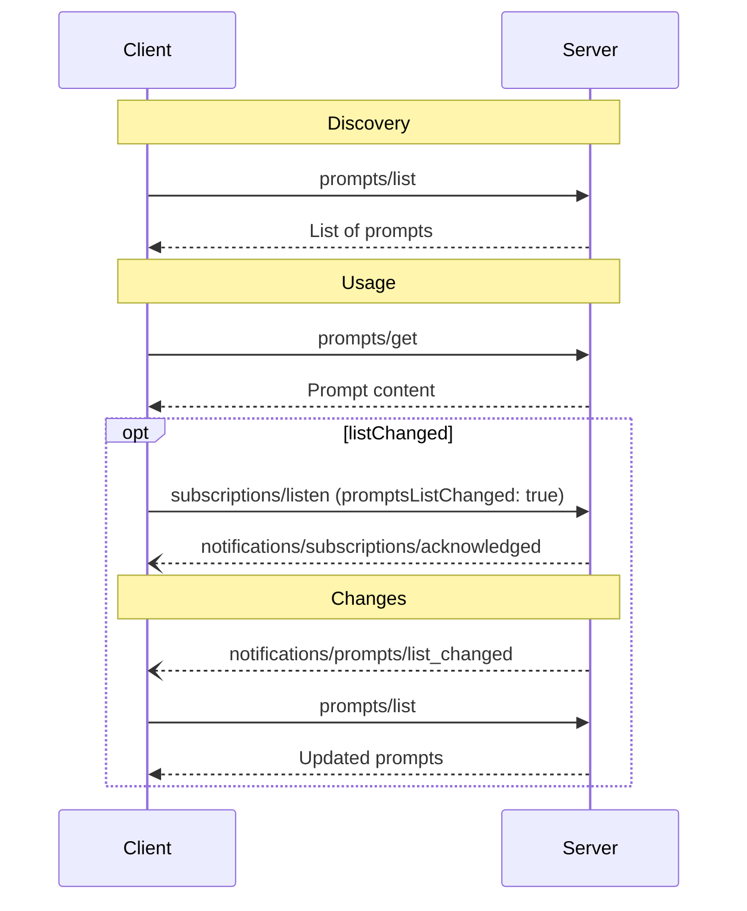

<div id="enable-section-numbers" />

Model Context Protocol (MCP) 提供了标准化的方式让服务器向客户端暴露提示模板。提示允许服务器提供与语言模型交互的结构化消息和指令。客户端可以发现可用的提示、检索其内容，并提供参数来自定义它们。

## 用户交互模型

提示设计为**用户控制**，意味着它们从服务器暴露给客户端，目的是让用户能够明确选择使用它们。这指的是谁决定何时使用提示，而非谁编写其内容。提示内容由服务器定义。

通常，提示会通过用户界面中用户发起的命令触发，这使用户能够自然地发现和调用可用的提示。

例如，作为斜杠命令：


然而，实现者可以自由地通过适合其需求的任何界面模式来暴露提示 — 协议本身不强制任何特定的用户交互模型。

## 能力

支持提示的服务器 **MUST** 在其 [`DiscoverResult`](/specification/draft/schema#discoverresult) 中声明 `prompts` 能力：

```json
{
  "capabilities": {
    "prompts": {
      "listChanged": true
    }
  }
}
```

`listChanged` indicates whether the server will emit notifications when the list of
available prompts changes.

Servers that declare the `prompts` capability **MUST** respond to `prompts/list` requests
with the set of prompts currently available to the requesting client. This set **MAY** be
empty and **MAY** change over time (see
[List Changed Notification](#list-changed-notification)), but **MUST NOT** vary
per-connection or as a side effect of other requests on the connection. The set
**MAY** vary by the authorization presented on the request — for example, returning
only the prompts the caller's granted scopes permit — since credentials are
per-request input, not connection state.

## 协议消息

### 列出提示

要检索可用的提示，客户端发送 `prompts/list` 请求。此操作支持[分页](/specification/draft/server/utilities/pagination)和[缓存](/specification/draft/server/utilities/caching)。

**Request:**

```json
{
  "jsonrpc": "2.0",
  "id": 1,
  "method": "prompts/list",
  "params": {
    "cursor": "optional-cursor-value"
  }
}
```

**Response:**

```json
{
  "jsonrpc": "2.0",
  "id": 1,
  "result": {
    "resultType": "complete",
    "prompts": [
      {
        "name": "code_review",
        "title": "Request Code Review",
        "description": "Asks the LLM to analyze code quality and suggest improvements",
        "arguments": [
          {
            "name": "code",
            "description": "The code to review",
            "required": true
          }
        ],
        "icons": [
          {
            "src": "https://example.com/review-icon.svg",
            "mimeType": "image/svg+xml",
            "sizes": ["any"]
          }
        ]
      }
    ],
    "nextCursor": "next-page-cursor",
    "ttlMs": 600000,
    "cacheScope": "public"
  }
}
```

### 获取提示

要检索特定提示，客户端发送 `prompts/get` 请求。参数可以通过[补全 API](/specification/draft/server/utilities/completion) 自动补全。

**Request:**

```json
{
  "jsonrpc": "2.0",
  "id": 2,
  "method": "prompts/get",
  "params": {
    "name": "code_review",
    "arguments": {
      "code": "def hello():\n    print('world')"
    }
  }
}
```

**Response:**

```json
{
  "jsonrpc": "2.0",
  "id": 2,
  "result": {
    "resultType": "complete",
    "description": "Code review prompt",
    "messages": [
      {
        "role": "user",
        "content": {
          "type": "text",
          "text": "Please review this Python code:\ndef hello():\n    print('world')"
        }
      }
    ]
  }
}
```

Servers **MAY** also respond to `prompts/get` with an [`InputRequiredResult`](/specification/draft/basic/patterns/mrtr#inputrequiredresult) to indicate that additional input is needed before the prompt can be resolved. This follows the [multi round-trip requests](/specification/draft/basic/patterns/mrtr#multi-round-trip-requests) mechanism. When retrying the request, clients include `inputResponses` and, if provided by the server, `requestState` in the request parameters.

### 列表变更通知

当可用提示列表发生变化时，声明了 `listChanged` 能力的服务器 **SHOULD** 向已打开带有 `promptsListChanged: true` 的 [`subscriptions/listen`](/specification/draft/basic/patterns/subscriptions) 流的客户端发送通知：

```json
{
  "jsonrpc": "2.0",
  "method": "notifications/prompts/list_changed"
}
```

## Message Flow



## 数据类型

### Prompt

A prompt definition includes:

- `name`: Unique identifier for the prompt
- `title`: Optional human-readable name of the prompt for display purposes.
- `description`: Optional human-readable description
- `icons`: Optional array of icons for display in user interfaces
- `arguments`: Optional list of arguments for customization

### PromptMessage

Messages in a prompt can contain:

- `role`: Either "user" or "assistant" to indicate the speaker
- `content`: One of the following content types:

<Note>
  All content types in prompt messages support optional
  [annotations](/specification/draft/server/resources#annotations) for metadata
  about audience, priority, and modification times.
</Note>

#### Text Content

Text content represents plain text messages:

```json
{
  "type": "text",
  "text": "The text content of the message"
}
```

This is the most common content type used for natural language interactions.

#### Image Content

Image content allows including visual information in messages:

```json
{
  "type": "image",
  "data": "base64-encoded-image-data",
  "mimeType": "image/png"
}
```

The image data **MUST** be base64-encoded and include a valid MIME type. This enables
multi-modal interactions where visual context is important.

#### Audio Content

Audio content allows including audio information in messages:

```json
{
  "type": "audio",
  "data": "base64-encoded-audio-data",
  "mimeType": "audio/wav"
}
```

The audio data MUST be base64-encoded and include a valid MIME type. This enables
multi-modal interactions where audio context is important.

#### Resource Links

Prompt messages **MAY** include links to
[Resources](/specification/draft/server/resources), to provide additional context or
data without embedding the resource contents directly. In this case, the prompt message
returns a URI that can be fetched by the client:

```json
{
  "type": "resource_link",
  "uri": "file:///project/src/main.rs",
  "name": "main.rs",
  "description": "Primary application entry point",
  "mimeType": "text/x-rust"
}
```

Resource links support the same [Resource annotations](/specification/draft/server/resources#annotations)
as regular resources to help clients understand how to use them.

#### Embedded Resources

Embedded resources allow referencing server-side resources directly in messages:

```json
{
  "type": "resource",
  "resource": {
    "uri": "resource://example",
    "mimeType": "text/plain",
    "text": "Resource content"
  }
}
```

Resources can contain either text or binary (blob) data and **MUST** include:

- A valid resource URI
- The appropriate MIME type
- Either text content or base64-encoded blob data

Embedded resources enable prompts to seamlessly incorporate server-managed content like
documentation, code samples, or other reference materials directly into the conversation
flow.

## Error Handling

Servers **SHOULD** return standard JSON-RPC errors for common failure cases:

- Invalid prompt name: `-32602` (Invalid params)
- Missing required arguments: `-32602` (Invalid params)
- Internal errors: `-32603` (Internal error)

## Implementation Considerations

1. Servers **SHOULD** validate prompt arguments before processing
2. Clients **SHOULD** handle pagination for large prompt lists
3. Both parties **SHOULD** respect capability negotiation

## Security

Implementations **MUST** carefully validate all prompt inputs and outputs to prevent
injection attacks or unauthorized access to resources.
