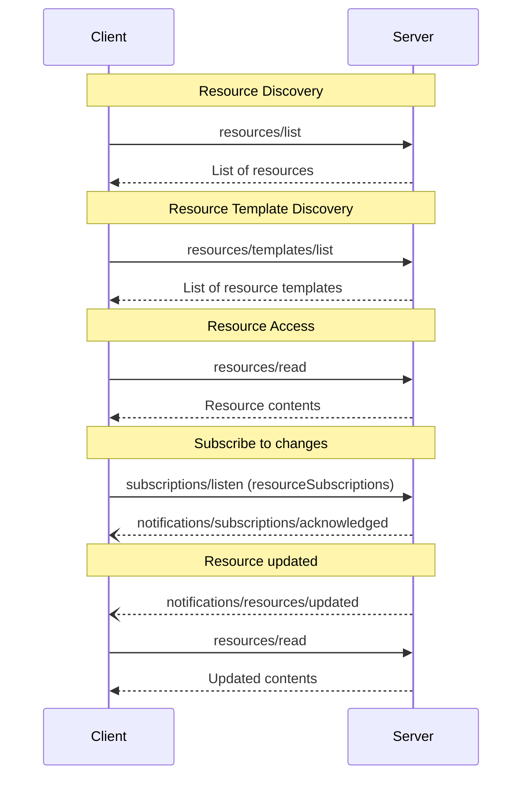

<div id="enable-section-numbers" />

Model Context Protocol (MCP) 提供了标准化的方式让服务器向客户端暴露资源。资源允许服务器共享为语言模型提供上下文的数据，如文件、数据库 schemas 或应用程序特定信息。每个资源由 [URI](https://datatracker.ietf.org/doc/html/rfc3986) 唯一标识。

## 用户交互模型

MCP 中的资源设计为**应用程序驱动**，主机应用程序根据其需要决定如何合并上下文。

例如，应用程序可以：

- 通过 UI 元素以树状或列表视图暴露资源供显式选择
- 允许用户搜索和过滤可用资源
- 基于启发式规则或 AI 模型的选择实现自动上下文包含


然而，实现可以自由地通过适合其需求的任何界面模式来暴露资源 — 协议本身不强制任何特定的用户交互模型。

## 能力

支持资源的服务器 **MUST** 声明 `resources` 能力：

```json
{
  "capabilities": {
    "resources": {
      "listChanged": true,
      "subscribe": true
    }
  }
}
```

The capability supports two optional features:

- `listChanged`: whether the server will emit notifications when the list of available
  resources changes.
- `subscribe` : whether the server supports resource-specific update notifications
  for resources requested through subscriptions/listen using the resourceSubscriptions
  filter.

Servers may advertise either feature independently, together or neither.

Serves that support neither `listChanged` or `subscribe` may omit it:

```json
{
  "capabilities": {
    "resources": {}
  }
}
```

Servers that declare the `resources` capability **MUST** respond to `resources/list`
requests with the set of resources currently available to the requesting client. This set
**MAY** be empty and **MAY** change over time (see
[List Changed Notification](#list-changed-notification)), but **MUST NOT** vary
per-connection or as a side effect of other requests on the connection. The set
**MAY** vary by the authorization presented on the request — for example, returning
only the resources the caller's granted scopes permit — since credentials are
per-request input, not connection state.

## 协议消息

### 列出资源

要发现可用的资源，客户端发送 `resources/list` 请求。此操作支持[分页](/specification/draft/server/utilities/pagination)和[缓存](/specification/draft/server/utilities/caching)。

**Request:**

```json
{
  "jsonrpc": "2.0",
  "id": 1,
  "method": "resources/list",
  "params": {
    "cursor": "optional-cursor-value"
  }
}
```

**Response:**

```json
{
  "jsonrpc": "2.0",
  "id": 1,
  "result": {
    "resultType": "complete",
    "resources": [
      {
        "uri": "file:///project/src/main.rs",
        "name": "main.rs",
        "title": "Rust Software Application Main File",
        "description": "Primary application entry point",
        "mimeType": "text/x-rust",
        "icons": [
          {
            "src": "https://example.com/rust-file-icon.png",
            "mimeType": "image/png",
            "sizes": ["48x48"]
          }
        ]
      }
    ],
    "nextCursor": "next-page-cursor",
    "ttlMs": 300000,
    "cacheScope": "public"
  }
}
```

### 读取资源

要检索资源内容，客户端发送 `resources/read` 请求。此操作支持[缓存](/specification/draft/server/utilities/caching)。

**Request:**

```json
{
  "jsonrpc": "2.0",
  "id": 2,
  "method": "resources/read",
  "params": {
    "uri": "file:///project/src/main.rs"
  }
}
```

**Response:**

```json
{
  "jsonrpc": "2.0",
  "id": 2,
  "result": {
    "resultType": "complete",
    "contents": [
      {
        "uri": "file:///project/src/main.rs",
        "mimeType": "text/x-rust",
        "text": "fn main() {\n    println!(\"Hello world!\");\n}"
      }
    ],
    "ttlMs": 60000,
    "cacheScope": "private"
  }
}
```

Servers **MAY** return multiple resource contents in response to a single
`resources/read` request. For example, a server could return the contents of
several files when a directory resource is read.

Servers **MAY** also respond to `resources/read` with an [`InputRequiredResult`](/specification/draft/basic/patterns/mrtr#inputrequiredresult) to indicate that additional input is needed before the resource can be read. This follows the [multi round-trip requests](/specification/draft/basic/patterns/mrtr#multi-round-trip-requests) mechanism. When retrying the request, clients include `inputResponses` and, if provided by the server, `requestState` in the request parameters.

Alternatively, if the scheme of `uri` is `https://`, clients may fetch the resource directly from the web. See the [Common URI Schemes section](#https%3A%2F%2F) for more information.

### 资源模板

资源模板允许服务器使用 [URI 模板](https://datatracker.ietf.org/doc/html/rfc6570) 暴露参数化的资源。参数可以通过[补全 API](/specification/draft/server/utilities/completion) 自动补全。此操作支持[分页](/specification/draft/server/utilities/pagination)和[缓存](/specification/draft/server/utilities/caching)。

**Request:**

```json
{
  "jsonrpc": "2.0",
  "id": 3,
  "method": "resources/templates/list",
  "params": {
    "cursor": "optional-cursor-value"
  }
}
```

**Response:**

```json
{
  "jsonrpc": "2.0",
  "id": 3,
  "result": {
    "resultType": "complete",
    "resourceTemplates": [
      {
        "uriTemplate": "file:///{path}",
        "name": "Project Files",
        "title": "📁 Project Files",
        "description": "Access files in the project directory",
        "mimeType": "application/octet-stream",
        "icons": [
          {
            "src": "https://example.com/folder-icon.png",
            "mimeType": "image/png",
            "sizes": ["48x48"]
          }
        ]
      }
    ],
    "nextCursor": "next-page-cursor",
    "ttlMs": 300000,
    "cacheScope": "public"
  }
}
```

### 列表变更通知

当可用资源列表发生变化时，声明了 `listChanged` 能力的服务器 **SHOULD** 发送通知：

```json
{
  "jsonrpc": "2.0",
  "method": "notifications/resources/list_changed"
}
```

### 订阅

客户端通过发送 [`subscriptions/listen`][subscriptions-listen] 请求（其中包含 `notifications.resourceSubscriptions` 中列出的资源 URI）来订阅特定资源的变更通知。当被监视的资源发生变化时，服务器在生成的流上传递 `notifications/resources/updated`。

```json
{
  "jsonrpc": "2.0",
  "method": "notifications/resources/updated",
  "params": {
    "_meta": { "io.modelcontextprotocol/subscriptionId": "4" },
    "uri": "file:///project/src/main.rs"
  }
}
```

See [Subscriptions][subscriptions] for the full protocol mechanics (acknowledgment,
`subscriptionId` correlation, and cancellation).

[subscriptions-listen]: /specification/draft/schema#subscriptionslistenrequest
[subscriptions]: /specification/draft/basic/patterns/subscriptions

## Message Flow



## Data Types

### Resource

A resource definition includes:

- `uri`: Unique identifier for the resource
- `name`: The name of the resource.
- `title`: Optional human-readable name of the resource for display purposes.
- `description`: Optional description
- `icons`: Optional array of icons for display in user interfaces
- `mimeType`: Optional MIME type
- `size`: Optional size in bytes

### Resource Contents

Resources can contain either text or binary data:

#### Text Content

```json
{
  "uri": "file:///example.txt",
  "mimeType": "text/plain",
  "text": "Resource content"
}
```

#### Binary Content

```json
{
  "uri": "file:///example.png",
  "mimeType": "image/png",
  "blob": "base64-encoded-data"
}
```

### Annotations

Resources, resource templates and content blocks support optional annotations that provide hints to clients about how to use or display the resource:

- **`audience`**: An array indicating the intended audience(s) for this resource. Valid values are `"user"` and `"assistant"`. For example, `["user", "assistant"]` indicates content useful for both.
- **`priority`**: A number from 0.0 to 1.0 indicating the importance of this resource. A value of 1 means "most important" (effectively required), while 0 means "least important" (entirely optional).
- **`lastModified`**: An ISO 8601 formatted timestamp indicating when the resource was last modified (e.g., `"2025-01-12T15:00:58Z"`).

Example resource with annotations:

```json
{
  "uri": "file:///project/README.md",
  "name": "README.md",
  "title": "Project Documentation",
  "mimeType": "text/markdown",
  "annotations": {
    "audience": ["user"],
    "priority": 0.8,
    "lastModified": "2025-01-12T15:00:58Z"
  }
}
```

Clients can use these annotations to:

- Filter resources based on their intended audience
- Prioritize which resources to include in context
- Display modification times or sort by recency

## Common URI Schemes

The protocol defines several standard URI schemes. This list is not
exhaustive&mdash;implementations are always free to use additional, custom URI schemes.

### https://

Used to represent a resource available on the web.

Servers **SHOULD** use this scheme only when the client is able to fetch and load the
resource directly from the web on its own—that is, it doesn’t need to read the resource
via the MCP server.

For other use cases, servers **SHOULD** prefer to use another URI scheme, or define a
custom one, even if the server will itself be downloading resource contents over the
internet.

### file://

Used to identify resources that behave like a filesystem. However, the resources do not
need to map to an actual physical filesystem.

MCP servers **MAY** identify file:// resources with an
[XDG MIME type](https://specifications.freedesktop.org/shared-mime-info-spec/0.14/ar01s02.html#id-1.3.14),
like `inode/directory`, to represent non-regular files (such as directories) that don’t
otherwise have a standard MIME type.

### git://

Git version control integration.

### Custom URI Schemes

Custom URI schemes **MUST** be in accordance with [RFC3986](https://datatracker.ietf.org/doc/html/rfc3986),
taking the above guidance in to account.

## Error Handling

If the requested resource does not exist, servers **MUST** return a JSON-RPC error with
code `-32602` (Invalid Params). Servers **SHOULD** return `-32603` for internal errors.

For backwards compatibility, clients **SHOULD** also accept `-32002` as a
resource not found error, as earlier protocol versions used this code.

Servers **MUST NOT** return an empty `contents` array for a non-existent resource. An empty array is ambiguous—it could mean the resource exists but has no content, or that it doesn't exist at all.

Example error:

```json
{
  "jsonrpc": "2.0",
  "id": 5,
  "error": {
    "code": -32602,
    "message": "Resource not found",
    "data": {
      "uri": "file:///nonexistent.txt"
    }
  }
}
```

## Security Considerations

1. Servers **MUST** validate all resource URIs
2. Access controls **SHOULD** be implemented for sensitive resources
3. Binary data **MUST** be properly encoded
4. Resource permissions **SHOULD** be checked before operations
5. Servers **MUST** sanitize file paths to prevent directory traversal attacks
   when serving `file://` resources
