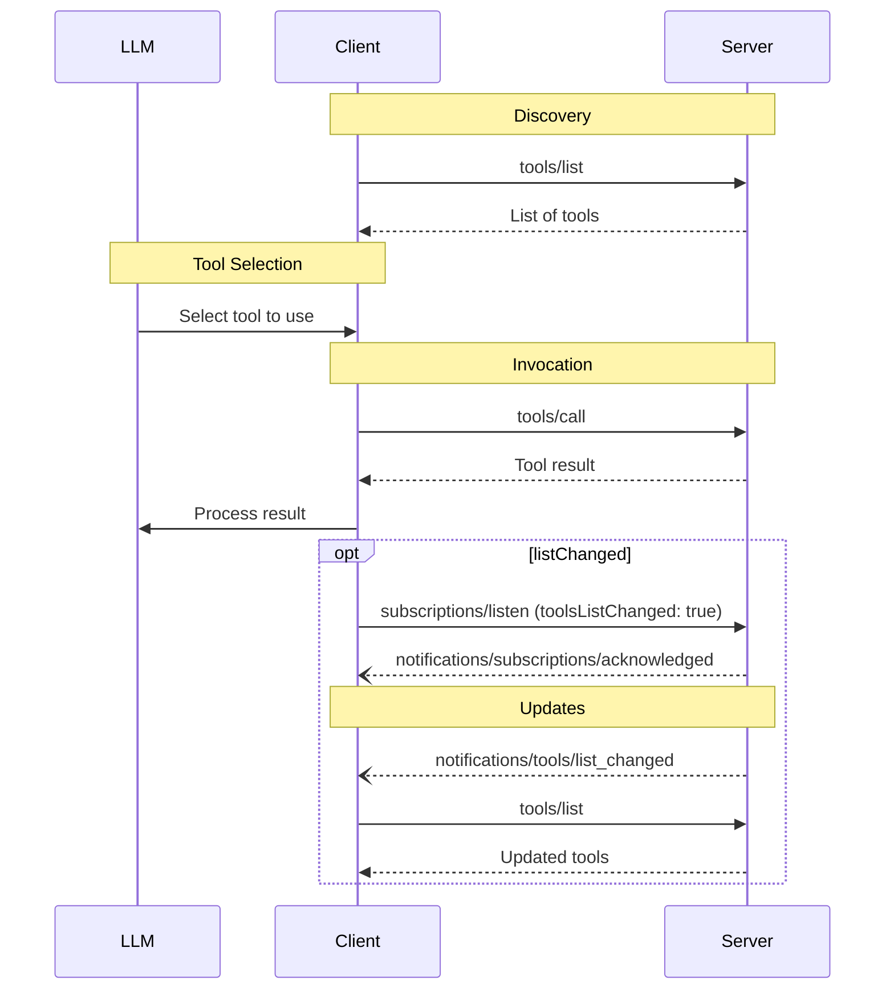

<div id="enable-section-numbers" />

Model Context Protocol (MCP) 允许服务器暴露可由语言模型调用的工具。工具使模型能够与外部系统交互，例如查询数据库、调用 API 或执行计算。每个工具由名称唯一标识，并包含描述其 schema 的元数据。

## 用户交互模型

MCP 中的工具设计为**模型控制**，意味着语言模型可以根据其上下文理解和用户的提示自动发现和调用工具。

然而，实现可以自由地通过适合其需求的任何界面模式来暴露工具 — 协议本身不强制任何特定的用户交互模型。

<Warning>

为了信任、安全和保护，**SHOULD** 始终在循环中有人类参与，具有拒绝工具调用的能力。

应用程序 **SHOULD**：

- 提供 UI 明确显示哪些工具暴露给 AI 模型
- 在工具被调用时插入清晰的视觉指示
- 向用户呈现操作确认提示，确保有人在循环中

</Warning>

## 能力

支持工具的服务器 **MUST** 声明 `tools` 能力：

```json
{
  "capabilities": {
    "tools": {
      "listChanged": true
    }
  }
}
```

`listChanged` indicates whether the server will emit notifications when the list of
available tools changes.

Servers that declare the `tools` capability **MUST** respond to `tools/list` requests
with the set of tools currently available to the requesting client. This set **MAY** be
empty and **MAY** change over time (see
[List Changed Notification](#list-changed-notification)), but **MUST NOT** vary
per-connection or as a side effect of other requests on the connection. The set
**MAY** vary by the authorization presented on the request — for example, returning
only the tools the caller's granted scopes permit — since credentials are
per-request input, not connection state.

Servers **SHOULD** return tools in a deterministic order (i.e., the same ordering across
requests when the underlying set of tools has not changed). Deterministic ordering enables
clients to reliably cache the tool list and improves LLM prompt cache hit rates when tools
are included in model context.

## 协议消息

### 列出工具

要发现可用的工具，客户端发送 `tools/list` 请求。此操作支持[分页](/specification/draft/server/utilities/pagination)和[缓存](/specification/draft/server/utilities/caching)。

**Request:**

```json
{
  "jsonrpc": "2.0",
  "id": 1,
  "method": "tools/list",
  "params": {
    "cursor": "optional-cursor-value"
  }
}
```

**Response:**

```json
{
  "jsonrpc": "2.0",
  "id": 1,
  "result": {
    "resultType": "complete",
    "tools": [
      {
        "name": "get_weather",
        "title": "Weather Information Provider",
        "description": "Get current weather information for a location",
        "inputSchema": {
          "type": "object",
          "properties": {
            "location": {
              "type": "string",
              "description": "City name or zip code"
            }
          },
          "required": ["location"]
        },
        "icons": [
          {
            "src": "https://example.com/weather-icon.png",
            "mimeType": "image/png",
            "sizes": ["48x48"]
          }
        ]
      }
    ],
    "nextCursor": "next-page-cursor",
    "ttlMs": 300000,
    "cacheScope": "public"
  }
}
```

### 调用工具

要调用工具，客户端发送 `tools/call` 请求：

**Request:**

```json
{
  "jsonrpc": "2.0",
  "id": 2,
  "method": "tools/call",
  "params": {
    "name": "get_weather",
    "arguments": {
      "location": "New York"
    }
  }
}
```

**Response:**

```json
{
  "jsonrpc": "2.0",
  "id": 2,
  "result": {
    "resultType": "complete",
    "content": [
      {
        "type": "text",
        "text": "Current weather in New York:\nTemperature: 72°F\nConditions: Partly cloudy"
      }
    ],
    "isError": false
  }
}
```

### 需要输入的工具结果

服务器 **MAY** 以 [`InputRequiredResult`](/specification/draft/basic/patterns/mrtr#inputrequiredresult) 响应 `tools/call`，以指示在工具调用完成之前需要额外的输入。这遵循[多轮请求](/specification/draft/basic/patterns/mrtr#multi-round-trip-requests)机制。

When retrying the request with input responses, clients include `inputResponses` and, if provided by the server, `requestState` in the request parameters:

**Input Required Response:**

```json
{
  "jsonrpc": "2.0",
  "id": 2,
  "result": {
    "resultType": "input_required",
    "inputRequests": {
      "github_login": {
        "method": "elicitation/create",
        "params": {
          "mode": "form",
          "message": "Please provide your GitHub username",
          "requestedSchema": {
            "type": "object",
            "properties": {
              "name": { "type": "string" }
            },
            "required": ["name"]
          }
        }
      }
    },
    "requestState": "eyJsb2NhdGlvbiI6Ik5ldyBZb3JrIn0..."
  }
}
```

**Retry with Input Responses:**

```json
{
  "jsonrpc": "2.0",
  "id": 3,
  "method": "tools/call",
  "params": {
    "name": "get_weather",
    "arguments": {
      "location": "New York"
    },
    "inputResponses": {
      "github_login": {
        "action": "accept",
        "content": {
          "name": "octocat"
        }
      }
    },
    "requestState": "eyJsb2NhdGlvbiI6Ik5ldyBZb3JrIn0..."
  }
}
```

Note that the JSON-RPC `id` **MUST** be different between the initial request and the retry.

### 列表变更通知

当可用工具列表发生变化时，声明了 `listChanged` 能力的服务器 **SHOULD** 向已打开带有 `toolsListChanged: true` 的 [`subscriptions/listen`](/specification/draft/basic/patterns/subscriptions) 流的客户端发送通知：

```json
{
  "jsonrpc": "2.0",
  "method": "notifications/tools/list_changed"
}
```

## Message Flow



## 数据类型

### 工具

工具定义包括：

- `name`：工具的唯一标识符
- `title`：用于显示目的的可选人类可读工具名称
- `description`：功能的人类可读描述
- `icons`：在用户界面中显示的可选图标数组
- `inputSchema`：定义预期参数的 JSON Schema
  - 遵循 [JSON Schema 使用指南](/specification/draft/basic#json-schema-usage)
  - 如果没有 `$schema` 字段，默认为 2020-12
  - **MUST** 是有效的 JSON Schema 对象（不是 `null`）
  - 对于没有参数的工具，使用以下有效方法之一：
    - `{ "type": "object", "additionalProperties": false }` - **推荐**：显式只接受空对象
    - `{ "type": "object" }` - 接受任何对象（包括带属性的）
  - 属性 **MAY** 包含 [`x-mcp-header`](#x-mcp-header) 注释以将参数值暴露为 HTTP 头部
- `outputSchema`：定义预期输出结构的可选 JSON Schema
  - 遵循 [JSON Schema 使用指南](/specification/draft/basic#json-schema-usage)
  - 如果没有 `$schema` 字段，默认为 2020-12
- `annotations`：描述工具行为的可选属性

<Warning>
  为了信任、安全和保护，客户端 **MUST**
  将工具注释视为不可信的，除非它们来自受信任的服务器。
</Warning>

#### 工具名称

- 工具名称 **SHOULD** 长度在 1 到 128 个字符之间（含）。
- 工具名称 **SHOULD** 被视为区分大小写。
- 以下 **SHOULD** 是仅允许的字符：大写和小写 ASCII 字母 (A-Z, a-z)、数字 (0-9)、下划线 (\_)、连字符 (-) 和点 (.)
- 工具名称 **SHOULD NOT** 包含空格、逗号或其他特殊字符。
- 工具名称 **SHOULD** 在服务器内唯一。
- Example valid tool names:
  - `getUser`
  - `DATA_EXPORT_v2`
  - `admin.tools.list`

<Note>

Tool name uniqueness is scoped to a single server. Clients or proxies that
aggregate tools from multiple servers **MAY** encounter naming collisions (for
example, two servers each exposing a `search` tool) and **SHOULD** implement a
disambiguation strategy such as prefixing tool names with a server identifier.

The server `name` (from `serverInfo`) is not guaranteed to be unique across
servers and **SHOULD NOT** be relied upon for disambiguation.

</Note>

#### x-mcp-header

`x-mcp-header` 扩展属性允许服务器指定在使用 [Streamable HTTP 传输](/specification/draft/basic/transports/streamable-http#custom-headers-from-tool-parameters) 时将特定工具参数镜像到 HTTP 头部中。
This enables network intermediaries (load balancers, proxies, WAFs) to route and process
requests based on parameter values without parsing the request body.

The `x-mcp-header` property is placed directly within the JSON Schema of the property to
be mirrored. Its value specifies the name portion of the resulting `Mcp-Param-{name}`
HTTP header.

**Constraints on `x-mcp-header` values:**

- **MUST NOT** be empty
- **MUST** match HTTP field-name token syntax (`1*tchar`, [RFC 9110 Section 5.1](https://datatracker.ietf.org/doc/html/rfc9110#section-5.1))
- **MUST NOT** contain control characters, including carriage return (CR, `\r`) or
  line feed (LF, `\n`)
- **MUST** be case-insensitively unique among all `x-mcp-header` values in the
  `inputSchema`
- **MUST** only be applied to parameters with primitive types (integer, string, boolean).
  Parameters with type `number` are not permitted. Integer values **MUST** be within the
  safe range for integers represented using IEEE754 double-precision floating point numbers (−2<sup>53</sup>+1 to 2<sup>53</sup>−1)
- **MAY** be applied to properties at any nesting depth within the `inputSchema`, not
  only top-level properties

Clients using the Streamable HTTP transport **MUST** reject tool definitions where any
`x-mcp-header` value violates these constraints. Rejection means the client **MUST**
exclude the invalid tool from the result of `tools/list`. Clients **SHOULD** log a
warning when rejecting a tool definition, including the tool name and the reason for
rejection. This ensures that a single malformed tool definition does not prevent other
valid tools from being used. Clients using other transports (e.g., stdio) **MAY** ignore
`x-mcp-header` annotations entirely.

**Example tool definition with `x-mcp-header`:**

```json
{
  "name": "execute_sql",
  "description": "Execute SQL on Google Cloud Spanner",
  "inputSchema": {
    "type": "object",
    "properties": {
      "region": {
        "type": "string",
        "description": "The region to execute the query in",
        "x-mcp-header": "Region"
      },
      "query": {
        "type": "string",
        "description": "The SQL query to execute"
      }
    },
    "required": ["region", "query"]
  }
}
```

In this example, when the tool is called with `"region": "us-west1"`, the client adds
the header `Mcp-Param-Region: us-west1` to the HTTP request.

<Warning>

Server developers **SHOULD NOT** mark sensitive parameters (passwords, API keys, tokens,
PII) with `x-mcp-header`, as header values are visible to network intermediaries.

</Warning>

### Tool Result

Tool results may contain [**structured**](#structured-content) or **unstructured** content.

**Unstructured** content is returned in the `content` field of a result, and can contain multiple content items of different types:

<Note>
  All content types (text, image, audio, resource links, and embedded resources)
  support optional
  [annotations](/specification/draft/server/resources#annotations) that provide
  metadata about audience, priority, and modification times. This is the same
  annotation format used by resources and prompts.
</Note>

#### Text Content

```json
{
  "type": "text",
  "text": "Tool result text"
}
```

#### Image Content

```json
{
  "type": "image",
  "data": "base64-encoded-data",
  "mimeType": "image/png",
  "annotations": {
    "audience": ["user"],
    "priority": 0.9
  }
}
```

#### Audio Content

```json
{
  "type": "audio",
  "data": "base64-encoded-audio-data",
  "mimeType": "audio/wav"
}
```

#### Resource Links

A tool **MAY** return links to [Resources](/specification/draft/server/resources), to provide additional context
or data. In this case, the tool will return a URI that can be subscribed to or fetched by the client:

```json
{
  "type": "resource_link",
  "uri": "file:///project/src/main.rs",
  "name": "main.rs",
  "description": "Primary application entry point",
  "mimeType": "text/x-rust"
}
```

Resource links support the same [Resource annotations](/specification/draft/server/resources#annotations) as regular resources to help clients understand how to use them.

<Info>
  Resource links returned by tools are not guaranteed to appear in the results
  of a `resources/list` request.
</Info>

#### Embedded Resources

[Resources](/specification/draft/server/resources) **MAY** be embedded to provide additional context
or data using a suitable [URI scheme](./resources#common-uri-schemes). Servers that use embedded resources **SHOULD** implement the `resources` capability:

```json
{
  "type": "resource",
  "resource": {
    "uri": "file:///project/src/main.rs",
    "mimeType": "text/x-rust",
    "text": "fn main() {\n    println!(\"Hello world!\");\n}",
    "annotations": {
      "audience": ["user", "assistant"],
      "priority": 0.7,
      "lastModified": "2025-05-03T14:30:00Z"
    }
  }
}
```

Embedded resources support the same [Resource annotations](/specification/draft/server/resources#annotations) as regular resources to help clients understand how to use them.

#### Structured Content

**Structured** content is returned as a JSON value in the `structuredContent` field of a result. This can be any JSON value (object, array, string, number, boolean, or null) that conforms to the tool's `outputSchema` if one is defined.

For backwards compatibility, a tool that returns structured content SHOULD also return the serialized JSON in a TextContent block.

#### Output Schema

Tools may also provide an output schema for validation of structured results.
If an output schema is provided:

- Servers **MUST** provide structured results that conform to this schema.
- Clients **SHOULD** validate structured results against this schema.

Example tool with output schema:

```json
{
  "name": "get_weather_data",
  "title": "Weather Data Retriever",
  "description": "Get current weather data for a location",
  "inputSchema": {
    "type": "object",
    "properties": {
      "location": {
        "type": "string",
        "description": "City name or zip code"
      }
    },
    "required": ["location"]
  },
  "outputSchema": {
    "type": "object",
    "properties": {
      "temperature": {
        "type": "number",
        "description": "Temperature in celsius"
      },
      "conditions": {
        "type": "string",
        "description": "Weather conditions description"
      },
      "humidity": {
        "type": "number",
        "description": "Humidity percentage"
      }
    },
    "required": ["temperature", "conditions", "humidity"]
  }
}
```

Example valid response for this tool:

```json
{
  "jsonrpc": "2.0",
  "id": 5,
  "result": {
    "content": [
      {
        "type": "text",
        "text": "{\"temperature\": 22.5, \"conditions\": \"Partly cloudy\", \"humidity\": 65}"
      }
    ],
    "structuredContent": {
      "temperature": 22.5,
      "conditions": "Partly cloudy",
      "humidity": 65
    }
  }
}
```

Example tool with array output schema:

```json
{
  "name": "list_users",
  "title": "User List",
  "description": "Returns a list of all users",
  "inputSchema": {
    "type": "object",
    "properties": {}
  },
  "outputSchema": {
    "type": "array",
    "items": {
      "type": "object",
      "properties": {
        "id": { "type": "string" },
        "name": { "type": "string" },
        "email": { "type": "string" }
      },
      "required": ["id", "name", "email"]
    }
  }
}
```

Example valid response for a tool with array output:

```json
{
  "jsonrpc": "2.0",
  "id": 6,
  "result": {
    "content": [
      {
        "type": "text",
        "text": "Found 2 users: Alice (alice@example.com) and Bob (bob@example.com)."
      }
    ],
    "structuredContent": [
      { "id": "1", "name": "Alice", "email": "alice@example.com" },
      { "id": "2", "name": "Bob", "email": "bob@example.com" }
    ]
  }
}
```

Providing an output schema helps clients and LLMs understand and properly handle structured tool outputs by:

- Enabling strict schema validation of responses
- Providing type information for better integration with programming languages
- Guiding clients and LLMs to properly parse and utilize the returned data
- Supporting better documentation and developer experience

### Schema Examples

#### Tool with default 2020-12 schema:

```json
{
  "name": "calculate_sum",
  "description": "Add two numbers",
  "inputSchema": {
    "type": "object",
    "properties": {
      "a": { "type": "number" },
      "b": { "type": "number" }
    },
    "required": ["a", "b"]
  }
}
```

#### Tool with explicit draft-07 schema:

```json
{
  "name": "calculate_sum",
  "description": "Add two numbers",
  "inputSchema": {
    "$schema": "http://json-schema.org/draft-07/schema#",
    "type": "object",
    "properties": {
      "a": { "type": "number" },
      "b": { "type": "number" }
    },
    "required": ["a", "b"]
  }
}
```

#### Tool with no parameters:

```json
{
  "name": "get_current_time",
  "description": "Returns the current server time",
  "inputSchema": {
    "type": "object",
    "additionalProperties": false
  }
}
```

## Stateful Tools

<Note>

This section is non-normative guidance for tool design. The protocol has no
concept of a state handle; from the wire's perspective a handle is an ordinary
string in a tool result and an ordinary argument to subsequent tool calls.

</Note>

MCP has no protocol-level session, so a server cannot rely on implicit
per-connection state to relate one tool call to the next. Servers that need to
maintain state across calls — a shopping cart, an open browser context, a
database transaction — should do so by returning an explicit handle from a
creation tool and accepting that handle as an argument on subsequent calls.

For example, a server that manages a shopping cart might expose:

```jsonc
// → tools/call
{ "name": "create_basket", "arguments": {} }

// ← result
{
  "content": [{ "type": "text", "text": "Created basket bsk_a1b2c3" }],
  "structuredContent": { "basket_id": "bsk_a1b2c3" }
}

// → tools/call
{
  "name": "add_item",
  "arguments": { "basket_id": "bsk_a1b2c3", "sku": "..." }
}
```

The model is responsible for carrying `basket_id` forward; the server stores
the cart contents under that key and looks them up on each call.

When designing handles, servers should consider:

- **Authorization.** For authenticated servers, a handle is a name, not a
  capability. The server should validate the caller's authorization against the
  handle on every call. For unauthenticated servers, where the handle is
  necessarily a bearer token, it should be generated with sufficient entropy
  (e.g., a UUIDv4) and given a bounded lifetime.
- **Opacity.** Handles that encode internal structure invite parsing or
  guessing; opaque identifiers do not.
- **Lifetime.** Because handles outlive any single connection, the server's
  retention policy should be stated in the creation tool's description (e.g.,
  "baskets expire after 24 hours of inactivity") so the model can see it when
  deciding to create state.
- **Expiry errors.** A call against an expired or unknown handle should return
  a tool execution error that says so, so the model can recover by creating a
  new one.

## Error Handling

Tools use two error reporting mechanisms:

1. **Protocol Errors** indicate issues with the request structure itself that models are less likely to be able to fix:
   - Unknown tool
   - Malformed requests (requests that fail to satisfy [CallToolRequest schema](/specification/draft/schema#calltoolrequest))
   - Server errors

   They are returned as standard JSON-RPC errors:

   ```json
   {
     "jsonrpc": "2.0",
     "id": 3,
     "error": {
       "code": -32602,
       "message": "Unknown tool: invalid_tool_name"
     }
   }
   ```

2. **Tool Execution Errors** contain actionable feedback that language models can use to self-correct and retry with adjusted parameters:
   - API failures
   - Input validation errors (e.g., date in wrong format, value out of range)
   - Business logic errors

   They are reported in tool results with `isError: true`:

   ```json
   {
     "jsonrpc": "2.0",
     "id": 4,
     "result": {
       "content": [
         {
           "type": "text",
           "text": "Invalid departure date: must be in the future. Current date is 08/08/2025."
         }
       ],
       "isError": true
     }
   }
   ```

Clients **MAY** provide protocol errors to language models, though these are less likely to result in successful recovery.
Clients **SHOULD** provide tool execution errors to language models to enable self-correction.

## Security Considerations

1. Servers **MUST**:
   - Validate all tool inputs
   - Implement proper access controls
   - Rate limit tool invocations
   - Sanitize tool outputs

2. Clients **SHOULD**:
   - Prompt for user confirmation on sensitive operations
   - Show tool inputs to the user before calling the server, to avoid malicious or
     accidental data exfiltration
   - Validate tool results before passing to LLM
   - Follow the [`$ref` resolution requirements](/specification/draft/basic/index#ref-resolution)
     when validating tool inputs and outputs against `inputSchema` and `outputSchema`
   - Implement timeouts for tool calls
   - Log tool usage for audit purposes
