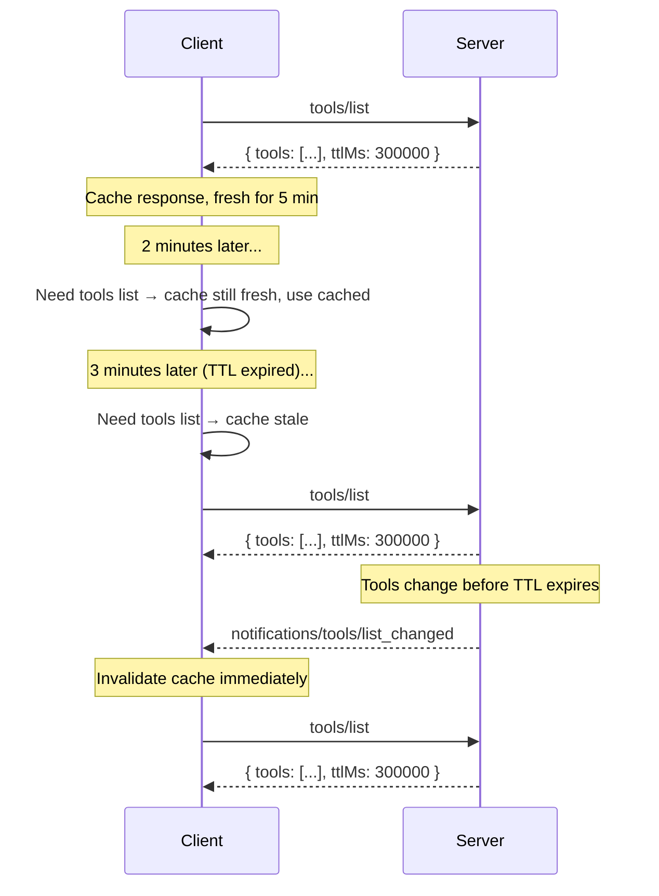

<div id="enable-section-numbers" />

Model Context Protocol (MCP) 支持对某些结果进行缓存。这允许客户端缓存响应并减少不必要的重复获取。缓存与[变更通知](#interaction-with-notifications)是互补的 — 两种机制可以共存。

## 可缓存的结果

服务器 MUST 在以下操作返回的结果中包含缓存提示：

- `server/discover`
- `tools/list`
- `prompts/list`
- `resources/list`
- `resources/templates/list`
- `resources/read`

## 可缓存模型

MCP 中的可缓存结果使用两个字段向客户端提供缓存提示：

- <b>生存时间 (TTL) 字段</b> `ttlMs`，是一个以毫秒为单位的整数值，指定客户端 MAY
  将结果视为新鲜的时间。
- <b>缓存作用域字段</b> `cacheScope`，指示缓存响应的预期作用域，可以是
  `"public"` 或 `"private"`。

### 生存时间 (TTL) 字段

`ttlMs` 字段来自服务器的提示，指示客户端 MAY 在多少毫秒内将结果视为新鲜。语义类似于 HTTP 的 `Cache-Control: max-age`。

- If `ttlMs` is `0`, the response **SHOULD** be considered immediately stale. The client
  MAY re-fetch every time the result is needed.
- If `ttlMs` is positive, the client **SHOULD** consider the result fresh for that many
  milliseconds after receiving the response.
- If `ttlMs` is absent, clients **SHOULD** assume a default of `0` (immediately stale)
  and rely on their own caching heuristics or notifications. This should only occur in older server versions.
- If `ttlMs` is negative, clients **SHOULD** ignore it and treat it as `0`.

Servers **MUST** provide a `ttlMs` value that is `>= 0`.

<Note>
  TTL is a **freshness hint**, not a guarantee. Servers MAY change the
  underlying data before the TTL expires. The TTL tells the client how long it
  can reasonably avoid re-fetching, not how long the data is guaranteed to
  remain unchanged.
</Note>

#### 新鲜度计算

客户端记录收到响应的本地时间（`t_received`）。在以下情况下，响应被视为**新鲜**：

```
now < t_received + ttlMs
```

TTL 过期后，响应变为**过期**，客户端 **SHOULD** 在下次访问时重新获取。

Clients **SHOULD NOT** treat TTL as a polling interval that triggers automatic background
refetches. The TTL is a freshness hint: the client checks freshness when it needs the
data, and re-fetches only if stale. Implementations that do choose to poll **MUST**
apply jitter and backoff.

Clients **MAY** re-fetch before the TTL expires if they have reason to believe the data
has changed (e.g., receiving an unexpected error on a tool call indicating the method was
not found or the parameters were invalid).

Clients **MAY** serve stale responses if errors occur during re-fetching (e.g., network
issues, server downtime).

### 缓存作用域字段

`cacheScope` 字段控制谁可以缓存响应，类似于 HTTP 的 `Cache-Control: public` 与 `Cache-Control: private`。

| Value       | Meaning                                                                                                                                                                                                                                                                           |
| ----------- | --------------------------------------------------------------------------------------------------------------------------------------------------------------------------------------------------------------------------------------------------------------------------------- |
| `"public"`  | The response does not contain user-specific data. Any client, shared gateway, or caching proxy **MAY** store and serve the cached response to any user.                                                                                                                           |
| `"private"` | The response contains private data that is not meant to be shared between callers. Cached responses **MAY** be reused for the same authorization context. Caches **MUST NOT** be shared across authorization contexts (e.g. a different access token requires a different cache). |

#### 选择缓存作用域

- **`"public"`** 适用于工具、提示和资源模板的列表，当它们对所有用户都相同时。
- **`"private"`** 适用于依赖于已认证用户的 `resources/read` 结果，或随用户变化的过滤列表结果。

## 与通知的交互

TTL 和服务器推送的通知是互补的：

- A server **MAY** provide `ttlMs` without advertising `listChanged: true` in its
  capabilities. In this case, the client relies entirely on TTL-based freshness.
- A server **MAY** advertise `listChanged: true` **and** provide `ttlMs`. In this case,
  the client can use the TTL to avoid unnecessary refetches between notifications, and
  the notification acts as an immediate invalidation signal.

When a relevant notification is received while a cached response is still fresh, the
notification **invalidates** the cached response and it should be considered immediately stale.



## 与分页的交互

当列表结果[分页](/specification/draft/server/utilities/pagination)时，每个页面是一个独立可缓存的响应 — 与 HTTP `Cache-Control` 处理分页资源的方式一致。

- Each page response carries its own `ttlMs` value. The freshness clock for each page
  starts at the time that page was received.
- Servers **MAY** return different `ttlMs` values on different pages (e.g., a longer TTL
  for early pages of a stable list, a shorter TTL for the final page).
- When a cached page expires, the client **SHOULD** re-fetch that page using its cursor.
- There is no cross-page consistency guarantee. If the underlying data changes between
  page fetches, clients may observe duplicates or gaps.
- Clients that require a consistent snapshot of the full list **SHOULD** re-fetch from
  the beginning (without a cursor).
- If a cursor becomes invalid (e.g., the server returns an error for a previously valid
  cursor), the client **SHOULD** discard all cached pages and re-fetch from the
  beginning.

Servers **MUST** apply the same `cacheScope` to all response pages for a given list
request. For example, if the first page of a `tools/list` response has
`cacheScope: "private"`, all subsequent pages for that request **MUST** also be
`"private"`.

## 安全考虑

`"public"` 的 `cacheScope` 表示响应不包含用户特定的数据，可以安全共享。服务器 MUST 注意，具有 `"public"` `cacheScope` 的响应可能在调用者之间共享，即使结果来自经过身份验证的端点。 For example, the Result from an authenticated `tools/list` call with a `"public"` `cacheScope` may be cached by a client and may be shared outside of the initial requests authorization context. (i.e. different access tokens can leverage the same cache).

Server implementors:

- should ensure that the `cacheScope` correctly reflects the intended visibility of the primitive.
- MUST apply appropriate per-primitive access controls, and MUST NOT rely on
  `cacheScope` alone to prevent unauthorized access to primitives.
