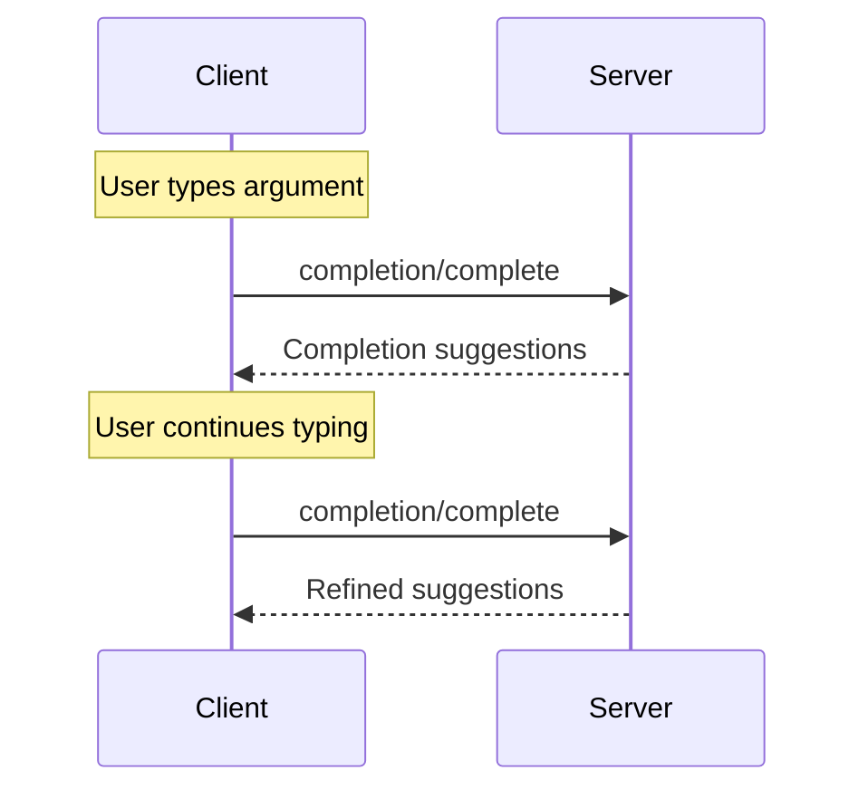

<div id="enable-section-numbers" />

Model Context Protocol (MCP) 提供了标准化的方式让服务器为提示和资源模板的参数提供自动补全建议。当用户在填写特定提示（按名称标识）或资源模板（按 URI 标识）的参数值时，服务器可以提供上下文相关的建议。

## 用户交互模型

MCP 中的补全设计为支持类似于 IDE 代码补全的交互式用户体验。

例如，应用程序可以在用户输入时在下拉或弹出菜单中显示补全建议，并能够从可用选项中过滤和选择。

然而，实现可以自由地通过适合其需求的任何界面模式来暴露补全 — 协议本身不强制任何特定的用户交互模型。

## 能力

支持补全的服务器 **MUST** 声明 `completions` 能力：

```json
{
  "capabilities": {
    "completions": {}
  }
}
```

## 协议消息

### 请求补全

To get completion suggestions, clients send a `completion/complete` request specifying
what is being completed through a reference type:

**Request:**

```json
{
  "jsonrpc": "2.0",
  "id": 1,
  "resultType": "complete",
  "method": "completion/complete",
  "params": {
    "ref": {
      "type": "ref/prompt",
      "name": "code_review"
    },
    "argument": {
      "name": "language",
      "value": "py"
    }
  }
}
```

**Response:**

```json
{
  "jsonrpc": "2.0",
  "id": 1,
  "result": {
    "completion": {
      "values": ["python", "pytorch", "pyside"],
      "total": 10,
      "hasMore": true
    }
  }
}
```

For prompts or URI templates with multiple arguments, clients should include previous completions in the `context.arguments` object to provide context for subsequent requests.

**Request:**

```json
{
  "jsonrpc": "2.0",
  "id": 1,
  "method": "completion/complete",
  "params": {
    "ref": {
      "type": "ref/prompt",
      "name": "code_review"
    },
    "argument": {
      "name": "framework",
      "value": "fla"
    },
    "context": {
      "arguments": {
        "language": "python"
      }
    }
  }
}
```

**Response:**

```json
{
  "jsonrpc": "2.0",
  "id": 1,
  "result": {
    "completion": {
      "values": ["flask"],
      "total": 1,
      "hasMore": false
    }
  }
}
```

### 引用类型

协议支持两种补全引用类型：

| Type           | Description                               | Example                                             |
| -------------- | ----------------------------------------- | --------------------------------------------------- |
| `ref/prompt`   | References a prompt by name               | `{"type": "ref/prompt", "name": "code_review"}`     |
| `ref/resource` | References a resource URI or URI template | `{"type": "ref/resource", "uri": "file:///{path}"}` |

### 补全结果

服务器返回按相关性排序的补全值数组，包含：

- 每个响应最多 100 个项目
- 可选的总匹配数
- 指示是否还有其他结果的布尔值

## Message Flow



## 数据类型

### CompleteRequest

- `ref`：一个 `PromptReference` 或 `ResourceTemplateReference`。对于 `ResourceTemplateReference`，`uri` 是一个 URI 或 URI 模板。
- `argument`：包含以下内容的对象：
  - `name`：参数名称
  - `value`：当前值
- `context`：包含以下内容的对象：
  - `arguments`：已解析参数名称到其值的映射。

### CompleteResult

- `completion`：包含以下内容的对象：
  - `values`：建议数组（最多 100 个）
  - `total`：可选的总匹配数
  - `hasMore`：是否还有其他结果的标志

## 错误处理

服务器 **SHOULD** 针对常见失败情况返回标准的 JSON-RPC 错误：

- 方法未找到：`-32601`（能力不支持）
- 无效的提示名称：`-32602`（无效参数）
- 缺少必需参数：`-32602`（无效参数）
- 内部错误：`-32603`（内部错误）

## 实现考虑

1. 服务器 **SHOULD**：
   - 返回按相关性排序的建议
   - 在适当的情况下实现模糊匹配
   - 对补全请求进行速率限制
   - 验证所有输入

2. 客户端 **SHOULD**：
   - 对快速补全请求进行防抖
   - 在适当的地方缓存补全结果
   - 优雅地处理缺失或部分结果

## 安全

实现 **MUST**：

- Validate all completion inputs
- Implement appropriate rate limiting
- Control access to sensitive suggestions
- Prevent completion-based information disclosure
