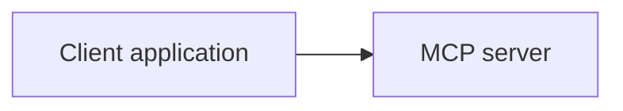
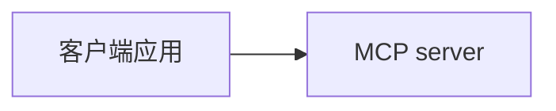

你是一个熟悉 Mintlify、MDX、技术文档、本地化和前端文档工程的代码代理。请对当前仓库 `modelcontextprotocol/modelcontextprotocol` 做完整中文本地化，目标是把面向读者展示的英文文档内容翻译为简体中文，同时保持项目结构、构建流程、MDX 语法、组件行为和链接可用。
由于文档较多，请先扫描仓库，规划好之后，指派多个子代理共同进行翻译。

## 任务目标

将仓库中的官方文档完整汉化，覆盖：

1. 当前项目中所有的 `.mdx`、`.md` 文档（不限文件夹）
2. `docs/docs.json` 中面向用户展示的导航、分组、标题、描述、tab、anchor、redirect 说明等文本。
3. MDX 组件中的可见文本，例如：

   - `<Card>`
   - `<CardGroup>`
   - `<Accordion>`
   - `<AccordionGroup>`
   - `<Steps>`
   - `<Step>`
   - `<Tabs>`
   - `<Tab>`
   - `<Note>`
   - `<Warning>`
   - `<Tip>`
   - `<Info>`
   - `<CodeGroup>`
   - `<RequestExample>`
   - `<ResponseExample>`
   - 其他 Mintlify 或自定义 MDX 组件

4. 页面 frontmatter 中的可见字段，例如：

   - `title`
   - `description`
   - `sidebarTitle`
   - `icon`
   - `openapi`
   - 其他和展示相关的字段

5. Mermaid、SVG、ASCII 图、流程图、时序图、表格、图片 alt 文本、caption、callout 文案中的英文
6. schema 文档相关内容，包括 `schema/*/schema.mdx` 模板和生成出来的 `docs/specification/**/schema.mdx`
7. README、CONTRIBUTING、社区文档等面向读者的 Markdown 文档，除非该文件明显只服务于仓库内部自动化
8. 直接在原文的基础上修改，并保证 `.mdx`、`.md` 文件的路径和文件名不变以及 `.mdx`、`.md` 语法合法。

## 翻译原则

请使用简体中文，风格要求：

1. 技术准确优先，表达自然，不要机翻腔。
2. 保留核心专有名词：

   - Model Context Protocol
   - MCP
   - client
   - server
   - host
   - tool
   - resource
   - prompt
   - sampling
   - elicitation
   - roots
   - transport
   - JSON-RPC
   - STDIO
   - Streamable HTTP
   - OAuth
   - authorization
   - schema
   - SDK
   - 等等你认为需要保留的

3. 重要术语必须采用“中文译名（英文原文）”格式，后续保持一致。
4. API 名称、协议字段、JSON key、TypeScript 类型名、函数名、类名、命令、路径、URL、包名、文件名不要翻译。
5. 代码块内容默认不翻译。只翻译代码块中的自然语言注释、输出示例说明或用户可见文案，前提是不影响示例运行。
6. JSON 示例中的 key 不翻译，value 只有在明显是自然语言展示内容时才翻译。
7. 命令行示例、环境变量、路径、import/export、npm script 名称保持原样。
8. 链接目标不要改，链接文字可以翻译。
9. MDX 组件名、属性名、JSX 结构不要改，只翻译属性值中面向读者展示的英文。
10. 不要改协议语义，不要重新解释规范，不要新增未经原文支持的内容。

## 术语表

请在整个仓库中保持以下译法一致：

- Model Context Protocol：Model Context Protocol
- MCP server：MCP server
- MCP client：MCP client
- host：host
- tool：tool
- resource：resource
- prompt：prompt
- roots：roots
- sampling：sampling
- elicitation：elicitation
- capability：能力
- primitive：原语
- transport：传输
- notification：通知
- request：请求
- response：响应
- result：结果
- error：错误
- authorization：授权
- authentication：身份验证
- schema：schema
- lifecycle：生命周期
- specification：规范
- implementation：实现
- example：示例
- guide：指南
- reference：参考
- tutorial：教程
- overview：概览
- quickstart：快速开始
- changelog：更新日志
- migration：迁移
- deprecated：已废弃
- experimental：实验性
- required：必需
- optional：可选
- 等等你认为合适的

存在上下文歧义时，优先保留英文术语，不要强行翻译。

## 文件处理规则

请先扫描仓库，列出需要汉化的文件类型和目录，再开始修改。

优先处理：

1. `docs/**/*.mdx`
2. `docs/docs.json`
3. `schema/**/*.mdx`
4. `README.md`
5. `CONTRIBUTING.md`
6. 其他明显属于文档站或社区说明的 `.md` / `.mdx`

不要修改：

1. `node_modules/`
2. `.git/`
3. 构建产物目录
4. lock 文件，除非必须
5. 与翻译无关的代码逻辑
6. 自动生成文件，不要进行 git提交

遇到 `docs/specification/**/schema.mdx` 这类生成文件时，先确认它是否由 `schema/*/schema.mdx` 或脚本生成。优先修改源模板，然后运行生成命令更新生成文件。

## MDX 处理要求

处理 MDX 时必须保持语法合法。

### 需要翻译的内容

```mdx
<Card title="Get started" icon="rocket">
  Learn how to use MCP.
</Card>
```

应变为：

```mdx
<Card title="开始使用" icon="rocket">
  了解如何使用 MCP。
</Card>
```

### 不要翻译组件名和属性名

```mdx
<Tabs>
  <Tab title="Python">...</Tab>
</Tabs>
```

只翻译 `title` 中的自然语言，不改 `Tabs`、`Tab`。

### 不要破坏 JSX 表达式

```mdx
<Card title={`Connect to ${serverName}`}>
```

需要保留表达式结构，只翻译自然语言片段：

```mdx
<Card title={`连接到 ${serverName}`}>
```

### frontmatter

```yaml
title: Get started
description: Learn how to build with MCP
```

应变为：

```yaml
title: 开始使用
description: 了解如何使用 MCP 构建应用
```

不要改 slug、id、openapi、path、method、href 这类机器读取字段。

## 图形和图表处理要求

请检查所有图形相关内容：

1. Mermaid 图
2. SVG 文件
3. MDX 中的内联 SVG
4. Markdown 表格
5. 图片 alt 文本
6. 图片 caption
7. ASCII 流程图
8. 组件内的 diagram/chart 文案

### Mermaid

保留节点 ID、箭头、语法，只翻译显示标签。



应变为：



### SVG

保留 SVG 结构、坐标、class、id、path、样式，只翻译 `<text>`、`aria-label`、`title`、`desc` 中的可见文本。

### 图片

二进制图片无法直接改图中文字时，请完成两件事：

1. 翻译该图片的 alt 文本和 caption
2. 在最终报告中列出这些图片，说明图片内仍含英文，需要设计工具或重新绘图处理

## 链接和导航规则

1. 不要随意修改 URL、锚点、文件路径。
2. 翻译导航展示名，但不要改页面路径。
3. 翻译 `docs/docs.json` 中可见文本。
4. 内部相对链接必须继续可用。
5. 外部链接保持原地址。
6. 页面标题翻译后，检查引用该标题的导航项是否同步。

## 校验要求

完成修改后执行以下命令：

```bash
npm install
npm run format
npm run check:docs
npm run check
```

涉及 schema 文档时，还要执行：

```bash
npm run generate:schema
npm run check:schema
```

文档本地预览命令：

```bash
npm run serve:docs
```

若某个命令失败，请阅读错误信息并修复。不要跳过 MDX 语法错误、死链、格式化错误、生成文件不一致问题。

## 工作方式

请按以下顺序执行：

1. 扫描仓库，识别所有文档和文档配置文件。
2. 建立术语表，优先使用上面的术语表。
3. 批量翻译普通 Markdown/MDX 正文。
4. 处理 MDX 组件属性和组件内部文本。
5. 处理 frontmatter。
6. 处理 `docs/docs.json` 导航和站点配置中的展示文本。
7. 处理 Mermaid、SVG、表格、图片 alt/caption。
8. 处理 schema 文档模板，并生成相关文档。
9. 运行格式化和检查命令。
10. 给出最终变更报告。

## 质量要求

翻译后必须满足：

1. 中文表达自然，符合中文表达习惯，禁止生硬翻译（机翻语气和风格）。
2. 技术术语一致。
3. MDX 能正常解析。
4. Mintlify 文档能本地启动。
5. 导航不丢页面。
6. 链接不失效。
7. 图形语法不损坏。
8. 不改协议含义。
9. 不改示例代码行为。
10. 不删除原文重要信息。

## 最终输出格式

完成后请给出：

1. 修改了哪些目录和文件类型
2. 主要术语处理说明
3. 已处理的 MDX 组件类型
4. 已处理的图形类型
5. 仍需人工处理的图片或复杂图形
6. 已运行的命令和结果
7. 失败命令的错误摘要和修复状态
8. 需要人工复核的高风险页面清单
